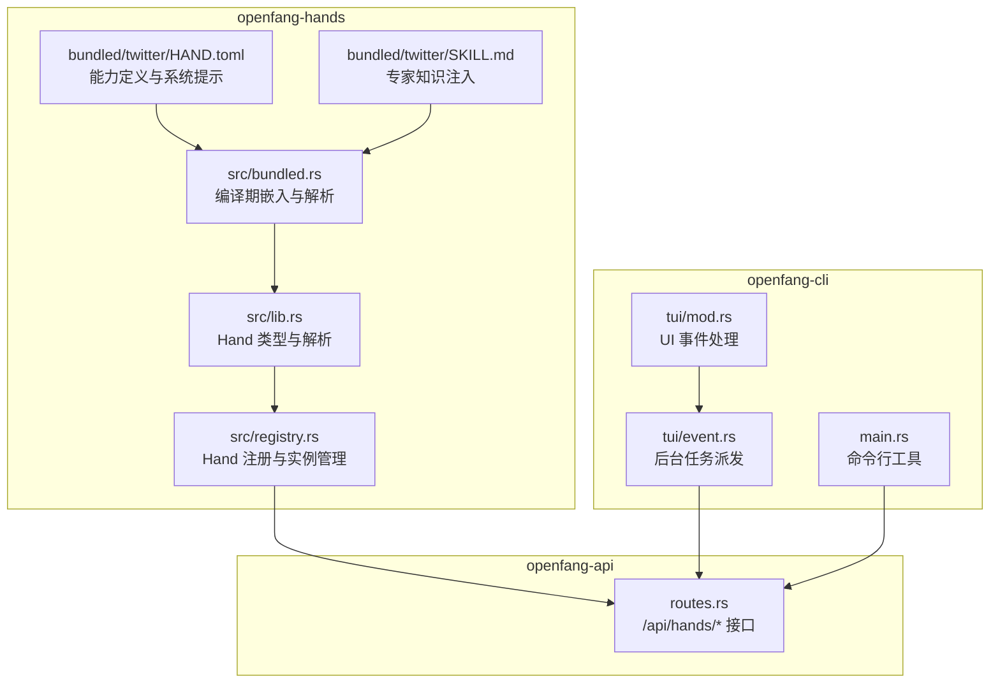
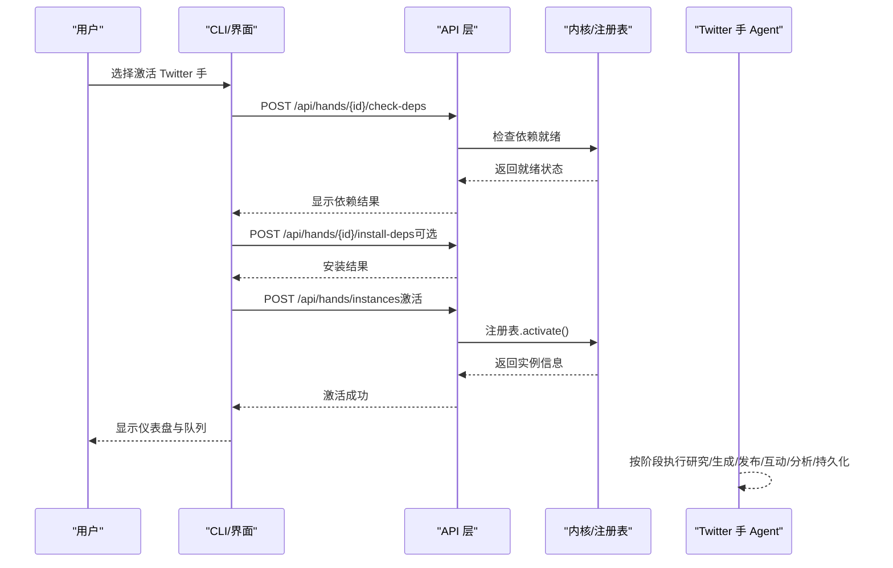
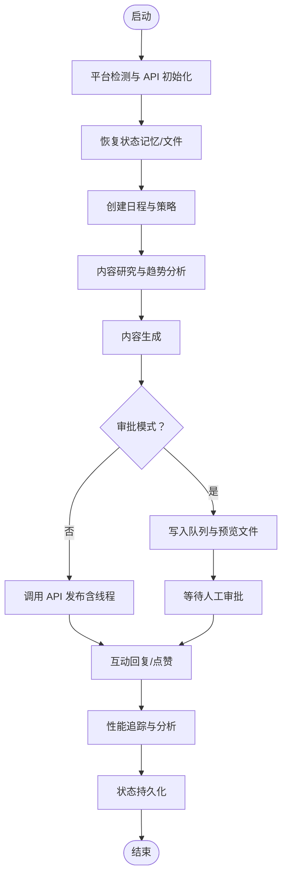
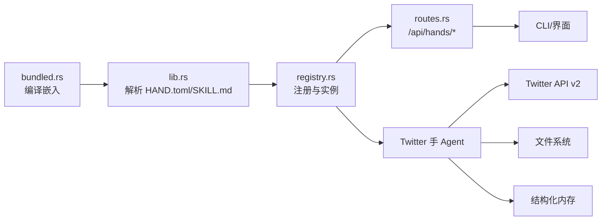

# Twitter 手（社交媒体管理）

<cite>
**本文引用的文件**
- [crates/openfang-hands/bundled/twitter/HAND.toml](file://crates/openfang-hands/bundled/twitter/HAND.toml)
- [crates/openfang-hands/bundled/twitter/SKILL.md](file://crates/openfang-hands/bundled/twitter/SKILL.md)
- [crates/openfang-hands/src/lib.rs](file://crates/openfang-hands/src/lib.rs)
- [crates/openfang-hands/src/bundled.rs](file://crates/openfang-hands/src/bundled.rs)
- [crates/openfang-hands/src/registry.rs](file://crates/openfang-hands/src/registry.rs)
- [crates/openfang-api/src/routes.rs](file://crates/openfang-api/src/routes.rs)
- [crates/openfang-cli/src/tui/mod.rs](file://crates/openfang-cli/src/tui/mod.rs)
- [crates/openfang-cli/src/tui/event.rs](file://crates/openfang-cli/src/tui/event.rs)
- [crates/openfang-cli/src/main.rs](file://crates/openfang-cli/src/main.rs)
- [agents/social-media/agent.toml](file://agents/social-media/agent.toml)
</cite>

## 目录
1. [简介](#简介)
2. [项目结构](#项目结构)
3. [核心组件](#核心组件)
4. [架构总览](#架构总览)
5. [详细组件分析](#详细组件分析)
6. [依赖关系分析](#依赖关系分析)
7. [性能考量](#性能考量)
8. [故障排查指南](#故障排查指南)
9. [结论](#结论)
10. [附录](#附录)

## 简介
本文件面向“Twitter 手（社交媒体管理）”能力包，系统化阐述其设计理念、内容策略、互动机制与自动化流程。文档覆盖 HAND.toml 配置参数、SKILL.md 专家知识注入要点，以及推文发布、话题跟踪、用户互动、数据分析等关键环节。同时提供内容创作辅助、时机优化、受众分析、竞争监控、自动化内容管理、品牌声誉监控与社区建设策略的实际使用案例与常见问题解决方案，并给出性能优化建议。

## 项目结构
Twitter 手作为“Hand”能力包，位于 openfang 代码库的 openfang-hands 子模块中，采用“预置能力包 + 专家知识注入”的设计：通过 HAND.toml 定义能力边界、工具集、可调参数与运行时系统提示；通过 SKILL.md 注入平台 API 参考、内容策略框架、最佳实践与安全合规要求。该能力包在运行期由内核注册表激活，配合 CLI 与 Web API 提供依赖检查、安装与实例生命周期管理。

图表来源
- [crates/openfang-hands/bundled/twitter/HAND.toml:1-409](file://crates/openfang-hands/bundled/twitter/HAND.toml#L1-L409)
- [crates/openfang-hands/bundled/twitter/SKILL.md:1-362](file://crates/openfang-hands/bundled/twitter/SKILL.md#L1-L362)
- [crates/openfang-hands/src/lib.rs:328-427](file://crates/openfang-hands/src/lib.rs#L328-L427)
- [crates/openfang-hands/src/bundled.rs:1-49](file://crates/openfang-hands/src/bundled.rs#L1-L49)
- [crates/openfang-hands/src/registry.rs:202-405](file://crates/openfang-hands/src/registry.rs#L202-L405)
- [crates/openfang-api/src/routes.rs:4075-4105](file://crates/openfang-api/src/routes.rs#L4075-L4105)
- [crates/openfang-cli/src/tui/mod.rs:1591-1622](file://crates/openfang-cli/src/tui/mod.rs#L1591-L1622)
- [crates/openfang-cli/src/tui/event.rs:2257-2290](file://crates/openfang-cli/src/tui/event.rs#L2257-L2290)
- [crates/openfang-cli/src/main.rs:4201-4244](file://crates/openfang-cli/src/main.rs#L4201-L4244)

章节来源
- [crates/openfang-hands/bundled/twitter/HAND.toml:1-409](file://crates/openfang-hands/bundled/twitter/HAND.toml#L1-L409)
- [crates/openfang-hands/bundled/twitter/SKILL.md:1-362](file://crates/openfang-hands/bundled/twitter/SKILL.md#L1-L362)
- [crates/openfang-hands/src/bundled.rs:1-49](file://crates/openfang-hands/src/bundled.rs#L1-L49)

## 核心组件
- 能力定义与系统提示（HAND.toml）
  - 定义能力 ID、名称、描述、分类、图标与所需工具集
  - 声明环境变量依赖（如 TWITTER_BEARER_TOKEN）与安装指引
  - 提供可配置设置项（内容风格、发布频率、自动回复/点赞、话题主题、品牌声音、线程模式、队列大小、互动时段、审批模式等）
  - 内置 agent 配置与系统提示，分阶段描述“平台检测与初始化、策略与日程、内容研究与趋势分析、生成、队列与发布、互动、性能追踪、状态持久化”等流程
  - 定义仪表盘指标（已发推文数、回复数、队列大小、平均互动率）
- 专家知识注入（SKILL.md）
  - Twitter API v2 参考：认证方式、核心端点、速率限制与响应头
  - 内容策略框架：内容支柱、内容类型组合、最佳发布时间
  - 推文写作最佳实践：钩子技巧、写作规则、线程结构、标签策略
  - 互动 playbook：回复规则、模板、不参与互动情形、自动点赞策略
  - 绩效指标与分析方法：关键指标、公式、内容表现分析
  - 品牌声音指南与一致性规则
  - 安全与合规：内容禁令、审批队列格式、风险评估
- 运行时支持（lib.rs、registry.rs、API/CLI）
  - Hand 类型、设置解析、仪表盘指标结构
  - 注册表激活/停用、就绪状态（满足需求/活动/degraded）
  - API 提供依赖检查与安装接口
  - CLI 支持依赖检查与安装命令

章节来源
- [crates/openfang-hands/bundled/twitter/HAND.toml:1-409](file://crates/openfang-hands/bundled/twitter/HAND.toml#L1-L409)
- [crates/openfang-hands/bundled/twitter/SKILL.md:1-362](file://crates/openfang-hands/bundled/twitter/SKILL.md#L1-L362)
- [crates/openfang-hands/src/lib.rs:153-427](file://crates/openfang-hands/src/lib.rs#L153-L427)
- [crates/openfang-hands/src/registry.rs:202-405](file://crates/openfang-hands/src/registry.rs#L202-L405)
- [crates/openfang-api/src/routes.rs:4075-4105](file://crates/openfang-api/src/routes.rs#L4075-L4105)
- [crates/openfang-cli/src/main.rs:4201-4244](file://crates/openfang-cli/src/main.rs#L4201-L4244)

## 架构总览
Twitter 手以“Hand + Expert Skill”的形式工作：
- 编译期：bundled.rs 将 HAND.toml 与 SKILL.md 编译进二进制，lib.rs 解析为 HandDefinition 并附带技能内容
- 运行期：registry.rs 激活 Hand 实例，API/CLI 提供依赖检查、安装与实例控制
- 执行期：agent 根据系统提示按阶段执行，结合工具集完成内容生成、调度、发布、互动与分析

图表来源
- [crates/openfang-hands/src/bundled.rs:51-63](file://crates/openfang-hands/src/bundled.rs#L51-L63)
- [crates/openfang-hands/src/lib.rs:328-365](file://crates/openfang-hands/src/lib.rs#L328-L365)
- [crates/openfang-hands/src/registry.rs:202-225](file://crates/openfang-hands/src/registry.rs#L202-L225)
- [crates/openfang-api/src/routes.rs:4075-4105](file://crates/openfang-api/src/routes.rs#L4075-L4105)
- [crates/openfang-cli/src/tui/event.rs:2257-2290](file://crates/openfang-cli/src/tui/event.rs#L2257-L2290)
- [crates/openfang-cli/src/main.rs:4201-4244](file://crates/openfang-cli/src/main.rs#L4201-L4244)

## 详细组件分析

### HAND.toml 配置参数详解
- 身份与工具
  - id/name/description/category/icon：能力标识与展示元数据
  - tools：声明可用工具集（如 shell_exec、file_*、web_*、memory_*、schedule_*、knowledge_*、event_publish）
- 依赖与安装
  - requires：声明环境变量依赖（如 TWITTER_BEARER_TOKEN），并提供安装步骤、示例与估计耗时
- 可配置设置
  - twitter_bearer_token：API 访问令牌
  - twitter_style：内容风格（专业/休闲/机智/教育/争议/励志）
  - post_frequency：发布频率（日均 1/3/5 次或每小时）
  - auto_reply/auto_like：自动回复/自动点赞开关
  - content_topics：内容主题（逗号分隔）
  - brand_voice：品牌声音描述
  - thread_mode：是否包含线程
  - content_queue_size：内容队列容量（5/10/20/50）
  - engagement_hours：互动时段（工作时间/清醒时间/全天）
  - approval_mode：审批模式（默认开启，写入队列等待人工审核）
- Agent 配置与系统提示
  - agent：模型、温度、最大迭代次数、系统提示
  - 系统提示分阶段描述：平台检测与初始化、策略与日程、内容研究与趋势分析、生成、队列与发布、互动、性能追踪、状态持久化
- 仪表盘指标
  - 已发推文数、回复数、队列大小、平均互动率

章节来源
- [crates/openfang-hands/bundled/twitter/HAND.toml:1-409](file://crates/openfang-hands/bundled/twitter/HAND.toml#L1-L409)

### SKILL.md 专家知识注入要点
- Twitter API v2 参考
  - 认证：Bearer Token（Authorization: Bearer $TWITTER_BEARER_TOKEN）
  - 核心端点：获取用户信息、发推、回复、删除、点赞、提及查询、搜索、指标查询
  - 速率限制：POST /tweets、DELETE /tweets、POST /likes、GET /mentions、GET /search/recent 的窗口与上限
  - 响应头：x-rate-limit-* 字段用于监控
- 内容策略框架
  - 内容支柱：3-5 个核心主题
  - 内容类型组合：热观点、线程、技巧/教程、提问、精选分享、故事、数据/统计
  - 最佳发布时间（UTC，需按受众时区调整）
- 推文写作最佳实践
  - 钩子技巧：反常识、数字、提问、故事、教程、清单、自白
  - 写作规则：单主题、前置价值、分行、280 字以内、主动语态、具体、行动号召
  - 线程结构：钩子、要点、总结 + 行动号召
  - 标签策略：0-2 个，发现用途，避免刷屏
- 互动 playbook
  - 回复规则：2 小时内响应、提供价值、提问引导、真诚、不争论
  - 不参与互动：极端分子、人身攻击、垃圾账号、法律风险
  - 自动点赞策略：互相关注者、领域影响者、优质内容、对回复点赞
- 绩效指标与分析
  - 关键指标：曝光、互动率、回复率、转推率、资料页访问、新增粉丝
  - 公式：互动率 = (点赞+转推+回复+引用)/曝光 × 100
  - 内容表现分析：按内容类型与主题维度对比
- 品牌声音指南
  - 维度：正式↔休闲、严肃↔幽默、保守↔激进、通用↔技术
  - 一致性：跨平台一致、签名短语、自然重复
- 安全与合规
  - 禁止内容：歧视、诽谤、隐私、威胁、冒充、误导、违反服务条款
  - 审批队列格式与预览文件
  - 风险评估：歧义重述、打压性言论、新闻可归因性、事实核查

章节来源
- [crates/openfang-hands/bundled/twitter/SKILL.md:1-362](file://crates/openfang-hands/bundled/twitter/SKILL.md#L1-L362)

### 运行时系统提示与阶段流程
系统提示将执行过程划分为若干阶段，确保幂等与可恢复：
- 平台检测与 API 初始化：操作系统探测、Bearer Token 校验、提取用户信息
- 状态恢复：从记忆与文件恢复历史、队列与策略
- 日程与策略：基于 post_frequency 创建发布计划，基于 engagement_hours 创建互动计划，构建内容策略并存入知识图谱
- 内容研究与趋势分析：基于 content_topics 与 brand_voice 搜索趋势、热门内容与竞品分析
- 内容生成：按 twitter_style 与 brand_voice 生成多种类型内容，遵循写作规则与线程结构
- 队列与发布：approval_mode 下写入队列与预览文件；否则直接调用 API 发布，线程按顺序回复
- 互动：在互动时段按 auto_reply/auto_like 规则进行回复与点赞
- 性能追踪：拉取最近推文指标，计算互动率，分析内容类型与主题表现，存入知识图谱
- 状态持久化：保存队列、发布历史、状态与仪表盘指标

图表来源
- [crates/openfang-hands/bundled/twitter/HAND.toml:187-386](file://crates/openfang-hands/bundled/twitter/HAND.toml#L187-L386)

章节来源
- [crates/openfang-hands/bundled/twitter/HAND.toml:187-386](file://crates/openfang-hands/bundled/twitter/HAND.toml#L187-L386)

### 社交媒体策略协同（Social Media Agent）
Social Media Agent 提供跨平台的内容策略、日程安排、互动与分析能力，可与 Twitter 手互补：
- 内容创作与文案：针对多平台特性优化，适应字符限制、标签策略、算法偏好与受众期待
- 内容日历与排程：推荐最佳发布时间、建议内容节奏、保持跨渠道主题一致性
- 互动策略与社区管理：撰写回复、设计互动问题、增长自然流量、处理敏感或负面互动
- 分析解读：基于曝光、点击、分享、粉丝增长等数据识别高表现内容类型并提出调整建议
- 品牌声音与一致性：定义并维护跨平台一致的品牌声音，存储声音指南与内容模板
- 标签与 SEO 优化：研究与推荐标签，撰写 SEO 友好标题与描述

章节来源
- [agents/social-media/agent.toml:1-66](file://agents/social-media/agent.toml#L1-L66)

## 依赖关系分析
- 编译期依赖
  - bundled.rs 将 HAND.toml 与 SKILL.md 编译进二进制，lib.rs 提供解析器与类型定义
- 运行期依赖
  - registry.rs 提供激活/停用、就绪状态判断（满足需求/活动/degraded）
  - API routes 提供依赖检查与安装接口
  - CLI 提供依赖检查与安装命令，以及 UI 事件派发
- 外部依赖
  - Twitter API v2（Bearer Token 认证）
  - 文件系统（队列与历史文件）
  - 结构化内存（状态、指标、知识图谱）

图表来源
- [crates/openfang-hands/src/bundled.rs:51-63](file://crates/openfang-hands/src/bundled.rs#L51-L63)
- [crates/openfang-hands/src/lib.rs:328-365](file://crates/openfang-hands/src/lib.rs#L328-L365)
- [crates/openfang-hands/src/registry.rs:202-225](file://crates/openfang-hands/src/registry.rs#L202-L225)
- [crates/openfang-api/src/routes.rs:4075-4105](file://crates/openfang-api/src/routes.rs#L4075-L4105)
- [crates/openfang-cli/src/main.rs:4201-4244](file://crates/openfang-cli/src/main.rs#L4201-L4244)

章节来源
- [crates/openfang-hands/src/bundled.rs:1-49](file://crates/openfang-hands/src/bundled.rs#L1-L49)
- [crates/openfang-hands/src/lib.rs:153-427](file://crates/openfang-hands/src/lib.rs#L153-L427)
- [crates/openfang-hands/src/registry.rs:390-405](file://crates/openfang-hands/src/registry.rs#L390-L405)
- [crates/openfang-api/src/routes.rs:4075-4105](file://crates/openfang-api/src/routes.rs#L4075-L4105)
- [crates/openfang-cli/src/main.rs:4201-4244](file://crates/openfang-cli/src/main.rs#L4201-L4244)

## 性能考量
- 速率限制与退避
  - 严格遵守 Twitter API v2 速率限制（如 POST /tweets 300 次/3 小时、POST /likes 50 次/15 分钟），监控响应头并及时退避
- 内容生成与队列
  - 合理设置 content_queue_size，避免过长队列导致延迟；在 approval_mode 下优先保证质量
- 互动策略
  - auto_like 限制每轮上限（如 50 次），避免触发限流；仅对高质量内容与互相关注者点赞
- 数据分析与优化
  - 定期分析内容类型与主题表现，动态调整内容混合比例与发布时间
- I/O 与持久化
  - 队列与历史文件写入需原子化与幂等，避免并发冲突

## 故障排查指南
- 依赖未满足
  - 使用 CLI 命令检查依赖：openfang hand check-deps；必要时安装依赖：openfang hand install-deps
  - 若返回 degraded，确认关键依赖（如 TWITTER_BEARER_TOKEN）是否满足
- API 错误与重试
  - 当 API 返回错误时，记录并重试一次，随后跳过并向用户告警
- 审批队列异常
  - 检查 twitter_queue.json 与 twitter_queue_preview.md 是否存在且格式正确
  - 如 approval_mode 关闭但仍有队列，检查配置与事件发布
- 速率限制触发
  - 监控响应头中的 x-rate-limit-* 字段，接近阈值时降低请求频率或暂停操作
- 互动时段与频率
  - 确认 engagement_hours 与 post_frequency 设置符合预期；必要时调整以匹配受众活跃时段

章节来源
- [crates/openfang-cli/src/main.rs:4201-4244](file://crates/openfang-cli/src/main.rs#L4201-L4244)
- [crates/openfang-api/src/routes.rs:4075-4105](file://crates/openfang-api/src/routes.rs#L4075-L4105)
- [crates/openfang-hands/bundled/twitter/HAND.toml:374-386](file://crates/openfang-hands/bundled/twitter/HAND.toml#L374-L386)
- [crates/openfang-hands/bundled/twitter/SKILL.md:86-99](file://crates/openfang-hands/bundled/twitter/SKILL.md#L86-L99)

## 结论
Twitter 手通过“能力包 + 专家知识”的组合，实现了从内容研究、生成、发布到互动与分析的全链路自动化。其严谨的配置参数、明确的阶段流程与安全合规约束，使其既能满足规模化运营需求，又能保障品牌声誉与用户体验。结合 Social Media Agent 的跨平台策略，可进一步完善内容生态与社区建设。

## 附录

### 实际使用案例
- 案例一：科技创始人账号
  - 设置：content_topics 包含 AI、创业、工程文化；brand_voice 描述为“简化复杂技术的创业者”；post_frequency 设为 3_daily；approval_mode 开启
  - 执行：系统按周一至周五最佳时间发布“技巧/教程”“数据/统计”“热观点”，周末发布“故事”
  - 互动：auto_reply 与 auto_like 在工作时间启用，优先点赞高质量内容与互相关注者
  - 分析：每周汇总内容类型与主题表现，优化下周内容混合
- 案例二：产品团队官方账号
  - 设置：content_topics 为产品路线、使用技巧、行业洞察；post_frequency 为 1_daily；thread_mode 关闭
  - 执行：每日发布“精选分享”“提问”驱动讨论；在互动时段自动回复与点赞
  - 分析：关注回复率与资料页访问趋势，调整提问与分享比例

### 常见问题与解答
- 为什么我的推文没有发布？
  - 检查 approval_mode 是否开启；若开启，需在队列文件中批准后才会发布
- 为什么出现速率限制错误？
  - 检查响应头与当前窗口内的剩余请求数，适当降低频率或暂停
- 如何提升互动率？
  - 依据 SKILL.md 的内容类型组合与写作规则优化内容；分析表现数据调整主题与发布时间

### 性能优化建议
- 降低 API 调用频率：合并请求、批量查询指标
- 合理设置队列与审批流程：平衡效率与质量
- 利用知识图谱与记忆：复用历史策略与模板
- 监控与告警：建立速率限制与错误监控，自动暂停与通知