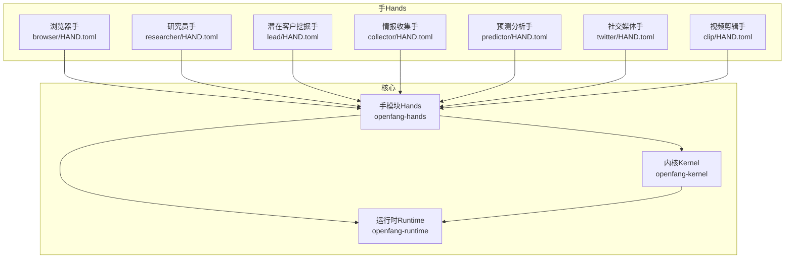
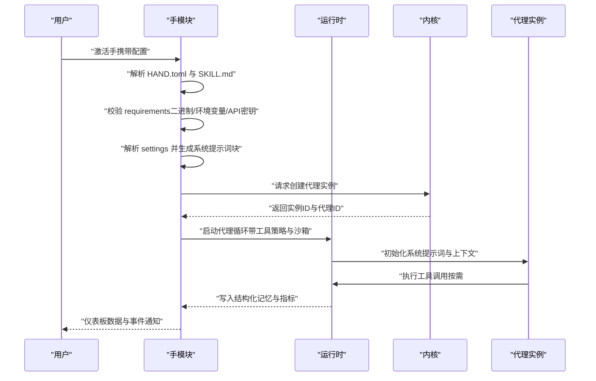
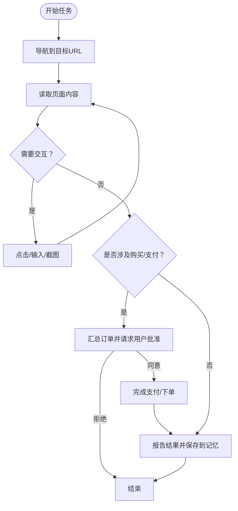
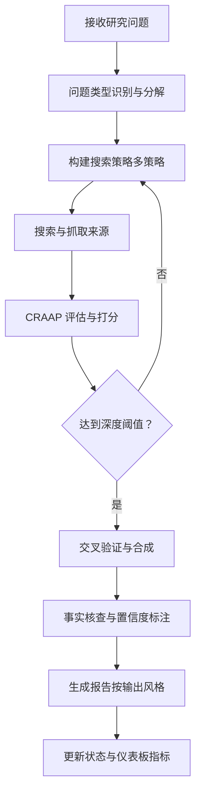
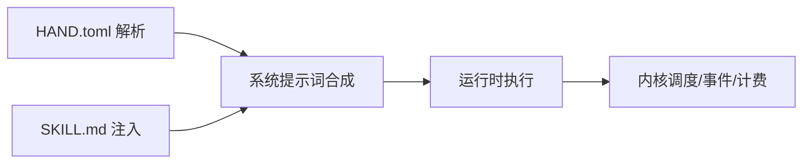

# 自主手系统

<cite>
**本文档引用的文件**
- [HAND.toml（浏览器）](file://crates/openfang-hands/bundled/browser/HAND.toml)
- [SKILL.md（浏览器）](file://crates/openfang-hands/bundled/browser/SKILL.md)
- [HAND.toml（研究员）](file://crates/openfang-hands/bundled/researcher/HAND.toml)
- [SKILL.md（研究员）](file://crates/openfang-hands/bundled/researcher/SKILL.md)
- [HAND.toml（潜在客户挖掘）](file://crates/openfang-hands/bundled/lead/HAND.toml)
- [SKILL.md（潜在客户挖掘）](file://crates/openfang-hands/bundled/lead/SKILL.md)
- [HAND.toml（情报收集）](file://crates/openfang-hands/bundled/collector/HAND.toml)
- [SKILL.md（情报收集）](file://crates/openfang-hands/bundled/collector/SKILL.md)
- [HAND.toml（预测分析）](file://crates/openfang-hands/bundled/predictor/HAND.toml)
- [SKILL.md（预测分析）](file://crates/openfang-hands/bundled/predictor/SKILL.md)
- [HAND.toml（社交媒体）](file://crates/openfang-hands/bundled/twitter/HAND.toml)
- [SKILL.md（社交媒体）](file://crates/openfang-hands/bundled/twitter/SKILL.md)
- [HAND.toml（视频剪辑）](file://crates/openfang-hands/bundled/clip/HAND.toml)
- [SKILL.md（视频剪辑）](file://crates/openfang-hands/bundled/clip/SKILL.md)
- [openfang.toml 示例](file://openfang.toml.example)
- [lib.rs（手模块）](file://crates/openfang-hands/src/lib.rs)
- [lib.rs（内核）](file://crates/openfang-kernel/src/lib.rs)
- [lib.rs（运行时）](file://crates/openfang-runtime/src/lib.rs)
</cite>

## 目录
1. [简介](#简介)
2. [项目结构](#项目结构)
3. [核心组件](#核心组件)
4. [架构总览](#架构总览)
5. [详细组件分析](#详细组件分析)
6. [依赖关系分析](#依赖关系分析)
7. [性能考虑](#性能考虑)
8. [故障排除指南](#故障排除指南)
9. [结论](#结论)
10. [附录](#附录)

## 简介
本文件为 OpenFang 自主手系统提供全面技术文档，涵盖以下主题：
- HAND.toml 配置文件格式与解析规则
- 系统提示词设计原则与最佳实践
- SKILL.md 专家知识注入机制
- 七个预构建自治能力包的功能特性与使用方法
- 手的生命周期管理、审批机制与仪表板指标
- 配置示例、最佳实践与自定义开发指南
- 手与智能体的关系、执行策略与资源管理
- 故障排除与性能优化建议

## 项目结构
OpenFang 将“手”（Hand）作为可激活的自治能力包，每个手由 HAND.toml 定义其功能、工具、设置、仪表板指标，并通过内置的系统提示词驱动智能体完成任务。运行时与内核负责调度、权限控制、资源管理与状态持久化。

图示来源
- [lib.rs（手模块）:1-867](file://crates/openfang-hands/src/lib.rs#L1-L867)
- [lib.rs（内核）:1-30](file://crates/openfang-kernel/src/lib.rs#L1-L30)
- [lib.rs（运行时）:1-59](file://crates/openfang-runtime/src/lib.rs#L1-L59)

章节来源
- [lib.rs（手模块）:1-867](file://crates/openfang-hands/src/lib.rs#L1-L867)
- [lib.rs（内核）:1-30](file://crates/openfang-kernel/src/lib.rs#L1-L30)
- [lib.rs（运行时）:1-59](file://crates/openfang-runtime/src/lib.rs#L1-L59)

## 核心组件
- HAND.toml：定义手的标识、名称、描述、分类、图标、工具清单、技能白名单、MCP 服务器白名单、要求检查、可配置设置、代理配置与仪表板指标。
- SKILL.md：为手注入专家知识，包括方法论、查询模式、实体抽取、推理链、API 参考等。
- 内核与运行时：负责生命周期管理、调度、权限、上下文预算、工具执行、沙箱与安全隔离。
- 配置示例：openfang.toml.example 提供默认模型、内存、网络、通道适配器与 MCP 服务器连接示例。

章节来源
- [HAND.toml（浏览器）:1-255](file://crates/openfang-hands/bundled/browser/HAND.toml#L1-L255)
- [HAND.toml（研究员）:1-398](file://crates/openfang-hands/bundled/researcher/HAND.toml#L1-L398)
- [HAND.toml（潜在客户挖掘）:1-336](file://crates/openfang-hands/bundled/lead/HAND.toml#L1-L336)
- [HAND.toml（情报收集）:1-346](file://crates/openfang-hands/bundled/collector/HAND.toml#L1-L346)
- [HAND.toml（预测分析）:1-382](file://crates/openfang-hands/bundled/predictor/HAND.toml#L1-L382)
- [HAND.toml（社交媒体）:1-409](file://crates/openfang-hands/bundled/twitter/HAND.toml#L1-L409)
- [HAND.toml（视频剪辑）:1-599](file://crates/openfang-hands/bundled/clip/HAND.toml#L1-L599)
- [openfang.toml 示例:1-49](file://openfang.toml.example#L1-L49)
- [lib.rs（手模块）:1-867](file://crates/openfang-hands/src/lib.rs#L1-L867)

## 架构总览
下图展示从 HAND.toml 到运行时执行的关键流程：解析配置 → 检查前置条件 → 合成系统提示词 → 启动代理实例 → 工具执行与状态更新 → 仪表板指标上报。

图示来源
- [lib.rs（手模块）:18-867](file://crates/openfang-hands/src/lib.rs#L18-L867)
- [lib.rs（运行时）:1-59](file://crates/openfang-runtime/src/lib.rs#L1-L59)
- [lib.rs（内核）:1-30](file://crates/openfang-kernel/src/lib.rs#L1-L30)

## 详细组件分析

### HAND.toml 配置文件格式与解析
- 基本字段
  - id/name/description：唯一标识与人类可读名称
  - category/icon：用于市场浏览与可视化
  - tools/skills/mcp_servers：授予代理的工具、技能与 MCP 服务器白名单
  - requires：前置条件（二进制、环境变量、API 密钥），支持平台化安装指引
  - settings：可配置设置（Select/Text/Toggle），支持选项中的 provider_env 与 binary
  - agent：代理模板（模块、提供商、模型、温度、最大令牌、系统提示词、最大迭代次数）
  - dashboard：仪表板指标（标签、内存键、格式）
- 解析与设置解析
  - 支持扁平或 [hand] 包裹两种 HAND.toml 格式
  - resolve_settings 将用户配置映射为系统提示词块与环境变量列表
- 安装指引
  - requires.install 支持 macOS/Windows/Linux（apt/dnf/pacman）/pip/注册链接/文档链接/示例环境变量/手动下载链接/耗时估计/步骤

章节来源
- [lib.rs（手模块）:10-867](file://crates/openfang-hands/src/lib.rs#L10-L867)
- [HAND.toml（浏览器）:1-255](file://crates/openfang-hands/bundled/browser/HAND.toml#L1-L255)
- [HAND.toml（研究员）:1-398](file://crates/openfang-hands/bundled/researcher/HAND.toml#L1-L398)
- [HAND.toml（潜在客户挖掘）:1-336](file://crates/openfang-hands/bundled/lead/HAND.toml#L1-L336)
- [HAND.toml（情报收集）:1-346](file://crates/openfang-hands/bundled/collector/HAND.toml#L1-L346)
- [HAND.toml（预测分析）:1-382](file://crates/openfang-hands/bundled/predictor/HAND.toml#L1-L382)
- [HAND.toml（社交媒体）:1-409](file://crates/openfang-hands/bundled/twitter/HAND.toml#L1-L409)
- [HAND.toml（视频剪辑）:1-599](file://crates/openfang-hands/bundled/clip/HAND.toml#L1-L599)

### 系统提示词设计（System Prompt）
- 设计原则
  - 明确阶段划分与执行顺序（如浏览器的多阶段流水线、研究员的五阶段研究法、预测分析的信号收集与推理链）
  - 给出错误恢复策略与安全规则（如 CAPTCHA 处理、购买前审批、禁止存储敏感信息）
  - 提供常见交互模式与选择器参考（浏览器 CSS 选择器、表单填写、电商购买流程）
  - 强调会话管理与资源释放（浏览器会话持久性、任务完成后关闭）
  - 要求在任务后更新记忆指标（如页面访问数、任务完成数、截图数量）
- 最佳实践
  - 将用户配置注入到系统提示词中（通过 resolve_settings 生成的提示块）
  - 使用分节标题与编号列表，便于阅读与审计
  - 在关键节点强调“必须获得用户批准”的动作（如购买、发布）

章节来源
- [HAND.toml（浏览器）:112-255](file://crates/openfang-hands/bundled/browser/HAND.toml#L112-L255)
- [HAND.toml（研究员）:156-398](file://crates/openfang-hands/bundled/researcher/HAND.toml#L156-L398)
- [HAND.toml（预测分析）:168-382](file://crates/openfang-hands/bundled/predictor/HAND.toml#L168-L382)
- [HAND.toml（社交媒体）:178-409](file://crates/openfang-hands/bundled/twitter/HAND.toml#L178-L409)
- [lib.rs（手模块）:209-266](file://crates/openfang-hands/src/lib.rs#L209-L266)

### SKILL.md 专家知识注入机制
- 作用
  - 为手提供领域专家知识（方法论、查询模式、实体抽取、推理链、API 参考）
  - 与 HAND.toml 的 agent.system_prompt 协同，形成“结构化知识 + 动态提示”的组合
- 典型内容
  - 浏览器：CSS 选择器参考、常见工作流、错误恢复策略、安全检查
  - 研究员：CRAAP 评估框架、搜索查询优化、交叉验证与合成、引文格式
  - 潜在客户挖掘：ICP 构建、发现与富化、评分与去重、合规与伦理
  - 情报收集：OSINT 方法论、实体抽取、知识图谱、变更检测与情感分析
  - 预测分析：超级预测原理、信号分类、置信度校准、Brier 分数、偏差检查
  - 社交媒体：API v2 参考、内容策略、互动玩法、性能指标、安全与合规
  - 视频剪辑：yt-dlp 下载、Whisper 转录、SRT 生成、FFmpeg 处理、TTS、Telegram/WhatsApp 发布

章节来源
- [SKILL.md（浏览器）:1-125](file://crates/openfang-hands/bundled/browser/SKILL.md#L1-L125)
- [SKILL.md（研究员）:1-328](file://crates/openfang-hands/bundled/researcher/SKILL.md#L1-L328)
- [SKILL.md（潜在客户挖掘）:1-236](file://crates/openfang-hands/bundled/lead/SKILL.md#L1-L236)
- [SKILL.md（情报收集）:1-272](file://crates/openfang-hands/bundled/collector/SKILL.md#L1-L272)
- [SKILL.md（预测分析）:1-273](file://crates/openfang-hands/bundled/predictor/SKILL.md#L1-L273)
- [SKILL.md（社交媒体）:1-362](file://crates/openfang-hands/bundled/twitter/SKILL.md#L1-L362)
- [SKILL.md（视频剪辑）:1-475](file://crates/openfang-hands/bundled/clip/SKILL.md#L1-L475)

### 浏览器手（Browser）
- 功能概述
  - 自动化网页导航、点击、输入、截图、读取页面内容
  - 购买/支付前强制用户审批，确保安全
  - 支持无头模式、等待时间、截图策略等配置
- 关键指标
  - 页面访问数、任务完成数、截图数量
- 审批机制
  - 在涉及金钱的操作前，必须汇总商品、价格、购物车并请求用户明确批准

图示来源
- [HAND.toml（浏览器）:112-255](file://crates/openfang-hands/bundled/browser/HAND.toml#L112-L255)

章节来源
- [HAND.toml（浏览器）:1-255](file://crates/openfang-hands/bundled/browser/HAND.toml#L1-L255)
- [SKILL.md（浏览器）:1-125](file://crates/openfang-hands/bundled/browser/SKILL.md#L1-L125)

### 研究员手（Researcher）
- 功能概述
  - 深度研究：问题分解、多策略搜索、来源评估、交叉验证、事实核查、报告生成
  - 输出风格：简要、详细、学术、高管摘要
  - 可选：自动跟进、保存研究日志、引用格式、语言设置
- 关键指标
  - 查询解决数、引用来源数、报告生成数、活跃调查数
- 推荐流程
  - 平台检测 → 状态恢复 → 问题分析与分解 → 搜索策略构建 → 信息收集与评估 → 交叉验证与综合 → 事实核查 → 报告生成 → 状态与统计

图示来源
- [HAND.toml（研究员）:156-398](file://crates/openfang-hands/bundled/researcher/HAND.toml#L156-L398)
- [SKILL.md（研究员）:10-328](file://crates/openfang-hands/bundled/researcher/SKILL.md#L10-L328)

章节来源
- [HAND.toml（研究员）:1-398](file://crates/openfang-hands/bundled/researcher/HAND.toml#L1-L398)
- [SKILL.md（研究员）:1-328](file://crates/openfang-hands/bundled/researcher/SKILL.md#L1-L328)

### 潜在客户挖掘手（Lead）
- 功能概述
  - 基于 ICP（理想客户画像）发现、富化、去重与评分
  - 多源发现（网络搜索、LinkedIn、Crunchbase、自定义）
  - 可配置输出格式（CSV/JSON/Markdown 表格）
- 关键指标
  - 发现线索数、报告生成数、最后报告日期、唯一公司数
- 推荐流程
  - 平台检测 → 状态恢复与计划 → 构建 ICP → 多查询搜索 → 富化 → 去重与评分 → 报告生成 → 状态持久化

章节来源
- [HAND.toml（潜在客户挖掘）:1-336](file://crates/openfang-hands/bundled/lead/HAND.toml#L1-L336)
- [SKILL.md（潜在客户挖掘）:1-236](file://crates/openfang-hands/bundled/lead/SKILL.md#L1-L236)

### 情报收集手（Collector）
- 功能概述
  - 连续监控目标（公司/人物/技术/市场），变更检测与知识图谱构建
  - 可配置关注领域（市场/业务/竞争者/个人/技术/通用）
  - 可选情感趋势跟踪与事件告警
- 关键指标
  - 数据点数、跟踪实体数、报告生成数、最后更新时间
- 推荐流程
  - 平台检测与状态恢复 → 初始化计划与目标 → 构建查询 → 收集与富化 → 知识图谱构建 → 变更检测与情感分析 → 报告生成 → 状态持久化

章节来源
- [HAND.toml（情报收集）:1-346](file://crates/openfang-hands/bundled/collector/HAND.toml#L1-L346)
- [SKILL.md（情报收集）:1-272](file://crates/openfang-hands/bundled/collector/SKILL.md#L1-L272)

### 预测分析手（Predictor）
- 功能概述
  - 超级预测原理：信号收集、推理链、置信度校准、准确性追踪
  - 可配置域（科技/金融/地缘政治/气候/通用）、时间跨度、数据源、报告频率
  - 可选反共识视角与准确性评分（Brier 分数）
- 关键指标
  - 预测总数、准确率、报告数、活跃预测数
- 推荐流程
  - 平台检测与状态恢复 → 建立域与计划 → 信号收集 → 准确性回顾 → 推理链构建 → 预测生成 → 报告与状态更新

章节来源
- [HAND.toml（预测分析）:1-382](file://crates/openfang-hands/bundled/predictor/HAND.toml#L1-L382)
- [SKILL.md（预测分析）:1-273](file://crates/openfang-hands/bundled/predictor/SKILL.md#L1-L273)

### 社交媒体手（Twitter）
- 功能概述
  - 内容创作、定时发布、自动回复与点赞、性能追踪
  - 支持多种风格（专业/休闲/机智/教育/挑衅/励志）、线程模式、队列审批
  - API v2：发推、回复、点赞、提及、搜索、指标获取
- 关键指标
  - 发推数、回复数、队列大小、平均互动率
- 审批机制
  - 默认启用审批模式，先写入队列再人工审核

章节来源
- [HAND.toml（社交媒体）:1-409](file://crates/openfang-hands/bundled/twitter/HAND.toml#L1-L409)
- [SKILL.md（社交媒体）:1-362](file://crates/openfang-hands/bundled/twitter/SKILL.md#L1-L362)

### 视频剪辑手（Clip）
- 功能概述
  - 下载（yt-dlp）、转录（Whisper/Groq/OpenAI/Deepgram/本地）、片段提取、垂直裁剪、字幕烧录、可选配音（TTS）、发布（Telegram/WhatsApp）
  - 跨平台命令行工具一致性与路径处理细节
- 关键指标
  - 作业完成数、生成片段数、总时长、发布到 Telegram/WhatsApp 数量
- 审批机制
  - 发布前可写入本地队列供人工审阅

章节来源
- [HAND.toml（视频剪辑）:1-599](file://crates/openfang-hands/bundled/clip/HAND.toml#L1-L599)
- [SKILL.md（视频剪辑）:1-475](file://crates/openfang-hands/bundled/clip/SKILL.md#L1-L475)

## 依赖关系分析
- 手模块依赖
  - HAND.toml 解析与设置解析（lib.rs）
  - SKILL.md 作为外部专家知识，与 HAND.toml 的 agent.system_prompt 协同
- 运行时与内核
  - 运行时提供工具执行、沙箱、上下文预算、LLM 驱动抽象、HTTP 请求头（User-Agent）
  - 内核负责生命周期、调度、事件总线、配对、触发器、计费与配额

图示来源
- [lib.rs（手模块）:1-867](file://crates/openfang-hands/src/lib.rs#L1-L867)
- [lib.rs（运行时）:1-59](file://crates/openfang-runtime/src/lib.rs#L1-L59)
- [lib.rs（内核）:1-30](file://crates/openfang-kernel/src/lib.rs#L1-L30)

章节来源
- [lib.rs（手模块）:1-867](file://crates/openfang-hands/src/lib.rs#L1-L867)
- [lib.rs（运行时）:1-59](file://crates/openfang-runtime/src/lib.rs#L1-L59)
- [lib.rs（内核）:1-30](file://crates/openfang-kernel/src/lib.rs#L1-L30)

## 性能考虑
- 上下文预算与压缩
  - 运行时提供上下文预算与压缩机制，避免超长对话导致成本与延迟上升
- 工具执行与并发
  - 工具执行遵循策略与沙箱，避免阻塞与资源泄漏
- 缓存与重试
  - Web 缓存、重试与退避策略减少外部依赖抖动
- 资源限制
  - 进程与子进程沙箱、Docker 沙箱、工作区隔离保障系统稳定

章节来源
- [lib.rs（运行时）:1-59](file://crates/openfang-runtime/src/lib.rs#L1-L59)

## 故障排除指南
- 前置条件未满足
  - 检查 requires 中的二进制/环境变量/API 密钥是否就绪；根据 requires.install 的平台化指令安装
- 系统提示词注入失败
  - 确认 resolve_settings 返回的 env_vars 与 prompt_block 正确；检查 settings 的 provider_env 与 binary 字段
- 工具执行异常
  - 查看运行时日志与错误码；确认工具可用性与权限；必要时增加超时与重试
- 发布失败（社交媒体/视频剪辑）
  - 检查 API 限流与错误响应；对超限文件进行重新编码；确认凭据完整且有效
- 仪表板指标缺失
  - 确认 memory_store 调用与 dashboard.metrics 的 memory_key 对应

章节来源
- [lib.rs（手模块）:18-867](file://crates/openfang-hands/src/lib.rs#L18-L867)
- [HAND.toml（社交媒体）:178-409](file://crates/openfang-hands/bundled/twitter/HAND.toml#L178-L409)
- [HAND.toml（视频剪辑）:1-599](file://crates/openfang-hands/bundled/clip/HAND.toml#L1-L599)

## 结论
OpenFang 自主手系统以 HAND.toml 为核心配置载体，结合 SKILL.md 专家知识与运行时/内核基础设施，实现了可插拔、可审计、可扩展的自治能力包体系。通过标准化的系统提示词设计、严格的审批与安全规则、完善的仪表板指标与错误处理，系统能够在复杂任务场景中保持稳健与高效。

## 附录

### 配置示例与最佳实践
- 默认模型与网络监听
  - 参考 openfang.toml.example 设置默认提供商、模型与监听地址
- 手的激活与配置
  - 在激活时传入 settings 的键值对，resolve_settings 会将其注入系统提示词并暴露相应环境变量
- 安全与合规
  - 浏览器手在购买前强制审批；社交媒体手严格限制内容与互动；视频剪辑手避免泄露凭据

章节来源
- [openfang.toml 示例:1-49](file://openfang.toml.example#L1-L49)
- [lib.rs（手模块）:209-266](file://crates/openfang-hands/src/lib.rs#L209-L266)