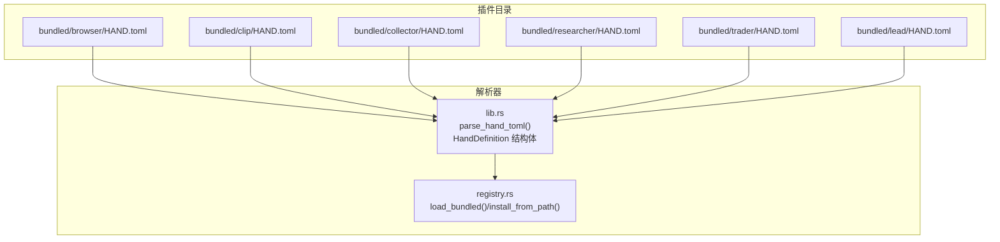
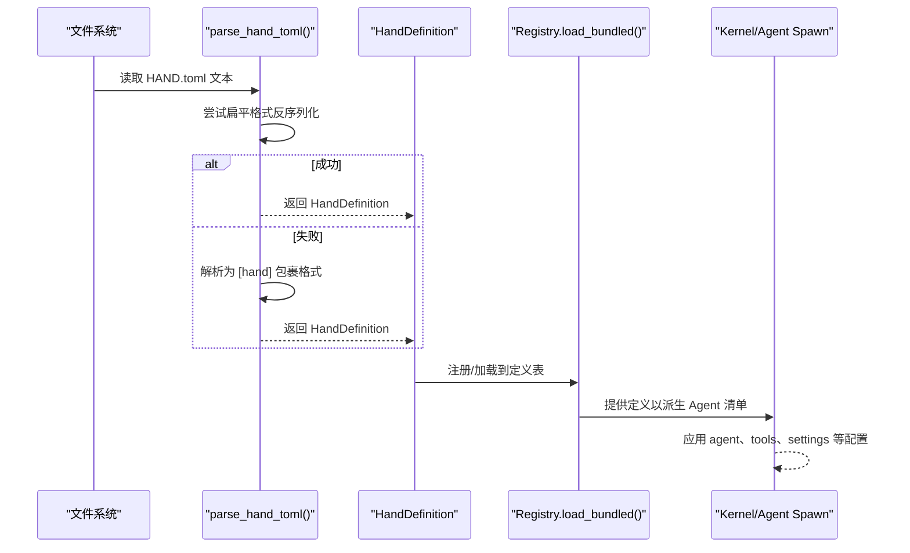
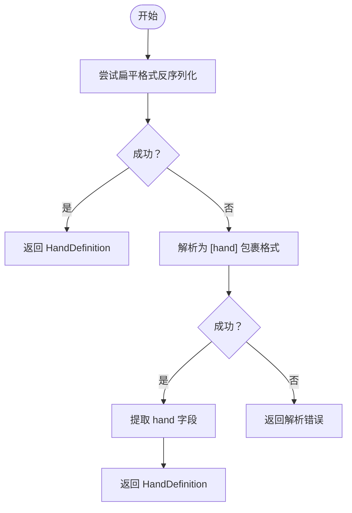
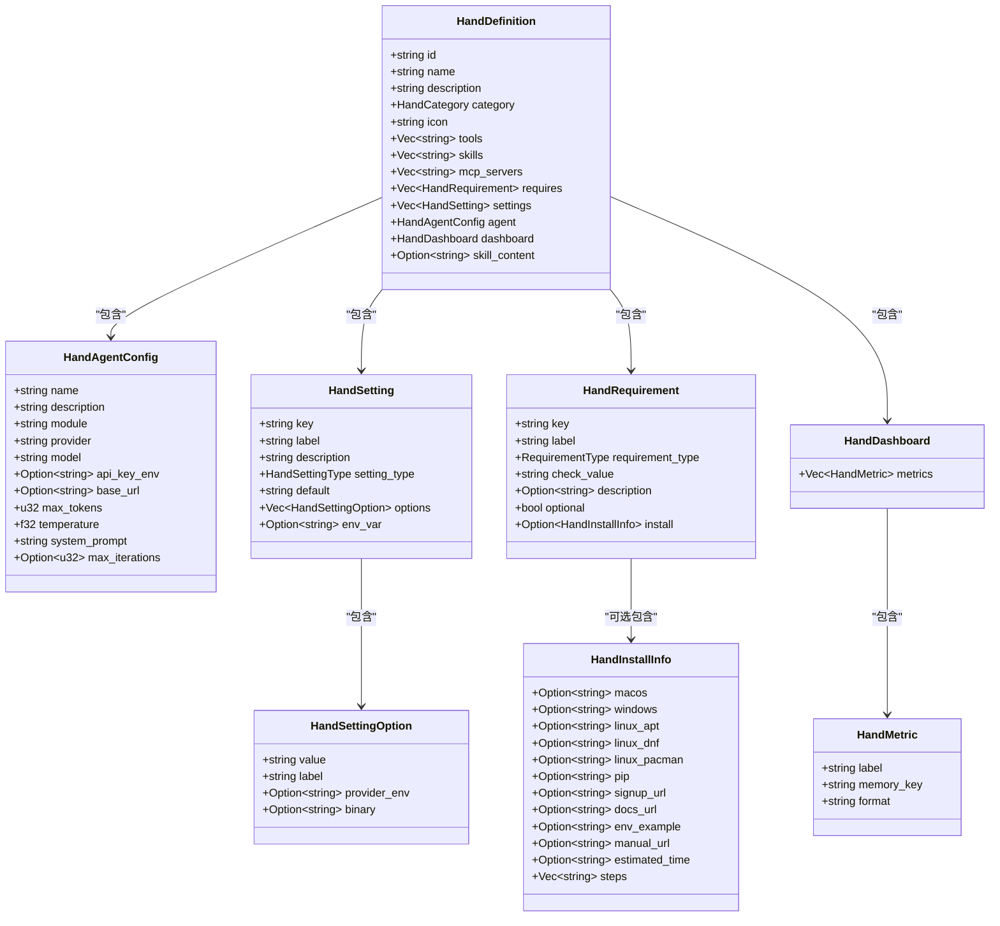
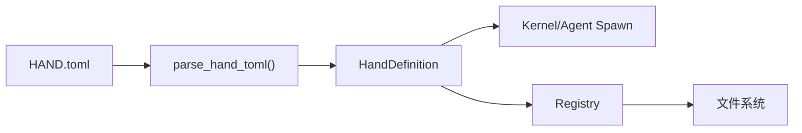

# HAND.toml 配置格式详解

<cite>
**本文档引用的文件**
- [lib.rs](file://crates/openfang-hands/src/lib.rs)
- [registry.rs](file://crates/openfang-hands/src/registry.rs)
- [browser/HAND.toml](file://crates/openfang-hands/bundled/browser/HAND.toml)
- [clip/HAND.toml](file://crates/openfang-hands/bundled/clip/HAND.toml)
- [collector/HAND.toml](file://crates/openfang-hands/bundled/collector/HAND.toml)
- [researcher/HAND.toml](file://crates/openfang-hands/bundled/researcher/HAND.toml)
- [trader/HAND.toml](file://crates/openfang-hands/bundled/trader/HAND.toml)
- [lead/HAND.toml](file://crates/openfang-hands/bundled/lead/HAND.toml)
</cite>

## 目录
1. [简介](#简介)
2. [项目结构](#项目结构)
3. [核心组件](#核心组件)
4. [架构总览](#架构总览)
5. [详细组件分析](#详细组件分析)
6. [依赖关系分析](#依赖关系分析)
7. [性能考量](#性能考量)
8. [故障排查指南](#故障排查指南)
9. [结论](#结论)
10. [附录：完整配置示例与最佳实践](#附录完整配置示例与最佳实践)

## 简介
本文件系统化阐述 HAND.toml 配置格式，涵盖 HAND.toml 的完整语法、HandDefinition 结构体字段语义、HandAgentConfig 的配置项、配置解析与兼容性处理（扁平格式与 [hand] 包裹格式）、配置验证与错误处理机制，并提供多场景配置示例与最佳实践建议。

## 项目结构
HAND.toml 是“手”（Hand）的声明式配置文件，位于各 HAND 插件目录中，如 `crates/openfang-hands/bundled/<hand>/HAND.toml`。运行时由 openfang-hands crate 解析为内存中的 HandDefinition 结构体，用于派生 Agent 清单、设置运行时参数、仪表盘指标与用户可调设置等。

**图表来源**
- [lib.rs:314-326](file://crates/openfang-hands/src/lib.rs#L314-L326)
- [registry.rs:108-137](file://crates/openfang-hands/src/registry.rs#L108-L137)

**章节来源**
- [lib.rs:314-326](file://crates/openfang-hands/src/lib.rs#L314-L326)
- [registry.rs:108-137](file://crates/openfang-hands/src/registry.rs#L108-L137)

## 核心组件
- HAND.toml 解析入口：parse_hand_toml(content) 支持两种格式：
  - 扁平格式：根表直接包含 id、name、description、agent、dashboard 等键
  - [hand] 包裹格式：所有键置于 [hand] 表下，agent/dashboard 同样置于 [hand] 下
- HandDefinition：从 HAND.toml 反序列化得到的完整定义，驱动 Agent 派生与运行时行为
- HandAgentConfig：嵌入在 HAND.toml 中的 Agent 模板配置，决定模型、提示词、工具授权等
- HandSetting/HandSettingOption：声明用户可在激活时调整的可配置项及其选项
- HandRequirement/HandInstallInfo：声明前置条件与安装指引
- HandDashboard/HandMetric：声明仪表盘指标

**章节来源**
- [lib.rs:314-326](file://crates/openfang-hands/src/lib.rs#L314-L326)
- [lib.rs:328-365](file://crates/openfang-hands/src/lib.rs#L328-L365)
- [lib.rs:274-296](file://crates/openfang-hands/src/lib.rs#L274-L296)
- [lib.rs:177-193](file://crates/openfang-hands/src/lib.rs#L177-L193)
- [lib.rs:111-135](file://crates/openfang-hands/src/lib.rs#L111-L135)
- [lib.rs:268-272](file://crates/openfang-hands/src/lib.rs#L268-L272)

## 架构总览
HAND.toml 的解析与使用流程如下：

**图表来源**
- [lib.rs:314-326](file://crates/openfang-hands/src/lib.rs#L314-L326)
- [registry.rs:108-137](file://crates/openfang-hands/src/registry.rs#L108-L137)

## 详细组件分析

### HAND.toml 语法与字段说明
- 必需字段
  - id：手的唯一标识（字符串）
  - name：人类可读名称（字符串）
  - description：功能描述（字符串）
  - agent：HandAgentConfig 对象（必填）
- 可选字段
  - category：分类（枚举，默认 Other）
  - icon：图标（字符串，emoji）
  - tools：允许访问的工具列表（数组）
  - skills：技能白名单（数组，空表示全部）
  - mcp_servers：MCP 服务器白名单（数组，空表示全部）
  - requires：前置条件列表（数组）
  - settings：用户可配置设置（数组）
  - dashboard：仪表盘指标定义（对象）
  - skill_content：打包的技能内容（运行时填充，非 TOML 字段）

- agent（HandAgentConfig）字段
  - name/description：Agent 名称与描述
  - module：模块（默认 builtin:chat）
  - provider：提供商（默认 anthropic）
  - model：模型（默认 claude-sonnet-4-20250514）
  - api_key_env/base_url：API 密钥环境变量与自定义基础地址
  - max_tokens：最大生成长度（默认 4096）
  - temperature：采样温度（默认 0.7）
  - system_prompt：系统提示词
  - max_iterations：最大迭代次数（可选）

- settings（HandSetting）与选项（HandSettingOption）
  - key/label/description：键名、显示标签与描述
  - setting_type：类型（select/toggle/text）
  - default：默认值（字符串）
  - options：选项列表（含 value/label/provider_env/binary）
  - env_var：当为文本型且有值时暴露的环境变量名

- requires（HandRequirement）与安装信息（HandInstallInfo）
  - key/label/requirement_type/check_value：键名、标签、检查类型与校验值
  - description/optional/install：描述、是否可选、平台安装指引
  - install 支持字段：macos/windows/linux_*、pip、signup_url/docs_url/env_example/manual_url、estimated_time、steps

- dashboard/metrics（HandDashboard/HandMetric）
  - metrics：指标数组，每项包含 label/memory_key/format

**章节来源**
- [lib.rs:328-365](file://crates/openfang-hands/src/lib.rs#L328-L365)
- [lib.rs:274-296](file://crates/openfang-hands/src/lib.rs#L274-L296)
- [lib.rs:177-193](file://crates/openfang-hands/src/lib.rs#L177-L193)
- [lib.rs:111-135](file://crates/openfang-hands/src/lib.rs#L111-L135)
- [lib.rs:268-272](file://crates/openfang-hands/src/lib.rs#L268-L272)

### 解析逻辑与兼容性
- 兼容性策略
  - parse_hand_toml 首先尝试将 TOML 直接反序列化为 HandDefinition
  - 若失败，则期望 [hand] 包裹格式，解析为包含 hand 字段的对象后取 hand
- 测试覆盖
  - 扁平格式与包裹格式均通过单元测试验证
  - 支持 settings、requires、agent、dashboard 等字段的 roundtrip

**图表来源**
- [lib.rs:314-326](file://crates/openfang-hands/src/lib.rs#L314-L326)

**章节来源**
- [lib.rs:314-326](file://crates/openfang-hands/src/lib.rs#L314-L326)
- [lib.rs:821-866](file://crates/openfang-hands/src/lib.rs#L821-L866)

### 配置验证与错误处理
- 解析阶段
  - 使用 toml::from_str 进行反序列化；失败返回 toml::de::Error
  - 兼容两种格式，避免因表结构差异导致的解析失败
- 运行时验证
  - requires.optional：可选要求不阻断激活，但会标记为降级状态
  - settings.resolve_settings：根据用户配置或默认值构建提示块与环境变量清单
  - agent.max_iterations：若存在则启用持续模式并设置调度
- 错误处理
  - 安装信息缺失：install 字段可为空，不影响 HAND.toml 正常解析
  - API Key 类型：install.steps/signup_url/docs_url/env_example 等仅在 API Key 类型需求时使用

**章节来源**
- [lib.rs:111-135](file://crates/openfang-hands/src/lib.rs#L111-L135)
- [lib.rs:203-266](file://crates/openfang-hands/src/lib.rs#L203-L266)
- [lib.rs:328-365](file://crates/openfang-hands/src/lib.rs#L328-L365)

### 数据模型类图

**图表来源**
- [lib.rs:328-365](file://crates/openfang-hands/src/lib.rs#L328-L365)
- [lib.rs:274-296](file://crates/openfang-hands/src/lib.rs#L274-L296)
- [lib.rs:177-193](file://crates/openfang-hands/src/lib.rs#L177-L193)
- [lib.rs:111-135](file://crates/openfang-hands/src/lib.rs#L111-L135)
- [lib.rs:82-109](file://crates/openfang-hands/src/lib.rs#L82-L109)
- [lib.rs:268-272](file://crates/openfang-hands/src/lib.rs#L268-L272)

## 依赖关系分析
- 解析器依赖
  - toml::from_str：TOML 解析
  - serde：结构体序列化/反序列化
- 运行时依赖
  - Kernel：基于 HandDefinition 生成 Agent 清单与能力
  - Registry：加载内置 HAND.toml 并注册定义
- 外部集成
  - MCP 服务器白名单控制
  - 工具与技能白名单控制 Agent 能力边界

**图表来源**
- [lib.rs:314-326](file://crates/openfang-hands/src/lib.rs#L314-L326)
- [registry.rs:108-137](file://crates/openfang-hands/src/registry.rs#L108-L137)

**章节来源**
- [lib.rs:314-326](file://crates/openfang-hands/src/lib.rs#L314-L326)
- [registry.rs:108-137](file://crates/openfang-hands/src/registry.rs#L108-L137)

## 性能考量
- 解析复杂度
  - 单次 HAND.toml 解析为 O(n)，n 为 TOML 键值对数量
- 运行时开销
  - settings.resolve_settings 为 O(S)，S 为设置项数
  - requires.optional 仅影响状态报告，不增加计算成本
- 建议
  - 控制 settings 与 requires 数量，避免过长列表
  - 使用默认值减少冗余配置

[本节为通用指导，无需具体文件引用]

## 故障排查指南
- 解析失败
  - 检查 TOML 语法与键名拼写
  - 确认使用扁平格式或 [hand] 包裹格式之一
- 前置条件未满足
  - 查看 requires 列表与 install 指南
  - 对 API Key 类型需求，确认安装步骤与环境变量
- 设置项无效
  - 确认 setting_type 与 default 值类型匹配
  - 对 select 类型，确保 options 包含默认值
- 运行时异常
  - 检查 agent.max_iterations 是否正确设置以启用持续模式
  - 核对 tools/skills/mcp_servers 白名单是否包含所需能力

**章节来源**
- [lib.rs:111-135](file://crates/openfang-hands/src/lib.rs#L111-L135)
- [lib.rs:203-266](file://crates/openfang-hands/src/lib.rs#L203-L266)
- [lib.rs:328-365](file://crates/openfang-hands/src/lib.rs#L328-L365)

## 结论
HAND.toml 通过明确的结构化配置，将 HAND 的能力、约束、用户可配置项与运行时参数统一管理。其解析器同时支持扁平与包裹两种格式，兼顾向后兼容与清晰表达。结合 requirements、settings、agent 等字段，可以实现从“可发现”到“可执行”的完整闭环。

[本节为总结性内容，无需具体文件引用]

## 附录：完整配置示例与最佳实践

### 示例一：浏览器手（browser）
- 特点：多工具、多 requires、多 settings、丰富的 agent system_prompt、仪表盘指标
- 关键点：purchase approval、headless 模式、截图策略、等待时间选择

**章节来源**
- [browser/HAND.toml:1-255](file://crates/openfang-hands/bundled/browser/HAND.toml#L1-L255)

### 示例二：视频剪辑手（clip）
- 特点：多 provider 选择（本地 Whisper、Groq、OpenAI、Deepgram）、TTS provider、发布目标（Telegram/WhatsApp）
- 关键点：跨平台命令适配、API Key 环境变量、发布凭证配置

**章节来源**
- [clip/HAND.toml:1-599](file://crates/openfang-hands/bundled/clip/HAND.toml#L1-L599)

### 示例三：情报收集手（collector）
- 特点：定时任务、知识图谱、变更检测、情感趋势追踪
- 关键点：focus_area、collection_depth、update_frequency、alert_on_changes

**章节来源**
- [collector/HAND.toml:1-346](file://crates/openfang-hands/bundled/collector/HAND.toml#L1-L346)

### 示例四：研究手（researcher）
- 特点：研究深度、输出风格、引用样式、语言选择、自动跟进
- 关键点：子问题分解、交叉验证、事实核查、报告模板

**章节来源**
- [researcher/HAND.toml:1-398](file://crates/openfang-hands/bundled/researcher/HAND.toml#L1-L398)

### 示例五：交易手（trader）
- 特点：交易模式（分析/模拟/实盘）、市场焦点、风险控制、组合分析
- 关键点：信号融合、多因子分析、止盈止损、回测与风控门禁

**章节来源**
- [trader/HAND.toml:1-741](file://crates/openfang-hands/bundled/trader/HAND.toml#L1-L741)

### 示例六：线索手（lead）
- 特点：行业/角色/规模筛选、线索来源、输出格式、交付计划、丰富度
- 关键点：去重与评分、知识图谱存储、报告生成

**章节来源**
- [lead/HAND.toml:1-336](file://crates/openfang-hands/bundled/lead/HAND.toml#L1-L336)

### 最佳实践建议
- 结构化组织
  - 将 settings 分组，使用 clear label/description
  - requires 明确 optional 与 install 指南
- 默认值与提示
  - 为 select/toggle/text 提供合理默认值
  - 在 agent.system_prompt 中明确安全与合规规则
- 可维护性
  - 保持 tools/skills/mcp_servers 白名单最小化
  - dashboard.metrics 与 memory_key 一一对应，便于监控
- 兼容性
  - 优先使用扁平格式，必要时采用 [hand] 包裹格式
  - 避免在 HAND.toml 中硬编码敏感信息，改用 env_var 或外部密钥管理

[本节为通用指导，无需具体文件引用]