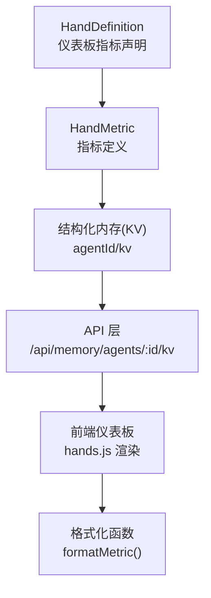
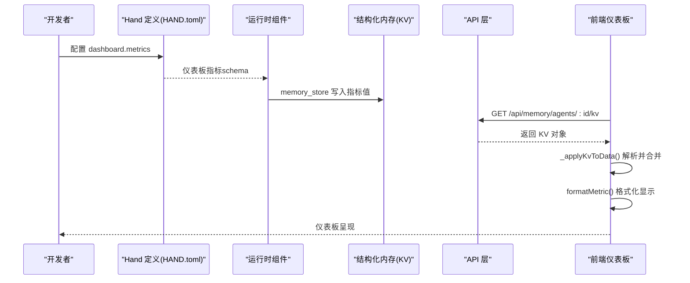
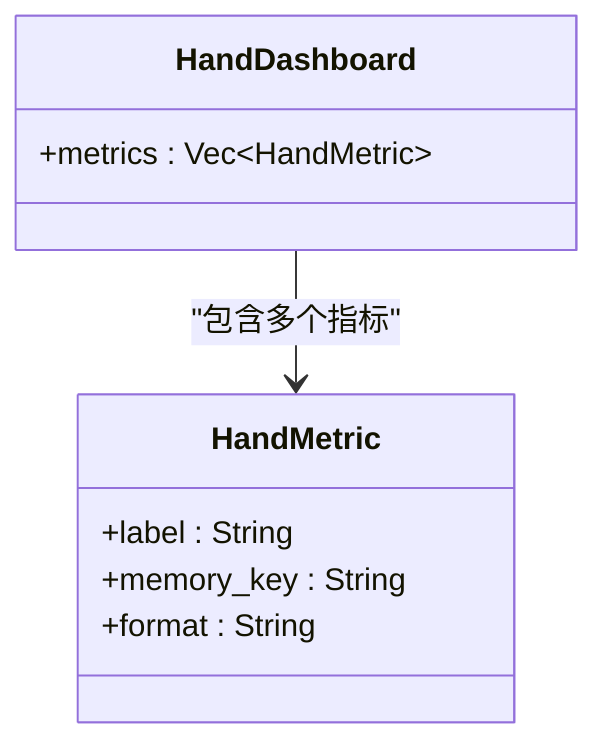
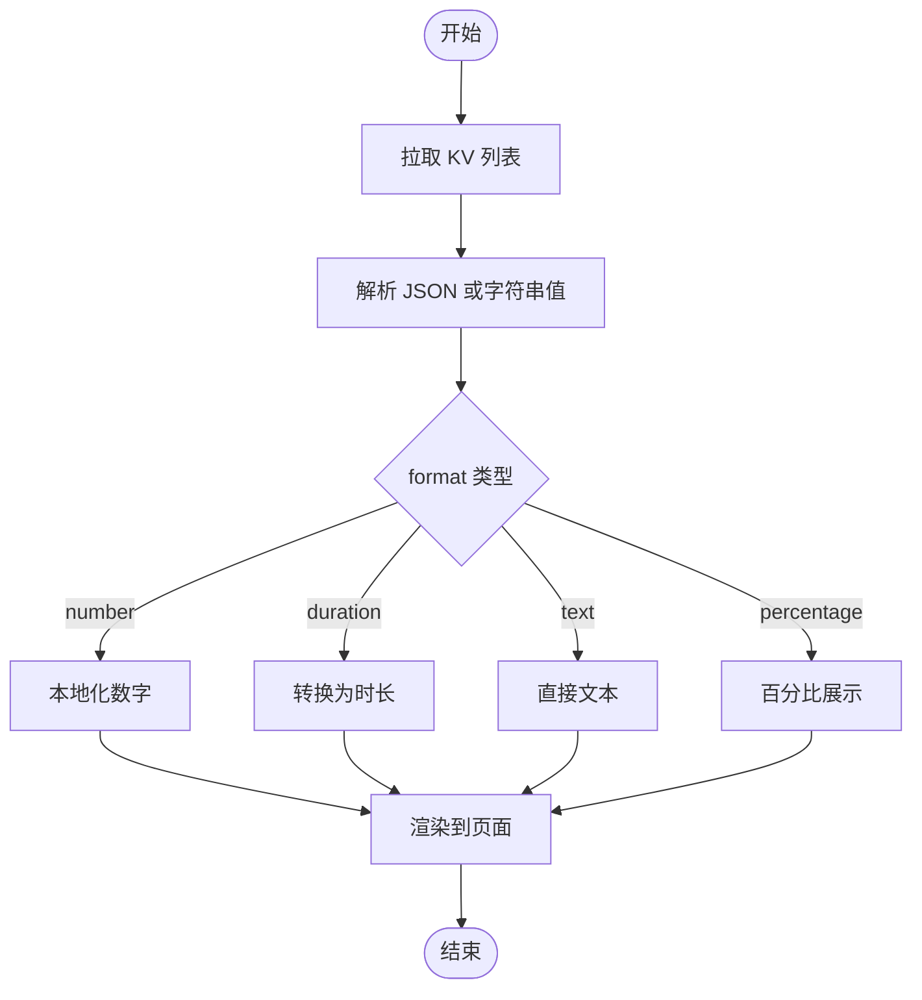
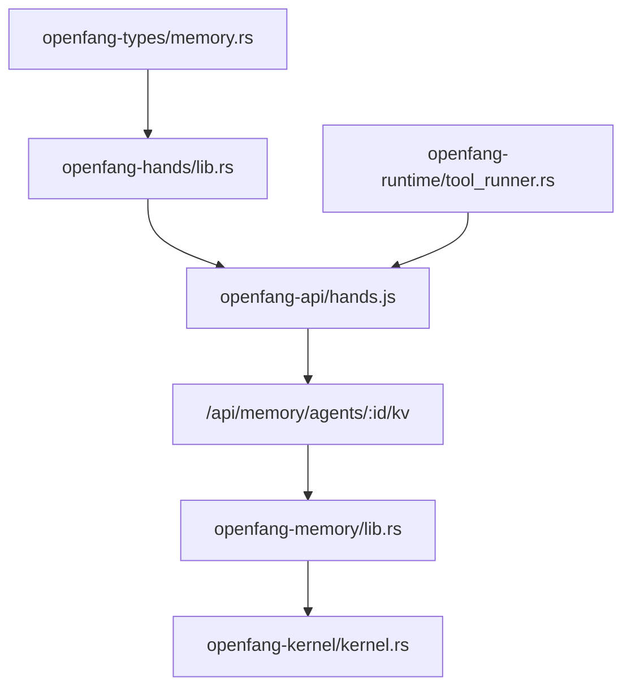

# 仪表板指标系统

<cite>
**本文档引用的文件**
- [crates/openfang-hands/src/lib.rs](file://crates/openfang-hands/src/lib.rs)
- [crates/openfang-hands/bundled/browser/HAND.toml](file://crates/openfang-hands/bundled/browser/HAND.toml)
- [crates/openfang-hands/bundled/clip/HAND.toml](file://crates/openfang-hands/bundled/clip/HAND.toml)
- [crates/openfang-hands/bundled/twitter/HAND.toml](file://crates/openfang-hands/bundled/twitter/HAND.toml)
- [crates/openfang-hands/bundled/collector/HAND.toml](file://crates/openfang-hands/bundled/collector/HAND.toml)
- [crates/openfang-api/static/js/pages/hands.js](file://crates/openfang-api/static/js/pages/hands.js)
- [crates/openfang-api/static/index_body.html](file://crates/openfang-api/static/index_body.html)
- [crates/openfang-api/static/js/pages/overview.js](file://crates/openfang-api/static/js/pages/overview.js)
- [crates/openfang-api/static/js/pages/usage.js](file://crates/openfang-api/static/js/pages/usage.js)
- [crates/openfang-memory/src/lib.rs](file://crates/openfang-memory/src/lib.rs)
- [crates/openfang-memory/src/consolidation.rs](file://crates/openfang-memory/src/consolidation.rs)
- [crates/openfang-types/src/memory.rs](file://crates/openfang-types/src/memory.rs)
- [crates/openfang-kernel/src/kernel.rs](file://crates/openfang-kernel/src/kernel.rs)
- [crates/openfang-runtime/src/tool_runner.rs](file://crates/openfang-runtime/src/tool_runner.rs)
</cite>

## 目录
1. [简介](#简介)
2. [项目结构](#项目结构)
3. [核心组件](#核心组件)
4. [架构总览](#架构总览)
5. [详细组件分析](#详细组件分析)
6. [依赖关系分析](#依赖关系分析)
7. [性能考量](#性能考量)
8. [故障排查指南](#故障排查指南)
9. [结论](#结论)
10. [附录](#附录)

## 简介
本文件系统性阐述仪表板指标系统的设计与实现，重点围绕 HandDashboard 与 HandMetric 的结构与行为，解释指标标签、内存键、显示格式的配置方法；说明指标数据来源（智能体结构化内存）、存储位置、更新频率与计算逻辑；提供常见指标类型（数字、持续时间、字节大小、百分比等）的配置示例；并解释指标在前端仪表板中的展示方式、数据聚合与历史趋势分析方法，最后给出最佳实践、性能优化建议与扩展机制。

## 项目结构
仪表板指标系统横跨多个子模块：
- 后端定义：在 openfang-hands 中定义 HandMetric 与 HandDashboard 数据结构，并通过 HAND.toml 声明仪表板指标。
- 前端展示：在 openfang-api 的静态页面中加载并渲染指标，支持按格式进行本地化展示。
- 内存系统：指标值来自智能体的结构化内存（KV），由 openfang-memory 提供统一抽象。
- 运行时写入：运行时组件通过工具调用将统计值写入结构化内存，供仪表板读取。

图表来源
- [crates/openfang-hands/src/lib.rs:137-147](file://crates/openfang-hands/src/lib.rs#L137-L147)
- [crates/openfang-api/static/js/pages/hands.js:482-500](file://crates/openfang-api/static/js/pages/hands.js#L482-L500)

章节来源
- [crates/openfang-hands/src/lib.rs:137-147](file://crates/openfang-hands/src/lib.rs#L137-L147)
- [crates/openfang-api/static/js/pages/hands.js:482-500](file://crates/openfang-api/static/js/pages/hands.js#L482-L500)

## 核心组件
- HandMetric：单个仪表板指标，包含显示标签、内存键与显示格式。
- HandDashboard：手（Hand）的仪表板配置，包含一组 HandMetric。
- 指标值来源：智能体结构化内存（KV），通过 API 读取。
- 前端渲染：hands.js 负责拉取 KV 并根据格式化函数展示。

章节来源
- [crates/openfang-hands/src/lib.rs:137-147](file://crates/openfang-hands/src/lib.rs#L137-L147)
- [crates/openfang-hands/src/lib.rs:268-272](file://crates/openfang-hands/src/lib.rs#L268-L272)
- [crates/openfang-api/static/js/pages/hands.js:658-687](file://crates/openfang-api/static/js/pages/hands.js#L658-L687)

## 架构总览
仪表板指标从“定义—采集—存储—展示”四个环节闭环：

图表来源
- [crates/openfang-hands/bundled/browser/HAND.toml:240-255](file://crates/openfang-hands/bundled/browser/HAND.toml#L240-L255)
- [crates/openfang-api/static/js/pages/hands.js:658-687](file://crates/openfang-api/static/js/pages/hands.js#L658-L687)
- [crates/openfang-api/static/js/pages/hands.js:482-500](file://crates/openfang-api/static/js/pages/hands.js#L482-L500)

## 详细组件分析

### HandMetric 与 HandDashboard 设计
- HandMetric 字段
  - label：显示名称
  - memory_key：从结构化内存读取的键名
  - format：显示格式，支持 number、duration、text、percentage 等
- 默认格式：未显式设置时默认为 number
- HandDashboard.metrics：指标数组，用于声明仪表板要展示的指标集合

图表来源
- [crates/openfang-hands/src/lib.rs:137-147](file://crates/openfang-hands/src/lib.rs#L137-L147)
- [crates/openfang-hands/src/lib.rs:268-272](file://crates/openfang-hands/src/lib.rs#L268-L272)

章节来源
- [crates/openfang-hands/src/lib.rs:137-147](file://crates/openfang-hands/src/lib.rs#L137-L147)
- [crates/openfang-hands/src/lib.rs:149-151](file://crates/openfang-hands/src/lib.rs#L149-L151)
- [crates/openfang-hands/src/lib.rs:268-272](file://crates/openfang-hands/src/lib.rs#L268-L272)

### 指标数据来源与存储位置
- 数据来源：智能体运行时通过工具调用将统计值写入结构化内存（KV）
- 存储位置：每个 agent 的 KV 键值对，前端通过 /api/memory/agents/:id/kv 接口读取
- 写入示例（来自 HAND.toml 注释或系统提示）：
  - 浏览器手：pages visited、tasks completed、screenshots
  - 收集器手：data points、entities tracked、reports generated、last update
  - 剪辑手：总时长、发布到各平台数量
  - Twitter 手：发推数、回复数、队列长度、互动率

章节来源
- [crates/openfang-hands/bundled/browser/HAND.toml:234-255](file://crates/openfang-hands/bundled/browser/HAND.toml#L234-L255)
- [crates/openfang-hands/bundled/collector/HAND.toml:305-311](file://crates/openfang-hands/bundled/collector/HAND.toml#L305-L311)
- [crates/openfang-hands/bundled/clip/HAND.toml:585-598](file://crates/openfang-hands/bundled/clip/HAND.toml#L585-L598)
- [crates/openfang-hands/bundled/twitter/HAND.toml:389-408](file://crates/openfang-hands/bundled/twitter/HAND.toml#L389-L408)

### 更新频率与计算逻辑
- 更新频率：由运行时组件按需写入，通常在任务执行后或周期性调度时更新
- 计算逻辑：运行时组件根据业务逻辑累加或计算指标值，然后通过 memory_store 写入 KV
- 示例：
  - 浏览器手：每次导航、截图、完成任务后递增对应计数
  - 收集器手：每次收集循环后更新数据点、实体数、报告数与最后更新时间
  - 剪辑手：累计处理时长并保存到指定 memory_key

章节来源
- [crates/openfang-hands/bundled/browser/HAND.toml:234-255](file://crates/openfang-hands/bundled/browser/HAND.toml#L234-L255)
- [crates/openfang-hands/bundled/collector/HAND.toml:305-311](file://crates/openfang-hands/bundled/collector/HAND.toml#L305-L311)
- [crates/openfang-hands/bundled/clip/HAND.toml:585-598](file://crates/openfang-hands/bundled/clip/HAND.toml#L585-L598)

### 显示格式与前端渲染
- 支持格式：
  - number：数值本地化显示
  - duration：秒数转为人类可读的时长（如“1h 30m”、“45m 10s”、“20s”）
  - text：直接文本展示
  - percentage：百分比展示（由 HAND.toml 声明）
- 前端流程：
  - hands.js 拉取 KV 列表
  - 解析字符串或 JSON 值
  - 使用 formatMetric() 根据 format 进行格式化
  - 在页面模板中渲染

图表来源
- [crates/openfang-api/static/js/pages/hands.js:658-687](file://crates/openfang-api/static/js/pages/hands.js#L658-L687)
- [crates/openfang-api/static/js/pages/hands.js:482-500](file://crates/openfang-api/static/js/pages/hands.js#L482-L500)

章节来源
- [crates/openfang-api/static/js/pages/hands.js:482-500](file://crates/openfang-api/static/js/pages/hands.js#L482-L500)
- [crates/openfang-api/static/js/pages/hands.js:658-687](file://crates/openfang-api/static/js/pages/hands.js#L658-L687)

### 常见指标类型配置示例
- 数字类（如任务数、实体数、发推数）
  - label: "任务完成数"
  - memory_key: "browser_hand_tasks_completed"
  - format: "number"
- 持续时间类（如总时长）
  - label: "总时长"
  - memory_key: "clip_hand_total_duration_secs"
  - format: "duration"
- 百分比类（如互动率）
  - label: "互动率"
  - memory_key: "twitter_hand_engagement_rate"
  - format: "percentage"
- 文本类（如最后更新时间戳）
  - label: "最后更新"
  - memory_key: "collector_hand_last_update"
  - format: "text"

章节来源
- [crates/openfang-hands/bundled/browser/HAND.toml:240-255](file://crates/openfang-hands/bundled/browser/HAND.toml#L240-L255)
- [crates/openfang-hands/bundled/clip/HAND.toml:585-598](file://crates/openfang-hands/bundled/clip/HAND.toml#L585-L598)
- [crates/openfang-hands/bundled/twitter/HAND.toml:389-408](file://crates/openfang-hands/bundled/twitter/HAND.toml#L389-L408)
- [crates/openfang-hands/bundled/collector/HAND.toml:326-346](file://crates/openfang-hands/bundled/collector/HAND.toml#L326-L346)

### 仪表板展示与历史趋势
- 展示方式：前端 hands.js 将 KV 合并为仪表板数据，使用 formatMetric() 格式化后渲染
- 历史趋势：当前实现聚焦于“即时值”，不包含内置的历史折线图或聚合统计。若需趋势分析，可在运行时组件中：
  - 按日/小时写入历史快照
  - 在 KV 中维护滚动窗口或时间序列
  - 前端通过额外接口或本地聚合生成趋势图

章节来源
- [crates/openfang-api/static/js/pages/hands.js:658-687](file://crates/openfang-api/static/js/pages/hands.js#L658-L687)
- [crates/openfang-api/static/js/pages/hands.js:482-500](file://crates/openfang-api/static/js/pages/hands.js#L482-L500)

### 指标与智能体内存系统的集成与数据同步
- 集成方式：运行时组件通过 memory_store 工具写入 KV；前端通过 /api/memory/agents/:id/kv 读取
- 数据同步策略：
  - 实时性：运行时写入后，前端下次刷新即可读取
  - 原子性：KV 写入为单键原子操作，避免并发冲突
  - 兼容性：KV 值支持字符串或 JSON，hands.js 自动解析

章节来源
- [crates/openfang-api/static/js/pages/hands.js:658-687](file://crates/openfang-api/static/js/pages/hands.js#L658-L687)
- [crates/openfang-api/static/js/pages/sessions.js:93-130](file://crates/openfang-api/static/js/pages/sessions.js#L93-L130)

## 依赖关系分析
- HandMetric/HandDashboard 依赖 openfang-types 的序列化能力
- 前端 hands.js 依赖 API 返回的 KV 对象
- 内存子系统提供统一的结构化存储抽象
- 运行时工具（如工具 runner）提供格式化辅助函数（如文件大小格式化）

图表来源
- [crates/openfang-types/src/memory.rs:225-234](file://crates/openfang-types/src/memory.rs#L225-L234)
- [crates/openfang-hands/src/lib.rs:137-147](file://crates/openfang-hands/src/lib.rs#L137-L147)
- [crates/openfang-api/static/js/pages/hands.js:658-687](file://crates/openfang-api/static/js/pages/hands.js#L658-L687)
- [crates/openfang-memory/src/lib.rs:1-19](file://crates/openfang-memory/src/lib.rs#L1-L19)
- [crates/openfang-kernel/src/kernel.rs:3965-3991](file://crates/openfang-kernel/src/kernel.rs#L3965-L3991)
- [crates/openfang-runtime/src/tool_runner.rs:2639-2648](file://crates/openfang-runtime/src/tool_runner.rs#L2639-L2648)

章节来源
- [crates/openfang-types/src/memory.rs:225-234](file://crates/openfang-types/src/memory.rs#L225-L234)
- [crates/openfang-hands/src/lib.rs:137-147](file://crates/openfang-hands/src/lib.rs#L137-L147)
- [crates/openfang-api/static/js/pages/hands.js:658-687](file://crates/openfang-api/static/js/pages/hands.js#L658-L687)
- [crates/openfang-memory/src/lib.rs:1-19](file://crates/openfang-memory/src/lib.rs#L1-L19)
- [crates/openfang-kernel/src/kernel.rs:3965-3991](file://crates/openfang-kernel/src/kernel.rs#L3965-L3991)
- [crates/openfang-runtime/src/tool_runner.rs:2639-2648](file://crates/openfang-runtime/src/tool_runner.rs#L2639-L2648)

## 性能考量
- KV 读取开销：前端一次性批量拉取 KV，减少多次往返
- 格式化成本：前端 formatMetric() 仅做轻量级本地化，复杂格式化尽量在后端完成
- 内存一致性：结构化内存支持并发访问，建议运行时写入采用幂等策略
- 周期性清理：内核定期执行内存整合（降低旧数据影响），有助于保持指标准确性

章节来源
- [crates/openfang-api/static/js/pages/hands.js:658-687](file://crates/openfang-api/static/js/pages/hands.js#L658-L687)
- [crates/openfang-kernel/src/kernel.rs:3965-3991](file://crates/openfang-kernel/src/kernel.rs#L3965-L3991)
- [crates/openfang-memory/src/consolidation.rs:26-53](file://crates/openfang-memory/src/consolidation.rs#L26-L53)

## 故障排查指南
- 指标为空或显示“-”
  - 检查 memory_key 是否正确，确认运行时已写入该键
  - 确认 KV 值是否为字符串或 JSON，前端会自动解析
- 格式化异常
  - number/duration 格式要求数值，非数值将回退为原始值
  - percentage 需确保值在合理范围（如 0-100）
- 数据不同步
  - 确认运行时写入成功且键名一致
  - 检查 /api/memory/agents/:id/kv 接口返回是否包含目标键

章节来源
- [crates/openfang-api/static/js/pages/hands.js:482-500](file://crates/openfang-api/static/js/pages/hands.js#L482-L500)
- [crates/openfang-api/static/js/pages/hands.js:658-687](file://crates/openfang-api/static/js/pages/hands.js#L658-L687)

## 结论
仪表板指标系统通过 HAND.toml 声明指标、运行时写入结构化内存、前端统一读取与格式化展示，形成清晰的闭环。系统支持多种显示格式，具备良好的扩展性。为进一步完善，建议在运行时增加历史快照与聚合能力，并在前端提供趋势可视化。

## 附录

### 最佳实践
- 指标命名规范：使用语义化 memory_key，便于跨手共享与复用
- 格式选择：优先使用 number/duration/percentage，避免过度自定义格式
- 写入时机：在关键节点（任务完成、周期结束）写入，保证实时性
- 兼容性：KV 值建议为 JSON，前端自动解析，避免手动字符串拼接

### 扩展机制
- 新增格式：在前端 formatMetric() 中添加新格式分支
- 新增指标：在 HAND.toml 的 dashboard.metrics 中新增条目
- 新增来源：在运行时组件中新增 memory_store 调用，写入新的 memory_key