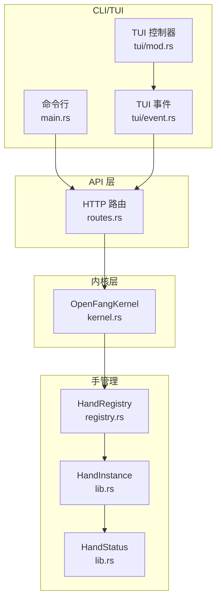
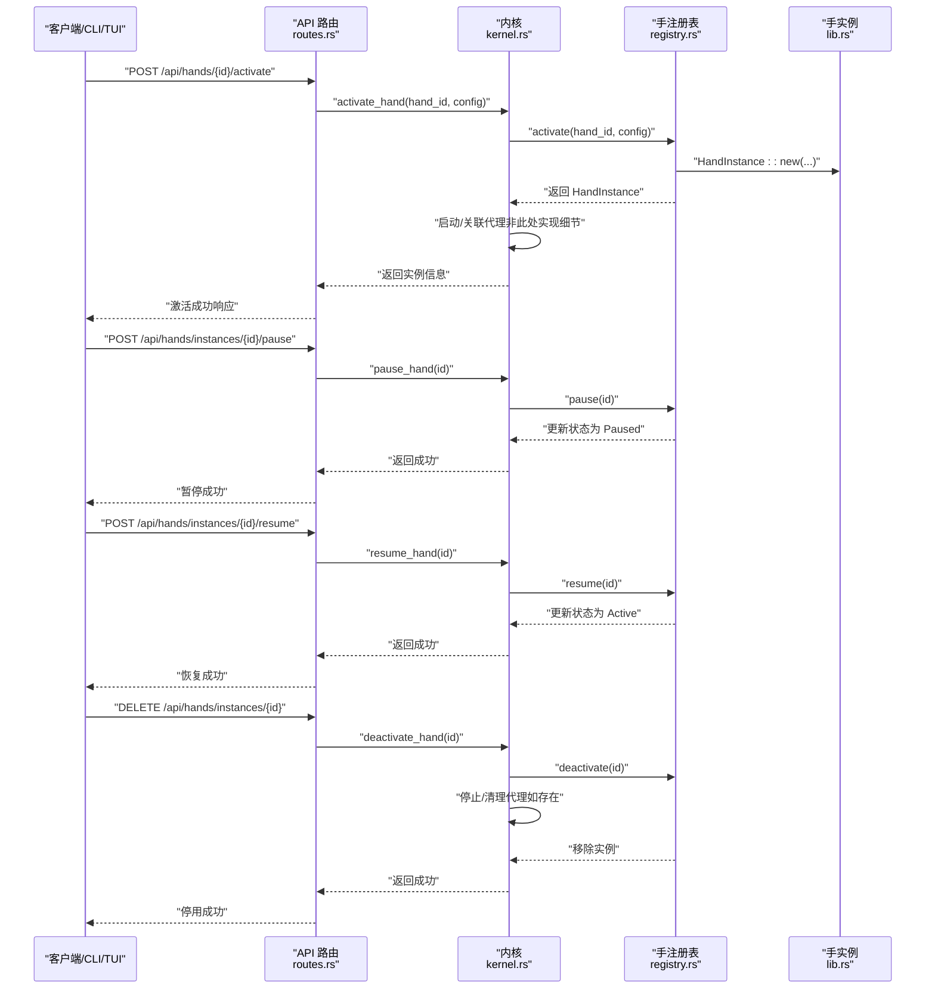
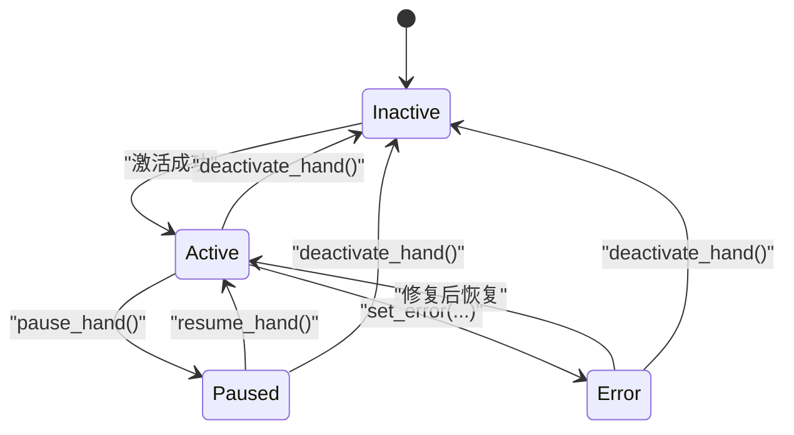
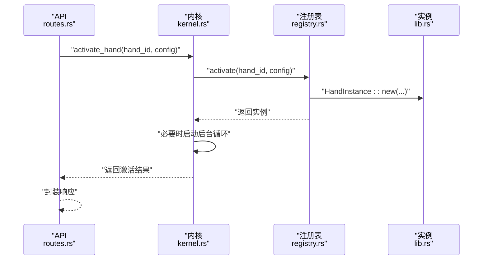
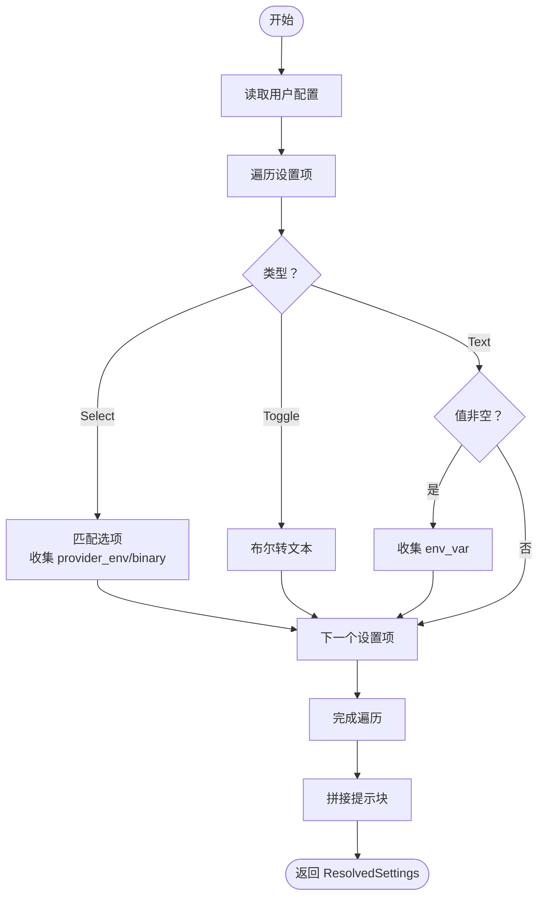
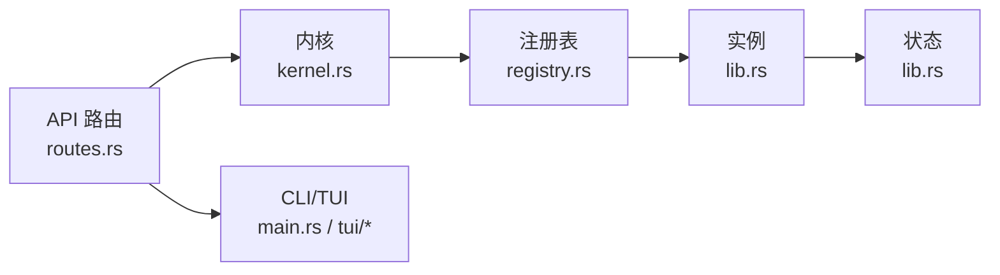

# 手的生命周期管理

<cite>
**本文引用的文件**
- [crates/openfang-hands/src/lib.rs](file://crates/openfang-hands/src/lib.rs)
- [crates/openfang-hands/src/registry.rs](file://crates/openfang-hands/src/registry.rs)
- [crates/openfang-api/src/routes.rs](file://crates/openfang-api/src/routes.rs)
- [crates/openfang-kernel/src/kernel.rs](file://crates/openfang-kernel/src/kernel.rs)
- [crates/openfang-cli/src/tui/event.rs](file://crates/openfang-cli/src/tui/event.rs)
- [crates/openfang-cli/src/tui/mod.rs](file://crates/openfang-cli/src/tui/mod.rs)
- [crates/openfang-cli/src/main.rs](file://crates/openfang-cli/src/main.rs)
</cite>

## 目录
1. [简介](#简介)
2. [项目结构](#项目结构)
3. [核心组件](#核心组件)
4. [架构总览](#架构总览)
5. [详细组件分析](#详细组件分析)
6. [依赖关系分析](#依赖关系分析)
7. [性能考量](#性能考量)
8. [故障排查指南](#故障排查指南)
9. [结论](#结论)
10. [附录](#附录)

## 简介
本文件系统性阐述“手（Hand）”在 OpenFang 中的完整生命周期管理，覆盖从 HandDefinition 解析、HandInstance 创建、激活（ActivateHandRequest）、运行时状态管理、暂停/恢复、停用与销毁；解释 HandStatus 枚举的状态及转换条件；梳理 HandInstance 结构体字段语义；说明激活请求处理流程、配置解析（resolve_settings）过程与环境变量注入机制；并提供状态转换图、错误处理策略、资源清理机制与故障恢复方案。

## 项目结构
围绕“手”的生命周期，相关代码分布在以下模块：
- openfang-hands：定义 HandDefinition、HandInstance、HandStatus、配置解析与注册表（HandRegistry）
- openfang-api：对外暴露激活、暂停、恢复、停用等 HTTP 接口
- openfang-kernel：内核协调器，负责实际的代理启动、暂停/恢复、停用与持久化
- openfang-cli：命令行与 TUI 对外操作入口（激活/停用/暂停/恢复）

图表来源
- [crates/openfang-api/src/routes.rs:4443-4543](file://crates/openfang-api/src/routes.rs#L4443-L4543)
- [crates/openfang-kernel/src/kernel.rs:3442-3491](file://crates/openfang-kernel/src/kernel.rs#L3442-L3491)
- [crates/openfang-hands/src/registry.rs:202-288](file://crates/openfang-hands/src/registry.rs#L202-L288)
- [crates/openfang-hands/src/lib.rs:367-427](file://crates/openfang-hands/src/lib.rs#L367-L427)
- [crates/openfang-cli/src/main.rs:4117-4199](file://crates/openfang-cli/src/main.rs#L4117-L4199)
- [crates/openfang-cli/src/tui/event.rs:2257-2327](file://crates/openfang-cli/src/tui/event.rs#L2257-L2327)
- [crates/openfang-cli/src/tui/mod.rs:1591-1622](file://crates/openfang-cli/src/tui/mod.rs#L1591-L1622)

章节来源
- [crates/openfang-api/src/routes.rs:4443-4543](file://crates/openfang-api/src/routes.rs#L4443-L4543)
- [crates/openfang-kernel/src/kernel.rs:3442-3491](file://crates/openfang-kernel/src/kernel.rs#L3442-L3491)
- [crates/openfang-hands/src/registry.rs:202-288](file://crates/openfang-hands/src/registry.rs#L202-L288)
- [crates/openfang-hands/src/lib.rs:367-427](file://crates/openfang-hands/src/lib.rs#L367-L427)
- [crates/openfang-cli/src/main.rs:4117-4199](file://crates/openfang-cli/src/main.rs#L4117-L4199)
- [crates/openfang-cli/src/tui/event.rs:2257-2327](file://crates/openfang-cli/src/tui/event.rs#L2257-L2327)
- [crates/openfang-cli/src/tui/mod.rs:1591-1622](file://crates/openfang-cli/src/tui/mod.rs#L1591-L1622)

## 核心组件
- HandDefinition：从 HAND.toml 解析得到的手能力定义，包含 id、name、description、category、tools、skills、mcp_servers、requires、settings、agent、dashboard 等字段。
- HandInstance：运行时实例，包含 instance_id、hand_id、status、agent_id、agent_name、config、activated_at、updated_at。
- HandStatus：实例状态枚举，支持 Active、Paused、Error(String)、Inactive。
- HandRegistry：维护已知 HandDefinition 与活动实例，提供 activate/deactivate/pause/resume/set_agent/update_config 等操作。
- ActivateHandRequest：激活请求载荷，包含可选配置覆盖 config。
- resolve_settings：根据设置模式（Select/Toggle/Text）解析用户配置，生成提示块与需要注入的环境变量列表。

章节来源
- [crates/openfang-hands/src/lib.rs:328-427](file://crates/openfang-hands/src/lib.rs#L328-L427)
- [crates/openfang-hands/src/registry.rs:202-288](file://crates/openfang-hands/src/registry.rs#L202-L288)

## 架构总览
下图展示从 API 到内核再到手注册表与实例的调用链路，以及状态变更路径。

图表来源
- [crates/openfang-api/src/routes.rs:4443-4543](file://crates/openfang-api/src/routes.rs#L4443-L4543)
- [crates/openfang-kernel/src/kernel.rs:3442-3491](file://crates/openfang-kernel/src/kernel.rs#L3442-L3491)
- [crates/openfang-hands/src/registry.rs:202-288](file://crates/openfang-hands/src/registry.rs#L202-L288)
- [crates/openfang-hands/src/lib.rs:387-427](file://crates/openfang-hands/src/lib.rs#L387-L427)

## 详细组件分析

### HandInstance 生命周期与状态机
- 创建：HandInstance::new 在注册表中创建一个 Active 状态的新实例。
- 激活：API 调用内核 activate_hand，内核委托注册表 activate，返回实例；随后内核可能启动代理后台循环。
- 运行时状态管理：注册表提供 pause/resume/set_error 等方法；内核提供 pause_hand/resume_hand；API 提供对应 REST 接口。
- 停用与销毁：API 调用 deactivate_hand，内核查找并移除实例，尝试终止代理进程，最后持久化状态。

图表来源
- [crates/openfang-hands/src/lib.rs:367-385](file://crates/openfang-hands/src/lib.rs#L367-L385)
- [crates/openfang-hands/src/registry.rs:237-273](file://crates/openfang-hands/src/registry.rs#L237-L273)
- [crates/openfang-api/src/routes.rs:4494-4526](file://crates/openfang-api/src/routes.rs#L4494-L4526)
- [crates/openfang-kernel/src/kernel.rs:3479-3491](file://crates/openfang-kernel/src/kernel.rs#L3479-L3491)

章节来源
- [crates/openfang-hands/src/lib.rs:387-427](file://crates/openfang-hands/src/lib.rs#L387-L427)
- [crates/openfang-hands/src/registry.rs:237-273](file://crates/openfang-hands/src/registry.rs#L237-L273)
- [crates/openfang-api/src/routes.rs:4494-4526](file://crates/openfang-api/src/routes.rs#L4494-L4526)
- [crates/openfang-kernel/src/kernel.rs:3479-3491](file://crates/openfang-kernel/src/kernel.rs#L3479-L3491)

### HandStatus 枚举与转换条件
- Active：初始激活或从 Paused/错误恢复后的正常运行态。
- Paused：显式暂停，不接收新任务但保持实例存在。
- Error(String)：运行期检测到不可恢复问题时进入，需人工干预修复后恢复。
- Inactive：实例被停用/销毁后不再活跃。

转换触发点：
- API 层：pause_hand/resume_hand/deactivate_hand
- 内核层：pause_hand/resume_hand/deactivate_hand
- 注册表层：pause/resume/set_error/deactivate
- CLI/TUI：通过 API 触发相应动作

章节来源
- [crates/openfang-hands/src/lib.rs:367-385](file://crates/openfang-hands/src/lib.rs#L367-L385)
- [crates/openfang-api/src/routes.rs:4494-4526](file://crates/openfang-api/src/routes.rs#L4494-L4526)
- [crates/openfang-kernel/src/kernel.rs:3479-3491](file://crates/openfang-kernel/src/kernel.rs#L3479-L3491)
- [crates/openfang-hands/src/registry.rs:237-273](file://crates/openfang-hands/src/registry.rs#L237-L273)

### HandInstance 字段语义
- instance_id：实例唯一标识（UUID）
- hand_id：所属 HandDefinition 的标识
- status：当前状态（Active/Paused/Error/Inactive）
- agent_id：实际运行的代理标识（可空，激活后由内核填充）
- agent_name：用于显示的代理名称
- config：用户提供的配置覆盖（JSON 值映射）
- activated_at：激活时间（UTC）
- updated_at：最近一次状态更新时间（UTC）

章节来源
- [crates/openfang-hands/src/lib.rs:387-427](file://crates/openfang-hands/src/lib.rs#L387-L427)

### 激活请求处理流程
- API 接收 ActivateHandRequest（含可选 config），调用内核 activate_hand(hand_id, config)
- 内核委托 HandRegistry.activate，检查是否已有 Active 实例，若无则创建 HandInstance 并插入注册表
- 若代理为非 Reactive（自主型），内核立即启动其后台循环
- 返回包含 instance_id、hand_id、status、agent_id/agent_name、激活时间等信息

图表来源
- [crates/openfang-api/src/routes.rs:4443-4492](file://crates/openfang-api/src/routes.rs#L4443-L4492)
- [crates/openfang-kernel/src/kernel.rs:3420-3440](file://crates/openfang-kernel/src/kernel.rs#L3420-L3440)
- [crates/openfang-hands/src/registry.rs:202-225](file://crates/openfang-hands/src/registry.rs#L202-L225)
- [crates/openfang-hands/src/lib.rs:408-427](file://crates/openfang-hands/src/lib.rs#L408-L427)

章节来源
- [crates/openfang-api/src/routes.rs:4443-4492](file://crates/openfang-api/src/routes.rs#L4443-L4492)
- [crates/openfang-kernel/src/kernel.rs:3420-3440](file://crates/openfang-kernel/src/kernel.rs#L3420-L3440)
- [crates/openfang-hands/src/registry.rs:202-225](file://crates/openfang-hands/src/registry.rs#L202-L225)
- [crates/openfang-hands/src/lib.rs:408-427](file://crates/openfang-hands/src/lib.rs#L408-L427)

### 配置解析与环境变量注入（resolve_settings）
- 输入：HandSetting 列表与用户配置 HashMap
- 处理：
  - Select：匹配选项，收集 provider_env（如 GROQ_API_KEY）与 binary（如 whisper）以决定可用性
  - Toggle：将 true/false 映射为 Enabled/Disabled 文本
  - Text：当值非空时写入提示块，并收集 env_var（如 API 密钥文本框）
- 输出：ResolvedSettings（prompt_block、env_vars）
- 用途：构建系统提示块与注入子进程所需环境变量

图表来源
- [crates/openfang-hands/src/lib.rs:195-266](file://crates/openfang-hands/src/lib.rs#L195-L266)

章节来源
- [crates/openfang-hands/src/lib.rs:195-266](file://crates/openfang-hands/src/lib.rs#L195-L266)

### 环境变量注入机制
- resolve_settings 会收集需要注入的环境变量名（provider_env/env_var），用于后续在代理子进程中可见
- 注册表层提供 check_settings_availability，结合环境变量与二进制可用性计算选项可用性
- 内核层在重启/迁移时会持久化手状态，确保重启后仍能正确恢复

章节来源
- [crates/openfang-hands/src/lib.rs:195-266](file://crates/openfang-hands/src/lib.rs#L195-L266)
- [crates/openfang-hands/src/registry.rs:309-347](file://crates/openfang-hands/src/registry.rs#L309-L347)
- [crates/openfang-kernel/src/kernel.rs:3471-3477](file://crates/openfang-kernel/src/kernel.rs#L3471-L3477)

### CLI/TUI 与 API 的交互
- CLI：命令 hand activate/deactivate/info 通过 HTTP 客户端访问 API
- TUI：事件线程发起激活/停用/暂停/恢复请求，API 层统一处理并返回状态
- API：提供 /api/hands/{id}/activate、/api/hands/instances/{id}/pause、/api/hands/instances/{id}/resume、/api/hands/instances/{id} 等接口

章节来源
- [crates/openfang-cli/src/main.rs:4117-4199](file://crates/openfang-cli/src/main.rs#L4117-L4199)
- [crates/openfang-cli/src/tui/event.rs:2257-2327](file://crates/openfang-cli/src/tui/event.rs#L2257-L2327)
- [crates/openfang-cli/src/tui/mod.rs:1591-1622](file://crates/openfang-cli/src/tui/mod.rs#L1591-L1622)
- [crates/openfang-api/src/routes.rs:4443-4543](file://crates/openfang-api/src/routes.rs#L4443-L4543)

## 依赖关系分析
- API 层依赖内核层提供的 activate_hand/pause_hand/resume_hand/deactivate_hand
- 内核层依赖 HandRegistry 进行实例状态管理与持久化
- HandRegistry 依赖 HandInstance/HandStatus/HandDefinition
- CLI/TUI 通过 API 间接依赖内核与注册表

图表来源
- [crates/openfang-api/src/routes.rs:4443-4543](file://crates/openfang-api/src/routes.rs#L4443-L4543)
- [crates/openfang-kernel/src/kernel.rs:3442-3491](file://crates/openfang-kernel/src/kernel.rs#L3442-L3491)
- [crates/openfang-hands/src/registry.rs:202-288](file://crates/openfang-hands/src/registry.rs#L202-L288)
- [crates/openfang-hands/src/lib.rs:367-427](file://crates/openfang-hands/src/lib.rs#L367-L427)
- [crates/openfang-cli/src/main.rs:4117-4199](file://crates/openfang-cli/src/main.rs#L4117-L4199)
- [crates/openfang-cli/src/tui/event.rs:2257-2327](file://crates/openfang-cli/src/tui/event.rs#L2257-L2327)

章节来源
- [crates/openfang-api/src/routes.rs:4443-4543](file://crates/openfang-api/src/routes.rs#L4443-L4543)
- [crates/openfang-kernel/src/kernel.rs:3442-3491](file://crates/openfang-kernel/src/kernel.rs#L3442-L3491)
- [crates/openfang-hands/src/registry.rs:202-288](file://crates/openfang-hands/src/registry.rs#L202-L288)
- [crates/openfang-hands/src/lib.rs:367-427](file://crates/openfang-hands/src/lib.rs#L367-L427)
- [crates/openfang-cli/src/main.rs:4117-4199](file://crates/openfang-cli/src/main.rs#L4117-L4199)
- [crates/openfang-cli/src/tui/event.rs:2257-2327](file://crates/openfang-cli/src/tui/event.rs#L2257-L2327)

## 性能考量
- 注册表使用并发容器（DashMap）存储定义与实例，降低锁竞争
- 状态变更仅更新内存与时间戳，避免频繁 IO
- 持久化仅在关键节点（激活/停用/重启）进行，减少磁盘写入频率
- 自主型代理在激活后立即启动后台循环，避免延迟

## 故障排查指南
- 激活失败
  - 可能原因：HandDefinition 不存在、同手已处于 Active 状态
  - 处理建议：确认 hand_id 正确、检查当前活动实例、查看日志
- 暂停/恢复无效
  - 可能原因：实例不存在或状态非法
  - 处理建议：确认 instance_id、检查实例状态、重试
- 停用失败
  - 可能原因：代理未启动或已异常退出
  - 处理建议：查看内核日志、确认代理是否存在、手动清理孤儿代理
- 环境变量未生效
  - 可能原因：resolve_settings 未收集到 env_var/provider_env
  - 处理建议：检查设置项与用户配置、确认二进制/环境变量可用性

章节来源
- [crates/openfang-hands/src/registry.rs:202-235](file://crates/openfang-hands/src/registry.rs#L202-L235)
- [crates/openfang-kernel/src/kernel.rs:3442-3469](file://crates/openfang-kernel/src/kernel.rs#L3442-L3469)
- [crates/openfang-hands/src/lib.rs:195-266](file://crates/openfang-hands/src/lib.rs#L195-L266)

## 结论
OpenFang 的手生命周期管理通过清晰的分层设计实现了从定义到实例、从激活到停用的全链路控制。HandStatus 的四种状态与 API/内核/注册表的协同，保证了运行时的可控性与可观测性。resolve_settings 与环境变量注入机制进一步提升了手能力的可配置性与可移植性。配合持久化与错误处理策略，系统具备良好的稳定性与可恢复性。

## 附录

### API 定义概览
- 激活手
  - 方法：POST
  - 路径：/api/hands/{id}/activate
  - 请求体：ActivateHandRequest（可选 config）
  - 响应：instance_id、hand_id、status、agent_id、agent_name、activated_at
- 暂停手实例
  - 方法：POST
  - 路径：/api/hands/instances/{id}/pause
  - 响应：status、instance_id
- 恢复手实例
  - 方法：POST
  - 路径：/api/hands/instances/{id}/resume
  - 响应：status、instance_id
- 停用手实例
  - 方法：DELETE
  - 路径：/api/hands/instances/{id}
  - 响应：status、instance_id

章节来源
- [crates/openfang-api/src/routes.rs:4443-4543](file://crates/openfang-api/src/routes.rs#L4443-L4543)