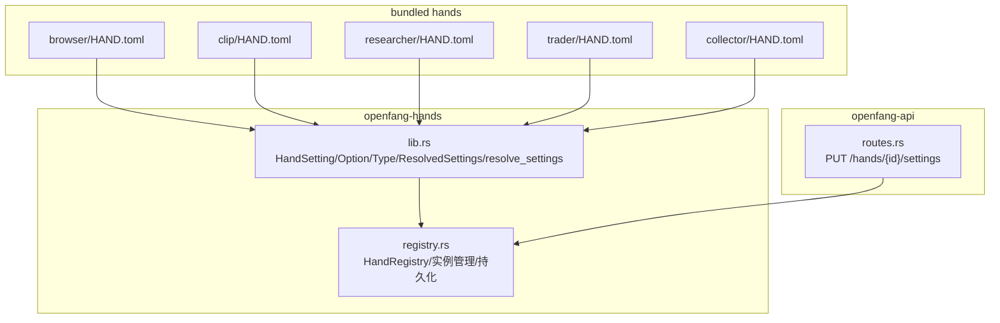
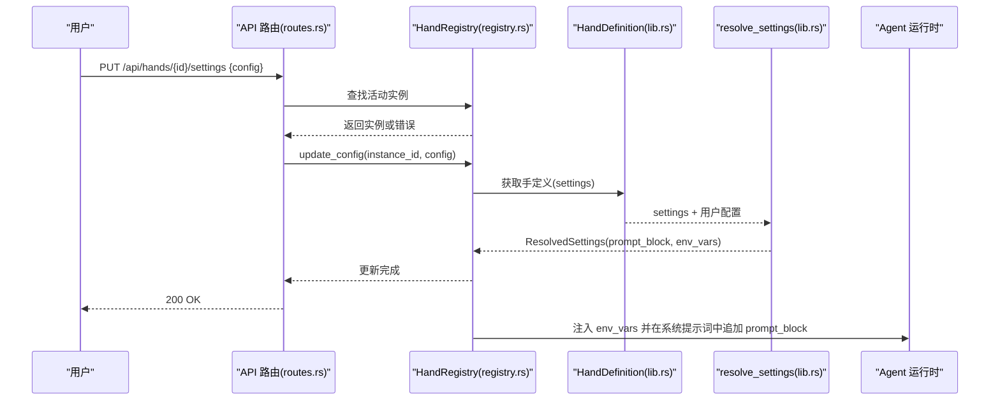
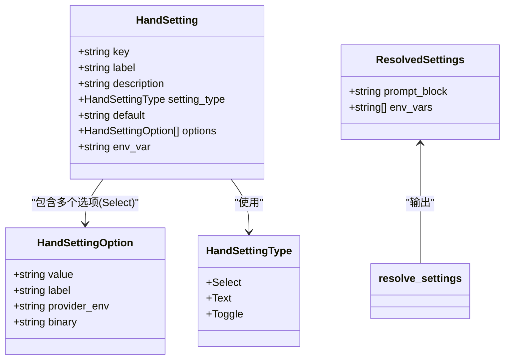
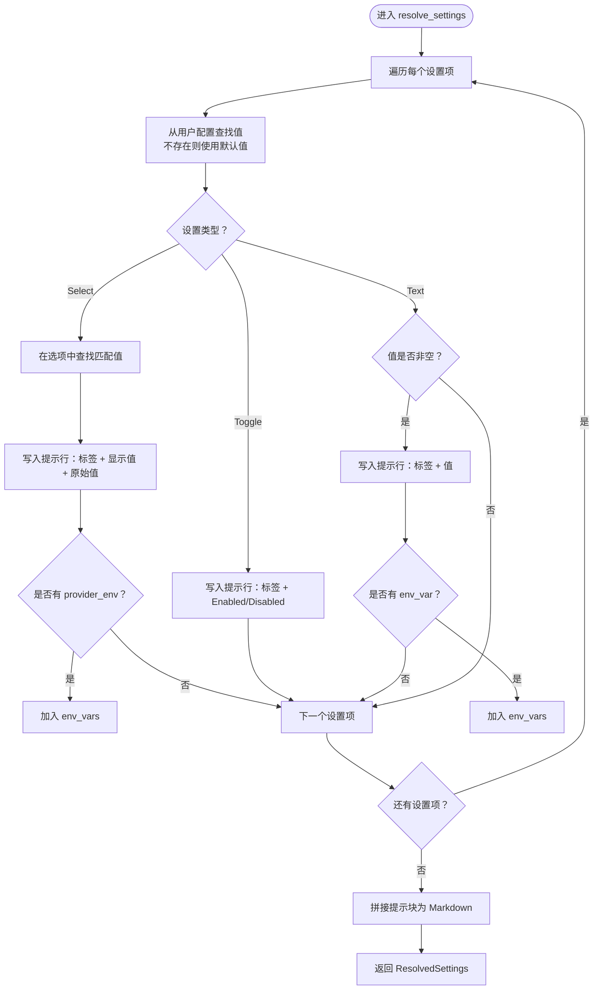
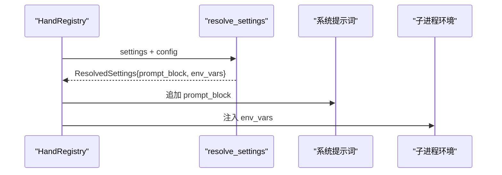
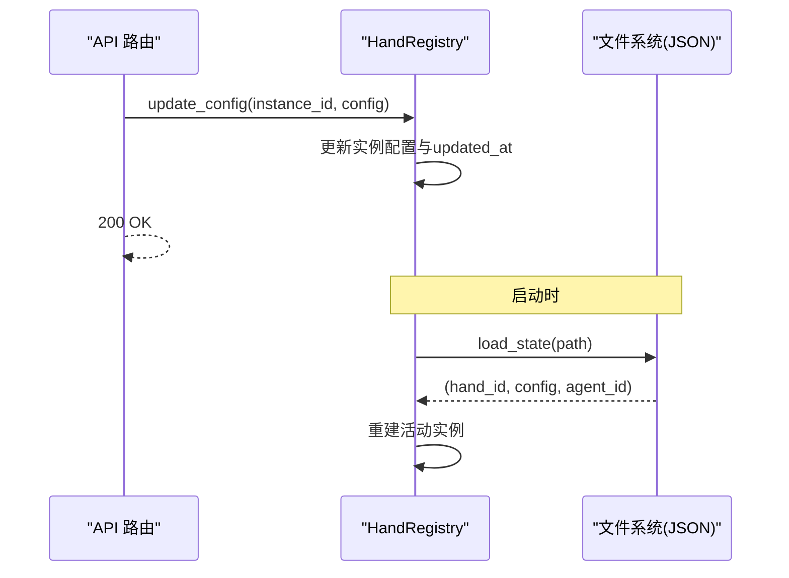
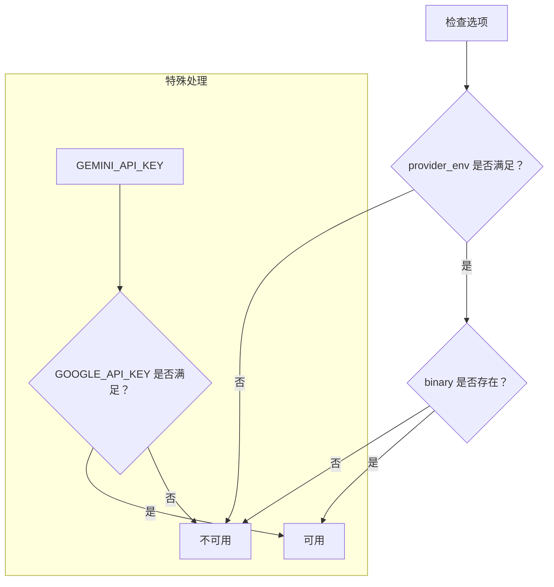
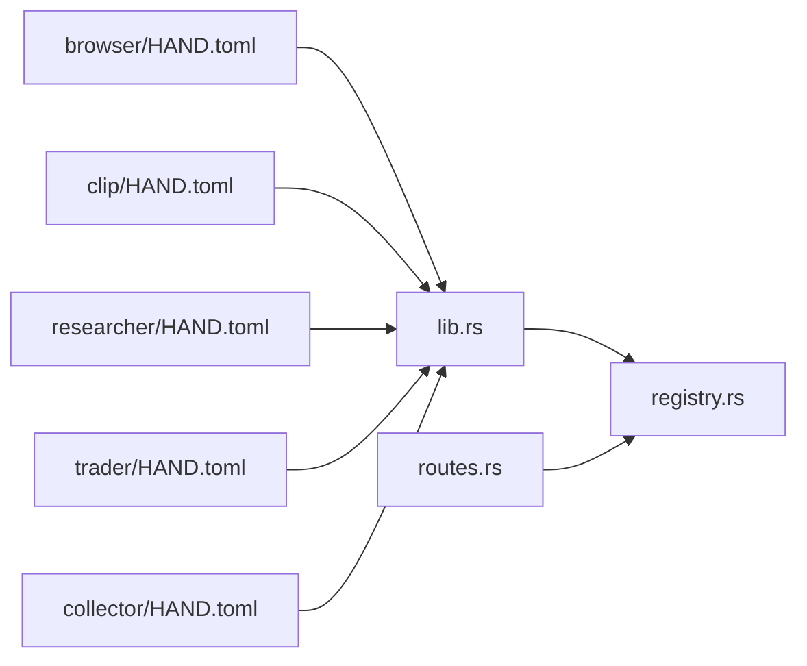

# 手设置和配置系统

<cite>
**本文档引用的文件**
- [lib.rs](file://crates/openfang-hands/src/lib.rs)
- [registry.rs](file://crates/openfang-hands/src/registry.rs)
- [routes.rs](file://crates/openfang-api/src/routes.rs)
- [HAND.toml（浏览器）](file://crates/openfang-hands/bundled/browser/HAND.toml)
- [HAND.toml（剪辑）](file://crates/openfang-hands/bundled/clip/HAND.toml)
- [HAND.toml（研究者）](file://crates/openfang-hands/bundled/researcher/HAND.toml)
- [HAND.toml（交易员）](file://crates/openfang-hands/bundled/trader/HAND.toml)
- [HAND.toml（收集器）](file://crates/openfang-hands/bundled/collector/HAND.toml)
</cite>

## 目录
1. [简介](#简介)
2. [项目结构](#项目结构)
3. [核心组件](#核心组件)
4. [架构总览](#架构总览)
5. [详细组件分析](#详细组件分析)
6. [依赖关系分析](#依赖关系分析)
7. [性能考虑](#性能考虑)
8. [故障排除指南](#故障排除指南)
9. [结论](#结论)
10. [附录](#附录)

## 简介
本文件系统性阐述“手设置和配置系统”的设计与实现，重点覆盖以下方面：
- HandSetting 与 HandSettingOption 的数据结构与职责边界
- 三种设置类型（Select、Text、Toggle）的特性与使用场景
- 配置解析流程 resolve_settings 的行为：用户配置与默认值合并、选项匹配、环境变量收集
- 不同设置类型的配置方法：Select 的选项配置、Text 的环境变量注入、Toggle 的状态管理
- 完整配置示例：多设置类型组合的复杂场景
- 设置验证规则、动态配置更新、配置持久化机制
- 设置与系统提示词的集成方式、配置变更的影响范围与回滚策略

## 项目结构
该系统位于 openfang 仓库的 crates/openfang-hands 子模块中，核心类型定义与解析逻辑集中在 lib.rs；运行时实例管理与持久化在 registry.rs；API 层通过 routes.rs 提供设置更新接口；各 HAND.toml 文件作为具体“手”的配置来源。

**图表来源**
- [lib.rs:155-266](file://crates/openfang-hands/src/lib.rs#L155-L266)
- [registry.rs:39-406](file://crates/openfang-hands/src/registry.rs#L39-L406)
- [routes.rs:4584-4597](file://crates/openfang-api/src/routes.rs#L4584-L4597)
- [HAND.toml（浏览器）:49-109](file://crates/openfang-hands/bundled/browser/HAND.toml#L49-L109)
- [HAND.toml（剪辑）:57-183](file://crates/openfang-hands/bundled/clip/HAND.toml#L57-L183)
- [HAND.toml（研究者）:8-153](file://crates/openfang-hands/bundled/researcher/HAND.toml#L8-L153)
- [HAND.toml（交易员）:8-191](file://crates/openfang-hands/bundled/trader/HAND.toml#L8-L191)
- [HAND.toml（收集器）:8-145](file://crates/openfang-hands/bundled/collector/HAND.toml#L8-L145)

**章节来源**
- [lib.rs:155-266](file://crates/openfang-hands/src/lib.rs#L155-L266)
- [registry.rs:39-406](file://crates/openfang-hands/src/registry.rs#L39-L406)
- [routes.rs:4584-4597](file://crates/openfang-api/src/routes.rs#L4584-L4597)

## 核心组件
- HandSettingType：设置控件类型枚举，支持 Select、Text、Toggle
- HandSettingOption：Select 类型的单个选项，包含值、标签以及可选的 provider_env（环境变量）与 binary（二进制）
- HandSetting：手的可配置项，包含键、标签、描述、类型、默认值、选项列表、Text 类型的 env_var
- ResolvedSettings：解析结果，包含将要附加到系统提示词的 Markdown 块与需要注入子进程的环境变量列表
- resolve_settings：核心解析函数，按设置类型分别处理并生成提示块与环境变量

这些组件共同构成“声明式配置 + 运行时解析”的模式，既保证了配置的可读性与可维护性，又能在运行时将配置转化为系统提示词与执行环境。

**章节来源**
- [lib.rs:155-266](file://crates/openfang-hands/src/lib.rs#L155-L266)

## 架构总览
下图展示了从 HAND.toml 到运行时配置、再到系统提示词与环境变量注入的整体流程。

**图表来源**
- [routes.rs:4584-4597](file://crates/openfang-api/src/routes.rs#L4584-L4597)
- [registry.rs:349-362](file://crates/openfang-hands/src/registry.rs#L349-L362)
- [lib.rs:209-266](file://crates/openfang-hands/src/lib.rs#L209-L266)

## 详细组件分析

### 数据模型与类图
HandSetting、HandSettingOption、HandSettingType、ResolvedSettings 的关系如下：

**图表来源**
- [lib.rs:155-266](file://crates/openfang-hands/src/lib.rs#L155-L266)

**章节来源**
- [lib.rs:155-266](file://crates/openfang-hands/src/lib.rs#L155-L266)

### 解析流程：resolve_settings
resolve_settings 的核心逻辑：
- 对每个设置项，优先从用户配置中取值，否则回退到默认值
- 根据设置类型分别处理：
  - Select：匹配选项，显示标签或原始值，并收集对应选项的 provider_env
  - Toggle：将字符串“true/1”视为启用，生成“Enabled/Disabled”
  - Text：若非空则写入提示块，并收集其 env_var
- 最终生成一个 Markdown 片段（用于系统提示词）与环境变量名列表（注入子进程）

**图表来源**
- [lib.rs:209-266](file://crates/openfang-hands/src/lib.rs#L209-L266)

**章节来源**
- [lib.rs:209-266](file://crates/openfang-hands/src/lib.rs#L209-L266)

### 设置类型详解与使用场景

- Select（选择型）
  - 特点：预定义一组互斥选项，每个选项可携带 provider_env 或 binary，用于“可用性检查”与“环境变量收集”
  - 使用场景：语音识别/合成服务提供商切换、市场关注方向、交易模式等
  - 示例来源：浏览器手（headless、purchase approval、max_pages_per_task、default_wait）、剪辑手（stt/tts provider、发布目标）、研究者手（research depth、output style、citation style、language）、交易员手（trading mode、market focus、strategy style、risk per trade、max daily loss、analysis depth、scan schedule）

- Text（文本型）
  - 特点：自由输入；可通过 env_var 将输入值映射为环境变量名，便于注入到子进程
  - 使用场景：API 密钥、观察列表、初始资金等
  - 示例来源：剪辑手（ElevenLabs API Key）、交易员手（Alpaca API Key/Secret Key、watchlist、initial capital）

- Toggle（开关型）
  - 特点：布尔语义，接受“true/1”为启用，“false/0”为禁用；生成“Enabled/Disabled”提示
  - 使用场景：是否截图、是否需要购买审批、是否保存日志、是否自动跟进等
  - 示例来源：浏览器手（headless、approval_mode、screenshot_on_action）、交易员手（approval_mode）、收集器手（alert_on_changes、track_sentiment）、研究者手（source_verification、auto_follow_up、save_research_log）

**章节来源**
- [HAND.toml（浏览器）:49-109](file://crates/openfang-hands/bundled/browser/HAND.toml#L49-L109)
- [HAND.toml（剪辑）:57-183](file://crates/openfang-hands/bundled/clip/HAND.toml#L57-L183)
- [HAND.toml（研究者）:8-153](file://crates/openfang-hands/bundled/researcher/HAND.toml#L8-L153)
- [HAND.toml（交易员）:8-191](file://crates/openfang-hands/bundled/trader/HAND.toml#L8-L191)
- [HAND.toml（收集器）:8-145](file://crates/openfang-hands/bundled/collector/HAND.toml#L8-L145)

### 配置解析与系统提示词集成
- resolve_settings 输出的 prompt_block 会被追加到系统提示词中，形成“用户配置摘要”，帮助代理在推理时考虑用户的偏好
- env_vars 会注入到代理子进程的环境中，使外部工具（如 Whisper、ElevenLabs、Alpaca 等）能够按需访问密钥

**图表来源**
- [lib.rs:209-266](file://crates/openfang-hands/src/lib.rs#L209-L266)

**章节来源**
- [lib.rs:209-266](file://crates/openfang-hands/src/lib.rs#L209-L266)

### 动态配置更新与持久化
- 动态更新：API 路由接收 PUT 请求，HandRegistry.update_config 将新配置写入活动实例并更新时间戳
- 持久化：HandRegistry.persist_state 将活动实例序列化为 JSON 并落盘；HandRegistry.load_state 在启动时恢复实例状态
- 影响范围：更新后，后续任务将基于新的配置进行解析与执行；若涉及环境变量变化，需确保子进程重新加载或重启

**图表来源**
- [routes.rs:4584-4597](file://crates/openfang-api/src/routes.rs#L4584-L4597)
- [registry.rs:55-106](file://crates/openfang-hands/src/registry.rs#L55-L106)
- [registry.rs:349-362](file://crates/openfang-hands/src/registry.rs#L349-L362)

**章节来源**
- [routes.rs:4584-4597](file://crates/openfang-api/src/routes.rs#L4584-L4597)
- [registry.rs:55-106](file://crates/openfang-hands/src/registry.rs#L55-L106)
- [registry.rs:349-362](file://crates/openfang-hands/src/registry.rs#L349-L362)

### 验证规则与可用性检查
- 设置可用性：registry.rs 中的 check_settings_availability 会根据 provider_env 与 binary 检查选项是否可用，并在 API 响应中标注
- 可用性判定：check_option_available 综合环境变量与二进制存在性，特殊处理如 GEMINI_API_KEY 兼容 GOOGLE_API_KEY
- 需求满足度：check_requirements 综合二进制、环境变量、API Key 等要求，支持可选需求（optional）

**图表来源**
- [registry.rs:607-636](file://crates/openfang-hands/src/registry.rs#L607-L636)

**章节来源**
- [registry.rs:310-347](file://crates/openfang-hands/src/registry.rs#L310-L347)
- [registry.rs:607-636](file://crates/openfang-hands/src/registry.rs#L607-L636)

### 复杂配置示例与最佳实践
- 浏览器手（Browser Hand）
  - Toggle：headless、approval_mode、screenshot_on_action
  - Select：max_pages_per_task、default_wait
  - 推荐：headless 服务器部署建议开启；purchase approval 强烈建议开启；default_wait 选择 auto 以提升稳定性
- 剪辑手（Clip Hand）
  - Select：stt_provider、tts_provider、publish_target
  - Text：ElevenLabs API Key、Telegram/WhatsApp 凭据
  - 推荐：stt_provider 优先本地 Whisper 或 Groq；发布平台至少配置一个凭据
- 研究者手（Researcher Hand）
  - Select：research_depth、output_style、citation_style、language
  - Toggle：source_verification、auto_follow_up、save_research_log
  - 推荐：深度越高，资源消耗越大；学术报告建议 APA 格式
- 交易员手（Trading Hand）
  - Select：trading_mode、market_focus、strategy_style、risk_per_trade、max_daily_loss、analysis_depth、scan_schedule
  - Text：watchlist、initial_capital、Alpaca API Key/Secret Key
  - Toggle：approval_mode
  - 推荐：paper 模式先行；approval_mode 始终开启；严格控制最大日亏损与仓位比例

**章节来源**
- [HAND.toml（浏览器）:49-109](file://crates/openfang-hands/bundled/browser/HAND.toml#L49-L109)
- [HAND.toml（剪辑）:57-183](file://crates/openfang-hands/bundled/clip/HAND.toml#L57-L183)
- [HAND.toml（研究者）:8-153](file://crates/openfang-hands/bundled/researcher/HAND.toml#L8-L153)
- [HAND.toml（交易员）:8-191](file://crates/openfang-hands/bundled/trader/HAND.toml#L8-L191)

## 依赖关系分析
- lib.rs 为配置模型与解析的核心，被 registry.rs 与 API 路由间接使用
- registry.rs 负责实例生命周期管理、配置持久化与可用性检查
- routes.rs 提供对外的设置更新接口，驱动 registry.rs 的配置变更
- HAND.toml 文件作为配置源，经解析后成为 HandDefinition 的 settings 字段

**图表来源**
- [lib.rs:155-266](file://crates/openfang-hands/src/lib.rs#L155-L266)
- [registry.rs:39-406](file://crates/openfang-hands/src/registry.rs#L39-L406)
- [routes.rs:4584-4597](file://crates/openfang-api/src/routes.rs#L4584-L4597)
- [HAND.toml（浏览器）:49-109](file://crates/openfang-hands/bundled/browser/HAND.toml#L49-L109)
- [HAND.toml（剪辑）:57-183](file://crates/openfang-hands/bundled/clip/HAND.toml#L57-L183)
- [HAND.toml（研究者）:8-153](file://crates/openfang-hands/bundled/researcher/HAND.toml#L8-L153)
- [HAND.toml（交易员）:8-191](file://crates/openfang-hands/bundled/trader/HAND.toml#L8-L191)
- [HAND.toml（收集器）:8-145](file://crates/openfang-hands/bundled/collector/HAND.toml#L8-L145)

**章节来源**
- [lib.rs:155-266](file://crates/openfang-hands/src/lib.rs#L155-L266)
- [registry.rs:39-406](file://crates/openfang-hands/src/registry.rs#L39-L406)
- [routes.rs:4584-4597](file://crates/openfang-api/src/routes.rs#L4584-L4597)

## 性能考虑
- 解析复杂度：resolve_settings 对每个设置项进行常数时间操作，整体 O(n)，n 为设置项数量，开销极低
- 可用性检查：check_option_available 仅做环境变量与 PATH 查询，成本可控
- 实例持久化：JSON 序列化/反序列化在活动实例较少时影响可忽略；建议定期清理历史实例以避免文件膨胀

[本节为通用指导，无需特定文件引用]

## 故障排除指南
- 配置未生效
  - 检查是否通过 API 正确调用更新接口并返回成功
  - 确认实例仍处于 Active 状态
- 环境变量未注入
  - 确认 Text 类型设置了 env_var
  - 确认 resolve_settings 收集到了对应的 provider_env（Select 类型）
- 设置不可用
  - 检查 provider_env 是否已设置且非空
  - 检查 binary 是否存在于 PATH
  - 特殊情况：GEMINI_API_KEY 可兼容 GOOGLE_API_KEY
- 配置回滚
  - 使用持久化文件恢复：load_state 会读取之前保存的实例配置
  - 若实例已停用，可重新激活并应用最新配置

**章节来源**
- [routes.rs:4584-4597](file://crates/openfang-api/src/routes.rs#L4584-L4597)
- [registry.rs:55-106](file://crates/openfang-hands/src/registry.rs#L55-L106)
- [registry.rs:607-636](file://crates/openfang-hands/src/registry.rs#L607-L636)

## 结论
手设置和配置系统通过声明式配置与运行时解析相结合，提供了灵活、可扩展且易于维护的配置能力。Select/Toggle/Text 三类设置覆盖了大多数使用场景，resolve_settings 将用户配置无缝融入系统提示词与执行环境。配合动态更新与持久化机制，系统能够在不中断服务的情况下平滑调整行为，满足生产环境对稳定性与可运维性的要求。

[本节为总结，无需特定文件引用]

## 附录

### API：更新手设置
- 路径：PUT /api/hands/{hand_id}/settings
- 请求体：键为设置 key，值为用户选择/输入
- 成功响应：返回当前手实例的配置状态

**章节来源**
- [routes.rs:4584-4597](file://crates/openfang-api/src/routes.rs#L4584-L4597)