# 自主手系统概览

<cite>
**本文档引用的文件**
- [HAND.toml（浏览器）](file://crates/openfang-hands/bundled/browser/HAND.toml)
- [SKILL.md（浏览器）](file://crates/openfang-hands/bundled/browser/SKILL.md)
- [HAND.toml（研究员）](file://crates/openfang-hands/bundled/researcher/HAND.toml)
- [SKILL.md（研究员）](file://crates/openfang-hands/bundled/researcher/SKILL.md)
- [HAND.toml（潜在客户挖掘）](file://crates/openfang-hands/bundled/lead/HAND.toml)
- [SKILL.md（潜在客户挖掘）](file://crates/openfang-hands/bundled/lead/SKILL.md)
- [HAND.toml（情报收集）](file://crates/openfang-hands/bundled/collector/HAND.toml)
- [SKILL.md（情报收集）](file://crates/openfang-hands/bundled/collector/SKILL.md)
- [HAND.toml（预测分析）](file://crates/openfang-hands/bundled/predictor/HAND.toml)
- [SKILL.md（预测分析）](file://crates/openfang-hands/bundled/predictor/SKILL.md)
- [HAND.toml（社交媒体）](file://crates/openfang-hands/bundled/twitter/HAND.toml)
- [SKILL.md（社交媒体）](file://crates/openfang-hands/bundled/twitter/SKILL.md)
- [HAND.toml（视频剪辑）](file://crates/openfang-hands/bundled/clip/HAND.toml)
- [SKILL.md（视频剪辑）](file://crates/openfang-hands/bundled/clip/SKILL.md)
- [HAND.toml（交易）](file://crates/openfang-hands/bundled/trader/HAND.toml)
- [SKILL.md（交易）](file://crates/openfang-hands/bundled/trader/SKILL.md)
</cite>

## 目录
1. [简介](#简介)
2. [项目结构](#项目结构)
3. [核心组件](#核心组件)
4. [架构总览](#架构总览)
5. [详细组件分析](#详细组件分析)
6. [依赖关系分析](#依赖关系分析)
7. [性能考虑](#性能考虑)
8. [故障排除指南](#故障排除指南)
9. [结论](#结论)
10. [附录](#附录)

## 简介
本文件为 OpenFang 自主手系统提供全面概览，重点覆盖以下方面：
- HAND.toml 配置文件格式与字段语义
- 系统提示词（system_prompt）设计原则与最佳实践
- SKILL.md 专家知识注入机制与工具集成
- 七个预构建“自治能力包”的功能特性、工作流与仪表盘指标
- 手的生命周期管理、审批机制与资源管理
- 执行策略、自定义开发指南与运维建议

## 项目结构
OpenFang 将“手”（Hand）作为可插拔的自治能力单元，每个手由 HAND.toml 定义元数据、工具集、运行参数与系统提示词，并通过 SKILL.md 注入专家知识。系统支持浏览器自动化、深度研究、潜在客户挖掘、情报收集、预测分析、社交媒体管理、视频剪辑等七大能力包。

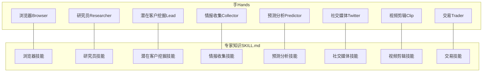

**图表来源**
- [HAND.toml（浏览器）:1-255](file://crates/openfang-hands/bundled/browser/HAND.toml#L1-L255)
- [SKILL.md（浏览器）:1-125](file://crates/openfang-hands/bundled/browser/SKILL.md#L1-L125)
- [HAND.toml（研究员）:1-398](file://crates/openfang-hands/bundled/researcher/HAND.toml#L1-L398)
- [SKILL.md（研究员）:1-328](file://crates/openfang-hands/bundled/researcher/SKILL.md#L1-L328)
- [HAND.toml（潜在客户挖掘）:1-336](file://crates/openfang-hands/bundled/lead/HAND.toml#L1-L336)
- [SKILL.md（潜在客户挖掘）:1-236](file://crates/openfang-hands/bundled/lead/SKILL.md#L1-L236)
- [HAND.toml（情报收集）:1-346](file://crates/openfang-hands/bundled/collector/HAND.toml#L1-L346)
- [SKILL.md（情报收集）:1-272](file://crates/openfang-hands/bundled/collector/SKILL.md#L1-L272)
- [HAND.toml（预测分析）:1-382](file://crates/openfang-hands/bundled/predictor/HAND.toml#L1-L382)
- [SKILL.md（预测分析）:1-273](file://crates/openfang-hands/bundled/predictor/SKILL.md#L1-L273)
- [HAND.toml（社交媒体）:1-409](file://crates/openfang-hands/bundled/twitter/HAND.toml#L1-L409)
- [SKILL.md（社交媒体）:1-362](file://crates/openfang-hands/bundled/twitter/SKILL.md#L1-L362)
- [HAND.toml（视频剪辑）:1-599](file://crates/openfang-hands/bundled/clip/HAND.toml#L1-L599)
- [SKILL.md（视频剪辑）:1-475](file://crates/openfang-hands/bundled/clip/SKILL.md#L1-L475)
- [HAND.toml（交易）:1-741](file://crates/openfang-hands/bundled/trader/HAND.toml#L1-L741)
- [SKILL.md（交易）:1-938](file://crates/openfang-hands/bundled/trader/SKILL.md#L1-L938)

**章节来源**
- [HAND.toml（浏览器）:1-255](file://crates/openfang-hands/bundled/browser/HAND.toml#L1-L255)
- [HAND.toml（研究员）:1-398](file://crates/openfang-hands/bundled/researcher/HAND.toml#L1-L398)
- [HAND.toml（潜在客户挖掘）:1-336](file://crates/openfang-hands/bundled/lead/HAND.toml#L1-L336)
- [HAND.toml（情报收集）:1-346](file://crates/openfang-hands/bundled/collector/HAND.toml#L1-L346)
- [HAND.toml（预测分析）:1-382](file://crates/openfang-hands/bundled/predictor/HAND.toml#L1-L382)
- [HAND.toml（社交媒体）:1-409](file://crates/openfang-hands/bundled/twitter/HAND.toml#L1-L409)
- [HAND.toml（视频剪辑）:1-599](file://crates/openfang-hands/bundled/clip/HAND.toml#L1-L599)
- [HAND.toml（交易）:1-741](file://crates/openfang-hands/bundled/trader/HAND.toml#L1-L741)

## 核心组件
- HAND.toml：定义手的元信息（id、name、description、category、icon）、可用工具列表、运行时要求、可配置设置、Agent 参数与系统提示词、仪表盘指标。
- SKILL.md：以专家知识形式提供工具使用参考、查询模式、推理链模板、API 参考与合规指引，用于增强系统提示词与工具调用质量。
- 仪表盘指标：通过 memory_store 记录与更新各类统计项，如任务完成数、产出数量、活跃度等，供前端展示。

**章节来源**
- [HAND.toml（浏览器）:1-255](file://crates/openfang-hands/bundled/browser/HAND.toml#L1-L255)
- [SKILL.md（浏览器）:1-125](file://crates/openfang-hands/bundled/browser/SKILL.md#L1-L125)
- [HAND.toml（研究员）:1-398](file://crates/openfang-hands/bundled/researcher/HAND.toml#L1-L398)
- [SKILL.md（研究员）:1-328](file://crates/openfang-hands/bundled/researcher/SKILL.md#L1-L328)
- [HAND.toml（潜在客户挖掘）:1-336](file://crates/openfang-hands/bundled/lead/HAND.toml#L1-L336)
- [SKILL.md（潜在客户挖掘）:1-236](file://crates/openfang-hands/bundled/lead/SKILL.md#L1-L236)
- [HAND.toml（情报收集）:1-346](file://crates/openfang-hands/bundled/collector/HAND.toml#L1-L346)
- [SKILL.md（情报收集）:1-272](file://crates/openfang-hands/bundled/collector/SKILL.md#L1-L272)
- [HAND.toml（预测分析）:1-382](file://crates/openfang-hands/bundled/predictor/HAND.toml#L1-L382)
- [SKILL.md（预测分析）:1-273](file://crates/openfang-hands/bundled/predictor/SKILL.md#L1-L273)
- [HAND.toml（社交媒体）:1-409](file://crates/openfang-hands/bundled/twitter/HAND.toml#L1-L409)
- [SKILL.md（社交媒体）:1-362](file://crates/openfang-hands/bundled/twitter/SKILL.md#L1-L362)
- [HAND.toml（视频剪辑）:1-599](file://crates/openfang-hands/bundled/clip/HAND.toml#L1-L599)
- [SKILL.md（视频剪辑）:1-475](file://crates/openfang-hands/bundled/clip/SKILL.md#L1-L475)
- [HAND.toml（交易）:1-741](file://crates/openfang-hands/bundled/trader/HAND.toml#L1-L741)
- [SKILL.md（交易）:1-938](file://crates/openfang-hands/bundled/trader/SKILL.md#L1-L938)

## 架构总览
自主手系统围绕“手（Hand）”进行模块化扩展，每个手在独立目录下维护其 HAND.toml 与 SKILL.md。系统通过内核调度器按需加载手，结合工具适配层与外部服务（如浏览器、API、存储）完成端到端任务。

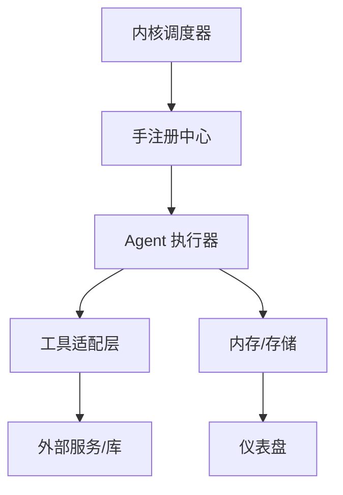

[此图为概念性架构示意，不直接映射具体源码文件]

## 详细组件分析

### 浏览器（Browser）
- 能力概述：网页导航、点击、输入、截图、页面阅读、关闭、搜索、抓取、记忆检索/存储、日程管理、文件读写。
- 关键配置：无头模式、购买审批、每任务最大页数、默认等待时间、动作后截图开关。
- 系统提示词要点：多阶段任务流程、购买前强制审批、错误恢复策略、安全规则与会话管理。
- 仪表盘指标：访问页数、完成任务数、截图数量。

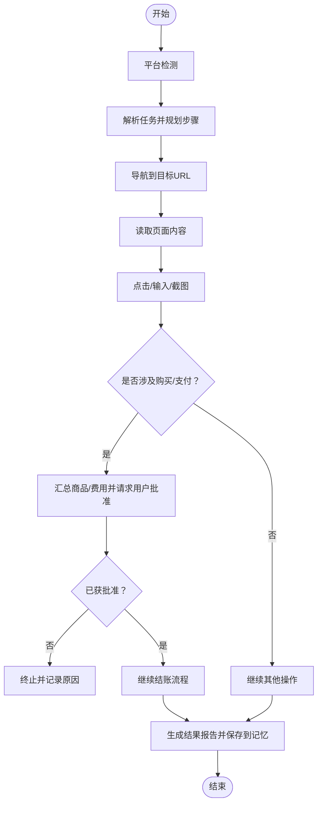

**图表来源**
- [HAND.toml（浏览器）:121-238](file://crates/openfang-hands/bundled/browser/HAND.toml#L121-L238)

**章节来源**
- [HAND.toml（浏览器）:1-255](file://crates/openfang-hands/bundled/browser/HAND.toml#L1-L255)
- [SKILL.md（浏览器）:1-125](file://crates/openfang-hands/bundled/browser/SKILL.md#L1-L125)

### 研究员（Researcher）
- 能力概述：深度研究、跨源交叉验证、事实核查、结构化报告生成。
- 关键配置：研究深度、输出风格、来源验证、最大来源数、自动跟进、语言、引文样式。
- 系统提示词要点：平台检测与上下文加载、问题分解、搜索策略构造、信息收集与合成、事实核查、报告生成与事件发布。
- 仪表盘指标：解决查询数、引用来源数、生成报告数、活跃调查数。

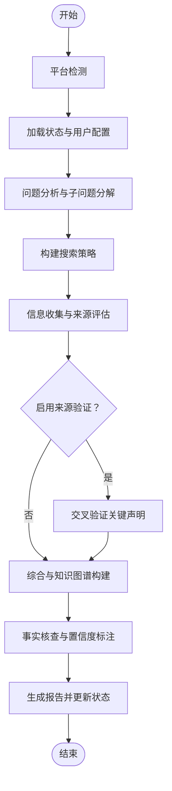

**图表来源**
- [HAND.toml（研究员）:165-376](file://crates/openfang-hands/bundled/researcher/HAND.toml#L165-L376)

**章节来源**
- [HAND.toml（研究员）:1-398](file://crates/openfang-hands/bundled/researcher/HAND.toml#L1-L398)
- [SKILL.md（研究员）:1-328](file://crates/openfang-hands/bundled/researcher/SKILL.md#L1-L328)

### 潜在客户挖掘（Lead）
- 能力概述：目标行业/角色/规模/地理聚焦，发现、丰富、去重、评分并定期产出线索报告。
- 关键配置：目标行业/角色/规模/地理、线索来源（网络搜索/LinkedIn/Crunchbase/自定义）、输出格式、每报告线索数、交付计划、丰富深度。
- 系统提示词要点：平台检测、状态恢复与计划设定、理想客户画像构建、线索发现与丰富、去重与评分、报告生成与持久化。
- 仪表盘指标：发现线索数、生成报告数、最后报告日期、唯一公司数。

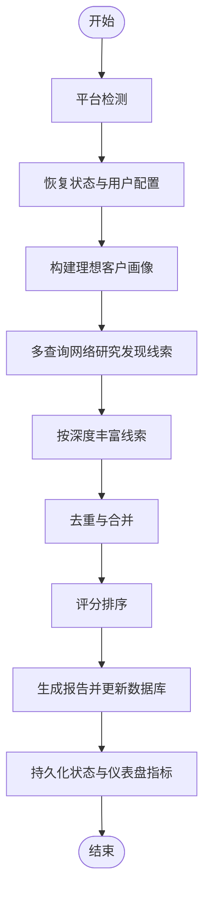

**图表来源**
- [HAND.toml（潜在客户挖掘）:172-314](file://crates/openfang-hands/bundled/lead/HAND.toml#L172-L314)

**章节来源**
- [HAND.toml（潜在客户挖掘）:1-336](file://crates/openfang-hands/bundled/lead/HAND.toml#L1-L336)
- [SKILL.md（潜在客户挖掘）:1-236](file://crates/openfang-hands/bundled/lead/SKILL.md#L1-L236)

### 情报收集（Collector）
- 能力概述：持续监控目标（公司/人物/技术/市场），变更检测，知识图谱构建，情感趋势跟踪。
- 关键配置：目标主题、采集深度、更新频率、关注领域（市场/业务/竞争/人物/技术/通用）、变更告警、报告格式、每周期最大来源数、情感跟踪。
- 系统提示词要点：平台检测与状态恢复、计划与目标初始化、查询构造、采集扫描、知识图谱构建、变更检测与Delta分析、报告生成与持久化。
- 仪表盘指标：数据点数、跟踪实体数、生成报告数、最后更新时间。

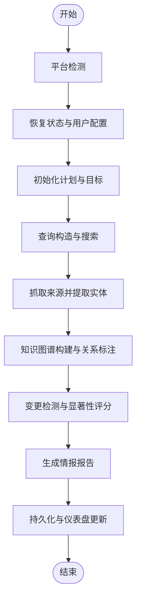

**图表来源**
- [HAND.toml（情报收集）:157-324](file://crates/openfang-hands/bundled/collector/HAND.toml#L157-L324)

**章节来源**
- [HAND.toml（情报收集）:1-346](file://crates/openfang-hands/bundled/collector/HAND.toml#L1-L346)
- [SKILL.md（情报收集）:1-272](file://crates/openfang-hands/bundled/collector/SKILL.md#L1-L272)

### 预测分析（Predictor）
- 能力概述：信号收集、推理链构建、预测生成、准确性追踪与校准。
- 关键配置：预测领域（科技/金融/地缘政治/气候/通用）、时间跨度、数据来源（新闻/社交/金融/学术/全部）、报告频率、每报告预测数、准确性追踪、置信阈值、反向模式。
- 系统提示词要点：平台检测与状态恢复、领域与计划设置、信号收集与准确性复核、模式分析与推理链、预测制定、报告生成与持久化。
- 仪表盘指标：预测总数、准确率、生成报告数、活跃预测数。

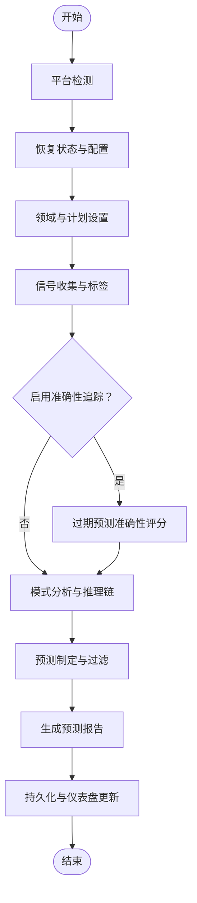

**图表来源**
- [HAND.toml（预测分析）:177-360](file://crates/openfang-hands/bundled/predictor/HAND.toml#L177-L360)

**章节来源**
- [HAND.toml（预测分析）:1-382](file://crates/openfang-hands/bundled/predictor/HAND.toml#L1-L382)
- [SKILL.md（预测分析）:1-273](file://crates/openfang-hands/bundled/predictor/SKILL.md#L1-L273)

### 社交媒体（Twitter）
- 能力概述：内容创作、定时发布、互动（回复/点赞）、性能跟踪；支持审批队列。
- 关键配置：Bearer Token、内容风格、发帖频率、自动回复/点赞、内容主题、品牌声音、线程模式、内容队列大小、互动时段、审批模式。
- 系统提示词要点：平台检测与API初始化、策略与计划设定、内容研究与趋势分析、内容生成、队列与发布、互动、性能跟踪、状态持久化。
- 仪表盘指标：发帖数、回复数、队列大小、互动率。

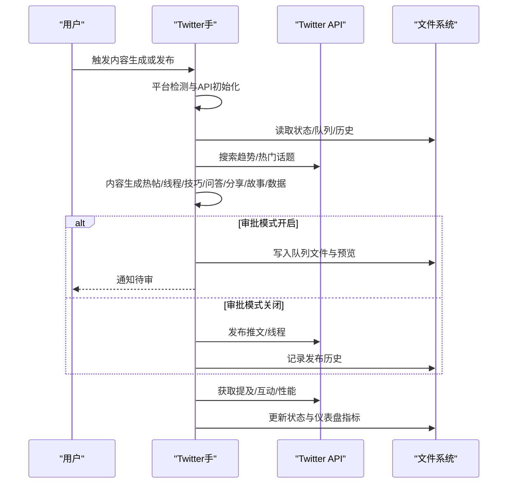

**图表来源**
- [HAND.toml（社交媒体）:178-387](file://crates/openfang-hands/bundled/twitter/HAND.toml#L178-L387)

**章节来源**
- [HAND.toml（社交媒体）:1-409](file://crates/openfang-hands/bundled/twitter/HAND.toml#L1-L409)
- [SKILL.md（社交媒体）:1-362](file://crates/openfang-hands/bundled/twitter/SKILL.md#L1-L362)

### 视频剪辑（Clip）
- 能力概述：从视频URL或本地文件下载、转录、片段选择、垂直裁剪、字幕烧录、可选配音、缩略图生成、发布到 Telegram/WhatsApp。
- 关键配置：语音转写提供方（自动/本地Whisper/Groq/OpenAI/Deepgram）、文本转语音提供方（禁用/EdgeTTS/OpenAI/ElevenLabs）、发布目标（本地/Telegram/WhatsApp）、凭据。
- 系统提示词要点：平台检测与命令规范、管道阶段（下载/转录/分析/提取/处理/发布/报告）、跨平台路径与编码注意事项、发布限流与错误处理。
- 仪表盘指标：完成作业数、生成片段数、总时长、发布到Telegram数、发布到WhatsApp数。

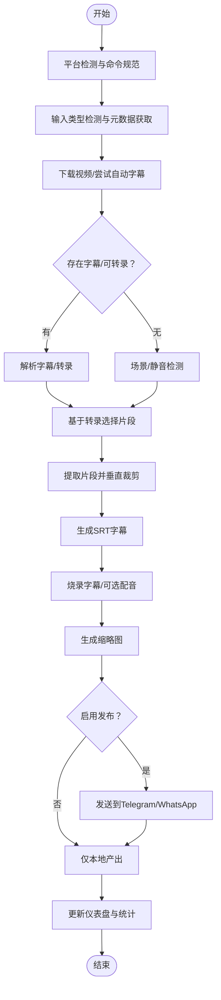

**图表来源**
- [HAND.toml（视频剪辑）:195-572](file://crates/openfang-hands/bundled/clip/HAND.toml#L195-L572)

**章节来源**
- [HAND.toml（视频剪辑）:1-599](file://crates/openfang-hands/bundled/clip/HAND.toml#L1-L599)
- [SKILL.md（视频剪辑）:1-475](file://crates/openfang-hands/bundled/clip/SKILL.md#L1-L475)

### 交易（Trader）
- 能力概述：多信号分析、对抗式多空推理、严格风控、组合级分析与报告。
- 关键配置：交易模式（分析/纸面/实盘）、市场焦点（美股股票/加密/多资产）、策略风格（扫荡/日内/波段/长线）、单笔风险、日最大损失、分析深度、扫描周期、观察清单、初始资金、Alpaca 凭据、审批模式。
- 系统提示词要点：平台检测与状态恢复、投资组合与市场设置、市场情报扫描、多因子分析引擎、信号融合与对抗式推理、硬限制风控门、交易执行（分析/纸面/实盘）、分析与报告生成、状态持久化。
- 仪表盘指标：投资组合价值、总盈亏、胜率、夏普比率、最大回撤、交易数、活跃仓位、分析信号数、准确率、最后扫描时间。

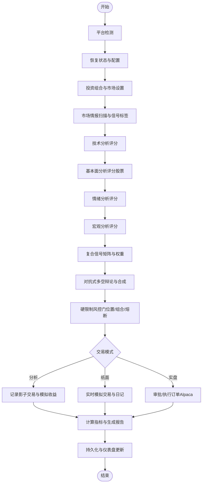

**图表来源**
- [HAND.toml（交易）:203-686](file://crates/openfang-hands/bundled/trader/HAND.toml#L203-L686)

**章节来源**
- [HAND.toml（交易）:1-741](file://crates/openfang-hands/bundled/trader/HAND.toml#L1-L741)
- [SKILL.md（交易）:1-938](file://crates/openfang-hands/bundled/trader/SKILL.md#L1-L938)

## 依赖关系分析
- 手与工具：每个 HAND.toml 的 tools 列表声明该手可使用的工具集合，系统通过工具适配层统一调度。
- 手与专家知识：SKILL.md 提供查询模式、API 参考、推理链模板与合规指引，增强系统提示词与工具调用质量。
- 手与外部服务：浏览器（Playwright/浏览器二进制）、API（Twitter/Alpaca/第三方STT/TTS）、存储（文件系统/内存）。
- 手与仪表盘：通过 memory_store 更新指标，前端以 dashboard.metrics 显示。

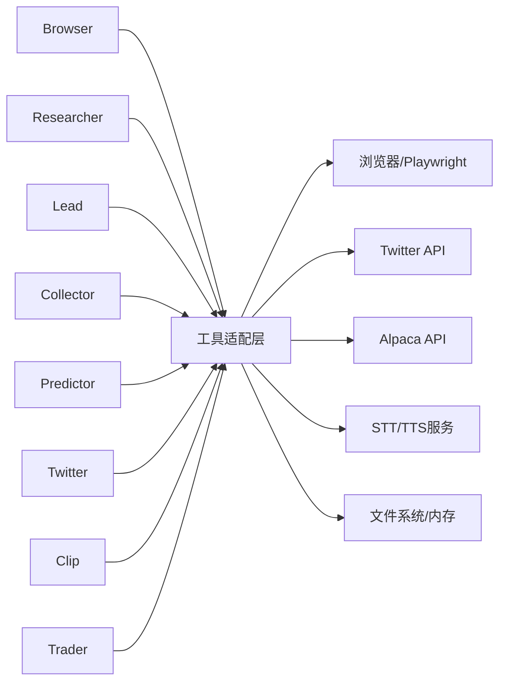

**图表来源**
- [HAND.toml（浏览器）:6-14](file://crates/openfang-hands/bundled/browser/HAND.toml#L6-L14)
- [HAND.toml（研究员）:6-6](file://crates/openfang-hands/bundled/researcher/HAND.toml#L6-L6)
- [HAND.toml（潜在客户挖掘）:6-6](file://crates/openfang-hands/bundled/lead/HAND.toml#L6-L6)
- [HAND.toml（情报收集）:6-6](file://crates/openfang-hands/bundled/collector/HAND.toml#L6-L6)
- [HAND.toml（预测分析）:6-6](file://crates/openfang-hands/bundled/predictor/HAND.toml#L6-L6)
- [HAND.toml（社交媒体）:6-6](file://crates/openfang-hands/bundled/twitter/HAND.toml#L6-L6)
- [HAND.toml（视频剪辑）:6-6](file://crates/openfang-hands/bundled/clip/HAND.toml#L6-L6)
- [HAND.toml（交易）:6-6](file://crates/openfang-hands/bundled/trader/HAND.toml#L6-L6)

**章节来源**
- [HAND.toml（浏览器）:1-255](file://crates/openfang-hands/bundled/browser/HAND.toml#L1-L255)
- [HAND.toml（研究员）:1-398](file://crates/openfang-hands/bundled/researcher/HAND.toml#L1-L398)
- [HAND.toml（潜在客户挖掘）:1-336](file://crates/openfang-hands/bundled/lead/HAND.toml#L1-L336)
- [HAND.toml（情报收集）:1-346](file://crates/openfang-hands/bundled/collector/HAND.toml#L1-L346)
- [HAND.toml（预测分析）:1-382](file://crates/openfang-hands/bundled/predictor/HAND.toml#L1-L382)
- [HAND.toml（社交媒体）:1-409](file://crates/openfang-hands/bundled/twitter/HAND.toml#L1-L409)
- [HAND.toml（视频剪辑）:1-599](file://crates/openfang-hands/bundled/clip/HAND.toml#L1-L599)
- [HAND.toml（交易）:1-741](file://crates/openfang-hands/bundled/trader/HAND.toml#L1-L741)

## 性能考虑
- 工具与外部服务：合理设置超时、重试与并发；对 API 速率限制进行退避与排队。
- I/O 与存储：批量写入、压缩中间产物、清理临时文件；避免重复下载/转录。
- 计算密集型：分块处理长视频、缓存常用查询结果、使用高效模型与硬件加速。
- 内存与会话：控制并发与会话生命周期，及时释放资源（如浏览器会话）。

[本节为通用指导，无需特定文件引用]

## 故障排除指南
- 浏览器手
  - 现象：元素未找到/页面超时/弹窗/验证码/登录要求/限流
  - 处理：切换选择器/可见文本；重试/等待；人工提供凭据；跳过/绕过；等待后重试
- 研究员手
  - 现象：来源质量差/相互矛盾/证据不足
  - 处理：CRAAP 评估；交叉验证；明确不确定性；必要时自动跟进
- 潜在客户挖掘
  - 现象：数据不可信/重复/隐私合规
  - 处理：公开信息优先；标准化归一化；标记置信度；遵守合规
- 情报收集
  - 现象：变更误报/情感误判/来源不可靠
  - 处理：提高置信阈值；多源佐证；滚动趋势分析
- 预测分析
  - 现象：过度自信/锚定偏差/叙事陷阱
  - 处理：校准概率；贝叶斯更新；反向模式寻找对立证据
- 社交媒体
  - 现象：API错误/限流/令牌失效/负面互动
  - 处理：检查令牌与权限；遵循速率限制；忽略/屏蔽不当内容
- 视频剪辑
  - 现象：转录失败/字幕错位/发布失败/平台限流
  - 处理：切换STT/TTS提供商；调整编码参数；按需重采样；限流退避
- 交易
  - 现象：风控触发/熔断/订单失败/数据延迟
  - 处理：检查风控阈值；暂停交易；重试/改单；确认市场状态

**章节来源**
- [SKILL.md（浏览器）:104-125](file://crates/openfang-hands/bundled/browser/SKILL.md#L104-L125)
- [SKILL.md（研究员）:283-328](file://crates/openfang-hands/bundled/researcher/SKILL.md#L283-L328)
- [SKILL.md（潜在客户挖掘）:215-236](file://crates/openfang-hands/bundled/lead/SKILL.md#L215-L236)
- [SKILL.md（情报收集）:194-272](file://crates/openfang-hands/bundled/collector/SKILL.md#L194-L272)
- [SKILL.md（预测分析）:238-273](file://crates/openfang-hands/bundled/predictor/SKILL.md#L238-L273)
- [SKILL.md（社交媒体）:304-362](file://crates/openfang-hands/bundled/twitter/SKILL.md#L304-L362)
- [SKILL.md（视频剪辑）:368-475](file://crates/openfang-hands/bundled/clip/SKILL.md#L368-L475)
- [SKILL.md（交易）:725-752](file://crates/openfang-hands/bundled/trader/SKILL.md#L725-L752)

## 结论
OpenFang 自主手系统通过 HAND.toml 与 SKILL.md 的协同，实现了高度模块化与可扩展的自治能力体系。七种手分别覆盖从信息获取、分析决策到内容生产与执行的全链路场景，配合严格的风控与指标体系，既保证了安全性，也提升了可运维性与可观测性。建议在实际部署中结合业务场景定制配置、完善审批与审计流程，并持续优化工具链与外部服务集成。

[本节为总结性内容，无需特定文件引用]

## 附录

### HAND.toml 字段速览与最佳实践
- 基本元信息：id/name/description/category/icon/tools
- 运行要求：requires（二进制/API密钥）与安装指引
- 可配置设置：settings（类型、默认值、选项、环境变量）
- Agent 配置：agent（模块、提供方、模型、温度、最大迭代、系统提示词）
- 仪表盘指标：dashboard.metrics（标签、内存键、格式）

**章节来源**
- [HAND.toml（浏览器）:1-255](file://crates/openfang-hands/bundled/browser/HAND.toml#L1-L255)
- [HAND.toml（研究员）:1-398](file://crates/openfang-hands/bundled/researcher/HAND.toml#L1-L398)
- [HAND.toml（潜在客户挖掘）:1-336](file://crates/openfang-hands/bundled/lead/HAND.toml#L1-L336)
- [HAND.toml（情报收集）:1-346](file://crates/openfang-hands/bundled/collector/HAND.toml#L1-L346)
- [HAND.toml（预测分析）:1-382](file://crates/openfang-hands/bundled/predictor/HAND.toml#L1-L382)
- [HAND.toml（社交媒体）:1-409](file://crates/openfang-hands/bundled/twitter/HAND.toml#L1-L409)
- [HAND.toml（视频剪辑）:1-599](file://crates/openfang-hands/bundled/clip/HAND.toml#L1-L599)
- [HAND.toml（交易）:1-741](file://crates/openfang-hands/bundled/trader/HAND.toml#L1-L741)

### SKILL.md 专家知识注入机制
- 作用：补充工具使用参考、查询模式、推理链模板、API参考、合规与风险提示。
- 使用方式：系统提示词中引用 SKILL.md 中的结构化知识，提升工具调用质量与任务成功率。

**章节来源**
- [SKILL.md（浏览器）:1-125](file://crates/openfang-hands/bundled/browser/SKILL.md#L1-L125)
- [SKILL.md（研究员）:1-328](file://crates/openfang-hands/bundled/researcher/SKILL.md#L1-L328)
- [SKILL.md（潜在客户挖掘）:1-236](file://crates/openfang-hands/bundled/lead/SKILL.md#L1-L236)
- [SKILL.md（情报收集）:1-272](file://crates/openfang-hands/bundled/collector/SKILL.md#L1-L272)
- [SKILL.md（预测分析）:1-273](file://crates/openfang-hands/bundled/predictor/SKILL.md#L1-L273)
- [SKILL.md（社交媒体）:1-362](file://crates/openfang-hands/bundled/twitter/SKILL.md#L1-L362)
- [SKILL.md（视频剪辑）:1-475](file://crates/openfang-hands/bundled/clip/SKILL.md#L1-L475)
- [SKILL.md（交易）:1-938](file://crates/openfang-hands/bundled/trader/SKILL.md#L1-L938)

### 手的生命周期与审批机制
- 生命周期：初始化（平台检测/状态恢复）→ 计划与配置 → 执行（工具调用/外部交互）→ 报告与持久化 → 仪表盘更新。
- 审批机制：浏览器购买审批、Twitter 审批队列、交易实盘审批模式，确保关键动作需要人工确认。

**章节来源**
- [HAND.toml（浏览器）:146-155](file://crates/openfang-hands/bundled/browser/HAND.toml#L146-L155)
- [HAND.toml（社交媒体）:170-175](file://crates/openfang-hands/bundled/twitter/HAND.toml#L170-L175)
- [HAND.toml（交易）:518-551](file://crates/openfang-hands/bundled/trader/HAND.toml#L518-L551)

### 自定义开发指南
- 新增手：在 bundled 目录下创建新手目录，编写 HAND.toml 与 SKILL.md，定义 tools、settings、agent 与 dashboard。
- 工具集成：在工具适配层注册新工具，确保跨平台命令一致性与错误处理。
- 测试与验证：编写最小可运行示例，覆盖关键路径与异常分支，结合仪表盘指标验证效果。

[本节为通用指导，无需特定文件引用]