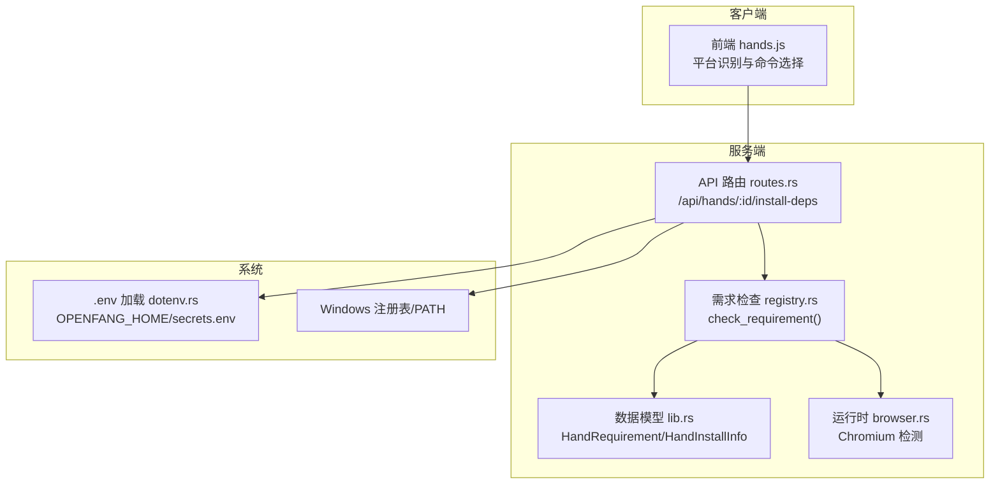
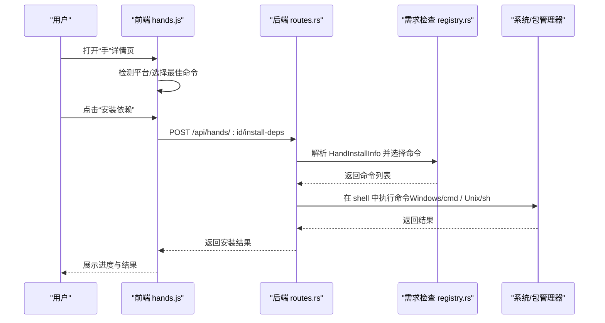
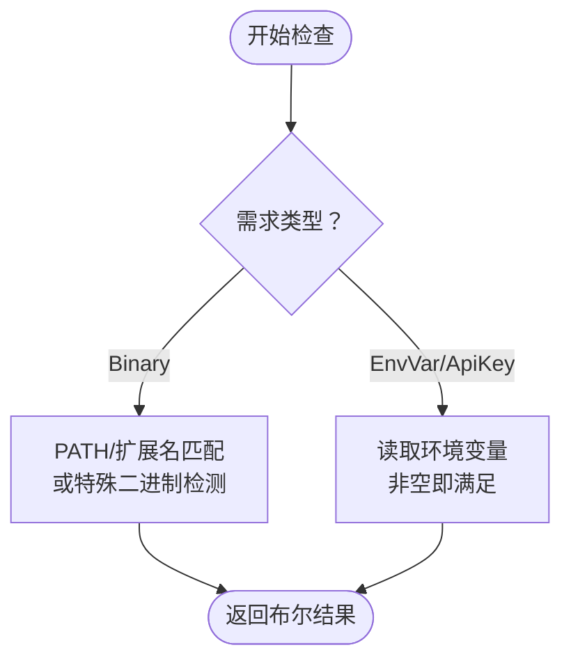
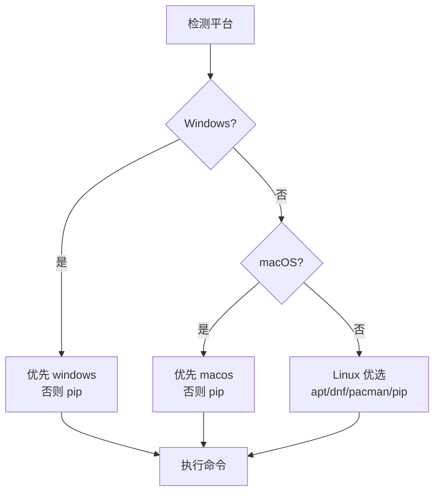
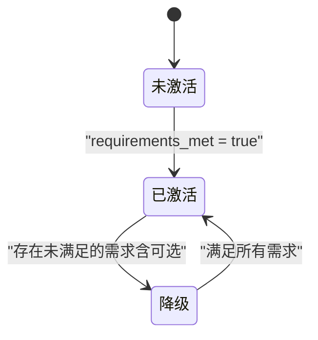
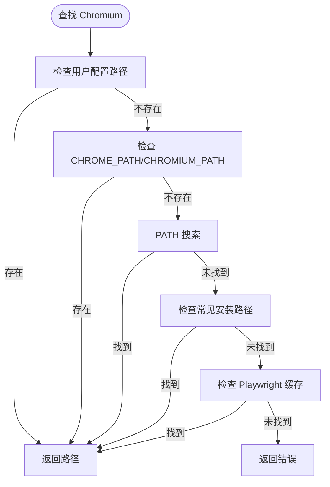
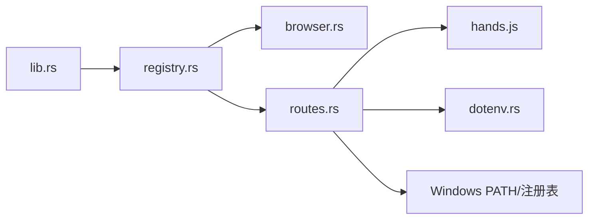

# 需求检查和安装指南

<cite>
**本文引用的文件**
- [lib.rs](file://crates/openfang-hands/src/lib.rs)
- [registry.rs](file://crates/openfang-hands/src/registry.rs)
- [routes.rs](file://crates/openfang-api/src/routes.rs)
- [hands.js](file://crates/openfang-api/static/js/pages/hands.js)
- [browser.rs](file://crates/openfang-runtime/src/browser.rs)
- [main.rs](file://crates/openfang-cli/src/main.rs)
- [dotenv.rs](file://crates/openfang-cli/src/dotenv.rs)
- [HAND.toml（浏览器）](file://crates/openfang-hands/bundled/browser/HAND.toml)
- [HAND.toml（剪辑）](file://crates/openfang-hands/bundled/clip/HAND.toml)
- [HAND.toml（收集器）](file://crates/openfang-hands/bundled/collector/HAND.toml)
</cite>

## 目录
1. [简介](#简介)
2. [项目结构](#项目结构)
3. [核心组件](#核心组件)
4. [架构总览](#架构总览)
5. [详细组件分析](#详细组件分析)
6. [依赖关系分析](#依赖关系分析)
7. [性能考虑](#性能考虑)
8. [故障排除指南](#故障排除指南)
9. [结论](#结论)
10. [附录：完整安装指南与验证](#附录完整安装指南与验证)

## 简介
本指南面向需要在本地部署与使用“手”（Hand）能力的用户与运维人员，系统讲解以下内容：
- HandRequirement 结构与 RequirementType 枚举（Binary、EnvVar、ApiKey）的语义与典型用法
- HandInstallInfo 的平台化安装信息配置（macOS、Windows、Linux 各发行包管理器）
- 需求检查的执行逻辑、可选需求（optional）的处理策略、降级状态（degraded）的判定条件
- 基于前端与后端的自动安装流程与回退策略
- 不同平台的安装步骤、环境变量配置、API 密钥设置示例
- 故障排除、常见问题与安装验证方法
- 手动安装路径、pip 安装方式与注册表配置要点

## 项目结构
围绕“需求检查与安装”的关键代码分布在以下模块：
- openfang-hands：定义需求模型、安装信息与检查逻辑
- openfang-api：提供安装接口与跨平台执行
- openfang-runtime：运行时工具链（如浏览器检测）
- openfang-cli：环境变量加载与系统集成
- 前端 hands.js：根据平台选择最佳安装命令

**图表来源**
- [routes.rs:4175-4213](file://crates/openfang-api/src/routes.rs#L4175-L4213)
- [registry.rs:429-457](file://crates/openfang-hands/src/registry.rs#L429-L457)
- [lib.rs:70-135](file://crates/openfang-hands/src/lib.rs#L70-L135)
- [browser.rs:674-772](file://crates/openfang-runtime/src/browser.rs#L674-L772)
- [hands.js:135-276](file://crates/openfang-api/static/js/pages/hands.js#L135-L276)
- [dotenv.rs:22-37](file://crates/openfang-cli/src/dotenv.rs#L22-L37)

**章节来源**
- [lib.rs:70-135](file://crates/openfang-hands/src/lib.rs#L70-L135)
- [registry.rs:429-457](file://crates/openfang-hands/src/registry.rs#L429-L457)
- [routes.rs:4175-4213](file://crates/openfang-api/src/routes.rs#L4175-L4213)
- [hands.js:135-276](file://crates/openfang-api/static/js/pages/hands.js#L135-L276)
- [browser.rs:674-772](file://crates/openfang-runtime/src/browser.rs#L674-L772)
- [dotenv.rs:22-37](file://crates/openfang-cli/src/dotenv.rs#L22-L37)

## 核心组件
- RequirementType（需求类型）
  - Binary：检查 PATH 或常见二进制名是否存在；对 python3/python 有特殊处理以确保实际可用
  - EnvVar：检查环境变量是否非空
  - ApiKey：与 EnvVar 类似，用于 API 密钥类变量
- HandRequirement（单个需求）
  - key/label/type/check_value/description/optional/install
  - optional 为 true 时，仅影响“降级”状态，不影响激活门禁
- HandInstallInfo（安装信息）
  - macos/windows/linux_* 包管理器命令、pip、signup_url/docs_url/env_example/manual_url/estimated_time/steps
- 运行时检测
  - Chromium 检测：优先环境变量与用户配置，其次 PATH，再其次常见路径，最后 Playwright 缓存目录

**章节来源**
- [lib.rs:70-135](file://crates/openfang-hands/src/lib.rs#L70-L135)
- [registry.rs:429-457](file://crates/openfang-hands/src/registry.rs#L429-L457)
- [registry.rs:497-605](file://crates/openfang-hands/src/registry.rs#L497-L605)
- [browser.rs:674-772](file://crates/openfang-runtime/src/browser.rs#L674-L772)

## 架构总览
从“前端选择命令”到“后端执行安装”的端到端流程如下：

**图表来源**
- [hands.js:149-171](file://crates/openfang-api/static/js/pages/hands.js#L149-L171)
- [hands.js:252-276](file://crates/openfang-api/static/js/pages/hands.js#L252-L276)
- [routes.rs:4175-4213](file://crates/openfang-api/src/routes.rs#L4175-L4213)
- [routes.rs:4282-4340](file://crates/openfang-api/src/routes.rs#L4282-L4340)

## 详细组件分析

### HandRequirement 与 RequirementType
- Binary
  - 特殊处理：python3/python 会通过实际运行与输出判断是否为 Python 3
  - 其他二进制：通过 which_binary 判断 PATH 与扩展名
  - Chromium：通过专用检测函数覆盖多种候选路径与缓存
- EnvVar / ApiKey
  - 读取环境变量，要求非空才视为满足
- 可选需求（optional）
  - 不影响“requirements_met”（激活门禁），但会影响“degraded”（已激活但存在未满足项）

**图表来源**
- [registry.rs:429-457](file://crates/openfang-hands/src/registry.rs#L429-L457)
- [registry.rs:586-605](file://crates/openfang-hands/src/registry.rs#L586-L605)
- [registry.rs:497-584](file://crates/openfang-hands/src/registry.rs#L497-L584)

**章节来源**
- [lib.rs:70-80](file://crates/openfang-hands/src/lib.rs#L70-L80)
- [registry.rs:429-457](file://crates/openfang-hands/src/registry.rs#L429-L457)
- [registry.rs:586-605](file://crates/openfang-hands/src/registry.rs#L586-L605)
- [registry.rs:497-584](file://crates/openfang-hands/src/registry.rs#L497-L584)

### HandInstallInfo 的平台选择策略
- 前端优先按平台返回对应命令，若无则回退到 pip 或任意可用命令
- 后端按平台选择顺序：Windows 优先生效 macos/pip，macOS 优先生效 windows/pip，Linux 依次尝试 apt/dnf/pacman/pip

**图表来源**
- [hands.js:252-276](file://crates/openfang-api/static/js/pages/hands.js#L252-L276)
- [routes.rs:4175-4185](file://crates/openfang-api/src/routes.rs#L4175-L4185)

**章节来源**
- [hands.js:252-276](file://crates/openfang-api/static/js/pages/hands.js#L252-L276)
- [routes.rs:4175-4185](file://crates/openfang-api/src/routes.rs#L4175-L4185)

### 可选需求与降级状态判定
- requirements_met：仅由“非可选”需求决定，用于控制是否可以激活
- degraded：当“已激活且存在任一需求未满足（含可选）”时标记为降级
- 测试用例验证了浏览器手（browser）在缺少可选 Chromium 时仍可激活，但处于降级状态

**图表来源**
- [registry.rs:844-872](file://crates/openfang-hands/src/registry.rs#L844-L872)

**章节来源**
- [lib.rs:125-131](file://crates/openfang-hands/src/lib.rs#L125-L131)
- [registry.rs:844-872](file://crates/openfang-hands/src/registry.rs#L844-L872)

### 运行时二进制检测（Chromium）
- 优先级：用户配置路径 → 环境变量 → PATH → 常见安装路径 → Playwright 缓存
- Windows 使用 where.exe，Unix 使用 which

**图表来源**
- [browser.rs:674-772](file://crates/openfang-runtime/src/browser.rs#L674-L772)
- [registry.rs:497-584](file://crates/openfang-hands/src/registry.rs#L497-L584)

**章节来源**
- [browser.rs:674-772](file://crates/openfang-runtime/src/browser.rs#L674-L772)
- [registry.rs:497-584](file://crates/openfang-hands/src/registry.rs#L497-L584)

## 依赖关系分析
- 数据模型层：lib.rs 定义 RequirementType/HandRequirement/HandInstallInfo
- 检查层：registry.rs 实现 check_requirement 与 which_binary、check_chromium_available
- 运行时层：browser.rs 提供 Chromium 检测
- 接口层：routes.rs 提供 /install-deps 接口，执行安装命令并刷新 PATH（Windows）
- 前端层：hands.js 选择命令并展示安装进度
- 环境层：dotenv.rs 加载 .env 与 secrets.env，main.rs 在 Windows 下维护 PATH

**图表来源**
- [lib.rs:70-135](file://crates/openfang-hands/src/lib.rs#L70-L135)
- [registry.rs:429-457](file://crates/openfang-hands/src/registry.rs#L429-L457)
- [browser.rs:674-772](file://crates/openfang-runtime/src/browser.rs#L674-L772)
- [routes.rs:4175-4213](file://crates/openfang-api/src/routes.rs#L4175-L4213)
- [hands.js:135-276](file://crates/openfang-api/static/js/pages/hands.js#L135-L276)
- [dotenv.rs:22-37](file://crates/openfang-cli/src/dotenv.rs#L22-L37)
- [main.rs:6441-6469](file://crates/openfang-cli/src/main.rs#L6441-L6469)

**章节来源**
- [lib.rs:70-135](file://crates/openfang-hands/src/lib.rs#L70-L135)
- [registry.rs:429-457](file://crates/openfang-hands/src/registry.rs#L429-L457)
- [browser.rs:674-772](file://crates/openfang-runtime/src/browser.rs#L674-L772)
- [routes.rs:4175-4213](file://crates/openfang-api/src/routes.rs#L4175-L4213)
- [hands.js:135-276](file://crates/openfang-api/static/js/pages/hands.js#L135-L276)
- [dotenv.rs:22-37](file://crates/openfang-cli/src/dotenv.rs#L22-L37)
- [main.rs:6441-6469](file://crates/openfang-cli/src/main.rs#L6441-L6469)

## 性能考虑
- 二进制检测采用早期返回与最小化系统调用（PATH 分割、扩展名枚举）
- Chromium 检测按优先级短路，避免全盘扫描
- 自动安装在 Windows 上执行后刷新 PATH，减少后续二次安装等待
- 前端仅在缺失依赖时发起安装请求，避免不必要的网络开销

[本节为通用建议，无需具体文件引用]

## 故障排除指南
- 二进制未找到（Binary）
  - 检查 PATH 是否包含安装目录；Windows 注意 .exe/.cmd/.bat 扩展名
  - 对于 python3/python，确认实际输出包含“Python 3”
  - 对于 Chromium，确认 CHROME_PATH/CHROMIUM_PATH 或常见安装路径存在
- 环境变量为空（EnvVar/ApiKey）
  - 确认 .env 与 secrets.env 已正确加载，且值非空
  - 在 Windows 上确认注册表/用户环境变量生效
- 可选需求导致降级（optional=true）
  - 若非关键功能受影响可忽略；若需完全激活请补齐可选需求
- Windows 安装后命令不可用
  - 后端会刷新 PATH，重启终端或重新加载会话；必要时手动追加安装目录

**章节来源**
- [registry.rs:586-605](file://crates/openfang-hands/src/registry.rs#L586-L605)
- [registry.rs:497-584](file://crates/openfang-hands/src/registry.rs#L497-L584)
- [routes.rs:4282-4340](file://crates/openfang-api/src/routes.rs#L4282-L4340)
- [dotenv.rs:22-37](file://crates/openfang-cli/src/dotenv.rs#L22-L37)
- [main.rs:6441-6469](file://crates/openfang-cli/src/main.rs#L6441-L6469)

## 结论
通过 HandRequirement 与 HandInstallInfo 的清晰分层设计，结合前后端联动的自动安装与运行时检测，系统实现了跨平台、可配置、可回退的需求管理与安装体验。可选需求与降级状态使系统在不阻断主功能的前提下提示用户补齐非关键依赖。

[本节为总结性内容，无需具体文件引用]

## 附录：完整安装指南与验证

### 通用安装步骤
- 准备工作
  - 确保系统具备网络访问能力
  - 准备 .env 与 secrets.env（位于 OPENFANG_HOME，默认 ~/.openfang）
- 选择安装方式
  - 前端一键安装：在“手”详情页点击“安装依赖”，前端按平台选择命令
  - 后端接口安装：POST /api/hands/{id}/install-deps
  - 手动安装：参考各 HAND.toml 中的 install.* 字段
- Windows 特别注意
  - winget 安装时自动附加接受协议参数
  - 安装完成后刷新 PATH，必要时重启终端

**章节来源**
- [hands.js:149-171](file://crates/openfang-api/static/js/pages/hands.js#L149-L171)
- [routes.rs:4175-4213](file://crates/openfang-api/src/routes.rs#L4175-L4213)
- [routes.rs:4282-4340](file://crates/openfang-api/src/routes.rs#L4282-L4340)

### 平台与发行版命令示例
以下示例来自内置 HAND.toml，展示典型需求的平台命令与步骤。请根据实际需求替换为对应 HAND 的 install.* 字段。

- 浏览器（browser）
  - python3：brew/apt/dnf/pacman 安装 python3；或 winget 安装 Python.Python.3.12
  - Chromium/Chrome：brew/apt/dnf/pacman 安装 chromium-browser 或 winget 安装 Google.Chrome
  - 参考字段：macos/windows/linux_apt/linux_dnf/linux_pacman/manual_url/estimated_time
- 剪辑（clip）
  - ffmpeg/ffprobe：brew/apt/dnf/pacman 安装 ffmpeg
  - yt-dlp：brew/apt/dnf/pacman 或 pip 安装 yt-dlp
  - 参考字段：pip、manual_url、estimated_time、steps
- 收集器（collector）
  - 该 HAND 本身不声明二进制需求，但其 Agent 可能依赖系统工具；请按需安装所需二进制

**章节来源**
- [HAND.toml（浏览器）:16-47](file://crates/openfang-hands/bundled/browser/HAND.toml#L16-L47)
- [HAND.toml（剪辑）:8-55](file://crates/openfang-hands/bundled/clip/HAND.toml#L8-L55)
- [HAND.toml（收集器）:1-346](file://crates/openfang-hands/bundled/collector/HAND.toml#L1-L346)

### 环境变量与 API 密钥设置
- .env 与 secrets.env
  - 加载顺序：先 .env，后 secrets.env；系统环境变量优先级最高
  - 写入后设置文件权限（Unix）并注意转义含空格/特殊字符的值
- Windows 注册表与 PATH
  - 通过 openfang CLI 可读取/过滤/写回用户 PATH，避免重复条目
- API 密钥
  - 在 HAND.toml 的 requires.install.env_example 中给出示例键名
  - 也可通过前端“设置密钥”按钮写入 secrets.env

**章节来源**
- [dotenv.rs:22-37](file://crates/openfang-cli/src/dotenv.rs#L22-L37)
- [dotenv.rs:160-190](file://crates/openfang-cli/src/dotenv.rs#L160-L190)
- [main.rs:6441-6469](file://crates/openfang-cli/src/main.rs#L6441-L6469)
- [HAND.toml（剪辑）:76-88](file://crates/openfang-hands/bundled/clip/HAND.toml#L76-L88)

### 安装验证方法
- 前端验证
  - 点击“安装依赖”后查看进度与结果；若无命令可用，前端会提示
- 后端验证
  - 调用 /api/hands/{id}/install-deps，观察返回的 results 数组
  - Windows 成功后 PATH 已刷新，可在新终端中直接使用新二进制
- 运行时验证
  - 对于 Chromium：确认 CHROME_PATH/CHROMIUM_PATH 或常见路径存在
  - 对于 Python：确认 python3/python 输出包含“Python 3”

**章节来源**
- [hands.js:149-171](file://crates/openfang-api/static/js/pages/hands.js#L149-L171)
- [routes.rs:4175-4213](file://crates/openfang-api/src/routes.rs#L4175-L4213)
- [routes.rs:4282-4340](file://crates/openfang-api/src/routes.rs#L4282-L4340)
- [browser.rs:674-772](file://crates/openfang-runtime/src/browser.rs#L674-L772)
- [registry.rs:497-584](file://crates/openfang-hands/src/registry.rs#L497-L584)