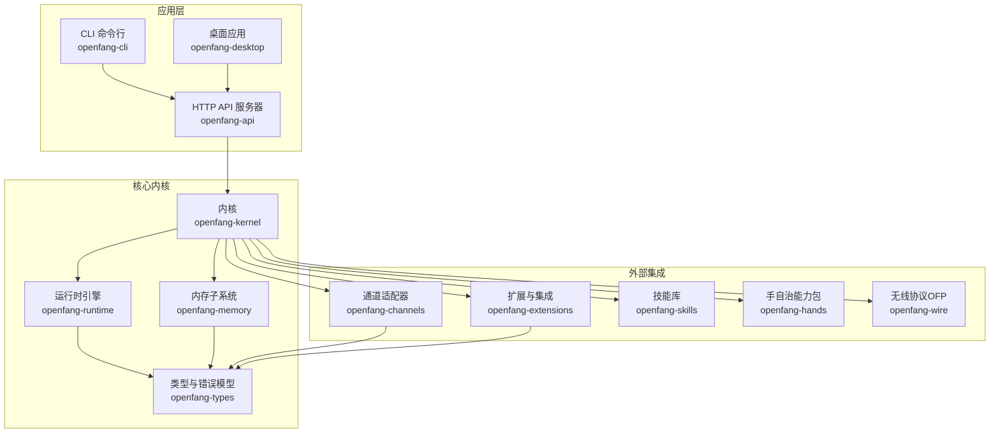
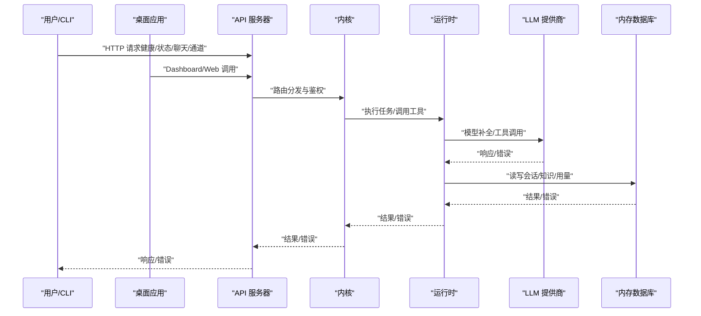
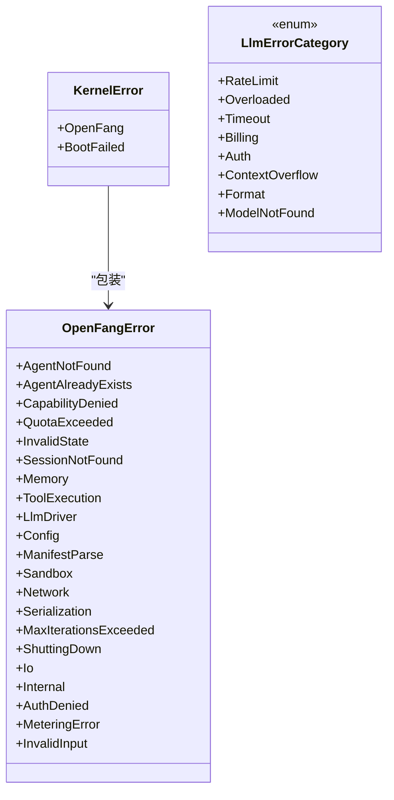
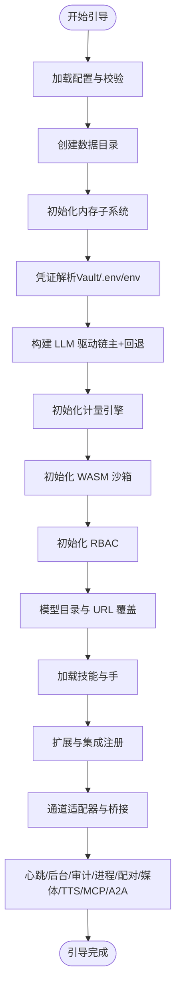
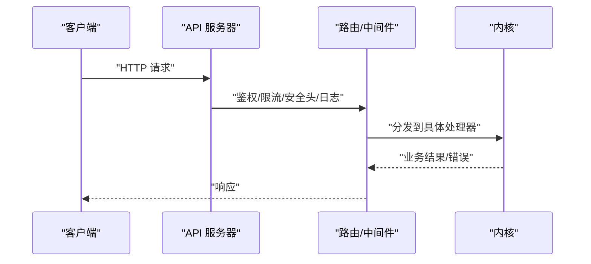
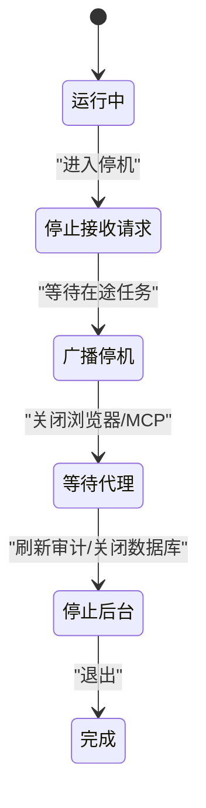
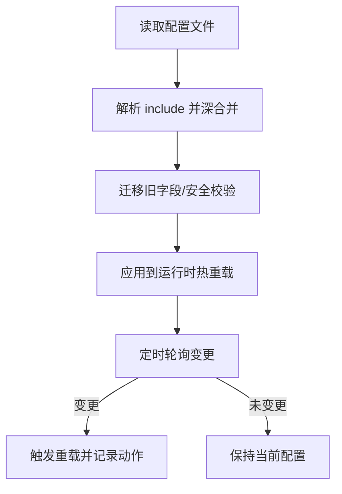
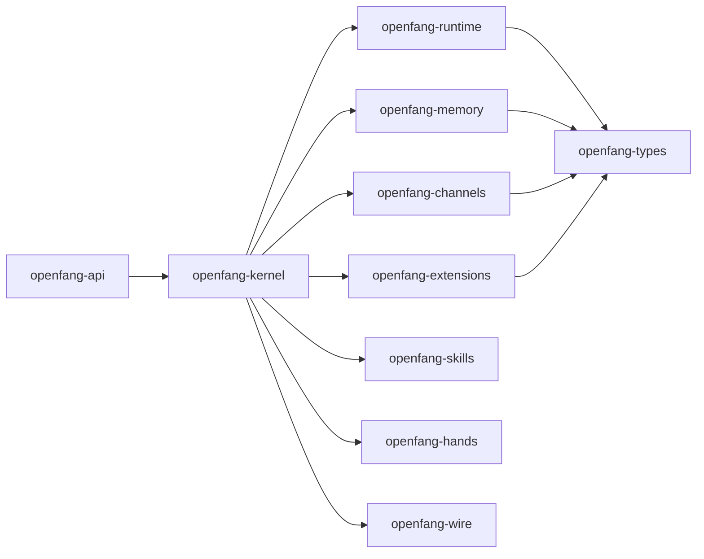

# 故障排除指南

<cite>
**本文引用的文件**
- [README.md](file://README.md)
- [crates/openfang-kernel/src/error.rs](file://crates/openfang-kernel/src/error.rs)
- [crates/openfang-types/src/error.rs](file://crates/openfang-types/src/error.rs)
- [crates/openfang-runtime/src/llm_errors.rs](file://crates/openfang-runtime/src/llm_errors.rs)
- [crates/openfang-kernel/src/kernel.rs](file://crates/openfang-kernel/src/kernel.rs)
- [crates/openfang-api/src/server.rs](file://crates/openfang-api/src/server.rs)
- [crates/openfang-runtime/src/graceful_shutdown.rs](file://crates/openfang-runtime/src/graceful_shutdown.rs)
- [crates/openfang-kernel/src/config.rs](file://crates/openfang-kernel/src/config.rs)
- [crates/openfang-cli/src/main.rs](file://crates/openfang-cli/src/main.rs)
- [crates/openfang-channels/src/bridge.rs](file://crates/openfang-channels/src/bridge.rs)
- [crates/openfang-memory/src/substrate.rs](file://crates/openfang-memory/src/substrate.rs)
- [crates/openfang-extensions/src/health.rs](file://crates/openfang-extensions/src/health.rs)
- [crates/openfang-runtime/src/auth_cooldown.rs](file://crates/openfang-runtime/src/auth_cooldown.rs)
- [crates/openfang-runtime/src/retry.rs](file://crates/openfang-runtime/src/retry.rs)
- [crates/openfang-cli/src/tui/screens/logs.rs](file://crates/openfang-cli/src/tui/screens/logs.rs)
- [crates/openfang-cli/src/tui/event.rs](file://crates/openfang-cli/src/tui/event.rs)
- [crates/openfang-cli/src/tui/mod.rs](file://crates/openfang-cli/src/tui/mod.rs)
- [crates/openfang-cli/src/tui/chat_runner.rs](file://crates/openfang-cli/src/tui/chat_runner.rs)
- [crates/openfang-api/src/routes.rs](file://crates/openfang-api/src/routes.rs)
</cite>

## 目录
1. [简介](#简介)
2. [项目结构](#项目结构)
3. [核心组件](#核心组件)
4. [架构总览](#架构总览)
5. [详细组件分析](#详细组件分析)
6. [依赖关系分析](#依赖关系分析)
7. [性能考虑](#性能考虑)
8. [故障排除指南](#故障排除指南)
9. [结论](#结论)
10. [附录](#附录)

## 简介
本指南面向 OpenFang 的运维与开发人员，提供系统化的故障排除方法论与实操步骤。内容覆盖启动失败、连接异常、性能问题、网络与数据库故障、外部服务集成问题、错误分类与恢复策略、日志分析与调试工具使用、紧急响应流程与技术支持渠道等。

## 项目结构
OpenFang 采用多 Crate 模块化设计，核心模块包括内核（kernel）、运行时（runtime）、API 层（api）、通道适配器（channels）、内存子系统（memory）、类型定义（types）、技能与手（skills/hands）、扩展与集成（extensions）、无线协议（wire）、CLI 与桌面端（cli/desktop）。各模块职责清晰，通过统一的内核进行编排与协调。

图表来源
- [crates/openfang-api/src/server.rs:35-712](file://crates/openfang-api/src/server.rs#L35-L712)
- [crates/openfang-kernel/src/kernel.rs:505-800](file://crates/openfang-kernel/src/kernel.rs#L505-L800)

章节来源
- [README.md:1-521](file://README.md#L1-L521)
- [crates/openfang-api/src/server.rs:35-712](file://crates/openfang-api/src/server.rs#L35-L712)
- [crates/openfang-kernel/src/kernel.rs:505-800](file://crates/openfang-kernel/src/kernel.rs#L505-L800)

## 核心组件
- 错误模型与分类：系统定义了统一的顶层错误类型与内核特定错误类型，便于在不同模块间传递与处理。
- LLM 错误分类与清洗：对第三方 LLM 提供商的错误消息进行分类、降噪与用户友好提示，支持重试策略与延迟建议。
- 内核引导与配置：负责加载配置、初始化驱动链、内存与认证管理，并在失败时提供回退策略。
- API 服务器与路由：提供健康检查、状态查询、代理 OpenAI 兼容接口、通道与技能管理等端点。
- 优雅停机：定义有序停机阶段，确保资源清理与数据一致性。
- 配置热重载：监听配置文件变更并应用热重载，避免重启带来的中断。
- 日志与可视化：CLI TUI 支持日志流式查看与级别分类；API 提供 SSE 实时日志流。

章节来源
- [crates/openfang-types/src/error.rs:1-105](file://crates/openfang-types/src/error.rs#L1-L105)
- [crates/openfang-kernel/src/error.rs:1-20](file://crates/openfang-kernel/src/error.rs#L1-L20)
- [crates/openfang-runtime/src/llm_errors.rs:1-800](file://crates/openfang-runtime/src/llm_errors.rs#L1-L800)
- [crates/openfang-kernel/src/kernel.rs:505-800](file://crates/openfang-kernel/src/kernel.rs#L505-L800)
- [crates/openfang-api/src/server.rs:35-712](file://crates/openfang-api/src/server.rs#L35-L712)
- [crates/openfang-runtime/src/graceful_shutdown.rs:1-443](file://crates/openfang-runtime/src/graceful_shutdown.rs#L1-L443)
- [crates/openfang-kernel/src/config.rs:1-458](file://crates/openfang-kernel/src/config.rs#L1-L458)
- [crates/openfang-cli/src/main.rs:1-800](file://crates/openfang-cli/src/main.rs#L1-L800)
- [crates/openfang-cli/src/tui/screens/logs.rs:50-79](file://crates/openfang-cli/src/tui/screens/logs.rs#L50-L79)

## 架构总览
下图展示从 CLI/桌面到 API、内核、运行时与外部系统的交互路径，以及关键的错误传播与恢复点。

图表来源
- [crates/openfang-api/src/server.rs:35-712](file://crates/openfang-api/src/server.rs#L35-L712)
- [crates/openfang-kernel/src/kernel.rs:505-800](file://crates/openfang-kernel/src/kernel.rs#L505-L800)
- [crates/openfang-runtime/src/llm_errors.rs:1-800](file://crates/openfang-runtime/src/llm_errors.rs#L1-L800)
- [crates/openfang-memory/src/substrate.rs:38-63](file://crates/openfang-memory/src/substrate.rs#L38-L63)

## 详细组件分析

### 组件一：错误模型与分类
- 统一错误类型：顶层错误类型涵盖代理、能力、配额、会话、工具执行、LLM 驱动、配置、内存、网络、序列化、迭代上限、关闭中、IO、内部、鉴权、计量、输入无效等。
- 内核错误：包装顶层错误并在引导失败时提供上下文。
- LLM 错误分类：按速率限制、过载、超时、计费、鉴权、上下文溢出、格式错误、模型不存在等类别划分，支持重试标记、延迟建议与用户可读提示。
- 安全与降级：对 HTML 错误页与敏感信息进行识别与脱敏，避免泄露密钥片段。

图表来源
- [crates/openfang-types/src/error.rs:1-105](file://crates/openfang-types/src/error.rs#L1-L105)
- [crates/openfang-kernel/src/error.rs:1-20](file://crates/openfang-kernel/src/error.rs#L1-L20)
- [crates/openfang-runtime/src/llm_errors.rs:1-800](file://crates/openfang-runtime/src/llm_errors.rs#L1-L800)

章节来源
- [crates/openfang-types/src/error.rs:1-105](file://crates/openfang-types/src/error.rs#L1-L105)
- [crates/openfang-kernel/src/error.rs:1-20](file://crates/openfang-kernel/src/error.rs#L1-L20)
- [crates/openfang-runtime/src/llm_errors.rs:1-800](file://crates/openfang-runtime/src/llm_errors.rs#L1-L800)

### 组件二：启动与引导流程
- 引导顺序：加载配置、创建数据目录、初始化内存子系统、凭证解析、LLM 驱动链（主驱动+回退）、计量引擎、WASM 沙箱、RBAC、模型目录、技能与手注册、扩展注册、通道适配器、心跳与后台任务、审计日志、进程管理、设备配对、浏览器/媒体/TTS 引擎、MCP 连接与工具缓存、A2A 任务存储与外部代理发现。
- 失败回退：当主驱动初始化失败时尝试自动检测可用提供商；若仍失败则使用“桩驱动”返回友好错误，保证仪表盘可访问以便修复配置。
- 环境变量覆盖：支持通过环境变量覆盖监听地址与 API 密钥，便于容器场景。

图表来源
- [crates/openfang-kernel/src/kernel.rs:505-800](file://crates/openfang-kernel/src/kernel.rs#L505-L800)

章节来源
- [crates/openfang-kernel/src/kernel.rs:505-800](file://crates/openfang-kernel/src/kernel.rs#L505-L800)

### 组件三：API 服务器与路由
- 路由组织：覆盖代理、记忆、工作流、通道、模型、技能、A2A、手、MCP、审计、日志、网络、通信、预算、会话、安全、配置、计划任务、Webhook、设备配对、OpenAI 兼容接口等端点。
- 中间件：鉴权、速率限制（GCRA）、安全头、请求日志、压缩、CORS。
- 启动流程：构建路由、启动通道桥接、写入守护进程信息、绑定地址、热重载配置文件。

图表来源
- [crates/openfang-api/src/server.rs:35-712](file://crates/openfang-api/src/server.rs#L35-L712)

章节来源
- [crates/openfang-api/src/server.rs:35-712](file://crates/openfang-api/src/server.rs#L35-L712)

### 组件四：优雅停机
- 阶段化停机：停止接受新请求、广播停机通知、等待在途代理循环、关闭浏览器会话、停止 MCP 连接、停止后台任务、刷新审计日志、关闭数据库连接、完成。
- 超时控制：分别设置“停机窗口”“代理完成等待”“总超时”，并记录每个阶段耗时与成功状态。
- WS 广播：向 WebSocket 客户端发送停机消息，包含原因与当前阶段。

图表来源
- [crates/openfang-runtime/src/graceful_shutdown.rs:1-443](file://crates/openfang-runtime/src/graceful_shutdown.rs#L1-L443)

章节来源
- [crates/openfang-runtime/src/graceful_shutdown.rs:1-443](file://crates/openfang-runtime/src/graceful_shutdown.rs#L1-L443)

### 组件五：配置与热重载
- 配置加载：支持 include 嵌套合并、默认路径、迁移旧字段、安全校验（禁止绝对路径、路径穿越、环形 include、深度限制）。
- 热重载：定时轮询配置文件修改时间，触发重载并输出动作计划。

图表来源
- [crates/openfang-kernel/src/config.rs:1-458](file://crates/openfang-kernel/src/config.rs#L1-L458)

章节来源
- [crates/openfang-kernel/src/config.rs:1-458](file://crates/openfang-kernel/src/config.rs#L1-L458)

### 组件六：日志与可视化
- CLI TUI 日志：根据 action/detail 关键词分类日志级别（错误/警告/信息），支持过滤与实时流式加载。
- SSE 实时日志：API 提供 /api/logs/stream，便于前端或外部工具订阅。
- 启动可视化：TUI 在引导阶段显示“正在启动内核”的提示与错误弹窗。

章节来源
- [crates/openfang-cli/src/tui/screens/logs.rs:50-79](file://crates/openfang-cli/src/tui/screens/logs.rs#L50-L79)
- [crates/openfang-api/src/routes.rs:1491-2521](file://crates/openfang-api/src/routes.rs#L1491-L2521)
- [crates/openfang-cli/src/tui/event.rs:2090-2109](file://crates/openfang-cli/src/tui/event.rs#L2090-L2109)
- [crates/openfang-cli/src/tui/mod.rs:2191-2221](file://crates/openfang-cli/src/tui/mod.rs#L2191-L2221)
- [crates/openfang-cli/src/tui/chat_runner.rs:685-724](file://crates/openfang-cli/src/tui/chat_runner.rs#L685-L724)

## 依赖关系分析
- 组件耦合：API 依赖内核；内核依赖运行时、内存、通道、扩展、类型；运行时依赖 LLM 驱动、沙箱、工具、审计、计量、浏览器/媒体/TTS、MCP、A2A；内存依赖 SQLite；通道适配器依赖平台 API；扩展依赖凭证与健康监控。
- 外部依赖：Axum、Tokio、SQLite、WASM、CORS、压缩、追踪（tracing）等。
- 循环依赖：代码中未见直接循环依赖；通道适配器在引导阶段被注册到内核，形成“注册-使用”单向依赖。

图表来源
- [crates/openfang-api/src/server.rs:35-712](file://crates/openfang-api/src/server.rs#L35-L712)
- [crates/openfang-kernel/src/kernel.rs:505-800](file://crates/openfang-kernel/src/kernel.rs#L505-L800)

章节来源
- [crates/openfang-api/src/server.rs:35-712](file://crates/openfang-api/src/server.rs#L35-L712)
- [crates/openfang-kernel/src/kernel.rs:505-800](file://crates/openfang-kernel/src/kernel.rs#L505-L800)

## 性能考虑
- 冷启动与内存：基准测试显示冷启动与内存占用均优于同类框架；生产部署建议使用稳定模式与合适的模型与并发参数。
- 数据库：WAL 模式与忙等待超时提升并发与稳定性；注意大对象与高并发写入场景的替代方案。
- 网络与重试：LLM 错误分类区分瞬时与非瞬时错误；提供指数退避与抖动的重试策略；速率限制与 GCRA 限流保护上游。
- 资源隔离：WASM 沙箱与子进程沙箱降低资源滥用风险；路径遍历与 SSRF 保护增强安全性。

[本节为通用指导，不直接分析具体文件]

## 故障排除指南

### 一、启动失败
- 症状
  - 启动后无法访问仪表盘或健康检查失败。
  - 引导阶段报错（如内存初始化失败、驱动链失败）。
- 诊断步骤
  - 查看守护进程信息文件与监听地址是否正确。
  - 检查配置文件是否存在语法错误、include 是否导致环形或越界。
  - 观察引导日志，确认内存子系统、凭证解析、LLM 驱动链初始化是否成功。
  - 若主驱动失败，检查自动检测逻辑是否找到可用提供商。
- 解决方案
  - 修正配置文件（修复 include、字段拼写、路径安全）。
  - 设置正确的 API 密钥与提供商 URL。
  - 使用回退驱动或本地模型（如 Ollama）临时缓解。
  - 清理或移除损坏的凭证与 .env 文件。

章节来源
- [crates/openfang-api/src/server.rs:714-800](file://crates/openfang-api/src/server.rs#L714-L800)
- [crates/openfang-kernel/src/config.rs:1-458](file://crates/openfang-kernel/src/config.rs#L1-L458)
- [crates/openfang-kernel/src/kernel.rs:505-800](file://crates/openfang-kernel/src/kernel.rs#L505-L800)

### 二、连接异常
- 症状
  - 通道适配器无法连接或消息发送失败。
  - 外部服务（GitHub、Slack、Notion 等）鉴权失败或健康检查失败。
- 诊断步骤
  - 使用通道列表与测试端点验证配置与凭据。
  - 查看通道桥接日志，定位错误消息与错误分类（速率限制、鉴权、超时）。
  - 检查扩展健康监控状态与自动重连配置。
- 解决方案
  - 更新集成密钥与 URL，确保环境变量已生效。
  - 对于速率限制，等待延迟或调整限流策略。
  - 手动重连或重启对应 MCP/桥接服务。

章节来源
- [crates/openfang-api/src/routes.rs:2491-2521](file://crates/openfang-api/src/routes.rs#L2491-L2521)
- [crates/openfang-channels/src/bridge.rs:983-1407](file://crates/openfang-channels/src/bridge.rs#L983-L1407)
- [crates/openfang-extensions/src/health.rs:81-132](file://crates/openfang-extensions/src/health.rs#L81-L132)

### 三、性能问题
- 症状
  - 响应缓慢、CPU 占用高、内存增长。
  - LLM 调用频繁超时或被限流。
- 诊断步骤
  - 使用健康端点与指标端点观察系统负载与资源使用。
  - 分析日志中的 LLM 错误分类（超时/过载/限流）与重试行为。
  - 检查会话历史长度与上下文溢出风险。
- 解决方案
  - 调整模型与上下文预算，启用会话压缩。
  - 优化工具调用批量化与去重，减少重复请求。
  - 为上游服务配置更合理的重试与退避策略。

章节来源
- [crates/openfang-runtime/src/llm_errors.rs:1-800](file://crates/openfang-runtime/src/llm_errors.rs#L1-L800)
- [crates/openfang-runtime/src/retry.rs:79-106](file://crates/openfang-runtime/src/retry.rs#L79-L106)

### 四、网络问题
- 症状
  - 请求超时、连接被拒、DNS 解析失败。
- 诊断步骤
  - 使用 LLM 错误分类判断是否为网络类错误。
  - 检查代理、防火墙与云服务提供商的错误页面识别。
- 解决方案
  - 重试与退避；必要时切换网络或使用代理。
  - 对于 Cloudflare 等错误页，按“过载”处理并稍后重试。

章节来源
- [crates/openfang-runtime/src/llm_errors.rs:598-628](file://crates/openfang-runtime/src/llm_errors.rs#L598-L628)

### 五、数据库连接与内存
- 症状
  - 内存初始化失败、数据库忙锁、迁移失败。
- 诊断步骤
  - 检查数据库路径权限与磁盘空间。
  - 观察 WAL 模式与 busy_timeout 设置是否生效。
- 解决方案
  - 修复权限与路径；必要时迁移数据库文件。
  - 调整并发写入策略，避免长时间持有锁。

章节来源
- [crates/openfang-memory/src/substrate.rs:38-63](file://crates/openfang-memory/src/substrate.rs#L38-L63)

### 六、外部服务集成故障
- 症状
  - GitHub、Slack、Notion 等集成鉴权失败或健康检查失败。
- 诊断步骤
  - 使用集成健康端点查看状态与重连配置。
  - 检查凭证存储与 OAuth 流程。
- 解决方案
  - 重新配置密钥与 URL；触发重连。
  - 对于 OAuth，使用提供的起始与轮询端点完成授权。

章节来源
- [crates/openfang-extensions/src/health.rs:81-132](file://crates/openfang-extensions/src/health.rs#L81-L132)
- [crates/openfang-api/src/routes.rs:537-558](file://crates/openfang-api/src/routes.rs#L537-L558)

### 七、错误分类与恢复机制
- 错误分类
  - 速率限制：自动退避与延迟建议；用户友好提示。
  - 过载/超时：瞬时错误，建议重试；HTML 错误页识别。
  - 计费/鉴权：非瞬时错误，需人工干预。
  - 上下文溢出/模型不存在/格式错误：配置或输入问题，需修正。
- 恢复策略
  - 瞬时错误：指数退避+抖动；达到最大延迟后退避。
  - 非瞬时错误：停止重试并上报；必要时打开“电路断路器”。

章节来源
- [crates/openfang-runtime/src/llm_errors.rs:1-800](file://crates/openfang-runtime/src/llm_errors.rs#L1-L800)
- [crates/openfang-runtime/src/retry.rs:79-106](file://crates/openfang-runtime/src/retry.rs#L79-L106)
- [crates/openfang-runtime/src/auth_cooldown.rs:256-291](file://crates/openfang-runtime/src/auth_cooldown.rs#L256-L291)

### 八、日志分析技巧与调试工具
- 日志级别分类：基于 action/detail 关键词自动分类（错误/警告/信息）。
- 实时日志：SSE 流与 CLI TUI 支持实时查看与过滤。
- 启动可视化：TUI 显示引导进度与错误提示，便于快速定位。

章节来源
- [crates/openfang-cli/src/tui/screens/logs.rs:50-79](file://crates/openfang-cli/src/tui/screens/logs.rs#L50-L79)
- [crates/openfang-api/src/routes.rs:1491-1494](file://crates/openfang-api/src/routes.rs#L1491-L1494)
- [crates/openfang-cli/src/tui/event.rs:2090-2109](file://crates/openfang-cli/src/tui/event.rs#L2090-L2109)
- [crates/openfang-cli/src/tui/mod.rs:2191-2221](file://crates/openfang-cli/src/tui/mod.rs#L2191-L2221)

### 九、紧急响应流程与升级机制
- 紧急响应
  - 立即执行优雅停机，确保数据一致与资源回收。
  - 记录停机阶段耗时与错误，用于事后分析。
- 升级机制
  - 通过 CLI doctor 进行健康检查与自动修复。
  - 使用配置热重载减少停机时间。
  - 对于严重故障，回滚到上一个稳定版本。

章节来源
- [crates/openfang-runtime/src/graceful_shutdown.rs:1-443](file://crates/openfang-runtime/src/graceful_shutdown.rs#L1-L443)
- [crates/openfang-cli/src/main.rs:155-163](file://crates/openfang-cli/src/main.rs#L155-L163)

### 十、技术支持联系方式
- 安全漏洞报告邮箱：jaber@rightnowai.co
- 文档与社区：官网、文档、GitHub、Discord、Twitter

章节来源
- [README.md:476-495](file://README.md#L476-L495)

## 结论
通过统一的错误模型、完善的 LLM 错误分类与恢复策略、模块化的内核与 API 设计、以及丰富的日志与可视化工具，OpenFang 能够在复杂生产环境中实现快速定位与高效恢复。建议在生产部署中启用稳定模式、严格配置校验与健康监控，并定期进行健康检查与演练。

[本节为总结，不直接分析具体文件]

## 附录

### A. 常见错误分类速查
- 速率限制：自动退避、延迟建议
- 过载/超时：瞬时错误，建议重试
- 计费/鉴权：需人工干预
- 上下文溢出/模型不存在/格式错误：配置或输入问题

章节来源
- [crates/openfang-runtime/src/llm_errors.rs:1-800](file://crates/openfang-runtime/src/llm_errors.rs#L1-L800)

### B. 预防性维护建议
- 定期备份数据库与配置文件。
- 监控内存与磁盘使用，及时清理无用会话与日志。
- 使用稳定模式与最小权限原则配置凭证。
- 对关键通道与集成启用健康监控与自动重连。

章节来源
- [crates/openfang-extensions/src/health.rs:81-132](file://crates/openfang-extensions/src/health.rs#L81-L132)
- [crates/openfang-memory/src/substrate.rs:38-63](file://crates/openfang-memory/src/substrate.rs#L38-L63)