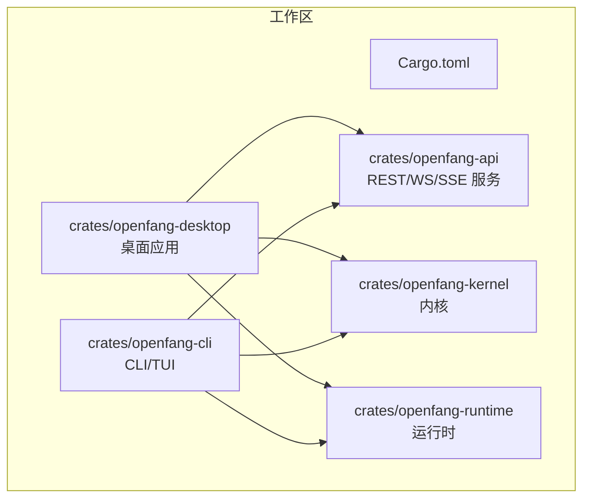
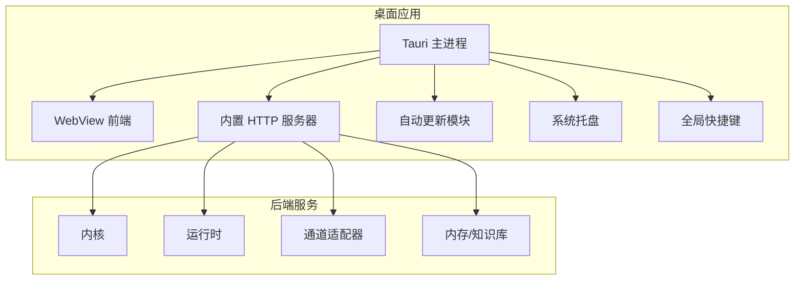
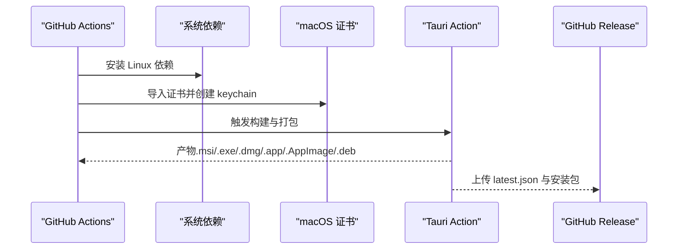
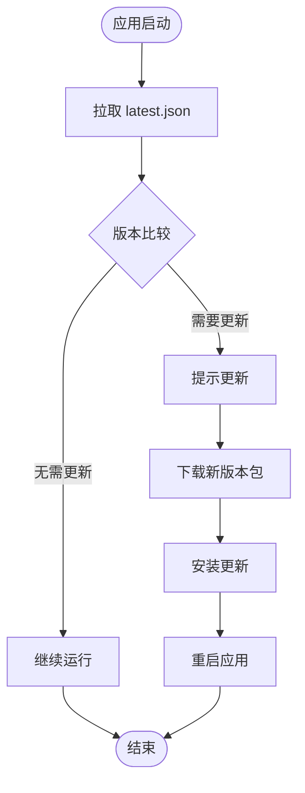
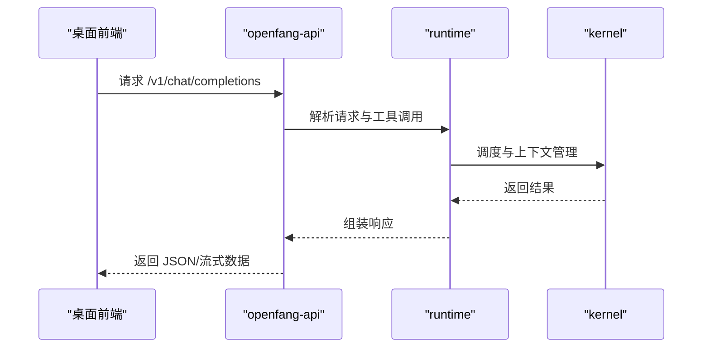
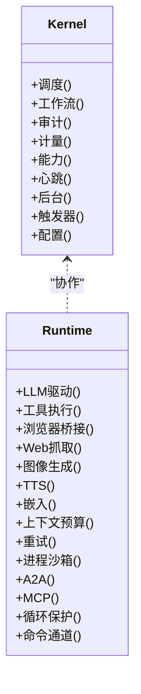
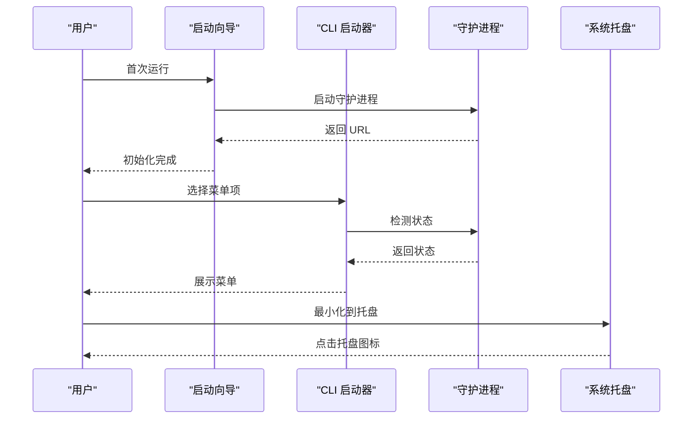
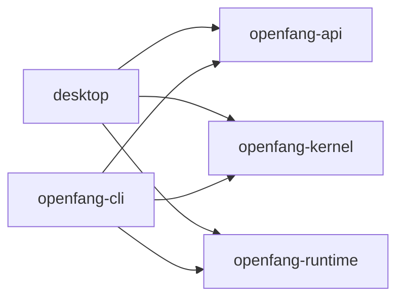

# 桌面应用部署

<cite>
**本文引用的文件**
- [README.md](file://README.md)
- [CHANGELOG.md](file://CHANGELOG.md)
- [.github/workflows/release.yml](file://.github/workflows/release.yml)
- [.github/workflows/ci.yml](file://.github/workflows/ci.yml)
- [crates/openfang-cli/src/main.rs](file://crates/openfang-cli/src/main.rs)
- [crates/openfang-cli/src/launcher.rs](file://crates/openfang-cli/src/launcher.rs)
- [crates/openfang-cli/src/tui/mod.rs](file://crates/openfang-cli/src/tui/mod.rs)
- [crates/openfang-cli/src/tui/screens/init_wizard.rs](file://crates/openfang-cli/src/tui/screens/init_wizard.rs)
- [crates/openfang-api/src/lib.rs](file://crates/openfang-api/src/lib.rs)
- [crates/openfang-api/src/server.rs](file://crates/openfang-api/src/server.rs)
- [crates/openfang-api/src/routes.rs](file://crates/openfang-api/src/routes.rs)
- [crates/openfang-api/src/webchat.rs](file://crates/openfang-api/src/webchat.rs)
- [crates/openfang-api/src/ws.rs](file://crates/openfang-api/src/ws.rs)
- [crates/openfang-api/src/session_auth.rs](file://crates/openfang-api/src/session_auth.rs)
- [crates/openfang-api/src/middleware.rs](file://crates/openfang-api/src/middleware.rs)
- [crates/openfang-api/src/types.rs](file://crates/openfang-api/src/types.rs)
- [crates/openfang-api/src/rate_limiter.rs](file://crates/openfang-api/src/rate_limiter.rs)
- [crates/openfang-api/src/stream_chunker.rs](file://crates/openfang-api/src/stream_chunker.rs)
- [crates/openfang-api/src/stream_dedup.rs](file://crates/openfang-api/src/stream_dedup.rs)
- [crates/openfang-api/src/channel_bridge.rs](file://crates/openfang-api/src/channel_bridge.rs)
- [crates/openfang-kernel/src/lib.rs](file://crates/openfang-kernel/src/lib.rs)
- [crates/openfang-kernel/src/kernel.rs](file://crates/openfang-kernel/src/kernel.rs)
- [crates/openfang-kernel/src/auth.rs](file://crates/openfang-kernel/src/auth.rs)
- [crates/openfang-kernel/src/registry.rs](file://crates/openfang-kernel/src/registry.rs)
- [crates/openfang-kernel/src/scheduler.rs](file://crates/openfang-kernel/src/scheduler.rs)
- [crates/openfang-kernel/src/event_bus.rs](file://crates/openfang-kernel/src/event_bus.rs)
- [crates/openfang-kernel/src/heartbeat.rs](file://crates/openfang-kernel/src/heartbeat.rs)
- [crates/openfang-kernel/src/background.rs](file://crates/openfang-kernel/src/background.rs)
- [crates/openfang-kernel/src/triggers.rs](file://crates/openfang-kernel/src/triggers.rs)
- [crates/openfang-kernel/src/approval.rs](file://crates/openfang-kernel/src/approval.rs)
- [crates/openfang-kernel/src/wizard.rs](file://crates/openfang-kernel/src/wizard.rs)
- [crates/openfang-kernel/src/supervisor.rs](file://crates/openfang-kernel/src/supervisor.rs)
- [crates/openfang-kernel/src/config.rs](file://crates/openfang-kernel/src/config.rs)
- [crates/openfang-kernel/src/config_reload.rs](file://crates/openfang-kernel/src/config_reload.rs)
- [crates/openfang-kernel/src/capabilities.rs](file://crates/openfang-kernel/src/capabilities.rs)
- [crates/openfang-kernel/src/error.rs](file://crates/openfang-kernel/src/error.rs)
- [crates/openfang-kernel/src/metering.rs](file://crates/openfang-kernel/src/metering.rs)
- [crates/openfang-kernel/src/audit.rs](file://crates/openfang-kernel/src/audit.rs)
- [crates/openfang-kernel/src/triggered.rs](file://crates/openfang-kernel/src/triggered.rs)
- [crates/openfang-runtime/src/lib.rs](file://crates/openfang-runtime/src/lib.rs)
- [crates/openfang-runtime/src/host_functions.rs](file://crates/openfang-runtime/src/host_functions.rs)
- [crates/openfang-runtime/src/kernel_handle.rs](file://crates/openfang-runtime/src/kernel_handle.rs)
- [crates/openfang-runtime/src/tool_runner.rs](file://crates/openfang-runtime/src/tool_runner.rs)
- [crates/openfang-runtime/src/browser.rs](file://crates/openfang-runtime/src/browser.rs)
- [crates/openfang-runtime/src/web_fetch.rs](file://crates/openfang-runtime/src/web_fetch.rs)
- [crates/openfang-runtime/src/web_search.rs](file://crates/openfang-runtime/src/web_search.rs)
- [crates/openfang-runtime/src/web_cache.rs](file://crates/openfang-runtime/src/web_cache.rs)
- [crates/openfang-runtime/src/web_content.rs](file://crates/openfang-runtime/src/web_content.rs)
- [crates/openfang-runtime/src/image_gen.rs](file://crates/openfang-runtime/src/image_gen.rs)
- [crates/openfang-runtime/src/tts.rs](file://crates/openfang-runtime/src/tts.rs)
- [crates/openfang-runtime/src/embedding.rs](file://crates/openfang-runtime/src/embedding.rs)
- [crates/openfang-runtime/src/context_budget.rs](file://crates/openfang-runtime/src/context_budget.rs)
- [crates/openfang-runtime/src/context_overflow.rs](file://crates/openfang-runtime/src/context_overflow.rs)
- [crates/openfang-runtime/src/retry.rs](file://crates/openfang-runtime/src/retry.rs)
- [crates/openfang-runtime/src/compactor.rs](file://crates/openfang-runtime/src/compactor.rs)
- [crates/openfang-runtime/src/graceful_shutdown.rs](file://crates/openfang-runtime/src/graceful_shutdown.rs)
- [crates/openfang-runtime/src/process_manager.rs](file://crates/openfang-runtime/src/process_manager.rs)
- [crates/openfang-runtime/src/docker_sandbox.rs](file://crates/openfang-runtime/src/docker_sandbox.rs)
- [crates/openfang-runtime/src/subprocess_sandbox.rs](file://crates/openfang-runtime/src/subprocess_sandbox.rs)
- [crates/openfang-runtime/src/sandbox.rs](file://crates/openfang-runtime/src/sandbox.rs)
- [crates/openfang-runtime/src/llm_driver.rs](file://crates/openfang-runtime/src/llm_driver.rs)
- [crates/openfang-runtime/src/drivers/openai.rs](file://crates/openfang-runtime/src/drivers/openai.rs)
- [crates/openfang-runtime/src/drivers/anthropic.rs](file://crates/openfang-runtime/src/drivers/anthropic.rs)
- [crates/openfang-runtime/src/drivers/gemini.rs](file://crates/openfang-runtime/src/drivers/gemini.rs)
- [crates/openfang-runtime/src/drivers/fallback.rs](file://crates/openfang-runtime/src/drivers/fallback.rs)
- [crates/openfang-runtime/src/drivers/qwen_code.rs](file://crates/openfang-runtime/src/drivers/qwen_code.rs)
- [crates/openfang-runtime/src/drivers/claude_code.rs](file://crates/openfang-runtime/src/drivers/claude_code.rs)
- [crates/openfang-runtime/src/drivers/copilot.rs](file://crates/openfang-runtime/src/drivers/copilot.rs)
- [crates/openfang-runtime/src/a2a.rs](file://crates/openfang-runtime/src/a2a.rs)
- [crates/openfang-runtime/src/agent_loop.rs](file://crates/openfang-runtime/src/agent_loop.rs)
- [crates/openfang-runtime/src/hooks.rs](file://crates/openfang-runtime/src/hooks.rs)
- [crates/openfang-runtime/src/mcp.rs](file://crates/openfang-runtime/src/mcp.rs)
- [crates/openfang-runtime/src/mcp_server.rs](file://crates/openfang-runtime/src/mcp_server.rs)
- [crates/openfang-runtime/src/apply_patch.rs](file://crates/openfang-runtime/src/apply_patch.rs)
- [crates/openfang-runtime/src/llm_errors.rs](file://crates/openfang-runtime/src/llm_errors.rs)
- [crates/openfang-runtime/src/link_understanding.rs](file://crates/openfang-runtime/src/link_understanding.rs)
- [crates/openfang-runtime/src/media_understanding.rs](file://crates/openfang-runtime/src/media_understanding.rs)
- [crates/openfang-runtime/src/prompt_builder.rs](file://crates/openfang-runtime/src/prompt_builder.rs)
- [crates/openfang-runtime/src/routing.rs](file://crates/openfang-runtime/src/routing.rs)
- [crates/openfang-runtime/src/tool_policy.rs](file://crates/openfang-runtime/src/tool_policy.rs)
- [crates/openfang-runtime/src/shell_bleed.rs](file://crates/openfang-runtime/src/shell_bleed.rs)
- [crates/openfang-runtime/src/loop_guard.rs](file://crates/openfang-runtime/src/loop_guard.rs)
- [crates/openfang-runtime/src/worker.rs](file://crates/openfang-runtime/src/worker.rs)
- [crates/openfang-runtime/src/workspace_sandbox.rs](file://crates/openfang-runtime/src/workspace_sandbox.rs)
- [crates/openfang-runtime/src/workspace_context.rs](file://crates/openfang-runtime/src/workspace_context.rs)
- [crates/openfang-runtime/src/python_runtime.rs](file://crates/openfang-runtime/src/python_runtime.rs)
- [crates/openfang-runtime/src/str_utils.rs](file://crates/openfang-runtime/src/str_utils.rs)
- [crates/openfang-runtime/src/think_filter.rs](file://crates/openfang-runtime/src/think_filter.rs)
- [crates/openfang-runtime/src/cron.rs](file://crates/openfang-runtime/src/cron.rs)
- [crates/openfang-runtime/src/heartbeat.rs](file://crates/openfang-runtime/src/heartbeat.rs)
- [crates/openfang-runtime/src/auth_cooldown.rs](file://crates/openfang-runtime/src/auth_cooldown.rs)
- [crates/openfang-runtime/src/reply_directives.rs](file://crates/openfang-runtime/src/reply_directives.rs)
- [crates/openfang-runtime/src/driver.rs](file://crates/openfang-runtime/src/driver.rs)
- [crates/openfang-runtime/src/command_lane.rs](file://crates/openfang-runtime/src/command_lane.rs)
- [crates/openfang-runtime/src/audit.rs](file://crates/openfang-runtime/src/audit.rs)
- [crates/openfang-runtime/src/monitoring.rs](file://crates/openfang-runtime/src/monitoring.rs)
- [crates/openfang-runtime/src/monitoring.rs](file://crates/openfang-runtime/src/monitoring.rs)
- [crates/openfang-memory/src/lib.rs](file://crates/openfang-memory/src/lib.rs)
- [crates/openfang-memory/src/session.rs](file://crates/openfang-memory/src/session.rs)
- [crates/openfang-memory/src/structured.rs](file://crates/openfang-memory/src/structured.rs)
- [crates/openfang-memory/src/knowledge.rs](file://crates/openfang-memory/src/knowledge.rs)
- [crates/openfang-memory/src/semantic.rs](file://crates/openfang-memory/src/semantic.rs)
- [crates/openfang-memory/src/consolidation.rs](file://crates/openfang-memory/src/consolidation.rs)
- [crates/openfang-memory/src/migration.rs](file://crates/openfang-memory/src/migration.rs)
- [crates/openfang-memory/src/usage.rs](file://crates/openfang-memory/src/usage.rs)
- [crates/openfang-channels/src/lib.rs](file://crates/openfang-channels/src/lib.rs)
- [crates/openfang-channels/src/router.rs](file://crates/openfang-channels/src/router.rs)
- [crates/openfang-channels/src/bridge.rs](file://crates/openfang-channels/src/bridge.rs)
- [crates/openfang-channels/src/formatter.rs](file://crates/openfang-channels/src/formatter.rs)
- [crates/openfang-channels/src/discord.rs](file://crates/openfang-channels/src/discord.rs)
- [crates/openfang-channels/src/telegram.rs](file://crates/openfang-channels/src/telegram.rs)
- [crates/openfang-channels/src/slack.rs](file://crates/openfang-channels/src/slack.rs)
- [crates/openfang-channels/src/teams.rs](file://crates/openfang-channels/src/teams.rs)
- [crates/openfang-channels/src/whatsapp.rs](file://crates/openfang-channels/src/whatsapp.rs)
- [crates/openfang-channels/src/matrix.rs](file://crates/openfang-channels/src/matrix.rs)
- [crates/openfang-channels/src/email.rs](file://crates/openfang-channels/src/email.rs)
- [crates/openfang-channels/src/webhook.rs](file://crates/openfang-channels/src/webhook.rs)
- [crates/openfang-channels/src/webex.rs](file://crates/openfang-channels/src/webex.rs)
- [crates/openfang-channels/src/irc.rs](file://crates/openfang-channels/src/irc.rs)
- [crates/openfang-channels/src/xmpp.rs](file://crates/openfang-channels/src/xmpp.rs)
- [crates/openfang-channels/src/line.rs](file://crates/openfang-channels/src/line.rs)
- [crates/openfang-channels/src/viber.rs](file://crates/openfang-channels/src/viber.rs)
- [crates/openfang-channels/src/mastodon.rs](file://crates/openfang-channels/src/mastodon.rs)
- [crates/openfang-channels/src/reddit.rs](file://crates/openfang-channels/src/reddit.rs)
- [crates/openfang-channels/src/linkedin.rs](file://crates/openfang-channels/src/linkedin.rs)
- [crates/openfang-channels/src/twitch.rs](file://crates/openfang-channels/src/twitch.rs)
- [crates/openfang-channels/src/bluesky.rs](file://crates/openfang-channels/src/bluesky.rs)
- [crates/openfang-channels/src/discourse.rs](file://crates/openfang-channels/src/discourse.rs)
- [crates/openfang-channels/src/guilded.rs](file://crates/openfang-channels/src/guilded.rs)
- [crates/openfang-channels/src/revolt.rs](file://crates/openfang-channels/src/revolt.rs)
- [crates/openfang-channels/src/keybase.rs](file://crates/openfang-channels/src/keybase.rs)
- [crates/openfang-channels/src/gitter.rs](file://crates/openfang-channels/src/gitter.rs)
- [crates/openfang-channels/src/flock.rs](file://crates/openfang-channels/src/flock.rs)
- [crates/openfang-channels/src/pumble.rs](file://crates/openfang-channels/src/pumble.rs)
- [crates/openfang-channels/src/twist.rs](file://crates/openfang-channels/src/twist.rs)
- [crates/openfang-channels/src/zulip.rs](file://crates/openfang-channels/src/zulip.rs)
- [crates/openfang-channels/src/notebook.rs](file://crates/openfang-channels/src/notebook.rs)
- [crates/openfang-channels/src/types.rs](file://crates/openfang-channels/src/types.rs)
- [crates/openfang-skills/src/lib.rs](file://crates/openfang-skills/src/lib.rs)
- [crates/openfang-skills/src/bundled.rs](file://crates/openfang-skills/src/bundled.rs)
- [crates/openfang-skills/src/loader.rs](file://crates/openfang-skills/src/loader.rs)
- [crates/openfang-skills/src/marketplace.rs](file://crates/openfang-skills/src/marketplace.rs)
- [crates/openfang-skills/src/openclaw_compat.rs](file://crates/openfang-skills/src/openclaw_compat.rs)
- [crates/openfang-skills/src/verify.rs](file://crates/openfang-skills/src/verify.rs)
- [crates/openfang-hands/src/lib.rs](file://crates/openfang-hands/src/lib.rs)
- [crates/openfang-hands/src/bundled.rs](file://crates/openfang-hands/src/bundled.rs)
- [crates/openfang-hands/src/registry.rs](file://crates/openfang-hands/src/registry.rs)
- [crates/openfang-extensions/src/lib.rs](file://crates/openfang-extensions/src/lib.rs)
- [crates/openfang-extensions/src/credentials.rs](file://crates/openfang-extensions/src/credentials.rs)
- [crates/openfang-extensions/src/oauth.rs](file://crates/openfang-extensions/src/oauth.rs)
- [crates/openfang-extensions/src/registry.rs](file://crates/openfang-extensions/src/registry.rs)
- [crates/openfang-extensions/src/vault.rs](file://crates/openfang-extensions/src/vault.rs)
- [crates/openfang-extensions/src/health.rs](file://crates/openfang-extensions/src/health.rs)
- [crates/openfang-extensions/src/installer.rs](file://crates/openfang-extensions/src/installer.rs)
- [crates/openfang-extensions/src/bundled.rs](file://crates/openfang-extensions/src/bundled.rs)
- [crates/openfang-wire/src/lib.rs](file://crates/openfang-wire/src/lib.rs)
- [crates/openfang-wire/src/message.rs](file://crates/openfang-wire/src/message.rs)
- [crates/openfang-wire/src/peer.rs](file://crates/openfang-wire/src/peer.rs)
- [crates/openfang-wire/src/registry.rs](file://crates/openfang-wire/src/registry.rs)
- [crates/openfang-types/src/lib.rs](file://crates/openfang-types/src/lib.rs)
- [crates/openfang-types/src/agent.rs](file://crates/openfang-types/src/agent.rs)
- [crates/openfang-types/src/config.rs](file://crates/openfang-types/src/config.rs)
- [crates/openfang-types/src/error.rs](file://crates/openfang-types/src/error.rs)
- [crates/openfang-types/src/event.rs](file://crates/openfang-types/src/event.rs)
- [crates/openfang-types/src/memory.rs](file://crates/openfang-types/src/memory.rs)
- [crates/openfang-types/src/message.rs](file://crates/openfang-types/src/message.rs)
- [crates/openfang-types/src/model_catalog.rs](file://crates/openfang-types/src/model_catalog.rs)
- [crates/openfang-types/src/tool.rs](file://crates/openfang-types/src/tool.rs)
- [crates/openfang-types/src/tool_compat.rs](file://crates/openfang-types/src/tool_compat.rs)
- [crates/openfang-types/src/capability.rs](file://crates/openfang-types/src/capability.rs)
- [crates/openfang-types/src/manifest_signing.rs](file://crates/openfang-types/src/manifest_signing.rs)
- [crates/openfang-types/src/media.rs](file://crates/openfang-types/src/media.rs)
- [crates/openfang-types/src/comms.rs](file://crates/openfang-types/src/comms.rs)
- [crates/openfang-types/src/scheduler.rs](file://crates/openfang-types/src/scheduler.rs)
- [crates/openfang-types/src/taint.rs](file://crates/openfang-types/src/taint.rs)
- [crates/openfang-types/src/webhook.rs](file://crates/openfang-types/src/webhook.rs)
- [crates/openfang-types/src/serde_compat.rs](file://crates/openfang-types/src/serde_compat.rs)
- [crates/openfang-migrate/src/lib.rs](file://crates/openfang-migrate/src/lib.rs)
- [crates/openfang-migrate/src/openclaw.rs](file://crates/openfang-migrate/src/openclaw.rs)
- [crates/openfang-migrate/src/report.rs](file://crates/openfang-migrate/src/report.rs)
- [crates/openfang-desktop/src/lib.rs](file://crates/openfang-desktop/src/lib.rs)
- [crates/openfang-desktop/src/main.rs](file://crates/openfang-desktop/src/main.rs)
- [crates/openfang-desktop/src/server.rs](file://crates/openfang-desktop/src/server.rs)
- [crates/openfang-desktop/src/updater.rs](file://crates/openfang-desktop/src/updater.rs)
- [crates/openfang-desktop/src/tray.rs](file://crates/openfang-desktop/src/tray.rs)
- [crates/openfang-desktop/src/shortcuts.rs](file://crates/openfang-desktop/src/shortcuts.rs)
- [crates/openfang-desktop/src/commands.rs](file://crates/openfang-desktop/src/commands.rs)
- [crates/openfang-desktop/Cargo.toml](file://crates/openfang-desktop/Cargo.toml)
- [crates/openfang-desktop/gen/schemas/desktop-schema.json](file://crates/openfang-desktop/gen/schemas/desktop-schema.json)
- [crates/openfang-desktop/gen/schemas/windows-schema.json](file://crates/openfang-desktop/gen/schemas/windows-schema.json)
- [crates/openfang-desktop/gen/schemas/capabilities.json](file://crates/openfang-desktop/gen/schemas/capabilities.json)
- [crates/openfang-desktop/capabilities/default.json](file://crates/openfang-desktop/capabilities/default.json)
- [scripts/install.sh](file://scripts/install.sh)
- [scripts/install.ps1](file://scripts/install.ps1)
- [deploy/openfang.service](file://deploy/openfang.service)
- [docker-compose.yml](file://docker-compose.yml)
- [Dockerfile](file://Dockerfile)
- [Cross.toml](file://Cross.toml)
- [Cargo.toml](file://Cargo.toml)
</cite>

## 目录
1. [简介](#简介)
2. [项目结构](#项目结构)
3. [核心组件](#核心组件)
4. [架构总览](#架构总览)
5. [详细组件分析](#详细组件分析)
6. [依赖关系分析](#依赖关系分析)
7. [性能考虑](#性能考虑)
8. [故障排查指南](#故障排查指南)
9. [结论](#结论)
10. [附录](#附录)

## 简介
本指南面向 OpenFang 桌面应用（基于 Tauri 2）的部署与发布，覆盖以下关键主题：
- 构建与签名：Windows、macOS、Linux 的交叉编译、签名与公证（macOS）
- 自动更新：基于 Tauri Updater 的发布清单生成与分发
- 跨平台打包：MSI/EXE（Windows）、DMG/APP（macOS）、AppImage/DEB（Linux）
- 图标与资源：图标准备与清单生成
- 权限与能力：Tauri 能力模型与默认能力配置
- CI/CD：GitHub Actions 流水线配置与自动化发布
- 安装包校验：SHA-256 校验与完整性检查
- 用户反馈与体验：启动向导、系统托盘、全局快捷键、仪表盘访问
- 性能优化与内存管理：内核与运行时的资源控制策略

## 项目结构
OpenFang 采用多 Crate Rust 工作区，桌面应用位于 crates/openfang-desktop。该目录包含：
- 应用入口与主窗口逻辑
- 内置 Web 服务（用于桌面端仪表盘）
- 自动更新模块
- 系统托盘与全局快捷键
- Tauri 能力与模式生成文件
- 默认能力配置

图示来源
- [Cargo.toml](file://Cargo.toml)
- [crates/openfang-desktop/Cargo.toml](file://crates/openfang-desktop/Cargo.toml)

章节来源
- [Cargo.toml](file://Cargo.toml)
- [README.md:247](file://README.md#L247)

## 核心组件
- 桌面应用入口与生命周期：负责初始化 WebView、系统托盘、全局快捷键、内置 HTTP 服务器，并与内核/运行时交互。
- 内置 API 服务：提供仪表盘、聊天、会话、通道等接口，支持 WebSocket 与 SSE。
- 内核与运行时：调度、工具执行、沙箱、LLM 驱动、事件总线、审计与计量。
- 扩展与技能：OAuth、凭证存储、市场与验证。
- 通道适配器：40+ 即时通讯与社区平台接入。
- 自动更新：基于 Tauri Updater 的发布清单与增量更新。

章节来源
- [crates/openfang-desktop/src/main.rs](file://crates/openfang-desktop/src/main.rs)
- [crates/openfang-desktop/src/server.rs](file://crates/openfang-desktop/src/server.rs)
- [crates/openfang-desktop/src/updater.rs](file://crates/openfang-desktop/src/updater.rs)
- [crates/openfang-desktop/src/tray.rs](file://crates/openfang-desktop/src/tray.rs)
- [crates/openfang-desktop/src/shortcuts.rs](file://crates/openfang-desktop/src/shortcuts.rs)
- [crates/openfang-api/src/lib.rs](file://crates/openfang-api/src/lib.rs)
- [crates/openfang-kernel/src/lib.rs](file://crates/openfang-kernel/src/lib.rs)
- [crates/openfang-runtime/src/lib.rs](file://crates/openfang-runtime/src/lib.rs)

## 架构总览
桌面应用通过 Tauri WebView 托管前端界面，同时在本地启动一个轻量 HTTP 服务器以提供仪表盘与 API。应用具备系统托盘、全局快捷键、自动更新能力，并通过能力模型限制对系统资源的访问。

图示来源
- [crates/openfang-desktop/src/main.rs](file://crates/openfang-desktop/src/main.rs)
- [crates/openfang-desktop/src/server.rs](file://crates/openfang-desktop/src/server.rs)
- [crates/openfang-api/src/lib.rs](file://crates/openfang-api/src/lib.rs)
- [crates/openfang-kernel/src/lib.rs](file://crates/openfang-kernel/src/lib.rs)
- [crates/openfang-runtime/src/lib.rs](file://crates/openfang-runtime/src/lib.rs)

## 详细组件分析

### 组件一：桌面应用构建与签名（CI/CD）
- 多平台矩阵：Linux x86_64、macOS x86_64、macOS ARM64、Windows x86_64、Windows ARM64
- Linux 依赖：WebKitGTK、GTK3、AppIndicator、RSVG、patchelf
- macOS 签名：从 secrets 导入证书，写入临时 keychain，设置分区列表，提取签名身份
- macOS 公证：使用 Apple ID、密码与团队 ID 提交 notarization
- Windows：使用 Tauri Action 生成 MSI/EXE
- 自动更新清单：生成 latest.json 并随发布上传

图示来源
- [.github/workflows/release.yml:54-136](file://.github/workflows/release.yml#L54-L136)

章节来源
- [.github/workflows/release.yml:15-136](file://.github/workflows/release.yml#L15-L136)

### 组件二：自动更新机制
- 发布清单：由 Tauri Action 自动生成并上传至 Release
- 更新触发：应用启动时拉取最新版本信息，比较版本号后提示或静默更新
- 平台差异：Windows 使用 NSIS/MSI；macOS 使用 DMG/App；Linux 使用 AppImage/DEB

图示来源
- [.github/workflows/release.yml:133-134](file://.github/workflows/release.yml#L133-L134)
- [crates/openfang-desktop/src/updater.rs](file://crates/openfang-desktop/src/updater.rs)

章节来源
- [.github/workflows/release.yml:133-134](file://.github/workflows/release.yml#L133-L134)
- [crates/openfang-desktop/src/updater.rs](file://crates/openfang-desktop/src/updater.rs)

### 组件三：内置 API 服务与仪表盘
- 服务范围：REST/WS/SSE 接口，OpenAI 兼容端点，聊天、会话、通道、技能、工作流、审计等
- 认证与中间件：会话认证、速率限制、安全头、健康检查
- 实时通信：WebSocket 与 SSE 支持流式输出与去重

图示来源
- [crates/openfang-api/src/lib.rs](file://crates/openfang-api/src/lib.rs)
- [crates/openfang-api/src/server.rs](file://crates/openfang-api/src/server.rs)
- [crates/openfang-api/src/routes.rs](file://crates/openfang-api/src/routes.rs)
- [crates/openfang-api/src/webchat.rs](file://crates/openfang-api/src/webchat.rs)
- [crates/openfang-api/src/ws.rs](file://crates/openfang-api/src/ws.rs)
- [crates/openfang-api/src/session_auth.rs](file://crates/openfang-api/src/session_auth.rs)
- [crates/openfang-api/src/middleware.rs](file://crates/openfang-api/src/middleware.rs)
- [crates/openfang-api/src/types.rs](file://crates/openfang-api/src/types.rs)
- [crates/openfang-api/src/rate_limiter.rs](file://crates/openfang-api/src/rate_limiter.rs)
- [crates/openfang-api/src/stream_chunker.rs](file://crates/openfang-api/src/stream_chunker.rs)
- [crates/openfang-api/src/stream_dedup.rs](file://crates/openfang-api/src/stream_dedup.rs)
- [crates/openfang-api/src/channel_bridge.rs](file://crates/openfang-api/src/channel_bridge.rs)

章节来源
- [crates/openfang-api/src/lib.rs](file://crates/openfang-api/src/lib.rs)
- [crates/openfang-api/src/server.rs](file://crates/openfang-api/src/server.rs)
- [crates/openfang-api/src/routes.rs](file://crates/openfang-api/src/routes.rs)
- [crates/openfang-api/src/webchat.rs](file://crates/openfang-api/src/webchat.rs)
- [crates/openfang-api/src/ws.rs](file://crates/openfang-api/src/ws.rs)
- [crates/openfang-api/src/session_auth.rs](file://crates/openfang-api/src/session_auth.rs)
- [crates/openfang-api/src/middleware.rs](file://crates/openfang-api/src/middleware.rs)
- [crates/openfang-api/src/types.rs](file://crates/openfang-api/src/types.rs)
- [crates/openfang-api/src/rate_limiter.rs](file://crates/openfang-api/src/rate_limiter.rs)
- [crates/openfang-api/src/stream_chunker.rs](file://crates/openfang-api/src/stream_chunker.rs)
- [crates/openfang-api/src/stream_dedup.rs](file://crates/openfang-api/src/stream_dedup.rs)
- [crates/openfang-api/src/channel_bridge.rs](file://crates/openfang-api/src/channel_bridge.rs)

### 组件四：内核与运行时
- 内核：工作流编排、调度、审计、计量、能力门禁、心跳、后台任务、触发器、配置与热重载
- 运行时：LLM 驱动、工具执行、浏览器桥接、Web 抓取/搜索/缓存、图像生成、TTS、嵌入、上下文预算与溢出处理、重试、进程与子进程沙箱、A2A、MCP、补丁应用、错误处理、循环保护、命令通道、监控

图示来源
- [crates/openfang-kernel/src/lib.rs](file://crates/openfang-kernel/src/lib.rs)
- [crates/openfang-kernel/src/kernel.rs](file://crates/openfang-kernel/src/kernel.rs)
- [crates/openfang-kernel/src/scheduler.rs](file://crates/openfang-kernel/src/scheduler.rs)
- [crates/openfang-kernel/src/event_bus.rs](file://crates/openfang-kernel/src/event_bus.rs)
- [crates/openfang-kernel/src/audit.rs](file://crates/openfang-kernel/src/audit.rs)
- [crates/openfang-kernel/src/metering.rs](file://crates/openfang-kernel/src/metering.rs)
- [crates/openfang-kernel/src/capabilities.rs](file://crates/openfang-kernel/src/capabilities.rs)
- [crates/openfang-runtime/src/lib.rs](file://crates/openfang-runtime/src/lib.rs)
- [crates/openfang-runtime/src/llm_driver.rs](file://crates/openfang-runtime/src/llm_driver.rs)
- [crates/openfang-runtime/src/tool_runner.rs](file://crates/openfang-runtime/src/tool_runner.rs)
- [crates/openfang-runtime/src/browser.rs](file://crates/openfang-runtime/src/browser.rs)
- [crates/openfang-runtime/src/web_fetch.rs](file://crates/openfang-runtime/src/web_fetch.rs)
- [crates/openfang-runtime/src/web_search.rs](file://crates/openfang-runtime/src/web_search.rs)
- [crates/openfang-runtime/src/web_cache.rs](file://crates/openfang-runtime/src/web_cache.rs)
- [crates/openfang-runtime/src/image_gen.rs](file://crates/openfang-runtime/src/image_gen.rs)
- [crates/openfang-runtime/src/tts.rs](file://crates/openfang-runtime/src/tts.rs)
- [crates/openfang-runtime/src/embedding.rs](file://crates/openfang-runtime/src/embedding.rs)
- [crates/openfang-runtime/src/context_budget.rs](file://crates/openfang-runtime/src/context_budget.rs)
- [crates/openfang-runtime/src/context_overflow.rs](file://crates/openfang-runtime/src/context_overflow.rs)
- [crates/openfang-runtime/src/retry.rs](file://crates/openfang-runtime/src/retry.rs)
- [crates/openfang-runtime/src/process_manager.rs](file://crates/openfang-runtime/src/process_manager.rs)
- [crates/openfang-runtime/src/sandbox.rs](file://crates/openfang-runtime/src/sandbox.rs)

章节来源
- [crates/openfang-kernel/src/lib.rs](file://crates/openfang-kernel/src/lib.rs)
- [crates/openfang-kernel/src/kernel.rs](file://crates/openfang-kernel/src/kernel.rs)
- [crates/openfang-kernel/src/scheduler.rs](file://crates/openfang-kernel/src/scheduler.rs)
- [crates/openfang-kernel/src/event_bus.rs](file://crates/openfang-kernel/src/event_bus.rs)
- [crates/openfang-kernel/src/audit.rs](file://crates/openfang-kernel/src/audit.rs)
- [crates/openfang-kernel/src/metering.rs](file://crates/openfang-kernel/src/metering.rs)
- [crates/openfang-kernel/src/capabilities.rs](file://crates/openfang-kernel/src/capabilities.rs)
- [crates/openfang-runtime/src/lib.rs](file://crates/openfang-runtime/src/lib.rs)
- [crates/openfang-runtime/src/llm_driver.rs](file://crates/openfang-runtime/src/llm_driver.rs)
- [crates/openfang-runtime/src/tool_runner.rs](file://crates/openfang-runtime/src/tool_runner.rs)
- [crates/openfang-runtime/src/browser.rs](file://crates/openfang-runtime/src/browser.rs)
- [crates/openfang-runtime/src/web_fetch.rs](file://crates/openfang-runtime/src/web_fetch.rs)
- [crates/openfang-runtime/src/web_search.rs](file://crates/openfang-runtime/src/web_search.rs)
- [crates/openfang-runtime/src/web_cache.rs](file://crates/openfang-runtime/src/web_cache.rs)
- [crates/openfang-runtime/src/image_gen.rs](file://crates/openfang-runtime/src/image_gen.rs)
- [crates/openfang-runtime/src/tts.rs](file://crates/openfang-runtime/src/tts.rs)
- [crates/openfang-runtime/src/embedding.rs](file://crates/openfang-runtime/src/embedding.rs)
- [crates/openfang-runtime/src/context_budget.rs](file://crates/openfang-runtime/src/context_budget.rs)
- [crates/openfang-runtime/src/context_overflow.rs](file://crates/openfang-runtime/src/context_overflow.rs)
- [crates/openfang-runtime/src/retry.rs](file://crates/openfang-runtime/src/retry.rs)
- [crates/openfang-runtime/src/process_manager.rs](file://crates/openfang-runtime/src/process_manager.rs)
- [crates/openfang-runtime/src/sandbox.rs](file://crates/openfang-runtime/src/sandbox.rs)

### 组件五：系统托盘、全局快捷键与启动向导
- 启动向导：首次运行引导用户完成初始化，随后自动启动守护进程
- 系统托盘：最小化到托盘，右键菜单，通知
- 全局快捷键：快速唤起界面或执行常用操作
- CLI 启动器：非 TUI 模式下的菜单选择与状态检测

图示来源
- [crates/openfang-cli/src/tui/screens/init_wizard.rs](file://crates/openfang-cli/src/tui/screens/init_wizard.rs)
- [crates/openfang-cli/src/launcher.rs](file://crates/openfang-cli/src/launcher.rs)
- [crates/openfang-desktop/src/tray.rs](file://crates/openfang-desktop/src/tray.rs)
- [crates/openfang-desktop/src/shortcuts.rs](file://crates/openfang-desktop/src/shortcuts.rs)

章节来源
- [crates/openfang-cli/src/tui/screens/init_wizard.rs](file://crates/openfang-cli/src/tui/screens/init_wizard.rs)
- [crates/openfang-cli/src/launcher.rs](file://crates/openfang-cli/src/launcher.rs)
- [crates/openfang-desktop/src/tray.rs](file://crates/openfang-desktop/src/tray.rs)
- [crates/openfang-desktop/src/shortcuts.rs](file://crates/openfang-desktop/src/shortcuts.rs)

### 组件六：图标与资源准备
- 图标资源：位于 crates/openfang-desktop/icons（按需准备各尺寸 PNG/SVG）
- 能力与模式：生成 desktop-schema.json、windows-schema.json、capabilities.json，定义默认能力集
- 能力配置：default.json 控制桌面应用的系统权限与行为边界

章节来源
- [crates/openfang-desktop/gen/schemas/desktop-schema.json](file://crates/openfang-desktop/gen/schemas/desktop-schema.json)
- [crates/openfang-desktop/gen/schemas/windows-schema.json](file://crates/openfang-desktop/gen/schemas/windows-schema.json)
- [crates/openfang-desktop/gen/schemas/capabilities.json](file://crates/openfang-desktop/gen/schemas/capabilities.json)
- [crates/openfang-desktop/capabilities/default.json](file://crates/openfang-desktop/capabilities/default.json)

### 组件七：权限与能力模型
- 能力（Capabilities）：声明应用所需的系统权限（如网络、文件、通知等），Tauri 在构建时进行校验与注入
- 默认能力：default.json 提供最小可用权限集合，可按需扩展
- 平台差异：Windows 模式 schema 与通用 schema 存在差异，需分别生成与校验

章节来源
- [crates/openfang-desktop/gen/schemas/capabilities.json](file://crates/openfang-desktop/gen/schemas/capabilities.json)
- [crates/openfang-desktop/capabilities/default.json](file://crates/openfang-desktop/capabilities/default.json)

## 依赖关系分析
桌面应用与后端服务的耦合关系如下：

图示来源
- [Cargo.toml](file://Cargo.toml)
- [crates/openfang-desktop/Cargo.toml](file://crates/openfang-desktop/Cargo.toml)

章节来源
- [Cargo.toml](file://Cargo.toml)
- [crates/openfang-desktop/Cargo.toml](file://crates/openfang-desktop/Cargo.toml)

## 性能考虑
- 冷启动时间：内核与运行时均采用 Rust 实现，冷启动时间低，适合桌面应用常驻
- 内存占用：内核与运行时模块化设计，按需加载与释放，避免不必要的内存占用
- 上下文预算与溢出处理：运行时提供上下文预算与溢出保护，防止长文本导致内存压力
- 进程与子进程沙箱：隔离外部进程，降低资源滥用风险
- 重试与回退：运行时提供重试与回退策略，提升稳定性
- 仪表盘与实时通信：API 服务采用异步与流式处理，减少阻塞

章节来源
- [README.md:125](file://README.md#L125)
- [README.md:136](file://README.md#L136)
- [crates/openfang-runtime/src/context_budget.rs](file://crates/openfang-runtime/src/context_budget.rs)
- [crates/openfang-runtime/src/context_overflow.rs](file://crates/openfang-runtime/src/context_overflow.rs)
- [crates/openfang-runtime/src/retry.rs](file://crates/openfang-runtime/src/retry.rs)
- [crates/openfang-runtime/src/process_manager.rs](file://crates/openfang-runtime/src/process_manager.rs)
- [crates/openfang-runtime/src/subprocess_sandbox.rs](file://crates/openfang-runtime/src/subprocess_sandbox.rs)

## 故障排查指南
- CI 构建失败（Linux）：确认已安装 WebKitGTK、GTK3、AppIndicator、RSVG、patchelf
- macOS 签名失败：检查证书是否正确导入、keychain 是否解锁、签名身份是否存在
- macOS 公证失败：核对 Apple ID、密码、团队 ID 是否正确
- 安装包完整性：使用 SHA-256 校验码验证下载包
- 启动向导问题：首次运行时确保网络可达，以便完成初始化与守护进程启动
- 仪表盘无法访问：确认内置 HTTP 服务器端口未被占用，且防火墙允许本地回环访问

章节来源
- [.github/workflows/release.yml:54-63](file://.github/workflows/release.yml#L54-L63)
- [.github/workflows/release.yml:73-94](file://.github/workflows/release.yml#L73-L94)
- [.github/workflows/release.yml:189-202](file://.github/workflows/release.yml#L189-L202)
- [crates/openfang-cli/src/tui/screens/init_wizard.rs](file://crates/openfang-cli/src/tui/screens/init_wizard.rs)

## 结论
OpenFang 桌面应用基于 Tauri 2 构建，结合 Rust 的高性能与安全性，提供了完整的本地化 Agent 操作系统体验。通过 GitHub Actions 实现跨平台自动化构建与发布，配合 Tauri Updater 提供无缝更新体验。建议在生产环境中启用能力模型与权限最小化原则，严格管理签名与公证流程，并持续优化内存与上下文处理策略以提升用户体验。

## 附录

### A. 平台特殊配置要求
- Linux
  - 依赖：libwebkit2gtk-4.1-dev、libgtk-3-dev、libayatana-appindicator3-dev、librsvg2-dev、patchelf
  - 参考步骤：[release.yml:54-63](file://.github/workflows/release.yml#L54-L63)
- macOS
  - 证书导入与 keychain 设置：[release.yml:73-94](file://.github/workflows/release.yml#L73-L94)
  - 公证：Apple ID、密码、团队 ID（见 release.yml 中环境变量）
- Windows
  - 使用 Tauri Action 生成 MSI/EXE（见 release.yml 第 96 行）

章节来源
- [.github/workflows/release.yml:54-63](file://.github/workflows/release.yml#L54-L63)
- [.github/workflows/release.yml:73-94](file://.github/workflows/release.yml#L73-L94)
- [.github/workflows/release.yml:96](file://.github/workflows/release.yml#L96)

### B. 安装程序制作与打包产物
- Windows：.msi、.exe
- macOS：.dmg、.app
- Linux：.AppImage、.deb
- CLI 二进制：按目标平台打包（tar.gz 或 zip），并生成 SHA-256 校验

章节来源
- [.github/workflows/release.yml:17](file://.github/workflows/release.yml#L17)
- [.github/workflows/release.yml:139-208](file://.github/workflows/release.yml#L139-L208)

### C. CI/CD 流水线配置要点
- 测试与 Lint：在 Ubuntu、macOS、Windows 上运行测试与 clippy
- 缓存：使用 rust-cache 提升构建速度
- 交叉编译：使用 cross 构建 aarch64-unknown-linux-gnu
- Docker 多架构镜像：linux/amd64 与 linux/arm64

章节来源
- [.github/workflows/ci.yml:40-84](file://.github/workflows/ci.yml#L40-L84)
- [.github/workflows/release.yml:137-240](file://.github/workflows/release.yml#L137-L240)

### D. 安装包验证与完整性检查
- Linux/macOS CLI：生成并校验 tar.gz 的 SHA-256
- Windows CLI：生成并校验 zip 的 SHA-256
- 桌面应用：使用 GitHub Release 上传的产物与 latest.json

章节来源
- [.github/workflows/release.yml:189-202](file://.github/workflows/release.yml#L189-L202)
- [.github/workflows/release.yml:133-134](file://.github/workflows/release.yml#L133-L134)

### E. 用户反馈与体验建议
- 启动向导：首次运行引导，自动启动守护进程
- 系统托盘：最小化到托盘，提供常用操作入口
- 全局快捷键：快速唤起界面
- 仪表盘：内置 HTTP 服务提供可视化管理与调试

章节来源
- [crates/openfang-cli/src/tui/screens/init_wizard.rs](file://crates/openfang-cli/src/tui/screens/init_wizard.rs)
- [crates/openfang-desktop/src/tray.rs](file://crates/openfang-desktop/src/tray.rs)
- [crates/openfang-desktop/src/shortcuts.rs](file://crates/openfang-desktop/src/shortcuts.rs)
- [crates/openfang-desktop/src/server.rs](file://crates/openfang-desktop/src/server.rs)

### F. 版本与变更记录
- 桌面应用版本与特性可在变更记录中查阅

章节来源
- [CHANGELOG.md:109-110](file://CHANGELOG.md#L109-L110)