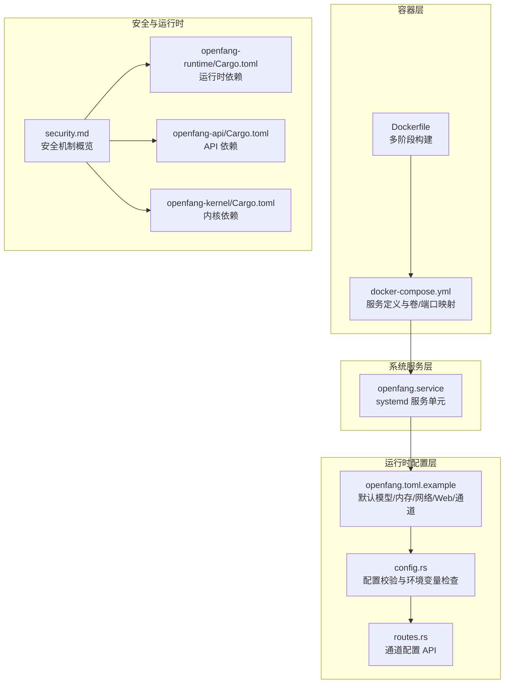
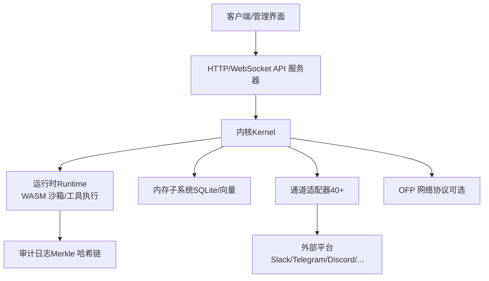
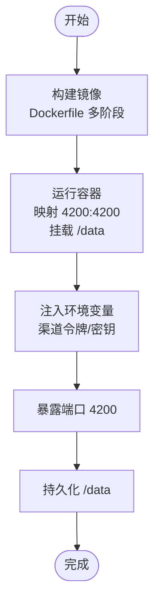
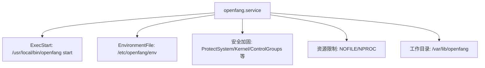
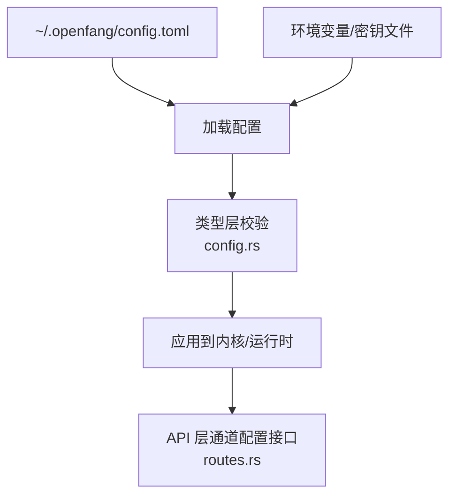
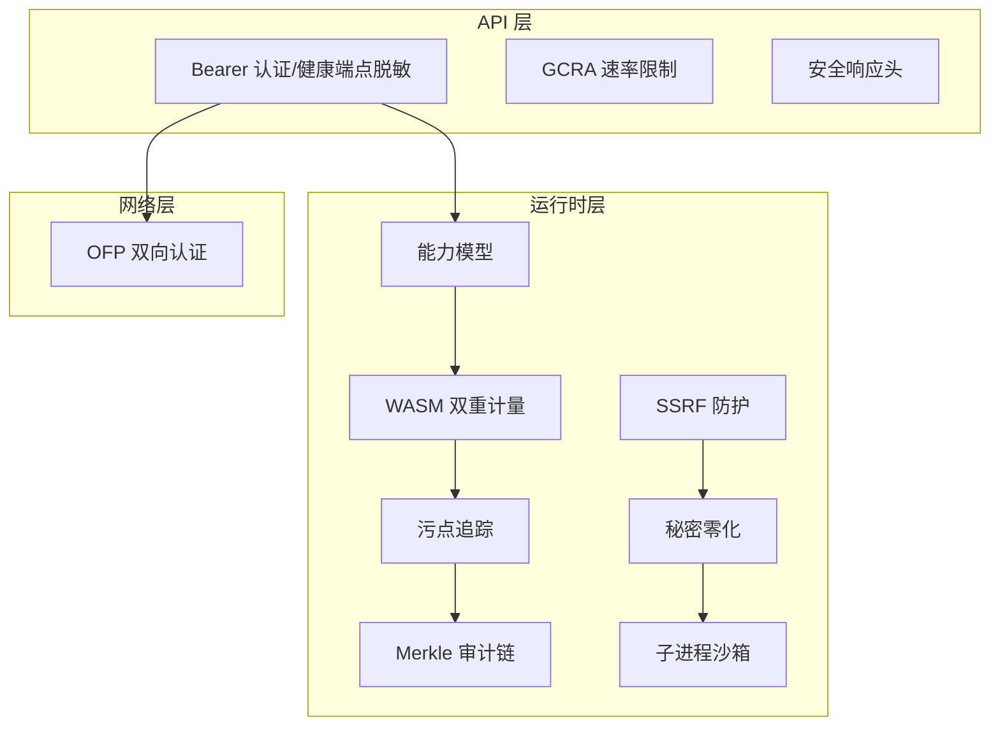
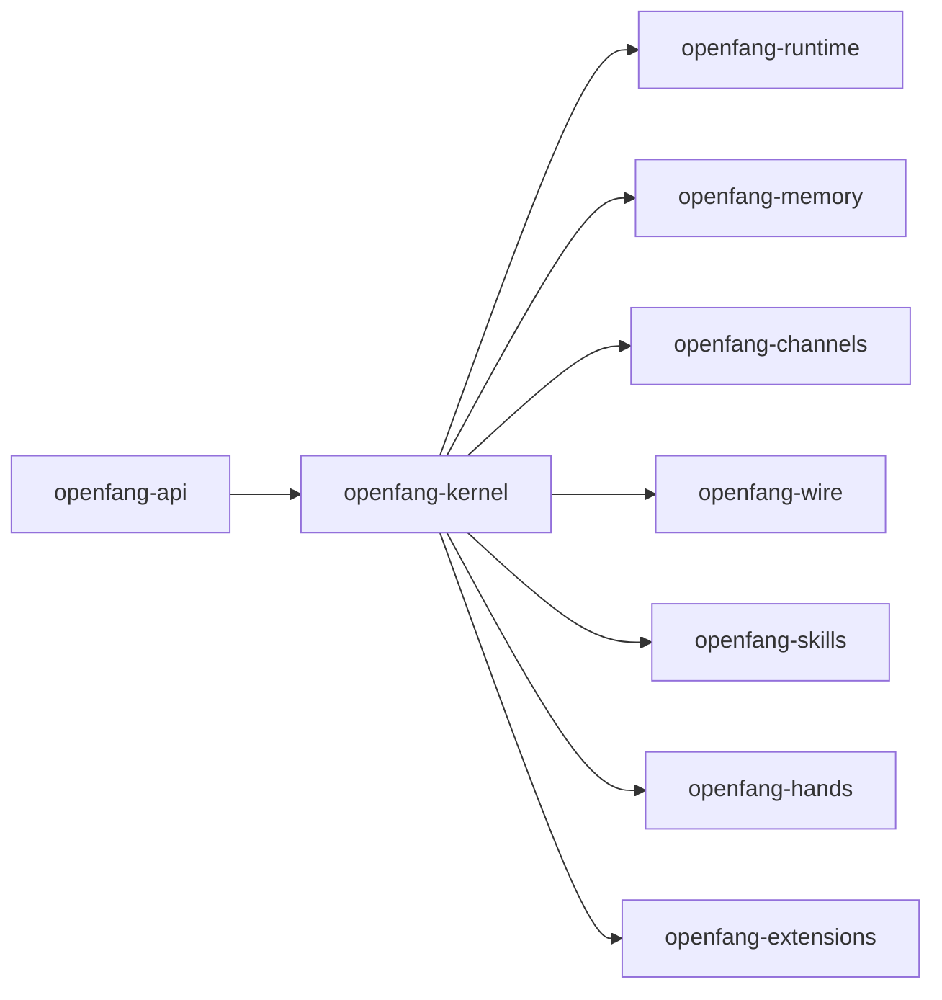

# 生产环境配置

<cite>
**本文引用的文件**
- [docker-compose.yml](file://docker-compose.yml)
- [Dockerfile](file://Dockerfile)
- [openfang.service](file://deploy/openfang.service)
- [openfang.toml.example](file://openfang.toml.example)
- [configuration.md](file://docs/configuration.md)
- [security.md](file://docs/security.md)
- [production-checklist.md](file://docs/production-checklist.md)
- [config.rs](file://crates/openfang-types/src/config.rs)
- [routes.rs](file://crates/openfang-api/src/routes.rs)
- [Cargo.toml（openfang-api）](file://crates/openfang-api/Cargo.toml)
- [Cargo.toml（openfang-runtime）](file://crates/openfang-runtime/Cargo.toml)
- [Cargo.toml（openfang-kernel）](file://crates/openfang-kernel/Cargo.toml)
</cite>

## 目录
1. [简介](#简介)
2. [项目结构](#项目结构)
3. [核心组件](#核心组件)
4. [架构总览](#架构总览)
5. [详细组件分析](#详细组件分析)
6. [依赖关系分析](#依赖关系分析)
7. [性能考虑](#性能考虑)
8. [故障排查指南](#故障排查指南)
9. [结论](#结论)
10. [附录](#附录)

## 简介
本指南面向在生产环境中部署与运维 OpenFang 的工程团队，覆盖系统要求、硬件配置、网络与安全、容器化与编排、数据库与存储、高可用与集群、性能调优、监控与备份等全链路内容。文档基于仓库中的配置示例、服务单元与 API 文档，结合安全架构说明，形成可落地的生产级配置蓝图。

## 项目结构
OpenFang 提供多种部署形态与配置入口：
- 容器镜像构建：通过根目录 Dockerfile 构建多阶段镜像，暴露 4200 端口，挂载 /data 作为持久化目录。
- Compose 编排：docker-compose.yml 定义单节点服务，映射 4200:4200，挂载 openfang-data 卷，并注入各平台渠道的 API 密钥环境变量。
- 系统服务：deploy/openfang.service 定义 systemd 服务单元，支持资源限制、安全加固与工作目录。
- 运行时配置：openfang.toml.example 展示默认模型、内存、网络、Web 搜索、通道适配器等关键配置项。
- API 与配置校验：API 层提供通道配置读写接口；类型层对配置进行校验与环境变量检查。

**图表来源**
- [Dockerfile:1-35](file://Dockerfile#L1-L35)
- [docker-compose.yml:1-26](file://docker-compose.yml#L1-L26)
- [openfang.service:1-39](file://deploy/openfang.service#L1-L39)
- [openfang.toml.example:1-49](file://openfang.toml.example#L1-L49)
- [config.rs:3016-3432](file://crates/openfang-types/src/config.rs#L3016-L3432)
- [routes.rs:2491-2621](file://crates/openfang-api/src/routes.rs#L2491-L2621)
- [security.md:1-120](file://docs/security.md#L1-L120)
- [Cargo.toml（openfang-runtime）:1-38](file://crates/openfang-runtime/Cargo.toml#L1-L38)
- [Cargo.toml（openfang-api）:1-44](file://crates/openfang-api/Cargo.toml#L1-L44)
- [Cargo.toml（openfang-kernel）:1-44](file://crates/openfang-kernel/Cargo.toml#L1-L44)

**章节来源**
- [docker-compose.yml:1-26](file://docker-compose.yml#L1-L26)
- [Dockerfile:1-35](file://Dockerfile#L1-L35)
- [openfang.service:1-39](file://deploy/openfang.service#L1-L39)
- [openfang.toml.example:1-49](file://openfang.toml.example#L1-L49)
- [configuration.md:1-200](file://docs/configuration.md#L1-L200)
- [security.md:1-120](file://docs/security.md#L1-L120)

## 核心组件
- 容器镜像与构建
  - 多阶段构建，第一阶段安装编译依赖并构建二进制，第二阶段仅保留运行时依赖，最终以 openfang 可执行文件启动。
  - 暴露 4200 端口，挂载 /data 为持久化卷，环境变量 OPENFANG_HOME=/data。
- Compose 服务
  - 映射宿主 4200:4200，挂载 openfang-data 卷，注入各平台渠道的令牌环境变量。
- systemd 服务
  - 使用 simple 类型，用户/组 openfang，工作目录 /var/lib/openfang，限制 NOFILE/NPROC，启用安全加固选项。
- 运行时配置
  - 默认模型、内存、网络、Web 搜索、MCP 服务器、通道适配器等均可通过配置文件与环境变量控制。
- API 与配置校验
  - API 提供通道列表与字段元数据查询，以及安全地写入密钥到 secrets.env 并注入进程环境。
  - 类型层对已配置通道的环境变量进行校验，缺失时生成警告。

**章节来源**
- [Dockerfile:1-35](file://Dockerfile#L1-L35)
- [docker-compose.yml:7-22](file://docker-compose.yml#L7-L22)
- [openfang.service:7-36](file://deploy/openfang.service#L7-L36)
- [openfang.toml.example:8-49](file://openfang.toml.example#L8-L49)
- [routes.rs:2491-2621](file://crates/openfang-api/src/routes.rs#L2491-L2621)
- [config.rs:3016-3432](file://crates/openfang-types/src/config.rs#L3016-L3432)

## 架构总览
下图展示生产环境从客户端到 OpenFang 内核的关键交互路径，包括 API 访问、通道适配器、运行时沙箱与审计日志等。

**图表来源**
- [Cargo.toml（openfang-api）:8-38](file://crates/openfang-api/Cargo.toml#L8-L38)
- [Cargo.toml（openfang-runtime）:8-34](file://crates/openfang-runtime/Cargo.toml#L8-L34)
- [Cargo.toml（openfang-kernel）:8-34](file://crates/openfang-kernel/Cargo.toml#L8-L34)
- [security.md:269-382](file://docs/security.md#L269-L382)

## 详细组件分析

### Docker 部署与容器编排
- 构建与入口
  - 使用多阶段 Dockerfile 构建二进制，运行时仅包含必要运行时库，入口命令为 openfang start。
  - 暴露 4200 端口，挂载 /data 为持久化目录，便于存储数据库与缓存。
- Compose 规划
  - 单实例映射 4200:4200，卷 openfang-data 持久化。
  - 注入各平台渠道的令牌环境变量，如 TELEGRAM_BOT_TOKEN、DISCORD_BOT_TOKEN、SLACK_BOT_TOKEN、SLACK_APP_TOKEN 等。
- 生产建议
  - 在生产中建议使用官方镜像（当 GHCR 公开后），或在私有镜像仓库中缓存构建产物。
  - 将敏感环境变量置于外部密钥管理（如 Vault/KMS），通过 Compose 的 env_file 或 Kubernetes Secret 注入。

**图表来源**
- [Dockerfile:1-35](file://Dockerfile#L1-L35)
- [docker-compose.yml:7-22](file://docker-compose.yml#L7-L22)

**章节来源**
- [Dockerfile:1-35](file://Dockerfile#L1-L35)
- [docker-compose.yml:1-26](file://docker-compose.yml#L1-L26)

### systemd 服务与系统集成
- 服务单元要点
  - simple 类型，用户/组 openfang，工作目录 /var/lib/openfang。
  - 启用安全加固：NoNewPrivileges、ProtectSystem、ProtectHome、PrivateTmp、RestrictSUIDSGID、RestrictRealtime 等。
  - 资源限制：LimitNOFILE、LimitNPROC。
  - 重启策略：on-failure，超时停止 30 秒。
- 环境文件
  - 通过 EnvironmentFile 引入 /etc/openfang/env，集中管理密钥与运行参数。
- 生产建议
  - 将 /var/lib/openfang 设为只读路径的一部分，仅允许特定子路径写入。
  - 结合 systemd 日志与 journald 归档，配合集中式日志收集。

**图表来源**
- [openfang.service:7-36](file://deploy/openfang.service#L7-L36)

**章节来源**
- [openfang.service:1-39](file://deploy/openfang.service#L1-L39)

### 运行时配置与环境变量
- 配置文件位置与默认行为
  - 配置文件位于 ~/.openfang/config.toml；未设置时默认使用 Anthropic 作为主模型。
  - 所有字段均为可选，默认值由类型默认实现提供；敏感字段（如 API Key、共享密钥）不会直接写入配置文件。
- 关键配置段落
  - default_model：主模型提供商、模型标识、API Key 环境变量名、可选 base_url。
  - memory：SQLite 路径、嵌入模型、合并阈值、衰减率。
  - network：监听地址、引导节点、mDNS、最大对等数、共享密钥。
  - web：搜索提供商、缓存 TTL、各搜索引擎的 API Key 环境变量与参数。
  - channels.*：各平台通道的令牌环境变量、默认代理 Agent、轮询/端口等。
  - mcp_servers：MCP 服务器连接配置（命令、参数、传输方式）。
- 环境变量注入
  - Compose 中通过 environment 注入渠道令牌；systemd 通过 /etc/openfang/env 注入。
  - API 层支持将密钥写入 secrets.env 并注入进程环境，避免明文写入配置文件。

**图表来源**
- [openfang.toml.example:8-49](file://openfang.toml.example#L8-L49)
- [configuration.md:219-490](file://docs/configuration.md#L219-L490)
- [config.rs:3016-3432](file://crates/openfang-types/src/config.rs#L3016-L3432)
- [routes.rs:2491-2621](file://crates/openfang-api/src/routes.rs#L2491-L2621)

**章节来源**
- [openfang.toml.example:1-49](file://openfang.toml.example#L1-L49)
- [configuration.md:219-490](file://docs/configuration.md#L219-L490)
- [config.rs:3016-3432](file://crates/openfang-types/src/config.rs#L3016-L3432)
- [routes.rs:2491-2621](file://crates/openfang-api/src/routes.rs#L2491-L2621)

### 数据库与存储卷
- 存储卷
  - Compose 使用 openfang-data 卷，持久化 /data 目录，确保重启后数据不丢失。
  - systemd 工作目录 /var/lib/openfang 也应具备持久化能力。
- 数据库
  - 默认 SQLite 文件位于 data_dir 下（默认 ~/.openfang/data/openfang.db），用于会话记忆与结构化数据。
  - 建议在生产中将 SQLite 迁移至更可靠的数据库（如 PostgreSQL/MySQL）以提升并发与可靠性。
- 性能与容量
  - memory.consolidation_threshold 控制自动合并触发点；根据消息规模调整阈值。
  - 建议定期清理与归档历史数据，避免数据库膨胀。

**章节来源**
- [docker-compose.yml:12-25](file://docker-compose.yml#L12-L25)
- [openfang.toml.example:14-16](file://openfang.toml.example#L14-L16)
- [configuration.md:277-295](file://docs/configuration.md#L277-L295)

### 端口映射与网络
- 端口
  - 容器映射 4200:4200；API 监听地址可在配置中调整（默认 127.0.0.1:50051，生产建议绑定 0.0.0.0）。
- 网络
  - network.listen_addr 控制 OFP 监听地址；network_enabled 为 true 时需设置 shared_secret。
  - web.search_provider 支持多引擎回退；fetch 限制响应大小与超时。
- 生产建议
  - 将 API 绑定到 0.0.0.0 并通过反向代理（Nginx/Traefik）统一入口。
  - 对外暴露端口仅开放 4200 与必要的 Webhook 端口（如 8443/8444 等）。

**章节来源**
- [docker-compose.yml:10-11](file://docker-compose.yml#L10-L11)
- [openfang.toml.example:18-20](file://openfang.toml.example#L18-L20)
- [configuration.md:119-154](file://docs/configuration.md#L119-L154)

### 安全配置与合规
- 安全机制概览
  - 能力模型（Capability-Based Security）、WASM 双重计量、Merkle 审计链、污点追踪、Ed25519 清单签名、SSRF 防护、秘密零化、OFP 双向认证、安全响应头、GCRA 速率限制、路径遍历防护、子进程沙箱、提示注入扫描、循环保护、会话修复、健康端点脱敏。
- API 安全
  - 可设置 Bearer Token 认证；健康端点脱敏。
- 通道安全
  - 令牌通过环境变量注入；API 层写入密钥到 secrets.env，避免明文配置。
- 系统加固
  - systemd 服务启用多项安全限制；容器镜像最小化运行时依赖。

**图表来源**
- [security.md:36-120](file://docs/security.md#L36-L120)
- [routes.rs:2491-2621](file://crates/openfang-api/src/routes.rs#L2491-L2621)

**章节来源**
- [security.md:1-120](file://docs/security.md#L1-L120)
- [routes.rs:2491-2621](file://crates/openfang-api/src/routes.rs#L2491-L2621)

### 负载均衡、高可用与集群
- 集群与网络
  - network_enabled 为 true 时启用 OFP；需要在所有节点设置相同的 shared_secret。
  - listen_addresses 支持多地址监听；bootstrap_peers 用于 DHT 发现。
- 高可用建议
  - 使用反向代理（Nginx/Traefik/Haproxy）做健康检查与会话粘连。
  - 多实例部署时，共享同一存储卷或数据库后端，确保状态一致。
  - 对外仅暴露必要端口，内部通过私网通信。
- 注意事项
  - 当前 GHCR 镜像尚未公开，建议优先使用本地构建镜像或私有仓库。

**章节来源**
- [openfang.toml.example:18-25](file://openfang.toml.example#L18-L25)
- [docker-compose.yml:1-3](file://docker-compose.yml#L1-L3)

### 性能调优与资源限制
- 运行时参数
  - memory.decay_rate 控制记忆衰减；consolidation_threshold 控制合并频率。
  - web.fetch.max_chars、max_response_bytes、timeout_secs 控制抓取性能与资源占用。
- 容器与系统
  - Dockerfile 支持 LTO 与 Codegen Units 参数，可通过构建参数优化体积与性能。
  - systemd 限制 NOFILE/NPROC，避免资源耗尽。
- 生产建议
  - 根据业务峰值调整内存与并发工具上限；对高吞吐场景启用更严格的速率限制与超时策略。

**章节来源**
- [openfang.toml.example:14-26](file://openfang.toml.example#L14-L26)
- [configuration.md:395-411](file://docs/configuration.md#L395-L411)
- [Dockerfile:10-16](file://Dockerfile#L10-L16)
- [openfang.service:33-36](file://deploy/openfang.service#L33-L36)

### 监控与可观测性
- 审计日志
  - Merkle 哈希链记录安全关键动作，支持完整性验证与最近条目查询。
- API 与运行时
  - API 层提供通道状态与字段元数据接口；运行时提供燃料与时间片度量。
- 建议实践
  - 将审计日志与 API 日志接入集中式日志系统（如 ELK/Vector/Loki）。
  - 配置健康检查端点与告警规则（CPU/内存/连接数/错误率）。

**章节来源**
- [security.md:269-382](file://docs/security.md#L269-L382)
- [routes.rs:2491-2621](file://crates/openfang-api/src/routes.rs#L2491-L2621)

### 备份策略、灾难恢复与数据迁移
- 备份
  - 持久化卷 openfang-data 与 SQLite 数据库是备份重点；建议周期性导出数据库并加密归档。
- 灾难恢复
  - 通过相同版本镜像与配置快速恢复；验证 /data 恢复后服务可用性。
- 数据迁移
  - 从旧版本迁移时，遵循迁移文档与配置兼容性；先在测试环境验证再上线。

**章节来源**
- [docker-compose.yml:24-25](file://docker-compose.yml#L24-L25)
- [production-checklist.md:136-151](file://docs/production-checklist.md#L136-L151)

## 依赖关系分析
OpenFang 的核心由 API、内核、运行时、内存、通道与网络等模块组成，彼此通过类型与接口耦合。

**图表来源**
- [Cargo.toml（openfang-api）:8-38](file://crates/openfang-api/Cargo.toml#L8-L38)
- [Cargo.toml（openfang-kernel）:8-34](file://crates/openfang-kernel/Cargo.toml#L8-L34)
- [Cargo.toml（openfang-runtime）:8-34](file://crates/openfang-runtime/Cargo.toml#L8-L34)

**章节来源**
- [Cargo.toml（openfang-api）:1-44](file://crates/openfang-api/Cargo.toml#L1-L44)
- [Cargo.toml（openfang-kernel）:1-44](file://crates/openfang-kernel/Cargo.toml#L1-L44)
- [Cargo.toml（openfang-runtime）:1-38](file://crates/openfang-runtime/Cargo.toml#L1-L38)

## 性能考虑
- 构建优化
  - Dockerfile 支持 LTO 与 Codegen Units 参数，按需开启以平衡编译速度与运行时性能。
- 运行时优化
  - 合理设置 memory.consolidation_threshold 与 decay_rate，避免频繁合并与过期数据堆积。
  - web.fetch 的超时与响应大小限制可防止资源滥用。
- 系统与容器
  - systemd 限制 NOFILE/NPROC，避免单实例资源耗尽；容器层面最小化运行时依赖，降低启动与运行成本。

**章节来源**
- [Dockerfile:10-16](file://Dockerfile#L10-L16)
- [openfang.toml.example:14-26](file://openfang.toml.example#L14-L26)
- [configuration.md:395-411](file://docs/configuration.md#L395-L411)
- [openfang.service:33-36](file://deploy/openfang.service#L33-L36)

## 故障排查指南
- 配置校验
  - 类型层会对已配置通道的环境变量进行检查，缺失时产生警告；请确认对应环境变量已注入。
- API 配置写入
  - 通过 API 写入密钥时，会写入 secrets.env 并注入进程环境，避免明文写入配置文件。
- 常见问题定位
  - 端口冲突：确认 4200 未被占用；若绑定 0.0.0.0，检查防火墙放行。
  - 权限不足：systemd 服务的工作目录与卷权限需正确授权给 openfang 用户。
  - 通道不可用：检查对应环境变量是否注入，API 接口返回的 has_value 字段可辅助判断。

**章节来源**
- [config.rs:3016-3432](file://crates/openfang-types/src/config.rs#L3016-L3432)
- [routes.rs:2491-2621](file://crates/openfang-api/src/routes.rs#L2491-L2621)
- [docker-compose.yml:14-22](file://docker-compose.yml#L14-L22)

## 结论
本文基于仓库现有配置与文档，给出了 OpenFang 生产环境的完整配置蓝图：容器与编排、系统服务、运行时配置、数据库与存储、网络与安全、高可用与集群、性能调优、监控与备份。建议在上线前完成密钥注入、健康检查与告警配置，并在测试环境充分验证后再推进生产部署。

## 附录
- 生产发布清单（CI/CD 与签名）
  - 包含 Tauri 签名密钥生成、公钥写入配置、GitHub Secrets 设置、图标资产准备、域名与安装脚本验证、Dockerfile 构建验证、自动更新验证与 Docker 镜像验证等步骤。
- 快速参考
  - 端口：4200（API），各通道 Webhook 端口（如 8443/8444）。
  - 卷：/data（持久化），/var/lib/openfang（工作目录）。
  - 环境变量：各平台渠道令牌、默认模型 API Key、Web 搜索密钥等。

**章节来源**
- [production-checklist.md:1-299](file://docs/production-checklist.md#L1-L299)