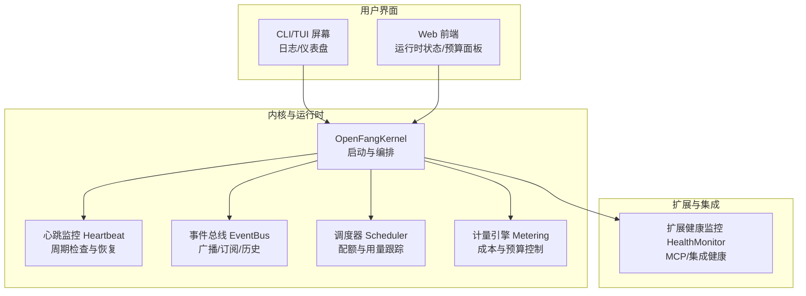
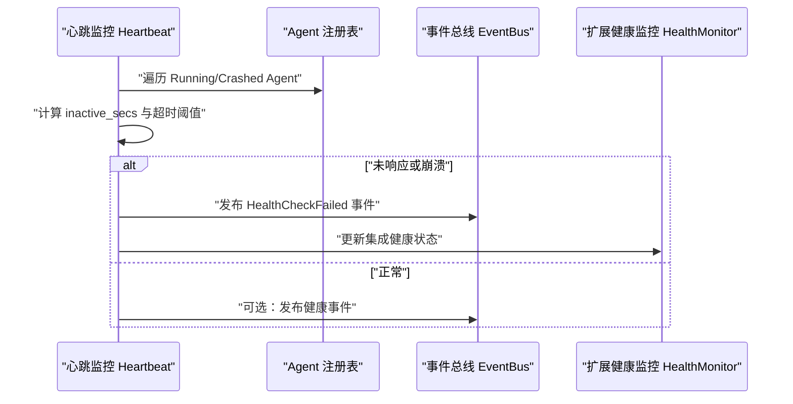
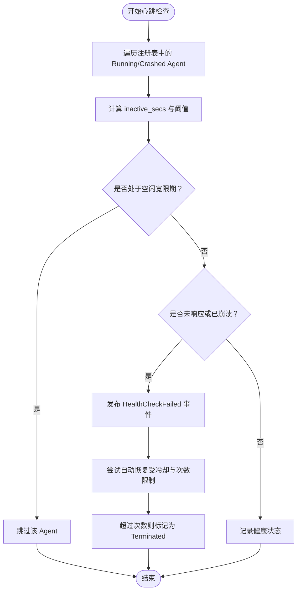
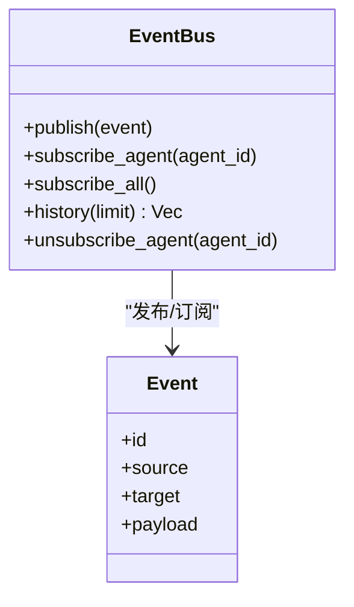
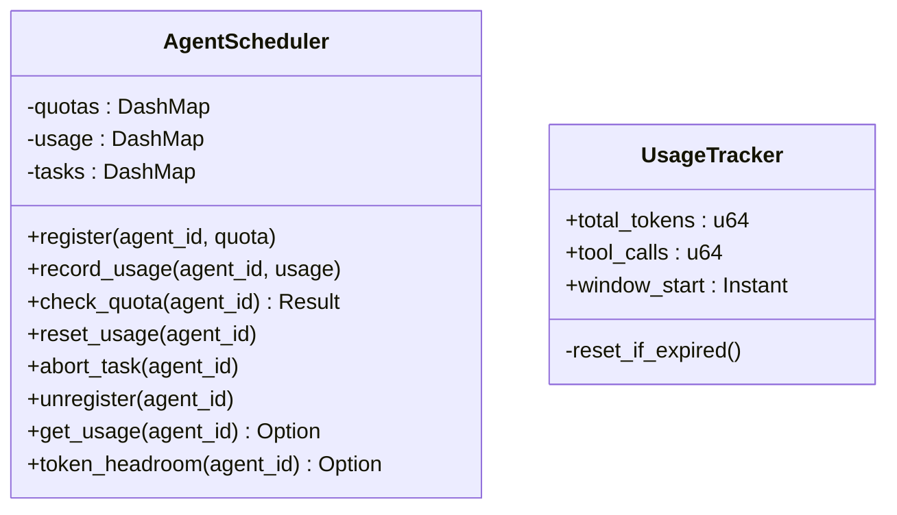
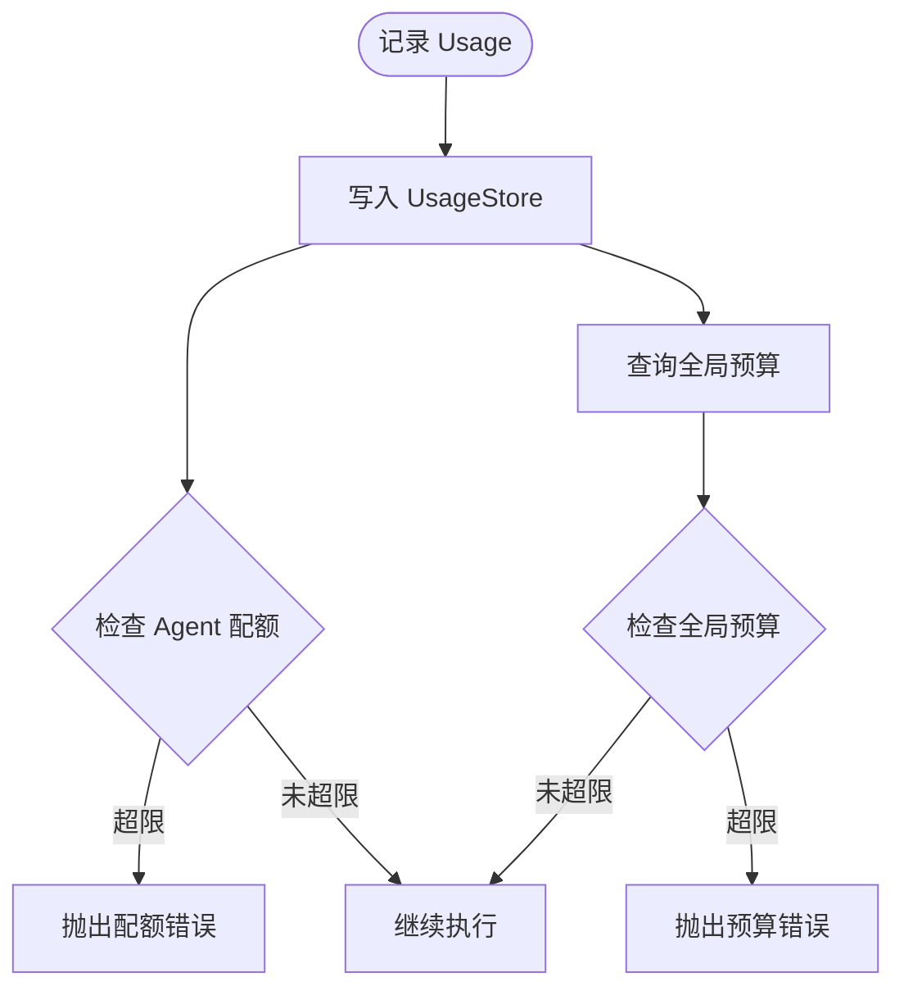
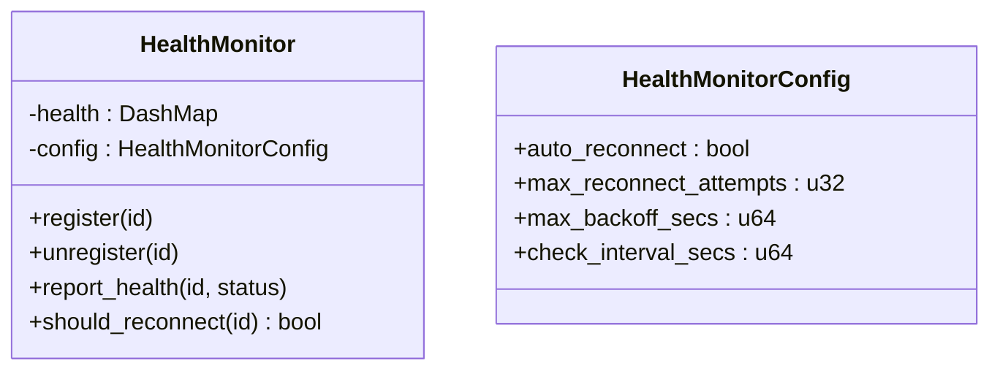
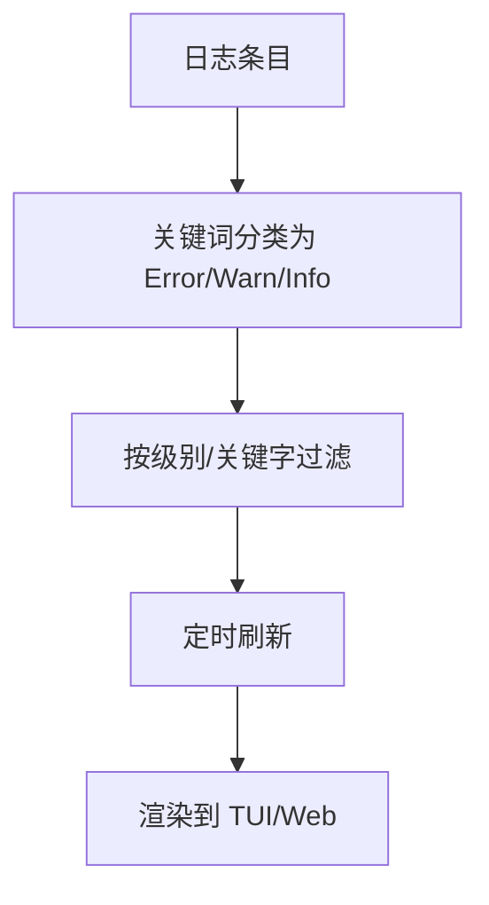
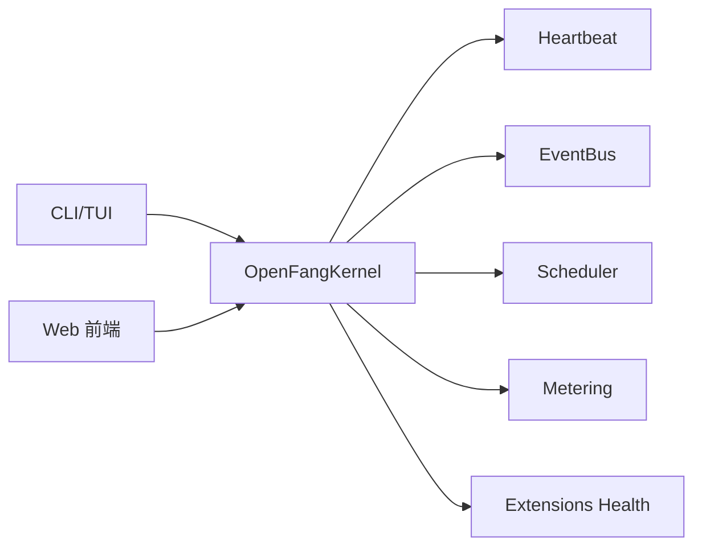

# 监控和告警

<cite>
**本文引用的文件**
- [crates/openfang-kernel/src/heartbeat.rs](file://crates/openfang-kernel/src/heartbeat.rs)
- [crates/openfang-kernel/src/event_bus.rs](file://crates/openfang-kernel/src/event_bus.rs)
- [crates/openfang-kernel/src/metering.rs](file://crates/openfang-kernel/src/metering.rs)
- [crates/openfang-kernel/src/scheduler.rs](file://crates/openfang-kernel/src/scheduler.rs)
- [crates/openfang-kernel/src/config.rs](file://crates/openfang-kernel/src/config.rs)
- [crates/openfang-kernel/src/kernel.rs](file://crates/openfang-kernel/src/kernel.rs)
- [crates/openfang-types/src/config.rs](file://crates/openfang-types/src/config.rs)
- [crates/openfang-extensions/src/health.rs](file://crates/openfang-extensions/src/health.rs)
- [crates/openfang-cli/src/tui/screens/logs.rs](file://crates/openfang-cli/src/tui/screens/logs.rs)
- [crates/openfang-api/static/index_body.html](file://crates/openfang-api/static/index_body.html)
- [crates/openfang-api/static/js/pages/runtime.js](file://crates/openfang-api/static/js/pages/runtime.js)
- [crates/openfang-cli/src/main.rs](file://crates/openfang-cli/src/main.rs)
- [crates/openfang-cli/src/tui/screens/dashboard.rs](file://crates/openfang-cli/src/tui/screens/dashboard.rs)
- [crates/openfang-skills/bundled/prometheus/SKILL.md](file://crates/openfang-skills/bundled/prometheus/SKILL.md)
</cite>

## 目录
1. [简介](#简介)
2. [项目结构](#项目结构)
3. [核心组件](#核心组件)
4. [架构总览](#架构总览)
5. [详细组件分析](#详细组件分析)
6. [依赖关系分析](#依赖关系分析)
7. [性能考量](#性能考量)
8. [故障排查指南](#故障排查指南)
9. [结论](#结论)
10. [附录](#附录)

## 简介
本指南面向 OpenFang 的运维与平台工程团队，提供一套完整的监控与告警实践方案。内容覆盖系统监控指标（四黄金信号、基础设施与服务）、性能与成本指标、业务指标（会话与任务）、心跳与健康检查、服务可用性监控、日志管理策略、告警规则与通知渠道、Prometheus/Grafana/APM 集成建议，以及容量规划与根因分析方法。文档以代码为依据，结合可视化图示帮助快速落地。

## 项目结构
OpenFang 的监控与告警能力由内核、事件总线、调度器、计量引擎、扩展健康监控、CLI/TUI/前端界面等模块协同实现。下图给出与监控相关的关键模块与交互关系：

图表来源
- [crates/openfang-kernel/src/kernel.rs](file://crates/openfang-kernel/src/kernel.rs)
- [crates/openfang-kernel/src/heartbeat.rs](file://crates/openfang-kernel/src/heartbeat.rs)
- [crates/openfang-kernel/src/event_bus.rs](file://crates/openfang-kernel/src/event_bus.rs)
- [crates/openfang-kernel/src/scheduler.rs](file://crates/openfang-kernel/src/scheduler.rs)
- [crates/openfang-kernel/src/metering.rs](file://crates/openfang-kernel/src/metering.rs)
- [crates/openfang-extensions/src/health.rs](file://crates/openfang-extensions/src/health.rs)
- [crates/openfang-cli/src/tui/screens/logs.rs](file://crates/openfang-cli/src/tui/screens/logs.rs)
- [crates/openfang-api/static/index_body.html](file://crates/openfang-api/static/index_body.html)

章节来源
- [crates/openfang-kernel/src/kernel.rs](file://crates/openfang-kernel/src/kernel.rs)
- [crates/openfang-kernel/src/heartbeat.rs](file://crates/openfang-kernel/src/heartbeat.rs)
- [crates/openfang-kernel/src/event_bus.rs](file://crates/openfang-kernel/src/event_bus.rs)
- [crates/openfang-kernel/src/scheduler.rs](file://crates/openfang-kernel/src/scheduler.rs)
- [crates/openfang-kernel/src/metering.rs](file://crates/openfang-kernel/src/metering.rs)
- [crates/openfang-extensions/src/health.rs](file://crates/openfang-extensions/src/health.rs)
- [crates/openfang-cli/src/tui/screens/logs.rs](file://crates/openfang-cli/src/tui/screens/logs.rs)
- [crates/openfang-api/static/index_body.html](file://crates/openfang-api/static/index_body.html)

## 核心组件
- 心跳监控：周期性检查 Agent 最后活跃时间，判定未响应并触发健康检查事件；对崩溃 Agent 进行有限次数自动恢复。
- 事件总线：统一发布/订阅事件，保留历史环形缓冲，支持按目标广播与模式匹配。
- 调度器：基于配额的令牌用量跟踪与窗口化统计，用于短期限流与容量预警。
- 计量引擎：LLM 成本记录与全局/单机配额校验，提供预算状态与可视化。
- 扩展健康监控：对 MCP/集成进行健康登记、自动重连与检查间隔配置。
- 日志与 UI：CLI/TUI 日志过滤与级别分类；Web 前端展示运行时状态与预算面板。

章节来源
- [crates/openfang-kernel/src/heartbeat.rs](file://crates/openfang-kernel/src/heartbeat.rs)
- [crates/openfang-kernel/src/event_bus.rs](file://crates/openfang-kernel/src/event_bus.rs)
- [crates/openfang-kernel/src/scheduler.rs](file://crates/openfang-kernel/src/scheduler.rs)
- [crates/openfang-kernel/src/metering.rs](file://crates/openfang-kernel/src/metering.rs)
- [crates/openfang-extensions/src/health.rs](file://crates/openfang-extensions/src/health.rs)
- [crates/openfang-cli/src/tui/screens/logs.rs](file://crates/openfang-cli/src/tui/screens/logs.rs)
- [crates/openfang-api/static/index_body.html](file://crates/openfang-api/static/index_body.html)

## 架构总览
以下序列图展示心跳监控如何驱动健康检查与恢复流程，并通过事件总线广播系统事件：

图表来源
- [crates/openfang-kernel/src/heartbeat.rs](file://crates/openfang-kernel/src/heartbeat.rs)
- [crates/openfang-kernel/src/event_bus.rs](file://crates/openfang-kernel/src/event_bus.rs)
- [crates/openfang-extensions/src/health.rs](file://crates/openfang-extensions/src/health.rs)

## 详细组件分析

### 心跳监控与健康检查
- 周期检查：默认每 30 秒检查一次，未响应阈值为 2 倍 Agent 自主心跳间隔（默认 180 秒）。
- 空闲宽限期：Agent 刚创建但尚未真正处理消息时不会被标记为未响应。
- 恢复策略：对崩溃 Agent 在冷却期内最多尝试有限次重启，超过上限标记为终止。
- 静默时段：支持 HH:MM-HH:MM 格式的静默时段判断，避免在非工作时间误报。
- 总结统计：输出响应/未响应 Agent 数量与明细，便于仪表盘汇总。

图表来源
- [crates/openfang-kernel/src/heartbeat.rs](file://crates/openfang-kernel/src/heartbeat.rs)

章节来源
- [crates/openfang-kernel/src/heartbeat.rs](file://crates/openfang-kernel/src/heartbeat.rs)

### 事件总线与历史
- 广播通道：支持系统/广播/按 Agent 目标分发。
- 历史环形缓冲：默认保留最近 1000 条事件，便于回溯与审计。
- 订阅接口：按 Agent 或全量订阅，便于组件间解耦通信。

图表来源
- [crates/openfang-kernel/src/event_bus.rs](file://crates/openfang-kernel/src/event_bus.rs)

章节来源
- [crates/openfang-kernel/src/event_bus.rs](file://crates/openfang-kernel/src/event_bus.rs)

### 调度器与配额
- 使用窗口化计数器（1 小时滚动窗口）跟踪每个 Agent 的总令牌用量与工具调用次数。
- 提供配额检查与剩余头寸查询，用于短期限流与容量预警。
- 支持任务中止与注销清理。

图表来源
- [crates/openfang-kernel/src/scheduler.rs](file://crates/openfang-kernel/src/scheduler.rs)

章节来源
- [crates/openfang-kernel/src/scheduler.rs](file://crates/openfang-kernel/src/scheduler.rs)

### 计量引擎与预算
- 成本记录：持久化到 SQLite，支持小时/日/月维度查询与清理。
- 全局预算：小时/日/月预算上限与告警阈值，支持 per-agent 默认令牌限额。
- 预算状态：返回当前花费占比与阈值，前端用于可视化展示。

图表来源
- [crates/openfang-kernel/src/metering.rs](file://crates/openfang-kernel/src/metering.rs)

章节来源
- [crates/openfang-kernel/src/metering.rs](file://crates/openfang-kernel/src/metering.rs)

### 扩展健康监控（MCP/集成）
- 集成注册与注销：为每个集成维护健康状态。
- 自动重连：可配置最大重试次数与退避上限。
- 健康检查间隔：可配置基础检查周期。

图表来源
- [crates/openfang-extensions/src/health.rs](file://crates/openfang-extensions/src/health.rs)

章节来源
- [crates/openfang-extensions/src/health.rs](file://crates/openfang-extensions/src/health.rs)

### 日志管理与 UI
- 日志级别分类：根据动作/详情关键词推断 Error/Warn/Info。
- 过滤与搜索：支持按级别与关键字过滤，自动刷新。
- TUI 仪表盘：显示 Agent 数量与运行时长等关键指标。
- Web 前端：展示运行时状态与预算面板，支持编辑预算与阈值。

图表来源
- [crates/openfang-cli/src/tui/screens/logs.rs](file://crates/openfang-cli/src/tui/screens/logs.rs)
- [crates/openfang-api/static/index_body.html](file://crates/openfang-api/static/index_body.html)
- [crates/openfang-cli/src/tui/screens/dashboard.rs](file://crates/openfang-cli/src/tui/screens/dashboard.rs)

章节来源
- [crates/openfang-cli/src/tui/screens/logs.rs](file://crates/openfang-cli/src/tui/screens/logs.rs)
- [crates/openfang-api/static/index_body.html](file://crates/openfang-api/static/index_body.html)
- [crates/openfang-cli/src/tui/screens/dashboard.rs](file://crates/openfang-cli/src/tui/screens/dashboard.rs)

### 配置与环境变量
- 配置加载：支持 include 合并、迁移字段、安全路径校验与深度限制。
- 通道与通知：Telegram/Slack/WhatsApp/Webhook/Ntfy/Gotify 等通道配置项与验证。
- 设备配对：推送提供商（ntfy/gotify）与主题配置。

章节来源
- [crates/openfang-kernel/src/config.rs](file://crates/openfang-kernel/src/config.rs)
- [crates/openfang-types/src/config.rs](file://crates/openfang-types/src/config.rs)

## 依赖关系分析
- 内核负责装配心跳、事件总线、调度器、计量引擎、扩展健康监控等子系统。
- 心跳与事件总线共同驱动健康检查与恢复；调度器与计量引擎分别从“资源使用”和“成本预算”两个维度保障系统稳定。
- CLI/TUI/Web 作为观测面，消费内核状态并提供交互入口。

图表来源
- [crates/openfang-kernel/src/kernel.rs](file://crates/openfang-kernel/src/kernel.rs)
- [crates/openfang-kernel/src/heartbeat.rs](file://crates/openfang-kernel/src/heartbeat.rs)
- [crates/openfang-kernel/src/event_bus.rs](file://crates/openfang-kernel/src/event_bus.rs)
- [crates/openfang-kernel/src/scheduler.rs](file://crates/openfang-kernel/src/scheduler.rs)
- [crates/openfang-kernel/src/metering.rs](file://crates/openfang-kernel/src/metering.rs)
- [crates/openfang-extensions/src/health.rs](file://crates/openfang-extensions/src/health.rs)
- [crates/openfang-cli/src/main.rs](file://crates/openfang-cli/src/main.rs)

章节来源
- [crates/openfang-kernel/src/kernel.rs](file://crates/openfang-kernel/src/kernel.rs)
- [crates/openfang-cli/src/main.rs](file://crates/openfang-cli/src/main.rs)

## 性能考量
- 心跳检查频率与阈值：默认 30 秒检查、180 秒超时，适用于复杂 LLM/浏览器任务场景；可根据 Agent 类型调整。
- 事件总线容量：广播通道容量与历史缓冲大小需结合并发事件规模评估。
- 调度器窗口化统计：1 小时滚动窗口适合短期限流；若需要更细粒度，可在上层增加更短窗口。
- 计量引擎：SQLite 存储与查询开销可控，建议定期清理旧记录以维持性能。
- 日志渲染：TUI/Web 的自动刷新与过滤应避免高频重绘，必要时引入节流。

## 故障排查指南
- 心跳未响应
  - 检查 Agent 是否处于空闲宽限期（刚创建且未真正处理消息）。
  - 查看事件总线历史，定位最近的 HealthCheckFailed 事件。
  - 若为崩溃 Agent，确认自动恢复尝试次数与冷却时间。
- 预算/配额超限
  - 通过前端预算面板查看小时/日/月花费占比与阈值。
  - 检查全局预算配置与 per-agent 默认令牌限额。
- 通道/集成异常
  - 检查通道配置项与环境变量是否正确设置。
  - 查看扩展健康监控状态与自动重连尝试次数。
- 日志问题
  - 使用 TUI 日志筛选器按级别与关键字定位问题。
  - 关注 Error/Warn 级别日志，结合事件总线历史进行根因分析。

章节来源
- [crates/openfang-kernel/src/heartbeat.rs](file://crates/openfang-kernel/src/heartbeat.rs)
- [crates/openfang-kernel/src/event_bus.rs](file://crates/openfang-kernel/src/event_bus.rs)
- [crates/openfang-kernel/src/metering.rs](file://crates/openfang-kernel/src/metering.rs)
- [crates/openfang-types/src/config.rs](file://crates/openfang-types/src/config.rs)
- [crates/openfang-extensions/src/health.rs](file://crates/openfang-extensions/src/health.rs)
- [crates/openfang-cli/src/tui/screens/logs.rs](file://crates/openfang-cli/src/tui/screens/logs.rs)

## 结论
OpenFang 的监控体系以心跳与事件为核心，辅以调度器与计量引擎，形成“可用性—资源—成本”的三层观测闭环。结合 CLI/TUI/Web 的可视化与配置能力，可快速定位问题、优化性能并进行容量规划。建议在生产环境中启用静默时段、合理设置阈值与告警，配合 Prometheus/Grafana/APM 实现持续可观测与自动化运维。

## 附录

### 指标与告警建议
- 四黄金信号
  - 延迟：Agent 处理耗时分布（P50/P95/P99）。
  - 流量：每秒消息/请求量、工具调用速率。
  - 错误：错误率、崩溃率、健康检查失败率。
  - 饱和：CPU/内存/磁盘/网络使用率、队列长度、令牌头寸。
- 成本与预算
  - 小时/日/月成本曲线与阈值告警。
  - per-agent 令牌头寸预警，防止突发流量导致超支。
- 可用性
  - 心跳未响应 Agent 数与占比。
  - 扩展健康检查失败与自动重连次数。
- 日志与审计
  - Error/Warn 级别日志趋势与关键字告警。
  - 事件总线历史用于回溯与审计。

### Prometheus/Grafana/APM 集成建议
- 指标导出
  - 将心跳统计、调度器用量、计量引擎预算状态暴露为指标。
  - 导出扩展健康监控状态与通道可用性。
- 报警规则
  - 基于 rate()/increase() 的错误与延迟阈值。
  - 基于 histogram_quantile() 的 P95/P99 延迟告警。
  - 预算阈值告警与令牌头寸低水位告警。
- 仪表板
  - 运行时概览：Agent 数、Uptime、健康状态。
  - 成本与预算：小时/日/月花费、阈值进度条。
  - 日志与事件：Error/Warn 趋势、事件历史检索。

章节来源
- [crates/openfang-skills/bundled/prometheus/SKILL.md](file://crates/openfang-skills/bundled/prometheus/SKILL.md)
- [crates/openfang-api/static/index_body.html](file://crates/openfang-api/static/index_body.html)
- [crates/openfang-api/static/js/pages/runtime.js](file://crates/openfang-api/static/js/pages/runtime.js)