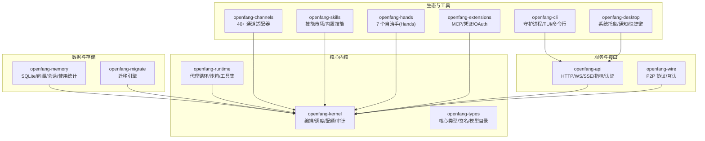
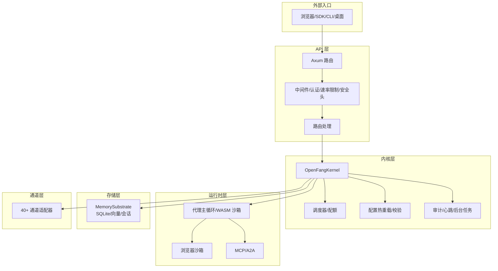
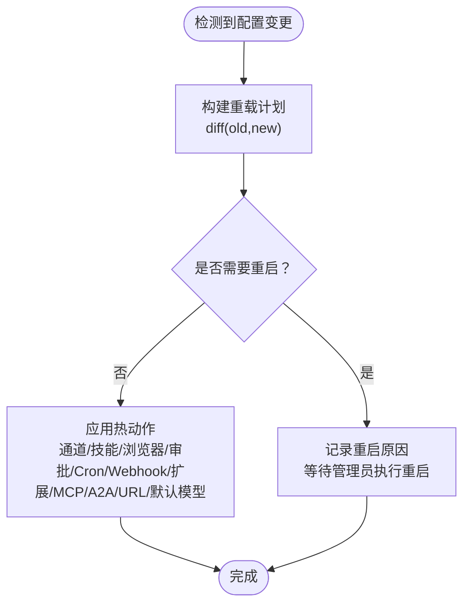
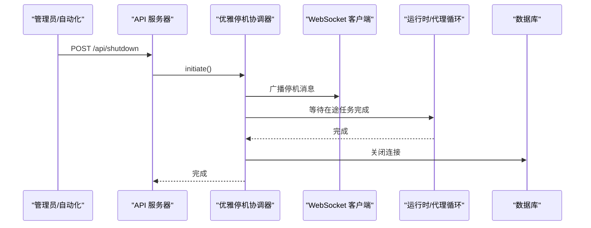
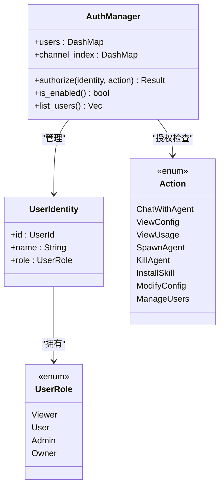
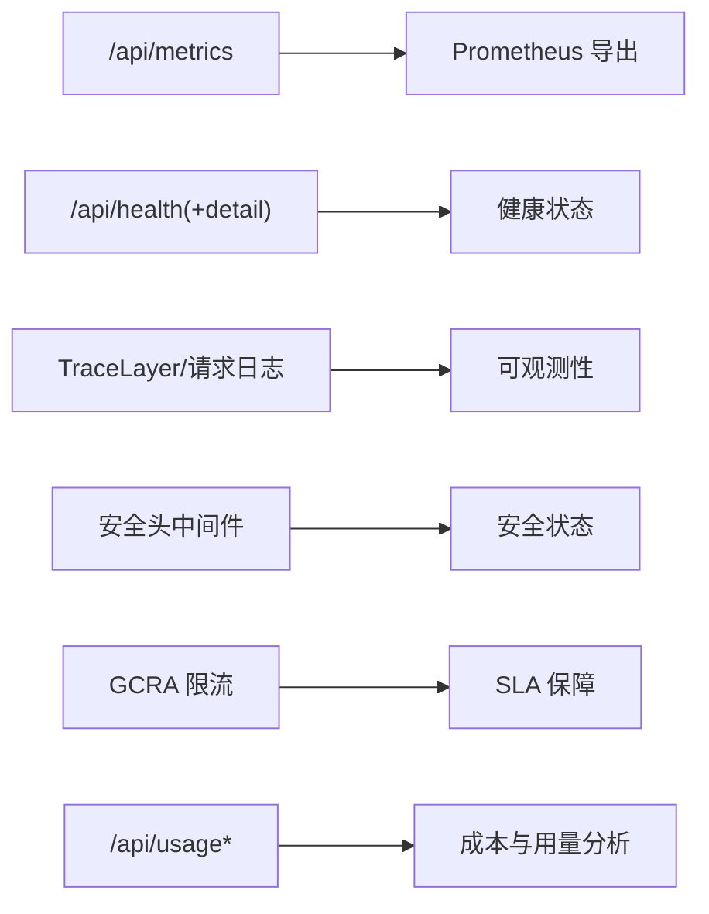
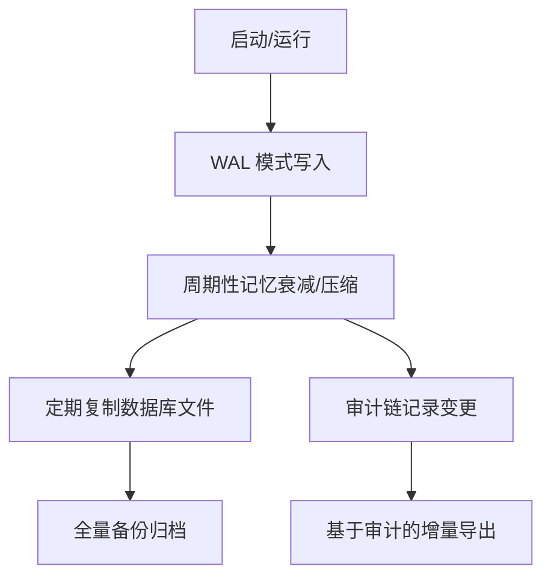
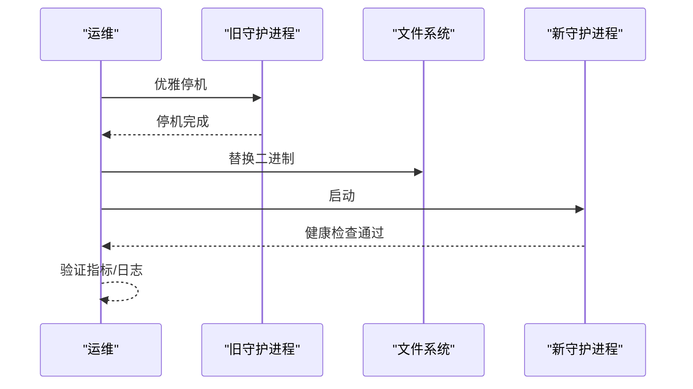
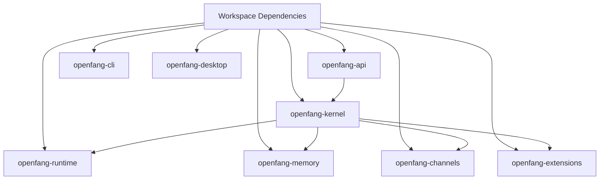

# 维护和运营

<cite>
**本文引用的文件**
- [README.md](file://README.md)
- [Cargo.toml](file://Cargo.toml)
- [openfang.toml.example](file://openfang.toml.example)
- [config_reload.rs](file://crates/openfang-kernel/src/config_reload.rs)
- [kernel.rs](file://crates/openfang-kernel/src/kernel.rs)
- [server.rs](file://crates/openfang-api/src/server.rs)
- [graceful_shutdown.rs](file://crates/openfang-runtime/src/graceful_shutdown.rs)
- [auth.rs](file://crates/openfang-kernel/src/auth.rs)
- [scheduler.rs](file://crates/openfang-kernel/src/scheduler.rs)
- [routes.rs](file://crates/openfang-api/src/routes.rs)
- [consolidation.rs](file://crates/openfang-memory/src/consolidation.rs)
- [migration.rs](file://crates/openfang-memory/src/migration.rs)
- [lib.rs](file://crates/openfang-memory/src/lib.rs)
- [metering.rs](file://crates/openfang-kernel/src/metering.rs)
- [index_body.html](file://crates/openfang-api/static/index_body.html)
- [scheduler.js](file://crates/openfang-api/static/js/pages/scheduler.js)
- [openai_compat.rs](file://crates/openfang-api/src/openai_compat.rs)
- [ws.rs](file://crates/openfang-api/src/ws.rs)
- [rate_limiter.rs](file://crates/openfang-api/src/rate_limiter.rs)
- [middleware.rs](file://crates/openfang-api/src/middleware.rs)
- [session_auth.rs](file://crates/openfang-api/src/session_auth.rs)
- [heartbeat.rs](file://crates/openfang-kernel/src/heartbeat.rs)
- [background.rs](file://crates/openfang-kernel/src/background.rs)
- [audit.rs](file://crates/openfang-runtime/src/audit.rs)
- [provider_health.rs](file://crates/openfang-runtime/src/provider_health.rs)
- [tool_runner.rs](file://crates/openfang-runtime/src/tool_runner.rs)
- [openclaw.rs](file://crates/openfang-migrate/src/openclaw.rs)
- [report.rs](file://crates/openfang-migrate/src/report.rs)
- [openfang.service](file://deploy/openfang.service)
- [production-checklist.md](file://docs/production-checklist.md)
- [configuration.md](file://docs/configuration.md)
- [security.md](file://docs/security.md)
- [troubleshooting.md](file://docs/troubleshooting.md)
</cite>

## 目录
1. [简介](#简介)
2. [项目结构](#项目结构)
3. [核心组件](#核心组件)
4. [架构总览](#架构总览)
5. [详细组件分析](#详细组件分析)
6. [依赖关系分析](#依赖关系分析)
7. [性能考量](#性能考量)
8. [故障排查指南](#故障排查指南)
9. [结论](#结论)
10. [附录](#附录)

## 简介
本指南面向 OpenFang 的维护与运营团队，覆盖日常维护、系统巡检、性能监控、配置热重载、在线升级与平滑重启、数据备份策略（含全量/增量）、版本升级流程与回滚、用户管理与权限控制、容量规划与成本优化、运营自动化与批量操作、以及运营报告与 KPI 指标。内容基于仓库源码与官方文档，确保可执行、可验证、可追溯。

## 项目结构
OpenFang 是一个由 14 个 Rust crate 组成的模块化内核系统，提供代理操作系统能力：内核编排、运行时沙箱、API 服务、通道适配器、内存子系统、类型定义、技能与手（Hands）包、扩展与集成、P2P 协议、CLI 与桌面应用、迁移工具等。生产部署通常通过单二进制与 systemd 服务文件进行。

图示来源
- [Cargo.toml:1-160](file://Cargo.toml#L1-L160)

章节来源
- [Cargo.toml:1-160](file://Cargo.toml#L1-L160)
- [README.md:231-250](file://README.md#L231-L250)

## 核心组件
- 内核（Kernel）：负责代理注册表、工作流、调度、配额、审计、心跳、后台任务、网络与 P2P、配置热重载与校验、升级与重启协调。
- 运行时（Runtime）：代理主循环、WASM 沙箱、工具集、浏览器沙箱、MCP/A2A、提供者健康探测、优雅停机协调。
- API（API）：HTTP/WS/SSE 路由、OpenAI 兼容接口、认证中间件、速率限制、安全头、日志与追踪。
- 内存（Memory）：结构化/语义化/知识图谱三元存储、迁移、压缩与衰减。
- 通道（Channels）：40+ 平台适配器（Telegram/Discord/Slack/WhatsApp 等），支持策略、限流与输出格式。
- 技能与手（Skills/Hands）：内置技能与自治手生命周期管理。
- 扩展（Extensions）：MCP 模板、凭证保险库、OAuth2 PKCE。
- CLI/桌面（CLI/Desktop）：守护进程管理、TUI、系统托盘与全局快捷键。
- 迁移（Migrate）：从 OpenClaw 等生态导入数据与配置。

章节来源
- [README.md:231-250](file://README.md#L231-L250)
- [lib.rs:1-20](file://crates/openfang-memory/src/lib.rs#L1-L20)

## 架构总览
OpenFang 的生产运行模式如下：CLI 或 systemd 启动守护进程，内核启动后构建并运行 HTTP API 服务器，同时启动通道桥接、后台任务与心跳。API 层提供 REST/WS/SSE 接口，支持 OpenAI 兼容端点；内核负责配置热重载、审计与配额控制；内存层持久化与统计；运行时负责代理循环与优雅停机。

图示来源
- [server.rs:37-712](file://crates/openfang-api/src/server.rs#L37-L712)
- [kernel.rs:1169-3833](file://crates/openfang-kernel/src/kernel.rs#L1169-L3833)
- [graceful_shutdown.rs:1-443](file://crates/openfang-runtime/src/graceful_shutdown.rs#L1-L443)

## 详细组件分析

### 配置热重载与在线升级
- 热重载范围：通道、技能、使用页脚、Web 配置、浏览器、审批策略、Cron、Webhook 触发、扩展、MCP 服务器、A2A、回退提供者链、提供者 URL、默认模型等。
- 不需要重启：api_listen、api_key、network_enabled、network、memory、home/data 目录、vault 等变更需重启。
- 校验规则：空 api_listen、过高的 max_cron_jobs、网络启用但共享密钥为空等将导致校验失败。
- 应用策略：根据 ReloadMode（Off/Restart/Hot/Hybrid）决定是否应用热动作；即使需要重启，也会收集可热重载的动作以便重启后快速恢复。
- 观察者：API 守护进程内置轮询检测配置文件修改，触发热重载并记录日志。

图示来源
- [config_reload.rs:115-267](file://crates/openfang-kernel/src/config_reload.rs#L115-L267)
- [config_reload.rs:277-303](file://crates/openfang-kernel/src/config_reload.rs#L277-L303)
- [server.rs:728-757](file://crates/openfang-api/src/server.rs#L728-L757)

章节来源
- [config_reload.rs:1-680](file://crates/openfang-kernel/src/config_reload.rs#L1-L680)
- [server.rs:714-800](file://crates/openfang-api/src/server.rs#L714-L800)

### 平滑重启与优雅停机
- 顺序停机：停止接受新请求 → 广播停机消息给 WebSocket 客户端 → 等待在途代理循环完成 → 关闭浏览器会话 → 停止 MCP 连接 → 停止心跳与后台任务 → 刷新审计日志 → 关闭数据库连接 → 完成。
- 配置项：停机超时、代理等待时间、广播停机消息等。
- API 触发：可通过 API 触发优雅停机，状态可通过 API 查询。

图示来源
- [graceful_shutdown.rs:1-443](file://crates/openfang-runtime/src/graceful_shutdown.rs#L1-L443)
- [server.rs:20-28](file://crates/openfang-api/src/server.rs#L20-L28)

章节来源
- [graceful_shutdown.rs:1-443](file://crates/openfang-runtime/src/graceful_shutdown.rs#L1-L443)
- [server.rs:714-800](file://crates/openfang-api/src/server.rs#L714-L800)

### 用户管理与权限控制
- 角色体系：Viewer/User/Admin/Owner，逐级授权。
- 动作授权：聊天、查看配置、查看用量、Spawn/Kill、安装技能、修改配置、管理用户等，均有最低角色要求。
- 通道绑定：平台身份到 OpenFang 用户的映射，支持按通道类型与平台 ID 绑定。
- RBAC 开关：当存在已注册用户时启用，否则关闭。

图示来源
- [auth.rs:1-316](file://crates/openfang-kernel/src/auth.rs#L1-L316)

章节来源
- [auth.rs:1-316](file://crates/openfang-kernel/src/auth.rs#L1-L316)

### 性能监控与指标
- Prometheus 指标端点：/api/metrics。
- 健康检查：/api/health 与 /api/health/detail。
- 安全与分析：仪表板中展示监控与分析能力卡片。
- 日志与追踪：TraceLayer、请求日志、安全头中间件。
- 速率限制：GCRA 令牌桶限流，支持按 IP 与路径配置。
- 使用统计：按模型/每日/总量等维度查询用量。

图示来源
- [server.rs:128-135](file://crates/openfang-api/src/server.rs#L128-L135)
- [index_body.html:3564-3583](file://crates/openfang-api/static/index_body.html#L3564-L3583)
- [middleware.rs:1-200](file://crates/openfang-api/src/middleware.rs#L1-L200)
- [rate_limiter.rs:1-200](file://crates/openfang-api/src/rate_limiter.rs#L1-L200)

章节来源
- [server.rs:128-135](file://crates/openfang-api/src/server.rs#L128-L135)
- [index_body.html:3564-3583](file://crates/openfang-api/static/index_body.html#L3564-L3583)
- [middleware.rs:1-200](file://crates/openfang-api/src/middleware.rs#L1-L200)
- [rate_limiter.rs:1-200](file://crates/openfang-api/src/rate_limiter.rs#L1-L200)

### 数据备份与清理策略
- 备份策略：SQLite 数据库存放在用户家目录下，建议定期复制数据库文件进行“全量备份”。结合 WAL 模式与事务持久化，保证一致性。
- 增量备份：可基于时间戳或审计条目增量导出（审计链见下节）。
- 记忆衰减：未访问的记忆按固定周期降低置信度，减少无用数据膨胀。
- 迁移与版本演进：Schema 版本随迁移脚本演进，升级前建议先备份数据库。

图示来源
- [consolidation.rs:1-72](file://crates/openfang-memory/src/consolidation.rs#L1-L72)
- [migration.rs:1-363](file://crates/openfang-memory/src/migration.rs#L1-L363)
- [substrate.rs:38-63](file://crates/openfang-memory/src/substrate.rs#L38-L63)

章节来源
- [consolidation.rs:1-72](file://crates/openfang-memory/src/consolidation.rs#L1-L72)
- [migration.rs:1-363](file://crates/openfang-memory/src/migration.rs#L1-L363)
- [substrate.rs:38-63](file://crates/openfang-memory/src/substrate.rs#L38-L63)

### 版本升级流程与回滚
- 升级流程：下载新版本二进制 → 停止旧守护进程（优雅停机）→ 替换二进制 → 启动新守护进程 → 验证健康检查与指标。
- 回滚：保留旧二进制与配置，必要时回退数据库（如迁移脚本不可逆，需提前备份）。
- 迁移工具：支持从 OpenClaw 等生态导入数据与配置，便于跨平台迁移。
- 兼容性检查：关注配置字段变化（如新增/废弃字段）、Schema 版本、API 变更。

图示来源
- [graceful_shutdown.rs:134-141](file://crates/openfang-runtime/src/graceful_shutdown.rs#L134-L141)
- [openclaw.rs:1-200](file://crates/openfang-migrate/src/openclaw.rs#L1-L200)

章节来源
- [graceful_shutdown.rs:1-443](file://crates/openfang-runtime/src/graceful_shutdown.rs#L1-L443)
- [openclaw.rs:1-200](file://crates/openfang-migrate/src/openclaw.rs#L1-L200)

### 容量规划与成本优化
- 资源配额：按小时/天/月成本与 LLM Token 数限制，防止超额使用。
- 成本估算：基于模型目录与输入/输出 token 估算成本，用于预算与告警。
- 限流与 SLA：GCRA 限流器保护下游服务，避免突发流量冲击。
- 会话压缩：长对话自动压缩，降低上下文开销。
- 浏览器沙箱：限制并发与空闲超时，避免资源泄漏。

章节来源
- [metering.rs:25-762](file://crates/openfang-kernel/src/metering.rs#L25-L762)
- [rate_limiter.rs:1-200](file://crates/openfang-api/src/rate_limiter.rs#L1-L200)
- [scheduler.rs:11-145](file://crates/openfang-kernel/src/scheduler.rs#L11-L145)

### 运营自动化与批量操作
- 定时任务：通过 Cron 作业管理器创建/启停/删除定时任务，支持 UI 与 API。
- 批量操作：通过 API 对代理、技能、通道、集成等进行批量管理。
- 运维脚本：结合 systemd 服务文件与守护进程信息文件，实现开机自启、健康检查与重启策略。

章节来源
- [scheduler.js:176-199](file://crates/openfang-api/static/js/pages/scheduler.js#L176-L199)
- [routes.rs:8116-8147](file://crates/openfang-api/src/routes.rs#L8116-L8147)
- [openfang.service:1-200](file://deploy/openfang.service)

### 运营报告与 KPI 指标
- KPI 建议：QPS/响应时间、错误率、队列长度、内存占用、CPU 利用率、Token 使用量、成本消耗、审计事件数、通道消息吞吐。
- 指标来源：/api/metrics、/api/usage、/api/health、/api/audit/*。
- 报告模板：按日/周/月生成用量与成本报告，结合配额与预算阈值生成告警。

章节来源
- [server.rs:128-135](file://crates/openfang-api/src/server.rs#L128-L135)
- [routes.rs:477-499](file://crates/openfang-api/src/routes.rs#L477-L499)

## 依赖关系分析
- 工作区依赖：Tokio、Axum、Serde、SQLite、WASM、WebSocket、加密与安全库等统一管理。
- 组件耦合：API 层依赖内核；内核依赖运行时与内存；通道与扩展作为插件注入；CLI/桌面作为外部入口。

图示来源
- [Cargo.toml:24-160](file://Cargo.toml#L24-L160)

章节来源
- [Cargo.toml:1-160](file://Cargo.toml#L1-L160)

## 性能考量
- 冷启动：单二进制，冷启动时间低；WASM 沙箱与工具集按需加载。
- 内存：WAL 模式与合理的缓存策略；会话压缩与记忆衰减降低内存压力。
- 并发：Tokio 异步运行时；通道适配器多路复用；限流器保护下游。
- 稳定性：心跳与后台任务；优雅停机；审计链保障可追溯。

## 故障排查指南
- 健康检查：优先检查 /api/health 与 /api/health/detail，确认内核、通道、数据库、审计状态。
- 日志：开启 TraceLayer 与请求日志，定位慢请求与异常路径。
- 速率限制：确认 GCRA 配置是否过严，避免误伤正常流量。
- 配置热重载：若变更未生效，检查热重载计划与校验错误；必要时执行全量重启。
- 优雅停机：若停机卡住，检查代理任务是否阻塞、浏览器会话是否关闭、MCP 连接是否断开。

章节来源
- [server.rs:128-135](file://crates/openfang-api/src/server.rs#L128-L135)
- [middleware.rs:1-200](file://crates/openfang-api/src/middleware.rs#L1-L200)
- [rate_limiter.rs:1-200](file://crates/openfang-api/src/rate_limiter.rs#L1-L200)
- [graceful_shutdown.rs:160-188](file://crates/openfang-runtime/src/graceful_shutdown.rs#L160-L188)

## 结论
OpenFang 提供了从内核到 API、从运行时到存储的完整运维闭环。通过配置热重载、优雅停机、RBAC、配额与成本估算、监控与审计，能够支撑生产环境的稳定运行与持续演进。建议在生产中结合 systemd 与守护进程信息文件，建立标准化的升级、备份与巡检流程，并以指标驱动容量与成本优化。

## 附录
- 快速参考
  - 配置文件示例：[openfang.toml.example](file://openfang.toml.example)
  - 生产检查清单：[production-checklist.md](file://docs/production-checklist.md)
  - 安全指南：[security.md](file://docs/security.md)
  - 故障排查：[troubleshooting.md](file://docs/troubleshooting.md)
  - 配置说明：[configuration.md](file://docs/configuration.md)
  - OpenAI 兼容接口：[openai_compat.rs](file://crates/openfang-api/src/openai_compat.rs)
  - WebSocket 接口：[ws.rs](file://crates/openfang-api/src/ws.rs)
  - 服务单元：[openfang.service](file://deploy/openfang.service)