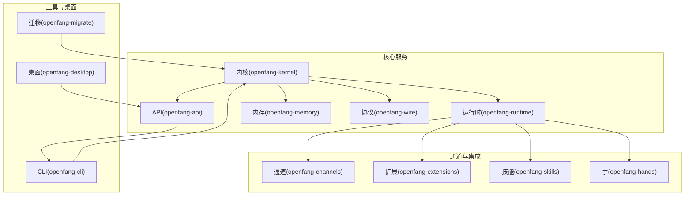
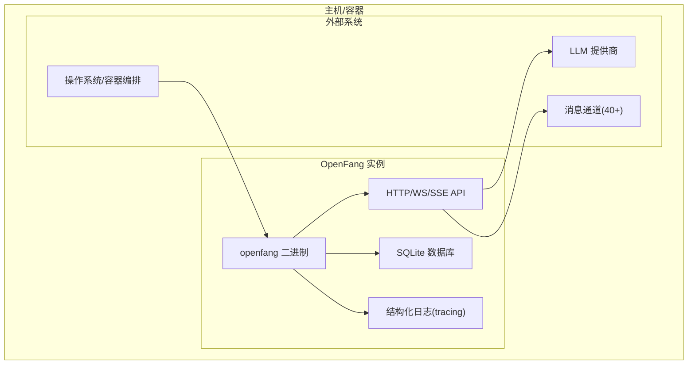
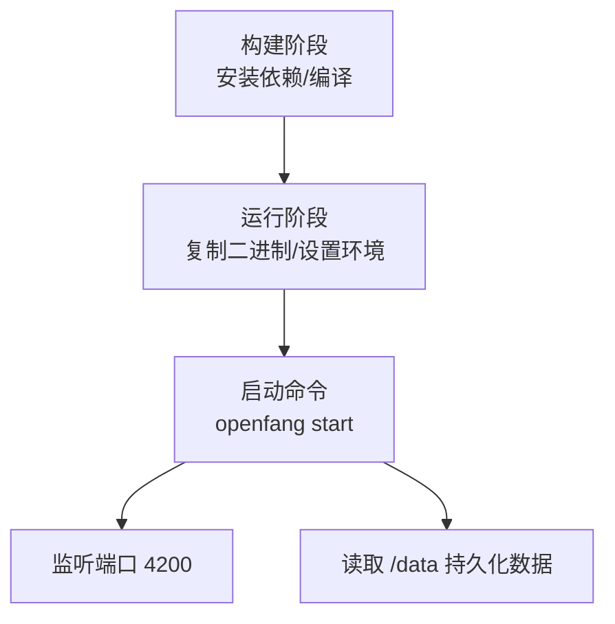
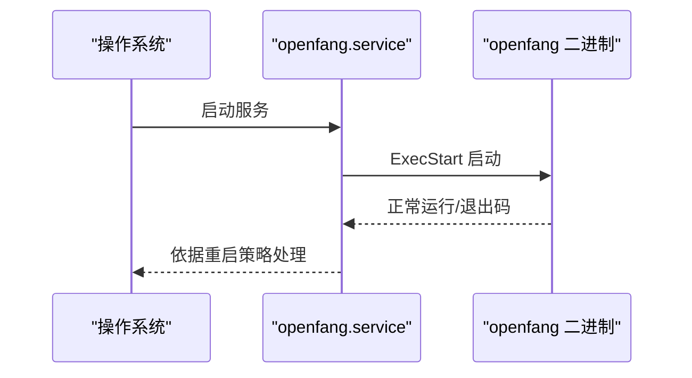
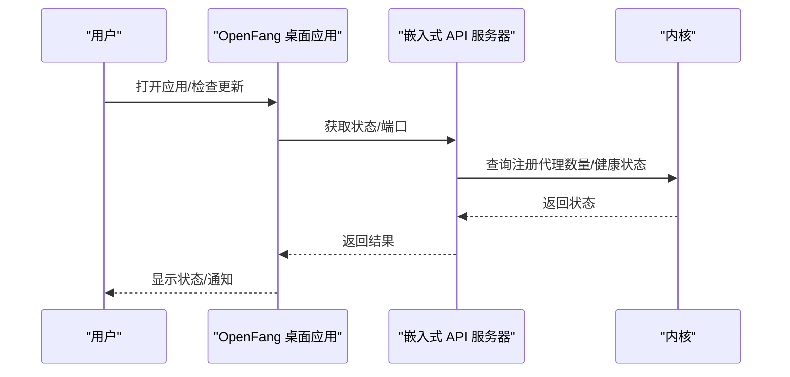
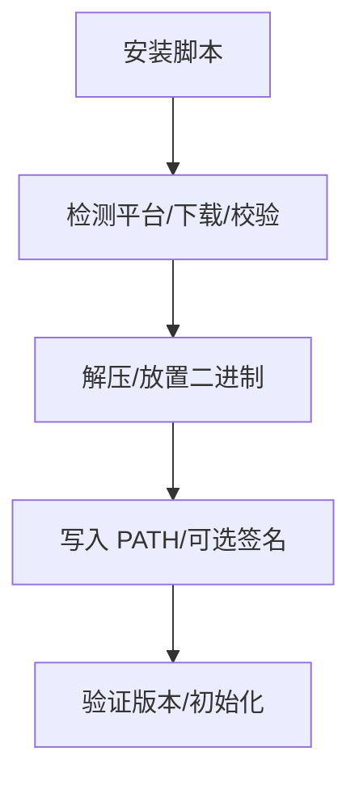
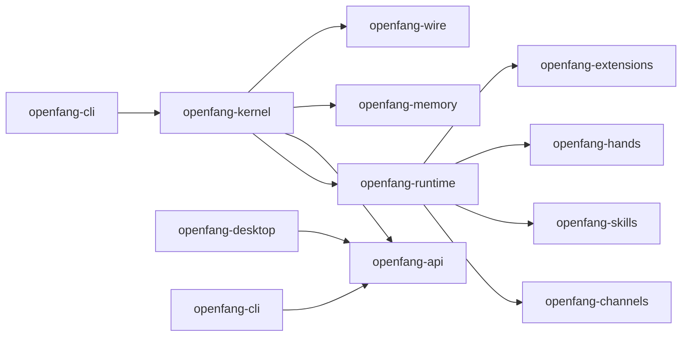

# 部署和运维

<cite>
**本文引用的文件**
- [README.md](file://README.md)
- [Dockerfile](file://Dockerfile)
- [docker-compose.yml](file://docker-compose.yml)
- [openfang.toml.example](file://openfang.toml.example)
- [deploy/openfang.service](file://deploy/openfang.service)
- [scripts/docker/install-smoke.Dockerfile](file://scripts/docker/install-smoke.Dockerfile)
- [scripts/install.sh](file://scripts/install.sh)
- [scripts/install.ps1](file://scripts/install.ps1)
- [flake.nix](file://flake.nix)
- [rust-toolchain.toml](file://rust-toolchain.toml)
- [Cargo.toml](file://Cargo.toml)
- [docs/configuration.md](file://docs/configuration.md)
- [docs/production-checklist.md](file://docs/production-checklist.md)
- [docs/troubleshooting.md](file://docs/troubleshooting.md)
- [docs/security.md](file://docs/security.md)
- [docs/desktop.md](file://docs/desktop.md)
- [MIGRATION.md](file://MIGRATION.md)
</cite>

## 目录
1. [简介](#简介)
2. [项目结构](#项目结构)
3. [核心组件](#核心组件)
4. [架构总览](#架构总览)
5. [详细组件分析](#详细组件分析)
6. [依赖关系分析](#依赖关系分析)
7. [性能考虑](#性能考虑)
8. [故障排除指南](#故障排除指南)
9. [结论](#结论)
10. [附录](#附录)

## 简介
本运维文档面向 OpenFang 的生产部署与日常运维，覆盖生产环境配置、性能优化、监控与日志管理、Docker 部署与容器编排、负载均衡与高可用、系统监控指标与告警、性能基准测试、故障排除与应急响应、备份与恢复、数据迁移与版本升级、运维自动化与 CI/CD、安全加固、桌面应用部署与用户权限、最佳实践与容量规划等内容。读者可据此在生产环境中稳定运行 OpenFang，并实现可观测性与可维护性。

## 项目结构
OpenFang 是一个由 14 个 Rust crate 组成的模块化操作系统，包含内核、运行时、API、通道适配器、内存、类型系统、技能、手（自主能力包）、扩展、MCP/A2A 协议、CLI、桌面应用与迁移工具等。其核心二进制为单一可执行文件，支持本地安装、Docker 容器与桌面应用三种主要部署形态。

图表来源
- [Cargo.toml:1-162](file://Cargo.toml#L1-L162)

章节来源
- [Cargo.toml:1-162](file://Cargo.toml#L1-L162)
- [README.md:231-250](file://README.md#L231-L250)

## 核心组件
- 内核：编排、工作流、计量、RBAC、调度、预算跟踪
- 运行时：代理循环、LLM 驱动、53+ 工具、WASM 沙箱、MCP、A2A
- API：140+ REST/WS/SSE 接口、OpenAI 兼容接口、仪表盘
- 通道：40 种消息平台适配器（Telegram、Discord、Slack、WhatsApp、Signal、Matrix、Email 等）
- 内存：SQLite 持久化、向量嵌入、会话合并
- 类型与安全：核心类型、污点追踪、Ed25519 签名、模型目录
- 技能与手：60+ 技能、FangHub 市场、7 个自主手（Hands）
- 扩展：25+ MCP 模板、AES-256-GCM 凭证保险库、OAuth2 PKCE
- 协议：OFP 对等网络协议（HMAC-SHA256 互认证）
- CLI 与桌面：守护进程管理、TUI 仪表盘、MCP 服务器模式、Tauri 2.0 桌面应用
- 迁移：从 OpenClaw、LangChain、AutoGPT 的迁移引擎

章节来源
- [README.md:231-250](file://README.md#L231-L250)
- [docs/configuration.md:1-800](file://docs/configuration.md#L1-L800)

## 架构总览
OpenFang 的生产部署通常采用“单二进制 + 外部依赖”的模式：核心二进制通过 CLI 或 systemd 启动，内置 API 服务监听端口；通道适配器负责与外部平台通信；内存使用 SQLite 存储；桌面应用作为本地包装器，复用同一内核与 API。

图表来源
- [Dockerfile:1-35](file://Dockerfile#L1-L35)
- [docker-compose.yml:1-26](file://docker-compose.yml#L1-L26)
- [docs/configuration.md:29-45](file://docs/configuration.md#L29-L45)

章节来源
- [Dockerfile:1-35](file://Dockerfile#L1-L35)
- [docker-compose.yml:1-26](file://docker-compose.yml#L1-L26)
- [docs/configuration.md:29-45](file://docs/configuration.md#L29-L45)

## 详细组件分析

### 生产环境配置
- 配置文件位置与默认行为：配置位于用户家目录下的专用目录，未设置时使用默认值；敏感字段不直接写入配置文件，而是通过环境变量注入。
- 关键配置项：
  - 默认模型与回退模型
  - 内存与向量嵌入
  - 网络（OFP）与 API 认证
  - Web 搜索与抓取参数
  - MCP 服务器与 A2A 协议
  - 用户与通道适配器（40+ 平台）
- 环境变量：通过环境变量注入 API 密钥、令牌与端口绑定等敏感信息，避免硬编码。

章节来源
- [docs/configuration.md:29-45](file://docs/configuration.md#L29-L45)
- [docs/configuration.md:75-216](file://docs/configuration.md#L75-L216)
- [openfang.toml.example:1-49](file://openfang.toml.example#L1-L49)

### Docker 部署与容器编排
- 单阶段构建：基于官方 Rust 镜像构建，安装必要系统依赖后编译二进制。
- 多阶段镜像：最终镜像仅包含运行所需的二进制与少量运行时依赖。
- 端口暴露与卷挂载：容器暴露 API 端口，数据持久化到 /data；通过环境变量注入提供商密钥。
- docker-compose 示例：映射端口、挂载数据卷、注入环境变量、重启策略。

图表来源
- [Dockerfile:1-35](file://Dockerfile#L1-L35)
- [docker-compose.yml:7-22](file://docker-compose.yml#L7-L22)

章节来源
- [Dockerfile:1-35](file://Dockerfile#L1-L35)
- [docker-compose.yml:1-26](file://docker-compose.yml#L1-L26)

### systemd 服务与高可用
- 服务单元：simple 类型，独立用户与组，限制资源，启用重启策略。
- 安全强化：NoNewPrivileges、ProtectSystem、ProtectHome、PrivateTmp、RestrictSUIDSGID、限制文件描述符与进程数。
- 数据目录：/var/lib/openfang，工作目录与环境文件分离。

图表来源
- [deploy/openfang.service:7-35](file://deploy/openfang.service#L7-L35)

章节来源
- [deploy/openfang.service:1-39](file://deploy/openfang.service#L1-L39)

### 桌面应用部署与用户管理
- 桌面应用：Tauri 2.0 包装，嵌入式本地 API 服务器，系统托盘、通知、自动更新、快捷键。
- 用户与权限：默认能力集限定窗口与插件权限；通过 IPC 命令与内核交互；支持开机自启与隐藏到托盘。
- 自动更新：基于签名公钥与 GitHub Releases 的 latest.json；支持被动安装。

图表来源
- [docs/desktop.md:11-80](file://docs/desktop.md#L11-L80)
- [docs/desktop.md:152-221](file://docs/desktop.md#L152-L221)

章节来源
- [docs/desktop.md:1-413](file://docs/desktop.md#L1-L413)

### 安装脚本与发布流水线
- Linux/macOS 安装脚本：检测平台、下载发布包、校验 SHA256、添加到 PATH、可选 macOS ad-hoc 签名。
- Windows 安装脚本：PowerShell 版本，下载与校验、路径注入、错误处理。
- 发布检查清单：生成 Tauri 签名密钥对、配置公钥、设置 GitHub Secrets、图标资产、域名与安装脚本托管、验证 Dockerfile 与安装脚本、变更日志、打标签与推送、发布后验证。

图表来源
- [scripts/install.sh:14-39](file://scripts/install.sh#L14-L39)
- [scripts/install.sh:65-107](file://scripts/install.sh#L65-L107)
- [scripts/install.ps1:22-60](file://scripts/install.ps1#L22-L60)
- [scripts/docker/install-smoke.Dockerfile:1-56](file://scripts/docker/install-smoke.Dockerfile#L1-L56)

章节来源
- [scripts/install.sh:1-197](file://scripts/install.sh#L1-L197)
- [scripts/install.ps1:1-192](file://scripts/install.ps1#L1-L192)
- [docs/production-checklist.md:1-299](file://docs/production-checklist.md#L1-L299)

### 性能优化与基准
- 编译配置：启用 LTO、减少 codegen units、strip、opt-level 优化；Nix flake 提供一致构建环境。
- 运行时优化：会话压缩阈值、保留最近消息数、最大摘要 token 数；内存衰减率；Web 抓取超时与缓存 TTL。
- 启动与冷启动：单二进制、内核热身、通道适配器延迟加载；数据库大小与索引影响启动时间。
- 资源限制：systemd 限制文件句柄与进程数；容器资源限制；桌面应用单实例与隐藏到托盘降低资源占用。

章节来源
- [Cargo.toml:150-162](file://Cargo.toml#L150-L162)
- [flake.nix:14-51](file://flake.nix#L14-L51)
- [docs/configuration.md:277-295](file://docs/configuration.md#L277-L295)
- [docs/configuration.md:321-411](file://docs/configuration.md#L321-L411)

### 监控与日志管理
- 日志框架：tracing + tracing-subscriber，支持 JSON 输出与环境过滤。
- 日志级别：通过环境变量控制全局或特定模块日志级别；默认 info。
- 健康检查：/api/health 与 /api/health/detail（需要认证）。
- 结构化输出：便于对接 ELK、Promtail、Loki 等日志栈。

章节来源
- [docs/troubleshooting.md:49-58](file://docs/troubleshooting.md#L49-L58)
- [docs/troubleshooting.md:42-47](file://docs/troubleshooting.md#L42-L47)
- [Cargo.toml:46-47](file://Cargo.toml#L46-L47)

### 安全加固
- 能力模型：工具、内存、网络、Shell、Agent 交互等细粒度授权；继承约束防止提权。
- WASM 双重计量：指令计数燃料与墙钟 epoch 中断，双重防护。
- Merkle 审计链：不可篡改审计日志，链完整性校验。
- 污点追踪：标签传播与显式降级，阻断敏感数据流向危险汇点。
- Ed25519 清单签名：防止供应链攻击。
- SSRF 防护：Scheme 白名单、主机黑名单、私有 IP 拦截、DNS 解析后 IP 校验。
- 秘钥零化：Zeroizing<String> 在作用域结束时清空内存。
- OFP 互认证：HMAC-SHA256 + 随机 nonce，常时比较防侧信道。
- 安全头：CSP、X-Frame-Options、HSTS、X-Content-Type-Options。
- GCRA 速率限制：按 IP 与令牌桶限流，带过期清理。
- 路径遍历防护：规范化与符号链接逃逸检测。
- 子进程沙箱：env_clear + 变量白名单、跨平台进程树隔离。
- 循环保护：SHA256 工具调用指纹检测与断路器。
- 会话修复：消息历史校验与自动恢复。
- 健康端点脱敏：公开健康检查返回最小信息，详细诊断需认证。

章节来源
- [docs/security.md:1-800](file://docs/security.md#L1-L800)

### 备份与恢复、数据迁移、版本升级
- 备份范围：配置文件、SQLite 数据库、技能目录。
- 迁移：从 OpenClaw 的一键迁移，自动转换配置、代理、记忆、通道导入报告；技能需重新安装。
- 版本升级：安装脚本拉取最新版本；Docker 使用 ghcr.io 镜像；桌面应用自动更新。
- 回滚：保留旧版本二进制与数据目录，systemd 与 docker-compose 支持切换镜像/二进制。

章节来源
- [docs/troubleshooting.md:484-496](file://docs/troubleshooting.md#L484-L496)
- [MIGRATION.md:17-40](file://MIGRATION.md#L17-L40)
- [MIGRATION.md:52-77](file://MIGRATION.md#L52-L77)
- [docs/production-checklist.md:226-276](file://docs/production-checklist.md#L226-L276)

### 运维自动化与 CI/CD
- 发布流水线：签发 Tauri 密钥对、配置公钥、设置 GitHub Secrets、多目标打包、生成 latest.json、推送镜像。
- 安装脚本验证：语法检查、平台检测、目标匹配校验、可选完整安装验证。
- Docker 构建验证：构建镜像、运行版本查询、端口可达性、数据卷持久化。

章节来源
- [docs/production-checklist.md:1-299](file://docs/production-checklist.md#L1-L299)
- [scripts/docker/install-smoke.Dockerfile:1-56](file://scripts/docker/install-smoke.Dockerfile#L1-L56)
- [Dockerfile:16-35](file://Dockerfile#L16-L35)

## 依赖关系分析

图表来源
- [Cargo.toml:1-17](file://Cargo.toml#L1-L17)

章节来源
- [Cargo.toml:1-17](file://Cargo.toml#L1-L17)

## 性能考虑
- 启动时间：<200ms 冷启动（内核），通道适配器启动会增加约 1-2s。
- 内存使用：默认 SQLite 数据库与向量嵌入，可通过会话压缩与阈值调整降低内存占用。
- CPU 使用：WASM 沙箱燃料限制与 epoch 中断防止 CPU 滥用；并发代理数量与工具链复杂度影响 CPU。
- I/O 与网络：通道适配器指数退避重连；Web 抓取超时与缓存 TTL 控制网络负载。
- 数据库：定期清理旧会话与压缩，避免数据库膨胀影响启动与查询性能。

章节来源
- [docs/troubleshooting.md:426-442](file://docs/troubleshooting.md#L426-L442)
- [docs/configuration.md:277-295](file://docs/configuration.md#L277-L295)
- [docs/configuration.md:395-411](file://docs/configuration.md#L395-L411)

## 故障排除指南
- 快速诊断：doctor 命令检查配置、API 密钥、数据库、守护进程状态、端口占用、工具依赖。
- 守护进程状态：status 命令查看运行状态。
- 健康检查：/api/health 与 /api/health/detail（需要认证）。
- 日志级别：通过 RUST_LOG 设置调试级别，定向模块日志。
- 安装问题：工具链版本、系统依赖、PATH 注入；Docker 容器缺少 API 密钥或端口冲突。
- 配置问题：缺失 API 密钥、端口被占用、TOML 语法错误；使用 config show 校验。
- LLM 问题：认证失败、速率限制、模型别名与可用模型列表；本地模型需确保服务运行。
- 通道问题：令牌缺失或错误、端口占用、公网可达性、平台回调 URL 与验证令牌。
- API 问题：401 未授权、429 速率限制、CORS、WebSocket 断开；检查 Bearer Token、CORS 配置与重连逻辑。
- 桌面应用：单实例限制、托盘图标缺失、白屏等待；检查内核是否启动完成。
- 性能问题：高内存/高 CPU 时，减少并发代理、启用会话压缩、使用小模型、清理旧会话。

章节来源
- [docs/troubleshooting.md:20-58](file://docs/troubleshooting.md#L20-L58)
- [docs/troubleshooting.md:61-98](file://docs/troubleshooting.md#L61-L98)
- [docs/troubleshooting.md:100-153](file://docs/troubleshooting.md#L100-L153)
- [docs/troubleshooting.md:156-230](file://docs/troubleshooting.md#L156-L230)
- [docs/troubleshooting.md:232-277](file://docs/troubleshooting.md#L232-L277)
- [docs/troubleshooting.md:342-390](file://docs/troubleshooting.md#L342-L390)
- [docs/troubleshooting.md:392-414](file://docs/troubleshooting.md#L392-L414)
- [docs/troubleshooting.md:416-442](file://docs/troubleshooting.md#L416-L442)

## 结论
OpenFang 以“单二进制 + 模块化内核”为核心，结合强大的安全体系、可观测性与自动化工具，适合在生产环境中进行高可靠、可扩展的部署。通过合理的配置、容器化与 systemd 编排、完善的日志与监控、严格的安全部署与更新流程，可实现稳定、安全且易于维护的 Agent OS 运维体系。

## 附录

### 系统监控指标与告警建议
- 指标采集
  - 进程：CPU 使用率、内存 RSS、打开文件描述符数、上下文切换
  - 网络：连接数、入/出站字节、错误数
  - 应用：API 请求速率、成功率、P95/P99 延迟、速率限制触发次数
  - 数据库：SQLite 查询耗时、锁等待、页命中率
  - 通道：各平台连接状态、消息处理速率、错误率
  - 日志：错误/警告级别日志条数
- 告警规则示例
  - API 错误率超过阈值持续 5 分钟
  - 速率限制触发频率异常上升
  - 数据库锁等待持续超过阈值
  - 通道断连或错误率异常
  - 系统资源接近上限（CPU/内存/磁盘/FD）

章节来源
- [docs/troubleshooting.md:416-442](file://docs/troubleshooting.md#L416-L442)

### 负载均衡与高可用
- 多实例：通过不同端口或容器运行多个 OpenFang 实例，配合反向代理（如 Nginx/Caddy）进行健康检查与轮询。
- 会话一致性：使用共享存储（如 NFS/对象存储）或集中式数据库（需评估性能与一致性）。
- 健康检查：使用 /api/health 与 /api/health/detail（认证）进行探活。
- 灰度与蓝绿：CI/CD 流水线支持镜像版本管理与滚动更新。

章节来源
- [docs/troubleshooting.md:42-47](file://docs/troubleshooting.md#L42-L47)
- [docs/production-checklist.md:247-254](file://docs/production-checklist.md#L247-L254)

### 性能基准测试
- 基准来源：README 中提供了与其他框架的冷启动、空闲内存、安装体积与安全系统对比。
- 建议场景：并发代理数、工具链复杂度、Web 抓取与搜索、会话长度与压缩阈值、通道适配器数量。
- 工具：wrk、ab、JMeter 或自定义 Rust 基准测试脚本。

章节来源
- [README.md:117-186](file://README.md#L117-L186)

### 应急响应流程
- 事件分类：认证失败、速率限制、通道断连、数据库异常、代理循环、崩溃与 panic。
- 处置步骤：快速定位日志、临时降级（关闭高风险通道/代理）、回滚到上一稳定版本、扩容或隔离实例。
- 沟通与记录：变更日志、根因分析、改进措施与演练计划。

章节来源
- [docs/troubleshooting.md:282-297](file://docs/troubleshooting.md#L282-L297)
- [docs/security.md:1-60](file://docs/security.md#L1-L60)

### 运维最佳实践
- 配置管理：集中化环境变量与密钥管理（Vault/KMS），禁用明文配置。
- 安全基线：systemd 与容器安全强化、最小权限原则、网络隔离与出站策略。
- 观测性：结构化日志、指标与分布式追踪、告警分级与值班流程。
- 自动化：CI/CD、安装脚本与 Dockerfile 验证、发布检查清单。
- 成本优化：合理选择提供商与模型、资源配额与限制、按需弹性与缓存策略。

章节来源
- [docs/production-checklist.md:1-80](file://docs/production-checklist.md#L1-L80)
- [docs/security.md:36-60](file://docs/security.md#L36-L60)