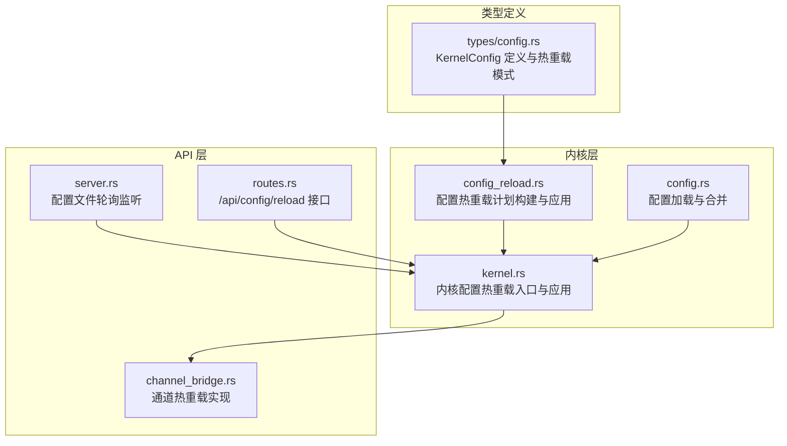
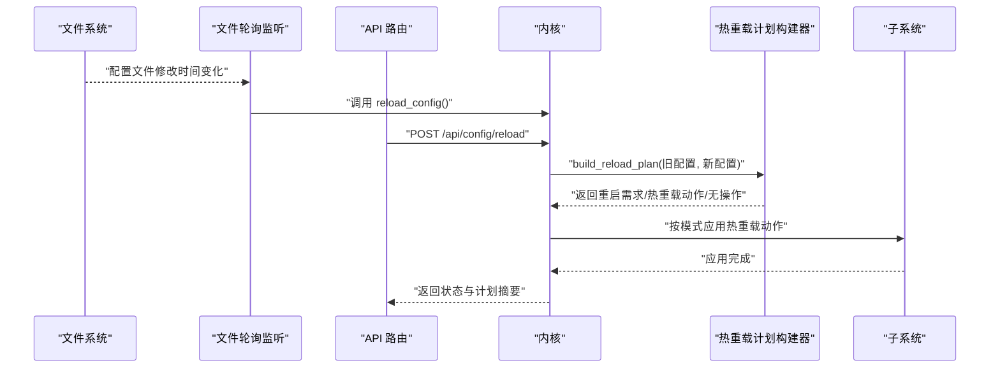
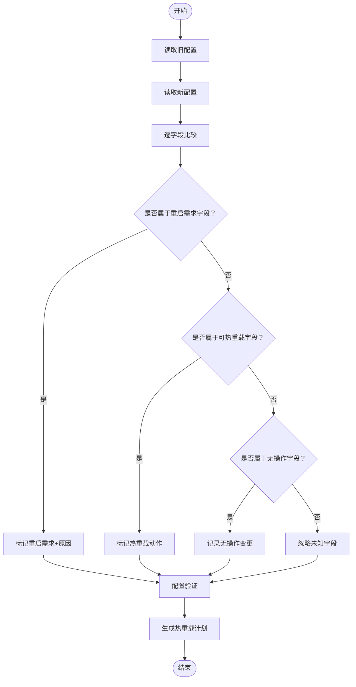
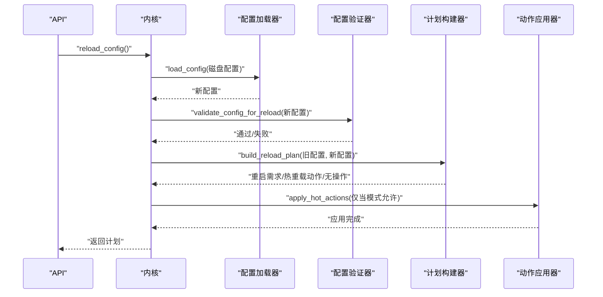
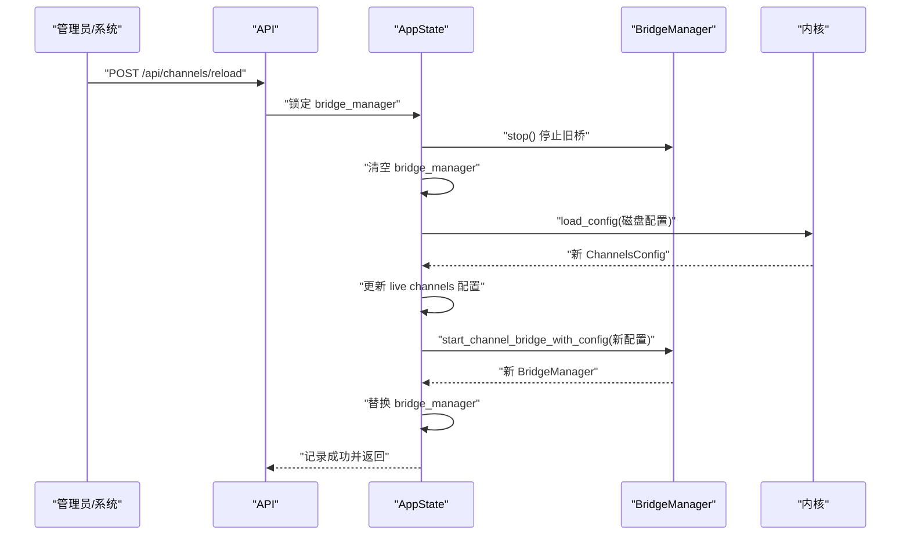
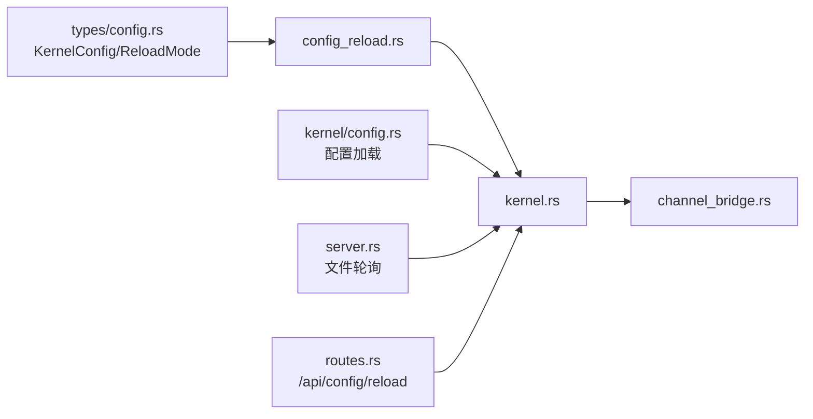

# 热重载机制

<cite>
**本文档引用的文件**
- [config_reload.rs](file://crates/openfang-kernel/src/config_reload.rs)
- [kernel.rs](file://crates/openfang-kernel/src/kernel.rs)
- [config.rs](file://crates/openfang-kernel/src/config.rs)
- [config.rs](file://crates/openfang-types/src/config.rs)
- [server.rs](file://crates/openfang-api/src/server.rs)
- [routes.rs](file://crates/openfang-api/src/routes.rs)
- [channel_bridge.rs](file://crates/openfang-api/src/channel_bridge.rs)
</cite>

## 目录
1. [简介](#简介)
2. [项目结构](#项目结构)
3. [核心组件](#核心组件)
4. [架构概览](#架构概览)
5. [详细组件分析](#详细组件分析)
6. [依赖分析](#依赖分析)
7. [性能考虑](#性能考虑)
8. [故障排除指南](#故障排除指南)
9. [结论](#结论)

## 简介
本文件详细阐述 OpenFang 的配置热重载机制，涵盖工作原理、触发条件、更新流程、支持与不支持的配置类别、实现机制（文件监控、增量更新、原子切换）、安全考虑（配置验证、回滚机制、错误处理）、最佳实践以及故障排除指南。热重载旨在实现运行时配置的动态更新，尽量减少停机时间并保持系统稳定性。

## 项目结构
OpenFang 的热重载功能由内核模块负责配置差异分析与应用，API 层提供手动触发与自动轮询，通道桥接层支持通道配置的热重载。

**图表来源**
- [config_reload.rs:1-680](file://crates/openfang-kernel/src/config_reload.rs#L1-L680)
- [kernel.rs:3528-3613](file://crates/openfang-kernel/src/kernel.rs#L3528-L3613)
- [config.rs:1-458](file://crates/openfang-kernel/src/config.rs#L1-L458)
- [config.rs:962-1102](file://crates/openfang-types/src/config.rs#L962-L1102)
- [server.rs:728-757](file://crates/openfang-api/src/server.rs#L728-L757)
- [routes.rs:9596-9636](file://crates/openfang-api/src/routes.rs#L9596-L9636)
- [channel_bridge.rs:1761-1827](file://crates/openfang-api/src/channel_bridge.rs#L1761-L1827)

**章节来源**
- [config_reload.rs:1-680](file://crates/openfang-kernel/src/config_reload.rs#L1-L680)
- [kernel.rs:3528-3613](file://crates/openfang-kernel/src/kernel.rs#L3528-L3613)
- [config.rs:1-458](file://crates/openfang-kernel/src/config.rs#L1-L458)
- [config.rs:962-1102](file://crates/openfang-types/src/config.rs#L962-L1102)
- [server.rs:728-757](file://crates/openfang-api/src/server.rs#L728-L757)
- [routes.rs:9596-9636](file://crates/openfang-api/src/routes.rs#L9596-L9636)
- [channel_bridge.rs:1761-1827](file://crates/openfang-api/src/channel_bridge.rs#L1761-L1827)

## 核心组件
- 配置热重载计划构建器：比较新旧配置，生成重启需求、可热重载动作与无操作变更的分类计划。
- 内核热重载入口：读取磁盘配置、校验、构建计划、按模式应用热重载动作。
- 文件监控轮询：定期检查配置文件修改时间，自动触发热重载。
- API 触发接口：提供手动触发热重载的 REST 接口，并记录审计日志。
- 通道热重载：停止旧桥接、重新读取配置、启动新桥接，实现通道配置的原子切换。

**章节来源**
- [config_reload.rs:115-267](file://crates/openfang-kernel/src/config_reload.rs#L115-L267)
- [kernel.rs:3528-3613](file://crates/openfang-kernel/src/kernel.rs#L3528-L3613)
- [server.rs:728-757](file://crates/openfang-api/src/server.rs#L728-L757)
- [routes.rs:9596-9636](file://crates/openfang-api/src/routes.rs#L9596-L9636)
- [channel_bridge.rs:1761-1827](file://crates/openfang-api/src/channel_bridge.rs#L1761-L1827)

## 架构概览
热重载的整体流程包括：配置文件变更检测、读取与解析、差异分析、验证、按模式应用热重载动作、记录审计日志与返回结果。

**图表来源**
- [server.rs:728-757](file://crates/openfang-api/src/server.rs#L728-L757)
- [routes.rs:9596-9636](file://crates/openfang-api/src/routes.rs#L9596-L9636)
- [kernel.rs:3528-3613](file://crates/openfang-kernel/src/kernel.rs#L3528-L3613)
- [config_reload.rs:115-267](file://crates/openfang-kernel/src/config_reload.rs#L115-L267)

## 详细组件分析

### 配置热重载计划构建器
- 功能：对比旧配置与新配置，识别重启需求字段、可热重载字段与无操作字段，输出分类计划。
- 关键点：
  - 重启需求字段：如监听地址、API 密钥、网络开关与网络配置、内存配置、家目录与数据目录、保险库配置等。
  - 可热重载字段：如通道配置、使用统计页脚模式、Web 工具配置、浏览器配置、审批策略、Cron 最大任务数、Webhook 触发器配置、扩展配置、MCP 服务器列表、A2A 配置、回退提供商链、提供商基础 URL 覆盖、默认模型等。
  - 无操作字段：如日志级别、语言、内核模式等。
- 验证：在应用前对新配置进行基本校验，确保关键字段有效。
- 模式控制：根据配置的热重载模式决定是否应用热重载动作。

**图表来源**
- [config_reload.rs:115-267](file://crates/openfang-kernel/src/config_reload.rs#L115-L267)
- [config_reload.rs:277-303](file://crates/openfang-kernel/src/config_reload.rs#L277-L303)
- [config_reload.rs:313-320](file://crates/openfang-kernel/src/config_reload.rs#L313-L320)

**章节来源**
- [config_reload.rs:115-267](file://crates/openfang-kernel/src/config_reload.rs#L115-L267)
- [config_reload.rs:277-303](file://crates/openfang-kernel/src/config_reload.rs#L277-L303)
- [config_reload.rs:313-320](file://crates/openfang-kernel/src/config_reload.rs#L313-L320)

### 内核热重载入口与应用
- 入口：从内核中导出的 reload_config 方法，负责读取磁盘配置、校验、构建计划并按模式应用热重载动作。
- 应用：当前已实现的热重载动作包括：更新审批策略、调整 Cron 最大任务数、应用提供商 URL 覆盖、更新默认模型覆盖。其他动作（如通道、Web、浏览器、扩展等）被记录但暂未自动应用，需等待相应子系统成熟。
- 返回：返回热重载计划，供 API 层展示状态与摘要。

**图表来源**
- [kernel.rs:3528-3613](file://crates/openfang-kernel/src/kernel.rs#L3528-L3613)
- [config_reload.rs:277-303](file://crates/openfang-kernel/src/config_reload.rs#L277-L303)
- [config_reload.rs:115-267](file://crates/openfang-kernel/src/config_reload.rs#L115-L267)

**章节来源**
- [kernel.rs:3528-3613](file://crates/openfang-kernel/src/kernel.rs#L3528-L3613)

### 文件监控与自动触发
- 轮询监听：API 服务器启动后，启动一个后台任务每 30 秒检查配置文件的最后修改时间，若发生变化则触发热重载。
- 原子性：轮询本身不保证文件写入的原子性，但热重载过程通过一次性读取完整配置并应用，避免部分写入导致的不一致。

**章节来源**
- [server.rs:728-757](file://crates/openfang-api/src/server.rs#L728-L757)

### API 触发与审计
- 手动触发：提供 /api/config/reload 接口，支持手动触发热重载。
- 审计记录：每次热重载请求都会记录到审计日志，便于追踪与合规。
- 返回内容：包含状态（无变更/已应用/部分应用/错误）、重启需求与原因、已应用的热重载动作、无操作变更等。

**章节来源**
- [routes.rs:9596-9636](file://crates/openfang-api/src/routes.rs#L9596-L9636)

### 通道热重载实现
- 停止旧桥：先停止现有的通道桥接管理器。
- 重新读取配置：从磁盘重新加载最新配置。
- 启动新桥：基于新配置启动新的通道桥接。
- 原子切换：替换 AppState 中的桥接管理器，确保服务切换的原子性。
- 结果反馈：记录启动成功的通道数量与名称。

**图表来源**
- [channel_bridge.rs:1761-1827](file://crates/openfang-api/src/channel_bridge.rs#L1761-L1827)
- [channel_bridge.rs:1066-1068](file://crates/openfang-api/src/channel_bridge.rs#L1066-L1068)

**章节来源**
- [channel_bridge.rs:1761-1827](file://crates/openfang-api/src/channel_bridge.rs#L1761-L1827)
- [channel_bridge.rs:1066-1068](file://crates/openfang-api/src/channel_bridge.rs#L1066-L1068)

## 依赖分析
- 类型依赖：KernelConfig 定义了所有可热重载与不可热重载的字段，ReloadMode 控制热重载行为。
- 运行时依赖：内核在应用热重载动作时依赖各子系统的可变状态或可替换组件（如审批管理器、Cron 调度器、模型目录、默认模型覆盖等）。
- 外部依赖：API 层依赖文件系统元数据用于轮询检测；通道热重载依赖外部平台的令牌环境变量。

**图表来源**
- [config.rs:962-1102](file://crates/openfang-types/src/config.rs#L962-L1102)
- [config_reload.rs:1-680](file://crates/openfang-kernel/src/config_reload.rs#L1-L680)
- [kernel.rs:3528-3613](file://crates/openfang-kernel/src/kernel.rs#L3528-L3613)
- [config.rs:1-458](file://crates/openfang-kernel/src/config.rs#L1-L458)
- [server.rs:728-757](file://crates/openfang-api/src/server.rs#L728-L757)
- [routes.rs:9596-9636](file://crates/openfang-api/src/routes.rs#L9596-L9636)
- [channel_bridge.rs:1761-1827](file://crates/openfang-api/src/channel_bridge.rs#L1761-L1827)

**章节来源**
- [config.rs:962-1102](file://crates/openfang-types/src/config.rs#L962-L1102)
- [config_reload.rs:1-680](file://crates/openfang-kernel/src/config_reload.rs#L1-L680)
- [kernel.rs:3528-3613](file://crates/openfang-kernel/src/kernel.rs#L3528-L3613)
- [config.rs:1-458](file://crates/openfang-kernel/src/config.rs#L1-L458)
- [server.rs:728-757](file://crates/openfang-api/src/server.rs#L728-L757)
- [routes.rs:9596-9636](file://crates/openfang-api/src/routes.rs#L9596-L9636)
- [channel_bridge.rs:1761-1827](file://crates/openfang-api/src/channel_bridge.rs#L1761-L1827)

## 性能考虑
- 轮询间隔：当前采用固定 30 秒轮询，可在高变更频率场景下增加开销。建议结合文件系统事件（如 inotify）优化，或引入可配置的轮询间隔。
- 序列化比较：字段变更比较通过 JSON 序列化进行，复杂嵌套结构可能带来额外开销。建议对热点字段采用更高效的比较策略。
- 并发安全：热重载过程中涉及锁保护的状态更新（如桥接管理器），应避免长时间持有锁，必要时采用双缓冲或不可变快照策略。
- 子系统重建成本：通道等子系统的重建成本较高，建议在批量变更时合并多次热重载，减少重复初始化。

## 故障排除指南
- 热重载失败：
  - 检查配置文件语法与字段有效性（如监听地址非空、最大 Cron 任务数合理、网络启用时共享密钥非空）。
  - 查看内核日志中的重启原因与热重载动作摘要，定位具体失败字段。
  - 若为通道相关失败，检查对应平台的令牌环境变量是否正确设置。
- 自动轮询无效：
  - 确认配置文件路径与权限正确，轮询任务是否仍在运行。
  - 检查文件系统事件支持与权限限制。
- 审计与可观测性：
  - 通过 /api/config/reload 接口返回的计划摘要了解变更范围。
  - 在审计日志中查找热重载请求的时间线与状态。

**章节来源**
- [config_reload.rs:277-303](file://crates/openfang-kernel/src/config_reload.rs#L277-L303)
- [routes.rs:9596-9636](file://crates/openfang-api/src/routes.rs#L9596-L9636)
- [server.rs:728-757](file://crates/openfang-api/src/server.rs#L728-L757)

## 结论
OpenFang 的热重载机制通过“差异分析 + 模式控制 + 子系统应用”的方式，在保证系统稳定性的前提下实现了大部分运行时配置的动态更新。通道热重载提供了原子切换能力，API 层支持手动与自动两种触发方式。未来可进一步优化文件监控、减少序列化开销、完善子系统自动应用与回滚机制，以提升热重载的可靠性与性能。