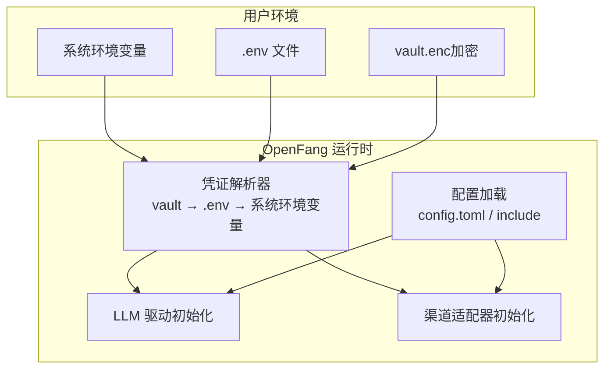
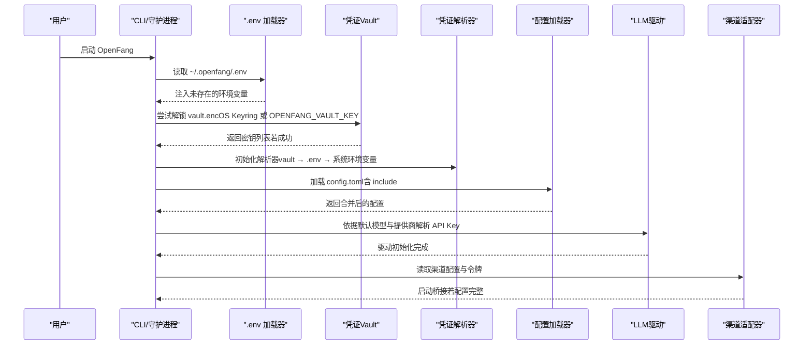
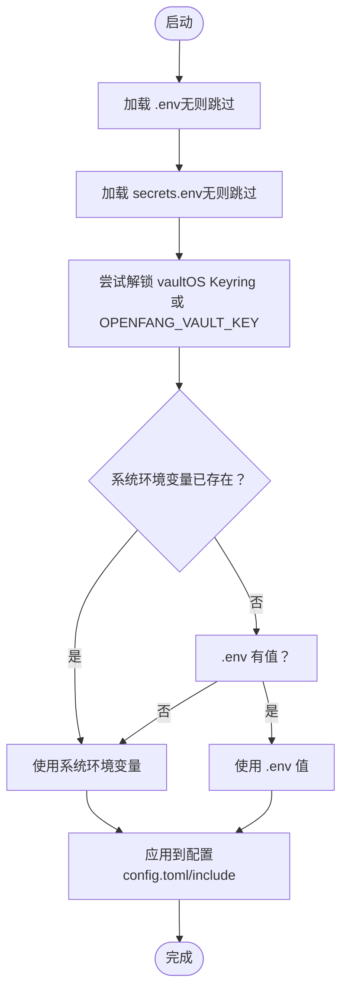
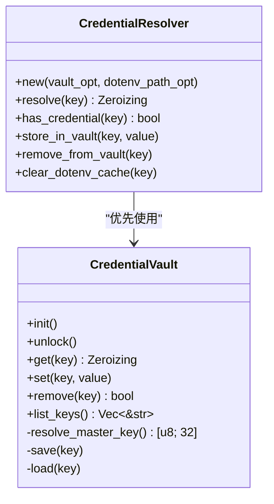
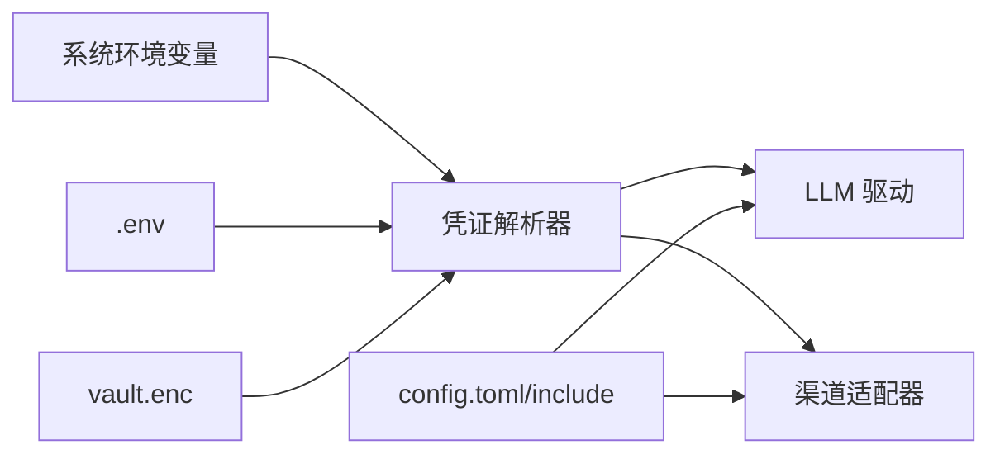

# 环境变量配置

<cite>
**本文引用的文件**
- [openfang.toml.example](file://openfang.toml.example)
- [dotenv.rs](file://crates/openfang-cli/src/dotenv.rs)
- [credentials.rs](file://crates/openfang-extensions/src/credentials.rs)
- [vault.rs](file://crates/openfang-extensions/src/vault.rs)
- [kernel.rs](file://crates/openfang-kernel/src/kernel.rs)
- [routes.rs](file://crates/openfang-api/src/routes.rs)
- [channel_bridge.rs](file://crates/openfang-api/src/channel_bridge.rs)
- [mod.rs](file://crates/openfang-runtime/src/drivers/mod.rs)
- [model_catalog.rs](file://crates/openfang-runtime/src/model_catalog.rs)
- [init_wizard.rs](file://crates/openfang-cli/src/tui/screens/init_wizard.rs)
- [README.md](file://README.md)
- [main.rs](file://crates/openfang-cli/src/main.rs)
</cite>

## 目录
1. [简介](#简介)
2. [项目结构](#项目结构)
3. [核心组件](#核心组件)
4. [架构总览](#架构总览)
5. [详细组件分析](#详细组件分析)
6. [依赖关系分析](#依赖关系分析)
7. [性能考量](#性能考量)
8. [故障排查指南](#故障排查指南)
9. [结论](#结论)
10. [附录](#附录)

## 简介
本文件系统性梳理 OpenFang 的环境变量配置体系，涵盖命名规范、作用域、优先级、敏感信息处理（API 密钥、访问令牌、密码）、支持的环境变量清单（LLM 提供商密钥、渠道适配器配置、网络设置）、加载顺序与覆盖机制、默认值处理、最佳实践、多环境配置示例与安全指南，以及环境变量与配置文件的交互关系与冲突解决策略。

## 项目结构
- 配置文件：以 TOML 为主，示例位于 openfang.toml.example；运行时可热更新。
- 环境变量来源：
  - 系统环境变量（最高优先级）
  - 用户家目录下的 .env（次高优先级）
  - 秘密存储 vault（若存在且已解锁）
- 敏感信息通过 Credential Vault 加密存储，支持 OS Keyring 或 OPENFANG_VAULT_KEY 头等环境变量回退。

图表来源
- [dotenv.rs:22-32](file://crates/openfang-cli/src/dotenv.rs#L22-L32)
- [credentials.rs:118-174](file://crates/openfang-extensions/src/credentials.rs#L118-L174)
- [vault.rs:244-263](file://crates/openfang-extensions/src/vault.rs#L244-L263)
- [kernel.rs:569-589](file://crates/openfang-kernel/src/kernel.rs#L569-L589)

章节来源
- [openfang.toml.example:1-49](file://openfang.toml.example#L1-L49)
- [dotenv.rs:22-32](file://crates/openfang-cli/src/dotenv.rs#L22-L32)
- [credentials.rs:118-174](file://crates/openfang-extensions/src/credentials.rs#L118-L174)
- [vault.rs:244-263](file://crates/openfang-extensions/src/vault.rs#L244-L263)
- [kernel.rs:569-589](file://crates/openfang-kernel/src/kernel.rs#L569-L589)

## 核心组件
- 凭证解析器（CredentialResolver）
  - 解析顺序：vault（若可用）→ .env（若存在）→ 系统环境变量（最终优先）
  - 支持从 .env 中读取键值对，忽略注释与空行，自动去除首尾空白与引号
- Credential Vault
  - 使用 AES-256-GCM 加密存储，Argon2id 派生密钥
  - 主密钥来源：OS Keyring（Windows Credential Manager / macOS Keychain / Linux Secret Service）或 OPENFANG_VAULT_KEY 环境变量
  - 支持列出、新增、删除密钥，并在内存中使用 Zeroizing<String> 避免泄露
- 配置加载
  - config.toml 及 include 机制，支持相对路径、防穿越、循环检测与深度限制
- 渠道适配器
  - 通过环境变量注入令牌，API 层会检查必填字段是否已设置
- LLM 提供商
  - 默认模型与提供商映射，按约定环境变量加载 API Key

章节来源
- [credentials.rs:118-174](file://crates/openfang-extensions/src/credentials.rs#L118-L174)
- [vault.rs:244-263](file://crates/openfang-extensions/src/vault.rs#L244-L263)
- [dotenv.rs:22-32](file://crates/openfang-cli/src/dotenv.rs#L22-L32)
- [kernel.rs:569-589](file://crates/openfang-kernel/src/kernel.rs#L569-L589)
- [routes.rs:2505-2514](file://crates/openfang-api/src/routes.rs#L2505-L2514)
- [mod.rs:71-110](file://crates/openfang-runtime/src/drivers/mod.rs#L71-L110)

## 架构总览
下图展示环境变量与配置文件在启动阶段的交互流程，包括加载顺序、覆盖机制与默认值处理。

图表来源
- [dotenv.rs:22-32](file://crates/openfang-cli/src/dotenv.rs#L22-L32)
- [vault.rs:244-263](file://crates/openfang-extensions/src/vault.rs#L244-L263)
- [kernel.rs:569-589](file://crates/openfang-kernel/src/kernel.rs#L569-L589)
- [routes.rs:2505-2514](file://crates/openfang-api/src/routes.rs#L2505-L2514)
- [channel_bridge.rs:1056-1064](file://crates/openfang-api/src/channel_bridge.rs#L1056-L1064)

## 详细组件分析

### 命名规范与作用域
- 命名规范
  - 统一采用大写蛇形命名（如 OPENAI_API_KEY、TELEGRAM_BOT_TOKEN）
  - 渠道令牌通常以“平台名”+“令牌类型”组合（如 SLACK_BOT_TOKEN、SLACK_APP_TOKEN）
  - 网络与服务端口类变量采用“功能前缀”+“参数名”（如 OPENFANG_LISTEN、OPENFANG_API_KEY）
- 作用域
  - 系统环境变量：全局最高优先级，用于生产与容器环境
  - .env：用户本地覆盖，适合开发与测试
  - vault：仅在运行时解密读取，不暴露明文到进程外

章节来源
- [openfang.toml.example:8-49](file://openfang.toml.example#L8-L49)
- [init_wizard.rs:171-223](file://crates/openfang-cli/src/tui/screens/init_wizard.rs#L171-L223)

### 优先级与加载顺序
- 凭证解析优先级（LLM/渠道令牌）
  - vault（若存在且已解锁）→ .env（若存在）→ 系统环境变量（最终）
- .env 加载顺序
  - 先加载 ~/.openfang/.env，再加载 ~/.openfang/secrets.env
  - 系统环境变量不会被 .env 覆盖（仅在不存在时注入）
- 配置文件 include
  - config.toml 支持 include 数组，按顺序深合并，根配置覆盖 include 内容
  - 安全限制：拒绝绝对路径、路径穿越、循环 include、超出最大深度

图表来源
- [dotenv.rs:22-32](file://crates/openfang-cli/src/dotenv.rs#L22-L32)
- [credentials.rs:118-174](file://crates/openfang-extensions/src/credentials.rs#L118-L174)
- [vault.rs:244-263](file://crates/openfang-extensions/src/vault.rs#L244-L263)
- [kernel.rs:569-589](file://crates/openfang-kernel/src/kernel.rs#L569-L589)

章节来源
- [dotenv.rs:22-32](file://crates/openfang-cli/src/dotenv.rs#L22-L32)
- [kernel.rs:569-589](file://crates/openfang-kernel/src/kernel.rs#L569-L589)
- [config.rs:112-209](file://crates/openfang-kernel/src/config.rs#L112-L209)

### 敏感信息处理机制
- 存储
  - vault.enc 使用 AES-256-GCM 加密，密钥通过 Argon2id 派生
  - 主密钥来源：OS Keyring（推荐）或 OPENFANG_VAULT_KEY（CI/headless）
- 访问
  - 解锁后以零化字符串返回，避免常驻内存
  - CLI 提供 vault init/set/list/remove 等命令
- 传输
  - 通过解析器按优先级注入，不直接暴露明文到外部

图表来源
- [vault.rs:56-192](file://crates/openfang-extensions/src/vault.rs#L56-L192)
- [credentials.rs:118-146](file://crates/openfang-extensions/src/credentials.rs#L118-L146)

章节来源
- [vault.rs:244-263](file://crates/openfang-extensions/src/vault.rs#L244-L263)
- [main.rs:5036-5120](file://crates/openfang-cli/src/main.rs#L5036-L5120)

### 支持的环境变量清单
- LLM 提供商密钥
  - ANTHROPIC_API_KEY、OPENAI_API_KEY、GEMINI_API_KEY、OLLAMA_API_KEY、VLLM_API_KEY、LMSTUDIO_API_KEY、PERPLEXITY_API_KEY、COHERE_API_KEY、AI21_API_KEY、FIREWORKS_API_KEY 等
  - 部分提供商无需密钥（如本地 Ollama/vLLM/LM Studio）
- 渠道适配器令牌
  - TELEGRAM_BOT_TOKEN、DISCORD_BOT_TOKEN、SLACK_BOT_TOKEN、SLACK_APP_TOKEN、WEBHOOK_SECRET 等
  - 不同渠道可能需要多个令牌（如 Slack Bot Token 与 App Token）
- 网络与服务端口
  - OPENFANG_LISTEN（监听地址）、OPENFANG_API_KEY（Bearer 认证）
  - WHATSAPP_WEB_GATEWAY_URL、WHATSAPP_GATEWAY_PORT、OPENFANG_URL、OPENFANG_DEFAULT_AGENT（WhatsApp 网关）
- 其他
  - OPENFANG_HOME（自定义家目录）
  - OPENFANG_VAULT_KEY（vault 主密钥回退）

章节来源
- [mod.rs:71-110](file://crates/openfang-runtime/src/drivers/mod.rs#L71-L110)
- [model_catalog.rs:492-532](file://crates/openfang-runtime/src/model_catalog.rs#L492-L532)
- [openfang.toml.example:8-49](file://openfang.toml.example#L8-L49)
- [README.md:334-342](file://README.md#L334-L342)

### 默认值处理与约定
- 默认模型与提供商映射由驱动层维护，若未显式配置，则按约定环境变量加载 API Key
- 若未设置任何密钥来源，驱动初始化为非致命错误，Dashboard 仍可访问以便修复配置

章节来源
- [kernel.rs:591-618](file://crates/openfang-kernel/src/kernel.rs#L591-L618)
- [mod.rs:71-110](file://crates/openfang-runtime/src/drivers/mod.rs#L71-L110)

### 与配置文件的交互关系与冲突解决
- config.toml 与 include
  - include 按顺序深合并，根配置覆盖 include 内容
  - include 路径必须相对、不可穿越、不可逃逸、不可循环、不超过最大深度
- 渠道配置
  - API 层在列出渠道时，检查每个渠道字段的必填环境变量是否已设置
  - 删除渠道配置时，同时清理 secrets.env 并移除系统环境变量

章节来源
- [config.rs:112-209](file://crates/openfang-kernel/src/config.rs#L112-L209)
- [routes.rs:2491-2693](file://crates/openfang-api/src/routes.rs#L2491-L2693)

## 依赖关系分析
- 凭证解析器依赖 vault 与 .env 文件，最终服务于 LLM 驱动与渠道适配器
- 配置加载器负责 config.toml 与 include 的安全合并
- API 层在运行时校验渠道令牌完整性

图表来源
- [dotenv.rs:22-32](file://crates/openfang-cli/src/dotenv.rs#L22-L32)
- [vault.rs:244-263](file://crates/openfang-extensions/src/vault.rs#L244-L263)
- [kernel.rs:569-589](file://crates/openfang-kernel/src/kernel.rs#L569-L589)
- [routes.rs:2491-2693](file://crates/openfang-api/src/routes.rs#L2491-L2693)

章节来源
- [dotenv.rs:22-32](file://crates/openfang-cli/src/dotenv.rs#L22-L32)
- [vault.rs:244-263](file://crates/openfang-extensions/src/vault.rs#L244-L263)
- [kernel.rs:569-589](file://crates/openfang-kernel/src/kernel.rs#L569-L589)
- [routes.rs:2491-2693](file://crates/openfang-api/src/routes.rs#L2491-L2693)

## 性能考量
- .env 与 vault 的读取为启动时一次性操作，对运行时影响极小
- 环境变量解析器按需查询，复杂度低
- 配置 include 的深合并与安全校验在启动阶段完成，避免运行时开销

## 故障排查指南
- 环境变量未生效
  - 检查是否被更高优先级的系统环境变量覆盖
  - 确认 .env 文件格式正确（KEY=VALUE，支持引号），且未被系统变量覆盖
- vault 无法解锁
  - 确认 OS Keyring 是否可用；否则设置 OPENFANG_VAULT_KEY
  - 检查 vault.enc 权限与格式（OFV1 魔数）
- 渠道无法启动
  - 使用 API 列出渠道，确认必填令牌环境变量均已设置
  - 通过删除渠道配置接口清理残留令牌与配置
- LLM 驱动初始化失败
  - 检查默认模型与提供商映射，确保对应 API Key 环境变量存在
  - 若无密钥，可使用本地提供商（如 Ollama/vLLM/LM Studio）

章节来源
- [dotenv.rs:122-141](file://crates/openfang-cli/src/dotenv.rs#L122-L141)
- [vault.rs:132-149](file://crates/openfang-extensions/src/vault.rs#L132-L149)
- [routes.rs:2491-2693](file://crates/openfang-api/src/routes.rs#L2491-L2693)
- [kernel.rs:591-618](file://crates/openfang-kernel/src/kernel.rs#L591-L618)

## 结论
OpenFang 的环境变量体系以“系统环境变量优先、.env 次之、vault 最终兜底”的设计实现灵活覆盖与安全隔离。通过凭证解析器与 vault 的配合，敏感信息得到加密存储与最小暴露；配置文件的 include 机制保证了模块化与可维护性。遵循本文的命名规范、优先级与最佳实践，可在不同部署环境中稳定地管理密钥与配置。

## 附录

### 命名约定与分类管理建议
- 命名
  - 大写蛇形：如 OPENAI_API_KEY、TELEGRAM_BOT_TOKEN
  - 平台+用途：如 SLACK_BOT_TOKEN、SLACK_APP_TOKEN
  - 功能+参数：如 OPENFANG_LISTEN、OPENFANG_API_KEY
- 分类
  - LLM 提供商：以 PROVIDER_API_KEY 命名
  - 渠道令牌：以 PLATFORM_TOKEN_TYPE 命名
  - 网络与服务：以 OPENFANG_* 前缀
- 版本控制
  - 将 .env 与 secrets.env 排除在版本控制之外
  - 在仓库中保留示例文件（如 openfang.toml.example），仅包含占位符与注释

章节来源
- [openfang.toml.example:8-49](file://openfang.toml.example#L8-L49)
- [README.md:334-342](file://README.md#L334-L342)

### 多环境配置示例与安全指南
- 开发环境
  - 使用 .env 存放临时令牌，系统环境变量用于覆盖
  - 不提交 .env 至版本库
- 生产环境
  - 通过系统环境变量注入密钥
  - 使用 vault 与 OS Keyring，避免明文落盘
- CI/CD
  - 使用 OPENFANG_VAULT_KEY 回退主密钥
  - 对 secrets.env 与 vault.enc 进行最小权限访问控制

章节来源
- [vault.rs:244-263](file://crates/openfang-extensions/src/vault.rs#L244-L263)
- [dotenv.rs:22-32](file://crates/openfang-cli/src/dotenv.rs#L22-L32)
- [README.md:334-342](file://README.md#L334-L342)