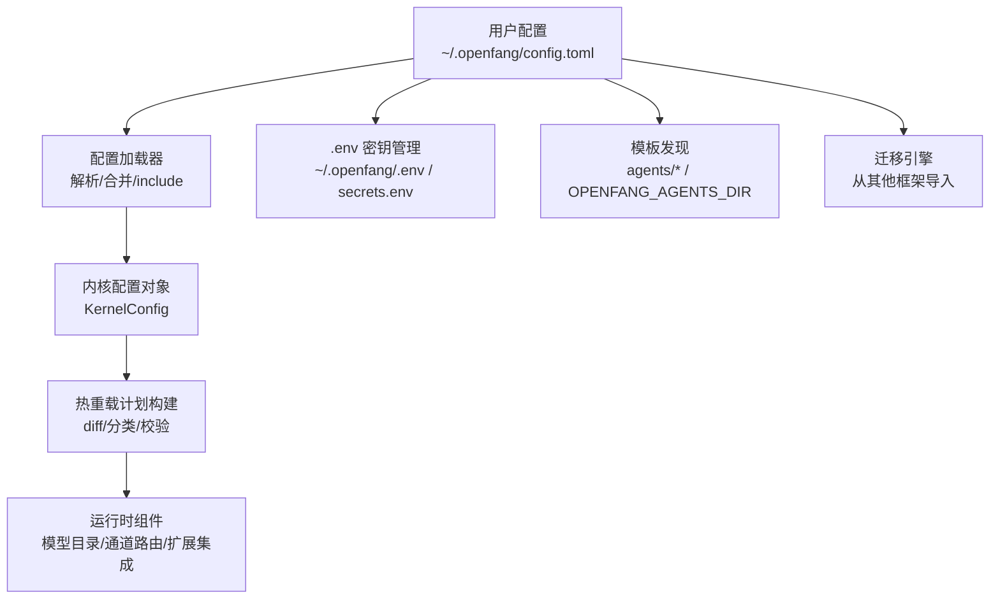
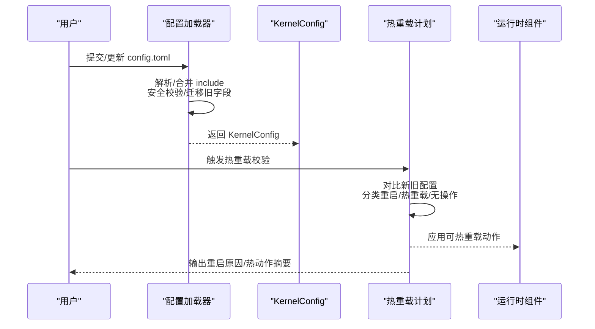
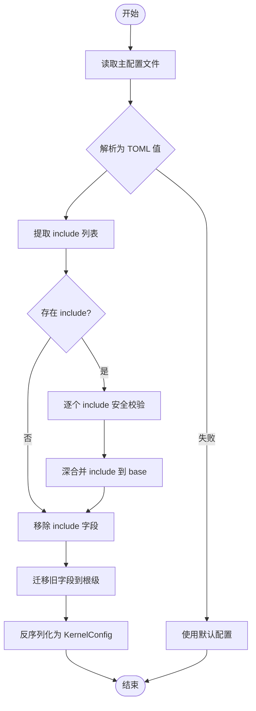
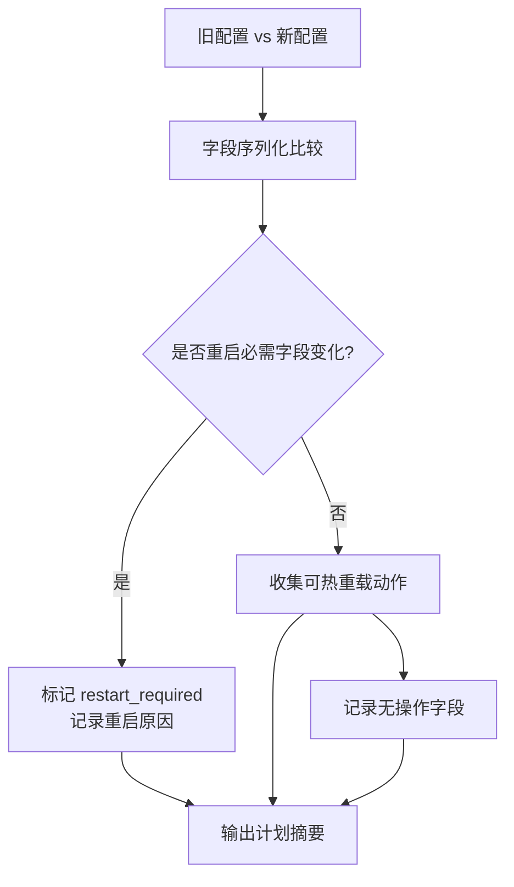
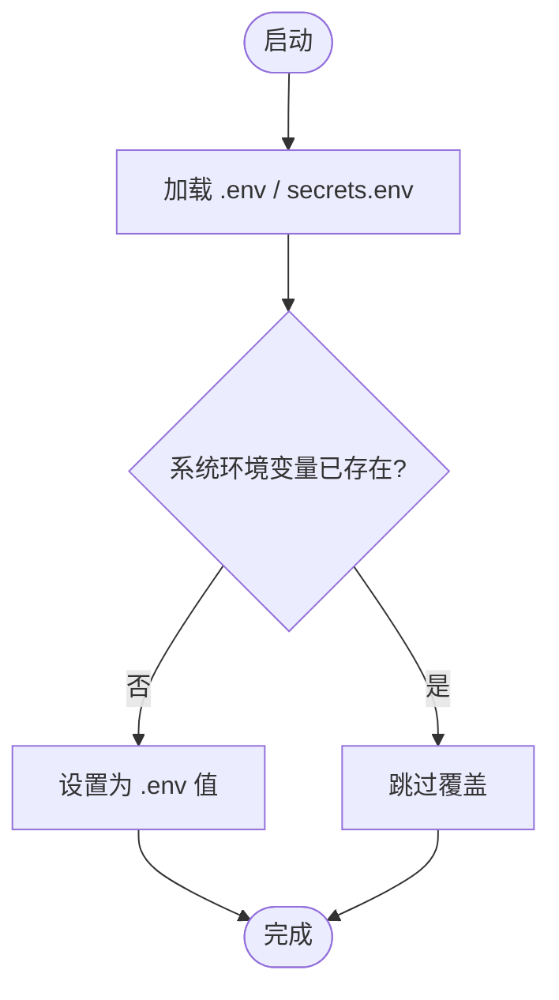
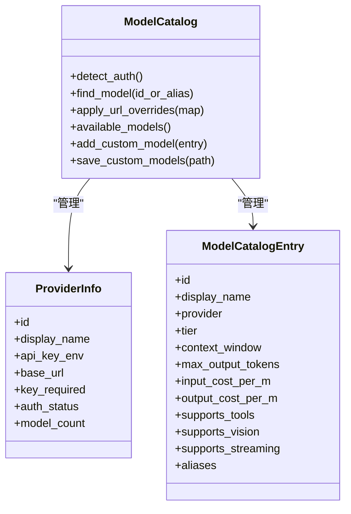
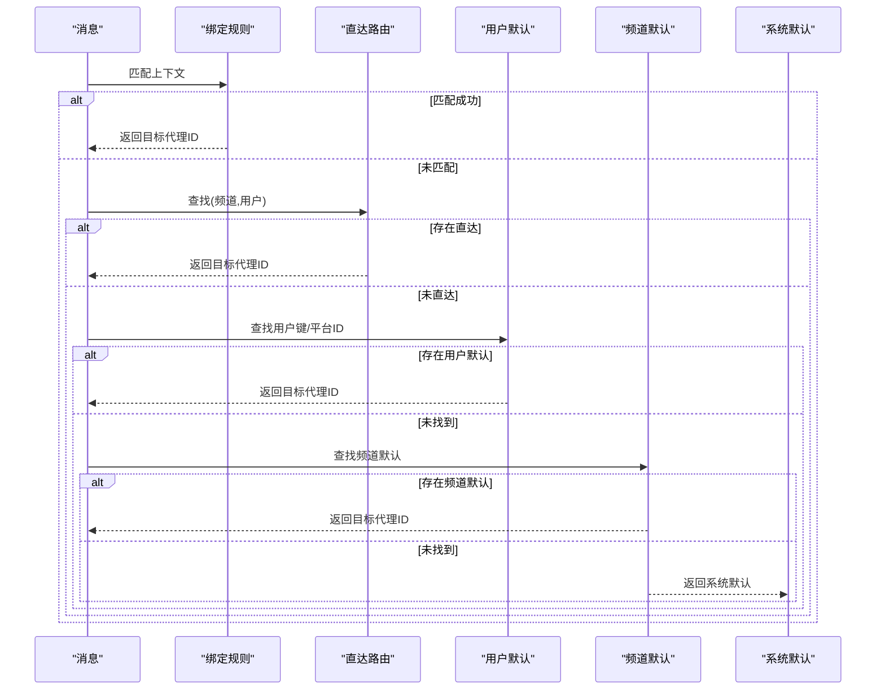
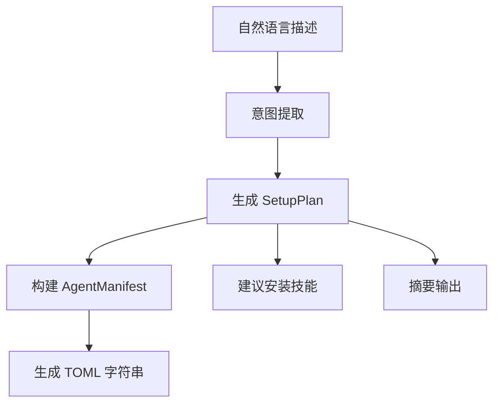
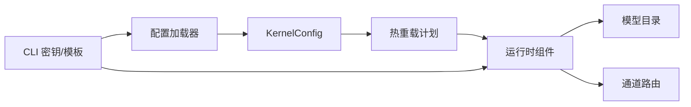

# 配置和管理

<cite>
**本文引用的文件**
- [openfang.toml.example](file://openfang.toml.example)
- [配置加载与合并](file://crates/openfang-kernel/src/config.rs)
- [配置热重载与校验](file://crates/openfang-kernel/src/config_reload.rs)
- [.env 加载与密钥管理](file://crates/openfang-cli/src/dotenv.rs)
- [扩展集成配置示例（AWS）](file://crates/openfang-extensions/integrations/aws.toml)
- [扩展集成配置示例（GitHub）](file://crates/openfang-extensions/integrations/github.toml)
- [扩展集成配置示例（Slack）](file://crates/openfang-extensions/integrations/slack.toml)
- [扩展集成配置示例（Gmail）](file://crates/openfang-extensions/integrations/gmail.toml)
- [通道路由与绑定](file://crates/openfang-channels/src/router.rs)
- [模型目录与提供商检测](file://crates/openfang-runtime/src/model_catalog.rs)
- [配置参考文档](file://docs/configuration.md)
- [迁移引擎入口](file://crates/openfang-migrate/src/lib.rs)
- [向导生成代理清单](file://crates/openfang-kernel/src/wizard.rs)
- [模板发现与加载](file://crates/openfang-cli/src/templates.rs)
</cite>

## 目录
1. [简介](#简介)
2. [项目结构](#项目结构)
3. [核心组件](#核心组件)
4. [架构总览](#架构总览)
5. [详细组件分析](#详细组件分析)
6. [依赖分析](#依赖分析)
7. [性能考虑](#性能考虑)
8. [故障排除指南](#故障排除指南)
9. [结论](#结论)
10. [附录](#附录)

## 简介
本文件面向 OpenFang 的配置与管理，围绕配置文件格式、环境变量、热重载机制、配置验证、LLM 提供商配置、渠道适配器设置、安全策略、性能参数展开，并给出配置版本控制、环境分离、敏感信息保护的最佳实践；同时覆盖配置迁移工具、数据导入导出、配置模板、配置与系统组件的集成关系、配置优先级与默认值处理、故障排除、性能调优与安全加固、批量配置管理、配置审计与变更管理流程等。

## 项目结构
OpenFang 将配置集中在用户家目录下的配置文件中，通过内核加载器解析并合并 include 文件，随后进行热重载计划构建与校验，最终驱动运行时组件（如模型目录、通道路由、扩展集成等）生效。CLI 层提供 .env 密钥管理与模板发现能力，文档提供完整的字段参考。

图示来源
- [配置加载与合并:18-110](file://crates/openfang-kernel/src/config.rs#L18-L110)
- [配置热重载与校验:123-267](file://crates/openfang-kernel/src/config_reload.rs#L123-L267)
- [.env 加载与密钥管理:28-32](file://crates/openfang-cli/src/dotenv.rs#L28-L32)
- [模板发现与加载:19-62](file://crates/openfang-cli/src/templates.rs#L19-L62)
- [迁移引擎入口:46-56](file://crates/openfang-migrate/src/lib.rs#L46-L56)

章节来源
- [配置加载与合并:18-110](file://crates/openfang-kernel/src/config.rs#L18-L110)
- [配置热重载与校验:123-267](file://crates/openfang-kernel/src/config_reload.rs#L123-L267)
- [.env 加载与密钥管理:28-32](file://crates/openfang-cli/src/dotenv.rs#L28-L32)
- [模板发现与加载:19-62](file://crates/openfang-cli/src/templates.rs#L19-L62)
- [迁移引擎入口:46-56](file://crates/openfang-migrate/src/lib.rs#L46-L56)

## 核心组件
- 配置文件与 include 合并：支持 include 字段按顺序深合并，根配置覆盖 include；内置安全限制（深度、路径遍历、绝对路径、循环引用），并自动迁移旧 schema 字段。
- 热重载与校验：对比新旧配置，分类为重启必需、可热重载、无操作三类；提供重启原因、热动作队列与校验规则（如端口非空、网络启用需共享密钥、最大定时任务数上限等）。
- 环境变量与密钥管理：.env 与 secrets.env 自动加载，系统环境变量优先；提供增删改查与权限设置；敏感字段在日志中脱敏。
- 模型目录与提供商：内置 28 家提供商与 130+ 模型，支持别名解析、认证状态检测、URL 覆盖、可用模型过滤、自定义模型导入/导出。
- 渠道路由与绑定：基于匹配规则的优先级路由（绑定 > 直达 > 用户默认 > 频道默认 > 系统默认），支持广播策略与动态绑定维护。
- 扩展集成：以 TOML 描述 MCP 服务器或 OAuth/健康检查等集成元数据，要求环境变量名声明，避免硬编码密钥。
- 迁移与模板：支持从 OpenClaw 等框架迁移；模板发现与加载支持多来源与回退。

章节来源
- [配置加载与合并:112-224](file://crates/openfang-kernel/src/config.rs#L112-L224)
- [配置热重载与校验:123-303](file://crates/openfang-kernel/src/config_reload.rs#L123-L303)
- [.env 加载与密钥管理:28-99](file://crates/openfang-cli/src/dotenv.rs#L28-L99)
- [模型目录与提供商检测:54-103](file://crates/openfang-runtime/src/model_catalog.rs#L54-L103)
- [通道路由与绑定:113-131](file://crates/openfang-channels/src/router.rs#L113-L131)
- [扩展集成配置示例（AWS）:1-43](file://crates/openfang-extensions/integrations/aws.toml#L1-L43)
- [迁移引擎入口:46-56](file://crates/openfang-migrate/src/lib.rs#L46-L56)
- [模板发现与加载:64-111](file://crates/openfang-cli/src/templates.rs#L64-L111)

## 架构总览
下图展示配置从文件到运行时组件的流转与热重载决策：

图示来源
- [配置加载与合并:18-110](file://crates/openfang-kernel/src/config.rs#L18-L110)
- [配置热重载与校验:123-267](file://crates/openfang-kernel/src/config_reload.rs#L123-L267)

章节来源
- [配置加载与合并:18-110](file://crates/openfang-kernel/src/config.rs#L18-L110)
- [配置热重载与校验:123-267](file://crates/openfang-kernel/src/config_reload.rs#L123-L267)

## 详细组件分析

### 配置文件格式与 include 合并
- 支持 include 列表，按顺序深合并，根配置覆盖 include；支持嵌套 include，最大深度限制；禁止绝对路径、路径穿越、循环引用；对包含文件进行安全校验后递归解析。
- 自动迁移旧 schema 中 [api] 下的字段到根级别，兼容历史配置。
- 默认配置路径受 OPENFANG_HOME 控制，若不可用则回退至用户家目录。

图示来源
- [配置加载与合并:18-110](file://crates/openfang-kernel/src/config.rs#L18-L110)
- [配置加载与合并:112-224](file://crates/openfang-kernel/src/config.rs#L112-L224)

章节来源
- [配置加载与合并:18-110](file://crates/openfang-kernel/src/config.rs#L18-L110)
- [配置加载与合并:112-224](file://crates/openfang-kernel/src/config.rs#L112-L224)

### 热重载机制与配置验证
- 变更分类：
  - 重启必需：监听地址、API 密钥、网络开关/配置、内存配置、家目录/数据目录、保险库配置等。
  - 可热重载：渠道、技能、使用统计页脚、Web 工具、浏览器、审批策略、定时任务数、Webhook 触发器、扩展、MCP 服务器、A2A、回退提供商链、提供商 URL 覆盖、默认模型等。
  - 无操作：日志级别、语言、模式等仅信息提示。
- 校验规则：
  - 监听地址非空；
  - 最大定时任务数上限；
  - 网络启用时必须提供共享密钥；
  - 审批策略自身校验。
- 应用策略：根据 ReloadMode 决定是否应用热动作；热动作队列与重启原因会输出日志摘要。

图示来源
- [配置热重载与校验:123-267](file://crates/openfang-kernel/src/config_reload.rs#L123-L267)
- [配置热重载与校验:277-303](file://crates/openfang-kernel/src/config_reload.rs#L277-L303)

章节来源
- [配置热重载与校验:123-267](file://crates/openfang-kernel/src/config_reload.rs#L123-L267)
- [配置热重载与校验:277-303](file://crates/openfang-kernel/src/config_reload.rs#L277-L303)

### 环境变量与密钥管理
- .env 与 secrets.env 自动加载，系统环境变量优先；支持增删改键值、写入时设置文件权限、当前进程环境同步。
- 敏感字段在日志中自动脱敏显示。
- 通过环境变量名引用真实密钥，避免直接写入配置文件。

图示来源
- [.env 加载与密钥管理:28-32](file://crates/openfang-cli/src/dotenv.rs#L28-L32)
- [.env 加载与密钥管理:68-99](file://crates/openfang-cli/src/dotenv.rs#L68-L99)

章节来源
- [.env 加载与密钥管理:28-32](file://crates/openfang-cli/src/dotenv.rs#L28-L32)
- [.env 加载与密钥管理:68-99](file://crates/openfang-cli/src/dotenv.rs#L68-L99)

### LLM 提供商配置与模型目录
- 默认模型与回退提供商链：可在 [default_model] 与 [[fallback_providers]] 中配置；支持 base_url 覆盖与别名解析。
- 认证检测：扫描各提供商 API Key 环境变量，自动标注认证状态；部分本地 CLI 提供商无需密钥。
- URL 覆盖：支持批量覆盖提供商基础 URL，未知提供商将作为自定义 OpenAI 兼容入口加入目录。
- 可用模型：仅展示已配置提供商的模型；支持自定义模型导入/导出与动态发现合并。

图示来源
- [模型目录与提供商检测:20-52](file://crates/openfang-runtime/src/model_catalog.rs#L20-L52)
- [模型目录与提供商检测:54-103](file://crates/openfang-runtime/src/model_catalog.rs#L54-L103)
- [模型目录与提供商检测:218-235](file://crates/openfang-runtime/src/model_catalog.rs#L218-L235)

章节来源
- [模型目录与提供商检测:54-103](file://crates/openfang-runtime/src/model_catalog.rs#L54-L103)
- [模型目录与提供商检测:218-235](file://crates/openfang-runtime/src/model_catalog.rs#L218-L235)

### 渠道适配器与路由绑定
- 渠道适配器：每个渠道在 [channels.<name>] 下配置，包含 bot/app token 环境变量、允许列表、轮询/端口、默认代理等。
- 路由优先级：绑定规则 > 直达路由 > 用户默认 > 频道默认 > 系统默认；支持广播策略与动态绑定维护。
- 绑定匹配：支持频道、账号、用户、公会、角色等多维匹配，按特定性排序。

图示来源
- [通道路由与绑定:141-187](file://crates/openfang-channels/src/router.rs#L141-L187)
- [通道路由与绑定:289-305](file://crates/openfang-channels/src/router.rs#L289-L305)

章节来源
- [通道路由与绑定:113-131](file://crates/openfang-channels/src/router.rs#L113-L131)
- [通道路由与绑定:141-187](file://crates/openfang-channels/src/router.rs#L141-L187)
- [通道路由与绑定:289-305](file://crates/openfang-channels/src/router.rs#L289-L305)

### 安全策略与性能参数
- 安全：
  - API 认证：可选 Bearer Token；未设置时为本地开发模式。
  - 网络互信：启用网络时必须提供共享密钥；日志中敏感字段脱敏。
  - 渠道白名单：允许用户/群组/频道/租户等维度限制接入。
- 性能：
  - 内存子系统：衰减率、合并阈值、SQLite 路径；影响检索与存储成本。
  - Web 抓取：超时、响应大小、字符截断、缓存 TTL。
  - 定时任务上限：防止资源滥用。

章节来源
- [配置热重载与校验:277-303](file://crates/openfang-kernel/src/config_reload.rs#L277-L303)
- [配置参考文档:221-253](file://docs/configuration.md#L221-L253)
- [配置参考文档:298-318](file://docs/configuration.md#L298-L318)
- [配置参考文档:321-411](file://docs/configuration.md#L321-L411)

### 配置模板与向导
- 模板发现：优先仓库 agents/，其次用户安装目录 ~/.openfang/agents/，再次 OPENFANG_AGENTS_DIR；回退内置模板。
- 向导：自然语言意图 → 结构化计划 → 生成代理清单（TOML）→ 可选安装技能 → 概要总结。

图示来源
- [向导生成代理清单:55-218](file://crates/openfang-kernel/src/wizard.rs#L55-L218)
- [模板发现与加载:64-111](file://crates/openfang-cli/src/templates.rs#L64-L111)

章节来源
- [向导生成代理清单:55-218](file://crates/openfang-kernel/src/wizard.rs#L55-L218)
- [模板发现与加载:64-111](file://crates/openfang-cli/src/templates.rs#L64-L111)

### 扩展集成配置
- 以 TOML 描述 MCP 服务器传输方式、命令参数、健康检查、OAuth 参数与所需环境变量；避免硬编码密钥，通过环境变量注入。
- 示例：AWS、GitHub、Slack、Gmail 等集成均采用相同模式。

章节来源
- [扩展集成配置示例（AWS）:1-43](file://crates/openfang-extensions/integrations/aws.toml#L1-L43)
- [扩展集成配置示例（GitHub）:1-35](file://crates/openfang-extensions/integrations/github.toml#L1-L35)
- [扩展集成配置示例（Slack）:1-42](file://crates/openfang-extensions/integrations/slack.toml#L1-L42)
- [扩展集成配置示例（Gmail）:1-28](file://crates/openfang-extensions/integrations/gmail.toml#L1-L28)

### 配置迁移工具
- 支持从 OpenClaw 迁移到 OpenFang；提供源框架、源工作区、目标目录、DryRun 等选项；返回迁移报告。
- 其他框架（如 LangChain/AutoGPT）当前不支持，保留扩展接口。

章节来源
- [迁移引擎入口:46-56](file://crates/openfang-migrate/src/lib.rs#L46-L56)

## 依赖分析
- 配置加载器依赖 toml 解析与深合并实现，确保 include 安全与 schema 迁移。
- 热重载模块依赖 KernelConfig 的字段序列化比较，以决定重启/热重载/无操作。
- 模型目录依赖运行时驱动探测与环境变量读取，实现认证状态与 URL 覆盖。
- 渠道路由依赖绑定规则与名称缓存，支持动态增删绑定。
- CLI 层依赖 .env 与模板发现，支撑密钥管理与模板分发。

图示来源
- [配置加载与合并:18-110](file://crates/openfang-kernel/src/config.rs#L18-L110)
- [配置热重载与校验:123-267](file://crates/openfang-kernel/src/config_reload.rs#L123-L267)
- [模型目录与提供商检测:54-103](file://crates/openfang-runtime/src/model_catalog.rs#L54-L103)
- [通道路由与绑定:113-131](file://crates/openfang-channels/src/router.rs#L113-L131)
- [.env 加载与密钥管理:28-32](file://crates/openfang-cli/src/dotenv.rs#L28-L32)
- [模板发现与加载:64-111](file://crates/openfang-cli/src/templates.rs#L64-L111)

章节来源
- [配置加载与合并:18-110](file://crates/openfang-kernel/src/config.rs#L18-L110)
- [配置热重载与校验:123-267](file://crates/openfang-kernel/src/config_reload.rs#L123-L267)
- [模型目录与提供商检测:54-103](file://crates/openfang-runtime/src/model_catalog.rs#L54-L103)
- [通道路由与绑定:113-131](file://crates/openfang-channels/src/router.rs#L113-L131)
- [.env 加载与密钥管理:28-32](file://crates/openfang-cli/src/dotenv.rs#L28-L32)
- [模板发现与加载:64-111](file://crates/openfang-cli/src/templates.rs#L64-L111)

## 性能考虑
- 内存子系统：合理设置衰减率与合并阈值，平衡检索精度与存储开销。
- Web 抓取：根据业务场景调整超时、响应大小与缓存 TTL，减少重复抓取。
- 定时任务：限制最大并发任务数，避免资源争用。
- 模型选择：默认模型与回退链应结合成本与延迟权衡；URL 覆盖用于就近访问或代理优化。

## 故障排除指南
- 配置加载失败：
  - 检查 include 是否存在循环、路径穿越或绝对路径；确认最大深度限制。
  - 校验 TOML 语法与字段类型；查看日志中的警告信息。
- 热重载失败：
  - 查看重启原因与热动作摘要；确认网络/数据库/家目录等字段变更是否需要重启。
  - 使用校验函数排查监听地址、最大定时任务数、网络共享密钥等。
- 密钥与认证问题：
  - 确认 .env 与 secrets.env 已正确加载且系统环境变量未被覆盖。
  - 检查提供商 API Key 环境变量是否存在且有效；模型目录会自动检测认证状态。
- 渠道接入异常：
  - 核对允许列表（用户/群组/频道/租户）与 token 环境变量。
  - 检查路由绑定优先级与直达路由配置。

章节来源
- [配置加载与合并:112-224](file://crates/openfang-kernel/src/config.rs#L112-L224)
- [配置热重载与校验:277-303](file://crates/openfang-kernel/src/config_reload.rs#L277-L303)
- [.env 加载与密钥管理:28-32](file://crates/openfang-cli/src/dotenv.rs#L28-L32)
- [模型目录与提供商检测:54-103](file://crates/openfang-runtime/src/model_catalog.rs#L54-L103)
- [通道路由与绑定:141-187](file://crates/openfang-channels/src/router.rs#L141-L187)

## 结论
OpenFang 的配置体系以 TOML 为核心，结合 include 合并与安全校验、热重载与严格校验、.env 密钥管理与脱敏、模型目录与提供商检测、渠道路由与绑定、扩展集成与迁移工具，形成一套可演进、可审计、可热更新的完整配置管理方案。遵循本文档的最佳实践，可在保证安全与性能的前提下高效管理大规模部署。

## 附录

### 配置优先级与默认值处理
- include 合并：include 列表按顺序深合并，根配置覆盖 include；支持嵌套 include，最大深度限制。
- 字段默认：所有结构体字段均为可选，默认值来自类型默认；未显式设置时使用文档默认。
- 环境变量优先：.env 与 secrets.env 的键值不会覆盖已存在的系统环境变量。

章节来源
- [配置加载与合并:112-224](file://crates/openfang-kernel/src/config.rs#L112-L224)
- [配置参考文档:29-45](file://docs/configuration.md#L29-L45)
- [.env 加载与密钥管理:28-32](file://crates/openfang-cli/src/dotenv.rs#L28-L32)

### 环境分离与敏感信息保护
- 使用环境变量名而非明文密钥；.env 与 secrets.env 分离存储；系统环境变量优先。
- 日志中敏感字段自动脱敏；仅检查密钥存在性，不存储实际密钥内容。
- 渠道适配器通过环境变量注入 token；扩展集成同样通过环境变量注入。

章节来源
- [配置参考文档:43-44](file://docs/configuration.md#L43-L44)
- [.env 加载与密钥管理:28-32](file://crates/openfang-cli/src/dotenv.rs#L28-L32)
- [扩展集成配置示例（AWS）:13-25](file://crates/openfang-extensions/integrations/aws.toml#L13-L25)
- [扩展集成配置示例（GitHub）:13-25](file://crates/openfang-extensions/integrations/github.toml#L13-L25)
- [扩展集成配置示例（Slack）:13-25](file://crates/openfang-extensions/integrations/slack.toml#L13-L25)
- [扩展集成配置示例（Gmail）:13-17](file://crates/openfang-extensions/integrations/gmail.toml#L13-L17)

### 配置模板与批量管理
- 模板来源：仓库 agents/ → ~/.openfang/agents/ → OPENFANG_AGENTS_DIR；回退内置模板。
- 批量配置：通过 include 合并与热重载计划批量应用；结合向导生成标准化代理清单。

章节来源
- [模板发现与加载:19-62](file://crates/openfang-cli/src/templates.rs#L19-L62)
- [模板发现与加载:64-111](file://crates/openfang-cli/src/templates.rs#L64-L111)
- [向导生成代理清单:55-218](file://crates/openfang-kernel/src/wizard.rs#L55-L218)

### 配置审计与变更管理
- 变更分类：重启必需/可热重载/无操作；热重载计划输出重启原因与热动作摘要。
- 审计要点：记录 include 安全事件、schema 迁移、热重载应用结果、密钥变更与提供商认证状态变化。

章节来源
- [配置热重载与校验:82-101](file://crates/openfang-kernel/src/config_reload.rs#L82-L101)
- [配置热重载与校验:123-267](file://crates/openfang-kernel/src/config_reload.rs#L123-L267)

### 数据导入导出与迁移
- 迁移：支持从 OpenClaw 迁移；DryRun 模式先预览再执行；返回迁移报告。
- 模型导入导出：自定义模型 JSON 导入/导出；动态发现合并本地模型。

章节来源
- [迁移引擎入口:46-56](file://crates/openfang-migrate/src/lib.rs#L46-L56)
- [模型目录与提供商检测:330-360](file://crates/openfang-runtime/src/model_catalog.rs#L330-L360)