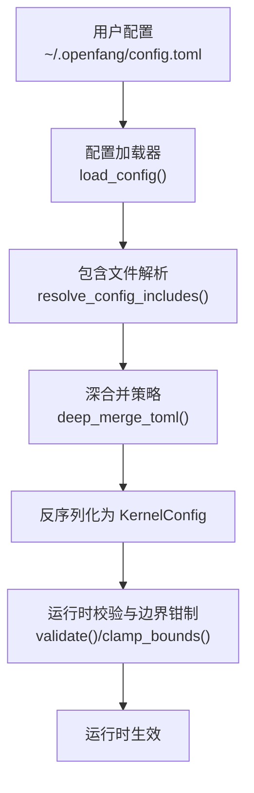
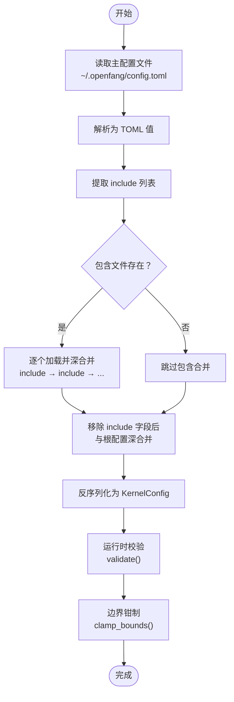
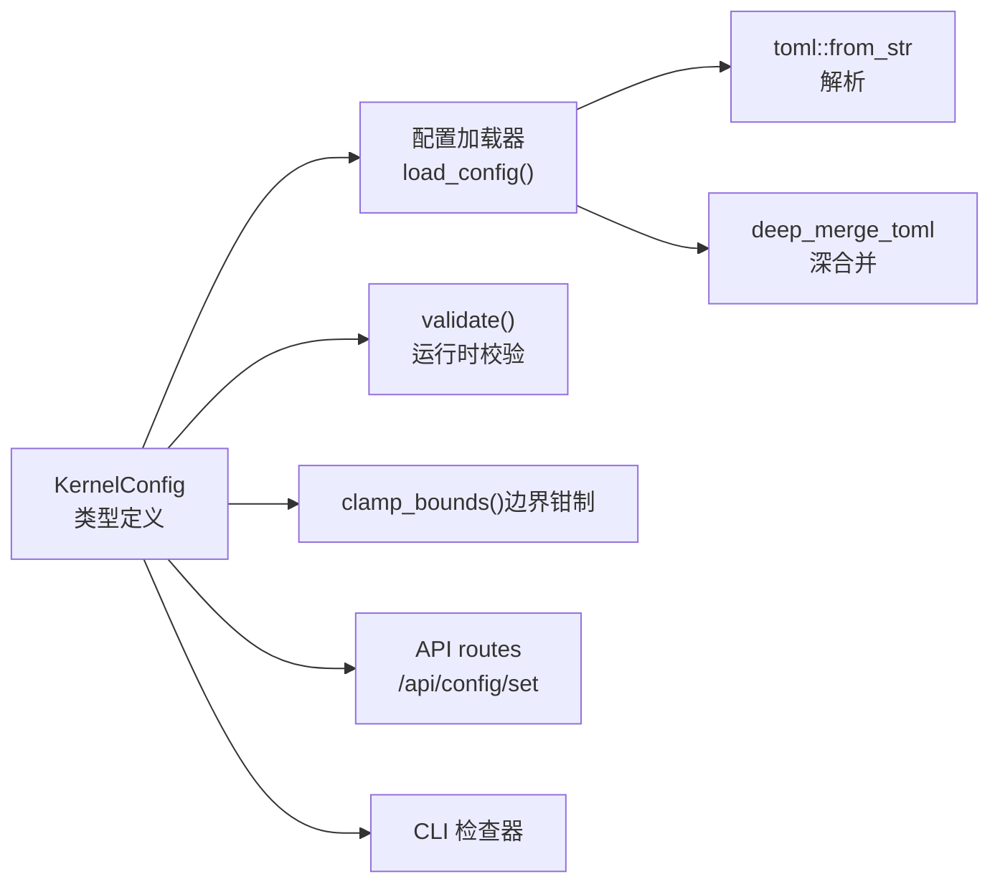

# 配置文件格式

<cite>
**本文引用的文件**
- [openfang.toml.example](file://openfang.toml.example)
- [config.rs（内核）](file://crates/openfang-kernel/src/config.rs)
- [config.rs（类型）](file://crates/openfang-types/src/config.rs)
- [routes.rs（API）](file://crates/openfang-api/src/routes.rs)
- [main.rs（CLI）](file://crates/openfang-cli/src/main.rs)
- [MIGRATION.md](file://MIGRATION.md)
</cite>

## 目录
1. [简介](#简介)
2. [项目结构](#项目结构)
3. [核心组件](#核心组件)
4. [架构总览](#架构总览)
5. [详细组件分析](#详细组件分析)
6. [依赖关系分析](#依赖关系分析)
7. [性能考量](#性能考量)
8. [故障排查指南](#故障排查指南)
9. [结论](#结论)
10. [附录](#附录)

## 简介
本文件系统化阐述 OpenFang 的配置文件格式与行为规范，聚焦于 TOML 配置文件的结构、语法规则、字段类型、默认值、取值范围、约束条件、继承与覆盖机制、验证与错误处理、调试技巧、完整示例、最佳实践与常见模式，并说明版本兼容性与迁移注意事项。

## 项目结构
OpenFang 使用 TOML 作为统一配置格式，主配置位于用户家目录的 OpenFang 工作区中，默认路径为 `~/.openfang/config.toml`。配置加载流程支持：
- 包含文件（include）机制：在根配置前深合并多个包含文件，最终由根配置覆盖
- 默认值回退：当文件缺失或解析失败时，使用类型定义中的默认值
- 运行时校验与边界钳制：对关键参数进行安全边界约束
- 环境变量与密钥管理：通过环境变量名映射 API 密钥等敏感信息

图表来源
- [config.rs（内核）:18-110](file://crates/openfang-kernel/src/config.rs#L18-L110)
- [config.rs（内核）:112-224](file://crates/openfang-kernel/src/config.rs#L112-L224)
- [config.rs（类型）:1262-1313](file://crates/openfang-types/src/config.rs#L1262-L1313)

章节来源
- [config.rs（内核）:1-110](file://crates/openfang-kernel/src/config.rs#L1-L110)
- [config.rs（类型）:1262-1313](file://crates/openfang-types/src/config.rs#L1262-L1313)

## 核心组件
- 配置根结构：由 KernelConfig 定义，涵盖日志级别、监听地址、网络开关、默认模型、内存、通道适配器、API 认证、操作模式、语言、用户、MCP 服务器、A2A 协议、使用统计展示、Web 工具、备用提供商、浏览器自动化、扩展集成、凭证保险库、工作空间目录、媒体理解、链接理解、热重载、Webhook 触发、执行审批策略、最大定时任务数、包含文件、执行策略、代理绑定、广播路由、自动回复、Canvas、TTS、Docker 沙箱、设备配对、认证配置、OAuth、预算控制、提供商 URL/密钥映射、工作流目录等。
- 通道适配器集合：ChannelsConfig 下挂载多种即时通讯平台的独立配置，如 Telegram、Discord、Slack、WhatsApp、Signal、Matrix、Email、Teams、Mattermost、IRC、Google Chat、Twitch、Rocket.Chat、Zulip、XMPP、以及更广泛的 LINE、Viber、Messenger、Reddit、Mastodon、Bluesky、Feishu、Revolt、Nextcloud、Guilded、Keybase、Threema、Nostr、Webex、Pumble、Flock、Twist、Mumble、钉钉机器人/流式、Discourse、Gitter、ntfy、Gotify、通用 Webhook、LinkedIn、企业微信等。
- 类型与默认值：所有字段均在类型定义中给出默认值，未显式设置时按默认值生效；部分字段支持字符串/整数混合数组的反序列化，便于从 Web 控台保存的数值 ID 自动转换为字符串。
- 运行时校验：检查各通道所需的环境变量是否已设置；对危险的零值或极端值进行边界钳制，避免运行期异常。

章节来源
- [config.rs（类型）:962-1102](file://crates/openfang-types/src/config.rs#L962-L1102)
- [config.rs（类型）:1559-1650](file://crates/openfang-types/src/config.rs#L1559-L1650)
- [config.rs（类型）:3016-3510](file://crates/openfang-types/src/config.rs#L3016-L3510)

## 架构总览
下图展示了配置文件从磁盘到运行时对象的转换过程，以及包含文件的深合并顺序与覆盖规则。

图表来源
- [config.rs（内核）:18-110](file://crates/openfang-kernel/src/config.rs#L18-L110)
- [config.rs（内核）:112-224](file://crates/openfang-kernel/src/config.rs#L112-L224)
- [config.rs（类型）:3016-3510](file://crates/openfang-types/src/config.rs#L3016-L3510)

章节来源
- [config.rs（内核）:112-224](file://crates/openfang-kernel/src/config.rs#L112-L224)
- [config.rs（类型）:3016-3510](file://crates/openfang-types/src/config.rs#L3016-L3510)

## 详细组件分析

### 顶层字段与嵌套段落
- 顶层字段
  - home_dir、data_dir：工作区与数据目录（默认指向 ~/.openfang 及其子目录）
  - log_level：日志级别（trace/debug/info/warn/error），默认 info
  - api_listen：API 监听地址（默认 127.0.0.1:50051）
  - network_enabled：是否启用 OFP 网络层
  - default_model：默认 LLM 提供商配置（provider/model/api_key_env/base_url）
  - memory：内存子系统配置（sqlite_path/embedding_model/consolidation_threshold/decay_rate/embedding_provider/embedding_api_key_env/consolidation_interval_hours）
  - network：网络层配置（listen_addresses/bootstrap_peers/mdns_enabled/max_peers/shared_secret）
  - channels：通道适配器集合（见下节）
  - api_key：Bearer 认证密钥（留空表示未启用）
  - mode：内核运行模式（stable/default/dev）
  - language：语言/区域（默认 en）
  - users：多用户 RBAC 用户列表
  - mcp_servers：MCP 服务器列表（名称、传输方式、超时、环境变量透传）
  - a2a：Agent-to-Agent 协议配置（启用、监听路径、外部代理）
  - usage_footer：使用统计展示模式（Off/Tokens/Cost/Full）
  - web：Web 工具配置（搜索提供商、缓存、各提供商配置、抓取参数）
  - fallback_providers：备用提供商链（按序尝试）
  - browser：浏览器自动化配置（headless/viewport/timeout/idle/max_sessions/chromium_path）
  - extensions：扩展与集成配置（自动重连、健康检查等）
  - vault：凭证保险库（启用与路径）
  - workspaces_dir：代理工作空间根目录（可选）
  - media/links：媒体理解与链接理解配置
  - reload：热重载模式与去抖设置
  - webhook_triggers：Webhook 触发器（启用、令牌环境变量、负载大小、速率限制）
  - approval：工具调用审批策略
  - max_cron_jobs：全局最大定时任务数
  - include：包含文件列表（相对根配置目录）
  - exec_policy：执行策略（模式/白名单/超时/输出限制/无输出超时）
  - bindings：代理绑定（按通道/账号/群组/角色路由）
  - broadcast：广播策略（并行/串行）与路由
  - auto_reply：自动回复引擎（并发/超时/抑制模式）
  - canvas：Agent-to-UI 工具（启用/HTML 大小/允许标签）
  - tts：文本转语音（启用/提供商/OpenAI/ElevenLabs/长度/超时）
  - docker：Docker 沙箱（启用/镜像/容器前缀/工作目录/网络/内存/CPU/超时/只读/能力/临时挂载/PID/模式/作用域/冷却/空闲/最大年龄/禁止挂载）
  - pairing：设备配对（启用/最大设备数/令牌过期/推送服务/URL/主题）
  - auth_profiles：提供商密钥轮换配置（名称/环境变量/优先级）
  - thinking：思考预算与流式输出
  - budget：全局消费预算（小时/日/月/告警阈值/默认每小时令牌限额）
  - provider_urls/provider_api_keys：提供商自定义基地址与 API 密钥环境变量映射
  - oauth：OAuth 客户端 ID 覆盖（Google/GitHub/Microsoft/Slack）
  - auth：仪表盘登录（启用/用户名/密码哈希/会话有效期）
  - workflows_dir：工作流目录（可为空禁用）

- 嵌套段落与数组
  - channels.*：各通道配置均为可选段落，未设置即禁用
  - [[fallback_providers]]：备用提供商数组
  - [[mcp_servers]]：MCP 服务器数组
  - users：用户数组
  - bindings：代理绑定数组
  - broadcast.routes：键为 peer_id、值为代理名数组的映射
  - provider_api_keys/provider_urls：字符串到字符串的映射

章节来源
- [config.rs（类型）:962-1102](file://crates/openfang-types/src/config.rs#L962-L1102)
- [config.rs（类型）:1559-1650](file://crates/openfang-types/src/config.rs#L1559-L1650)
- [config.rs（类型）:1187-1258](file://crates/openfang-types/src/config.rs#L1187-L1258)

### 字段类型、默认值、取值范围与约束
- 基本类型
  - 字符串：如 provider、model、api_key_env、base_url、region、service_url 等
  - 数字：如 u64/u32/usize/f32/f64（如 timeout_secs、max_sessions、max_chars、max_response_bytes、consolidation_threshold、decay_rate、max_hourly_usd 等）
  - 布尔：如 network_enabled、headless、ignore_bots、auto_thread_reply、unfurl_links、enabled 等
  - 数组：如 listen_addresses、allowed_users/allowed_guilds/allowed_channels 等（支持字符串/整数混合）
  - 映射：如 provider_api_keys、provider_urls、auth_profiles、bindings.routes、broadcast.routes
  - 枚举：如 UsageFooterMode、KernelMode、ExecSecurityMode、DockerSandboxMode、DockerScope、TypingMode、SearchProvider、DmPolicy、GroupPolicy、OutputFormat、ReloadMode、BroadcastStrategy 等

- 默认值
  - 日志级别：info
  - API 监听：127.0.0.1:50051
  - 网络开关：false
  - 默认模型：anthropic/claude-sonnet-4-20250514/ANTHROPIC_API_KEY（可选 base_url）
  - 内存：embedding=all-MiniLM-L6-v2/consolidation=10000/decay=0.1/间隔24h
  - 网络：libp2p 监听/本地发现/最大连接数/共享密钥（空）
  - 浏览器：headless=true/viewport=1280x720/timeout=30s/idle=300s/max=5/可指定二进制
  - Web 抓取：max_chars=50k/max_bytes=10MB/timeout=30s/readability=true
  - 执行策略：模式=Allowlist/安全二进制白名单/超时=30s/无输出超时=30s
  - 其他多数字段均有明确默认值，详见类型定义

- 取值范围与约束
  - 浏览器超时：最小5秒，最大300秒（超出将被钳制）
  - 最大会话数：最小1，最大100
  - 抓取响应大小：最小1KB，最大50MB
  - 抓取超时：最小5秒，最大120秒
  - 令牌/密钥环境变量：未设置时会在运行时校验阶段产生警告
  - 包含文件：拒绝绝对路径、路径穿越、逃逸配置目录、循环包含、超过最大深度（默认10）

章节来源
- [config.rs（类型）:1262-1313](file://crates/openfang-types/src/config.rs#L1262-L1313)
- [config.rs（类型）:3477-3510](file://crates/openfang-types/src/config.rs#L3477-L3510)
- [config.rs（内核）:112-224](file://crates/openfang-kernel/src/config.rs#L112-L224)

### 继承机制、覆盖规则与优先级
- 包含文件（include）
  - include 是一个字符串数组，元素为相对根配置目录的路径
  - 加载顺序：按数组顺序依次深合并，先于根配置
  - 根配置最终覆盖所有包含内容
  - 安全限制：拒绝绝对路径、父目录组件、逃逸配置目录、循环包含、超过最大深度
- 深合并策略（deep_merge_toml）
  - 表格递归合并，非表格直接覆盖
  - 保证包含文件的“基础层”与根配置的“覆盖层”的正确叠加
- 字段覆盖优先级
  - include 列表本身不参与覆盖，仅决定合并顺序
  - 合并后，根配置字段优先级最高
- 迁移兼容
  - 旧版 [api] 段落中的 api_key/api_listen/log_level 若未迁移到根层级，加载器会自动上移

章节来源
- [config.rs（内核）:112-224](file://crates/openfang-kernel/src/config.rs#L112-L224)
- [config.rs（内核）:53-70](file://crates/openfang-kernel/src/config.rs#L53-L70)

### 验证规则、错误处理与调试技巧
- 验证规则
  - 对已启用的通道，检查其所需的环境变量是否已设置，未设置则生成警告
  - 对已选择的 Web 搜索提供商（Brave/Tavily/Perplexity），检查对应 API 密钥环境变量是否已设置
- 错误处理
  - 解析失败、读取失败、包含文件错误：记录警告并回退到默认配置
  - 包含文件安全违规：立即失败并回退到默认配置
- 调试技巧
  - 使用 CLI 的配置检查命令，快速定位反序列化失败与配置问题
  - 在生产环境中启用 clamp_bounds，避免极端值导致运行期异常
  - 通过 API 的 /api/config/set 接口写入单个配置项并触发重载，便于在线调试

章节来源
- [config.rs（类型）:3016-3510](file://crates/openfang-types/src/config.rs#L3016-L3510)
- [main.rs（CLI）:2518-2544](file://crates/openfang-cli/src/main.rs#L2518-L2544)
- [routes.rs（API）:9749-9789](file://crates/openfang-api/src/routes.rs#L9749-L9789)

### 完整配置示例与最佳实践
- 示例参考
  - 仓库提供了示例配置文件，包含默认模型、内存、网络、会话压缩、使用统计显示、通道适配器（注释示例）、MCP 服务器（注释示例）
- 最佳实践
  - 将敏感信息（API 密钥）存储在环境变量中，配置文件仅保留环境变量名
  - 使用 include 将通用配置拆分为多个文件，根配置用于覆盖与定制
  - 为各通道设置合理的 allowed_* 白名单，降低滥用风险
  - 启用并配置 webhook_triggers 时，务必设置强令牌并限制速率
  - 生产环境启用 clamp_bounds 并定期审查配置边界
  - 使用 provider_api_keys 或 provider_urls 对自定义/未知提供商进行显式映射

章节来源
- [openfang.toml.example:1-49](file://openfang.toml.example#L1-L49)
- [config.rs（类型）:3477-3510](file://crates/openfang-types/src/config.rs#L3477-L3510)

### 版本兼容性与迁移注意事项
- 格式迁移
  - OpenFang 使用 TOML 替代 OpenClaw 的 YAML
  - 通道配置从分散文件整合到 config.toml 的 [channels] 段落
  - 工具权限从隐式列表改为显式的 capability 系统
  - 模型配置从顶层字段迁移到 [model] 段落
  - Agent 模块显式声明（builtin:chat / wasm:... / python:...）
- 迁移工具
  - 提供 openfang migrate 命令，自动转换配置、导入代理、迁移记忆、导出通道配置
  - 通道配置导出至 channels_import.toml，需手动合并到 config.toml
- 工具与提供商映射
  - 工具名称规范化（如 read_file → file_read），迁移引擎自动处理
  - 提供商名称映射（如 claude → anthropic），新增 vLLM/LM Studio 等

章节来源
- [MIGRATION.md:1-361](file://MIGRATION.md#L1-L361)

## 依赖关系分析
- 配置加载依赖
  - toml 库：解析与深合并
  - dirs 与环境变量：确定 OPENFANG_HOME 与默认路径
  - tracing：记录加载与错误信息
- 运行时依赖
  - 各通道配置依赖对应平台的环境变量
  - Web 搜索提供商依赖对应 API 密钥环境变量
  - Docker 沙箱依赖 Docker 可用性与权限
- 交互点
  - API routes 支持在线设置配置项并触发重载
  - CLI 检查器对配置进行反序列化与字段完整性验证

图表来源
- [config.rs（内核）:18-110](file://crates/openfang-kernel/src/config.rs#L18-L110)
- [config.rs（内核）:226-243](file://crates/openfang-kernel/src/config.rs#L226-L243)
- [config.rs（类型）:3016-3510](file://crates/openfang-types/src/config.rs#L3016-L3510)
- [routes.rs（API）:9749-9789](file://crates/openfang-api/src/routes.rs#L9749-L9789)
- [main.rs（CLI）:2518-2544](file://crates/openfang-cli/src/main.rs#L2518-L2544)

章节来源
- [config.rs（内核）:18-110](file://crates/openfang-kernel/src/config.rs#L18-L110)
- [config.rs（类型）:3016-3510](file://crates/openfang-types/src/config.rs#L3016-L3510)

## 性能考量
- 包含文件数量与深度
  - include 数量过多或层级过深会增加解析与合并成本，建议控制在合理范围内（默认最大深度为10）
- 热重载与边界钳制
  - 对浏览器与抓取参数设置安全边界，避免极端配置导致资源耗尽
- 网络与通道
  - 合理设置通道白名单与速率限制，减少无效流量与 API 费用
- 执行策略
  - Allowlist 模式可显著降低执行风险，同时保持必要的工具可用性

## 故障排查指南
- 配置无法加载
  - 检查配置文件语法（TOML），确认 include 路径合法且未逃逸配置目录
  - 查看日志中的警告信息，定位解析/读取/包含错误
- 通道无法连接
  - 确认所需环境变量已设置（如 TELEGRAM_BOT_TOKEN、DISCORD_BOT_TOKEN 等）
  - 检查 allowed_* 白名单是否过于严格
- Web 搜索失败
  - 确认所选搜索提供商的 API 密钥环境变量已设置
- Docker 沙箱异常
  - 确认 Docker 可用、权限足够、网络与挂载配置符合要求
- 在线修改配置
  - 使用 /api/config/set 接口设置单个配置项，观察重载结果
- CLI 检查
  - 使用 CLI 的配置检查功能，快速定位反序列化失败与字段缺失问题

章节来源
- [config.rs（类型）:3016-3510](file://crates/openfang-types/src/config.rs#L3016-L3510)
- [routes.rs（API）:9749-9789](file://crates/openfang-api/src/routes.rs#L9749-L9789)
- [main.rs（CLI）:2518-2544](file://crates/openfang-cli/src/main.rs#L2518-L2544)

## 结论
OpenFang 的 TOML 配置体系以 KernelConfig 为核心，结合包含文件深合并、默认值回退、运行时校验与边界钳制，提供了灵活、安全、可维护的配置管理能力。通过清晰的字段分层、严格的验证与丰富的默认值，用户可以在不同场景下快速部署并稳定运行。配合迁移工具与最佳实践，可平滑从其他框架迁移到 OpenFang。

## 附录
- 常用字段速查
  - [default_model]：provider/model/api_key_env/base_url
  - [memory]：sqlite_path/embedding_model/consolidation_threshold/decay_rate/embedding_provider/embedding_api_key_env/consolidation_interval_hours
  - [network]：listen_addresses/bootstrap_peers/mdns_enabled/max_peers/shared_secret
  - [channels.*]：各平台通道配置（如 telegram/discord/slack/whatsapp 等）
  - [web]：search_provider/cache_ttl_minutes/各提供商配置/抓取参数
  - [mcp_servers]：服务器名称、传输方式（stdio/SSE）、超时、环境变量透传
  - [fallback_providers]：备用提供商链
  - [reload]：mode/debounce_ms
  - [webhook_triggers]：enabled/token_env/max_payload_bytes/rate_limit_per_minute
  - [exec_policy]：mode/safe_bins/allowed_commands/timeout_secs/max_output_bytes/no_output_timeout_secs
  - [docker]：启用/镜像/容器前缀/工作目录/网络/内存/CPU/超时/只读/能力/临时挂载/PID/模式/作用域/冷却/空闲/最大年龄/禁止挂载
  - [provider_api_keys/provider_urls]：自定义提供商映射
  - [auth/oauth/budget/workflows_dir]：认证/OAuth/预算/工作流目录