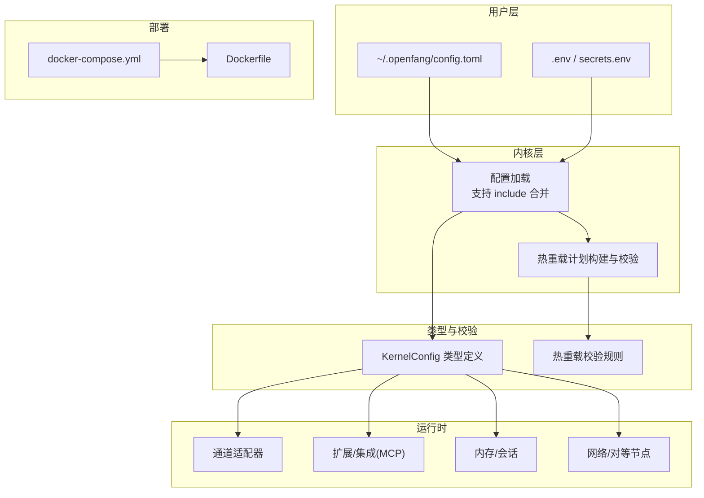
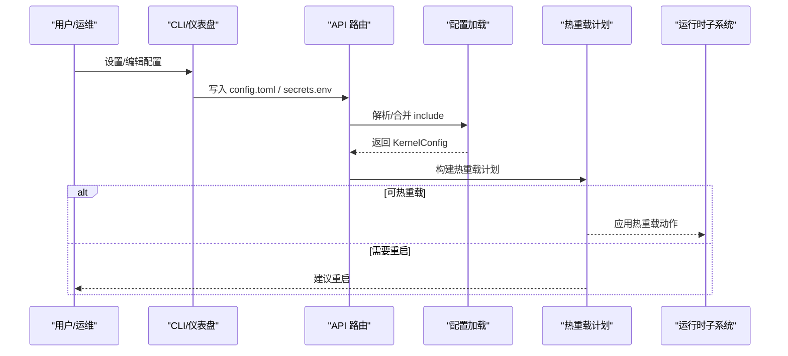
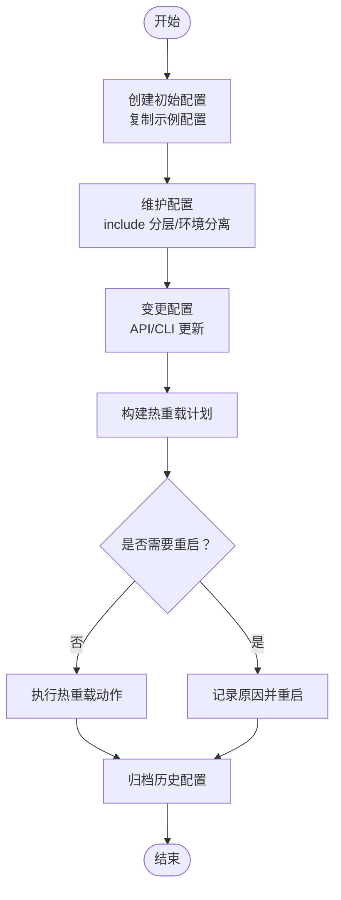
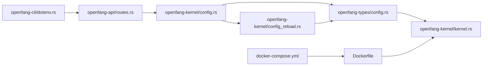

# 配置管理最佳实践

<cite>
**本文引用的文件**
- [openfang.toml.example](file://openfang.toml.example)
- [config.rs](file://crates/openfang-kernel/src/config.rs)
- [config_reload.rs](file://crates/openfang-kernel/src/config_reload.rs)
- [config.rs（类型定义）](file://crates/openfang-types/src/config.rs)
- [dotenv.rs](file://crates/openfang-cli/src/dotenv.rs)
- [kernel.rs](file://crates/openfang-kernel/src/kernel.rs)
- [aws.toml](file://crates/openfang-extensions/integrations/aws.toml)
- [github.toml](file://crates/openfang-extensions/integrations/github.toml)
- [docker-compose.yml](file://docker-compose.yml)
- [Dockerfile](file://Dockerfile)
- [routes.rs](file://crates/openfang-api/src/routes.rs)
- [main.rs（CLI）](file://crates/openfang-cli/src/main.rs)
</cite>

## 目录
1. [引言](#引言)
2. [项目结构](#项目结构)
3. [核心组件](#核心组件)
4. [架构总览](#架构总览)
5. [详细组件分析](#详细组件分析)
6. [依赖关系分析](#依赖关系分析)
7. [性能考量](#性能考量)
8. [故障排除指南](#故障排除指南)
9. [结论](#结论)
10. [附录](#附录)

## 引言
本文件面向 OpenFang 的配置管理最佳实践，系统性阐述从“创建、维护、变更、归档”的全生命周期管理；解释开发/测试/生产三类环境的配置分离策略；记录基于 Git 的版本控制与分支管理方法；明确敏感信息保护、访问控制、审计与合规要求；给出模板生成、批量部署、环境差异化与 CI/CD 集成建议；并提供变更通知、异常检测、性能监控与健康检查方案，以及问题定位、根因分析、恢复与预防措施。

## 项目结构
OpenFang 的配置体系由以下层次构成：
- 用户配置层：用户主目录下的配置文件与 .env 密钥文件
- 内核加载层：内核启动时解析配置、支持 include 合并与热重载
- 类型与校验层：统一的配置类型定义与热重载校验规则
- 运行时集成层：通道、扩展、MCP、内存等子系统按配置运行
- 部署与环境层：容器镜像与 compose 将环境变量注入到运行时

图表来源
- [config.rs:18-110](file://crates/openfang-kernel/src/config.rs#L18-L110)
- [config_reload.rs:123-267](file://crates/openfang-kernel/src/config_reload.rs#L123-L267)
- [config.rs（类型定义）:343-375](file://crates/openfang-types/src/config.rs#L343-L375)
- [docker-compose.yml:14-22](file://docker-compose.yml#L14-L22)
- [Dockerfile:32-34](file://Dockerfile#L32-L34)

章节来源
- [config.rs:18-110](file://crates/openfang-kernel/src/config.rs#L18-L110)
- [config_reload.rs:123-267](file://crates/openfang-kernel/src/config_reload.rs#L123-L267)
- [config.rs（类型定义）:343-375](file://crates/openfang-types/src/config.rs#L343-L375)
- [docker-compose.yml:14-22](file://docker-compose.yml#L14-L22)
- [Dockerfile:32-34](file://Dockerfile#L32-L34)

## 核心组件
- 配置加载与合并
  - 支持 include 嵌套合并，深度限制与路径安全校验，避免绝对路径、逃逸与循环包含
  - 默认读取 OPENFANG_HOME 或 ~/.openfang/config.toml，兼容旧 schema 字段迁移
- 配置热重载
  - 差异化分类：重启必需、可热重载、仅信息提示
  - 提供校验规则与应用决策逻辑，避免不安全变更
- 类型与默认值
  - 统一 KernelConfig 结构，含通道、扩展、MCP、浏览器、Web 搜索、TTS、Docker Sandbox 等配置项
- 环境变量与密钥
  - .env 与 secrets.env 双文件优先级，密钥写入受控权限
- 运行时集成
  - 通道、扩展、MCP、内存、网络等子系统均按配置运行

章节来源
- [config.rs:116-224](file://crates/openfang-kernel/src/config.rs#L116-L224)
- [config_reload.rs:17-101](file://crates/openfang-kernel/src/config_reload.rs#L17-L101)
- [config.rs（类型定义）:343-375](file://crates/openfang-types/src/config.rs#L343-L375)
- [dotenv.rs:28-37](file://crates/openfang-cli/src/dotenv.rs#L28-L37)

## 架构总览
下图展示配置在系统中的流转与作用范围：

图表来源
- [routes.rs:2588-2621](file://crates/openfang-api/src/routes.rs#L2588-L2621)
- [config.rs:18-110](file://crates/openfang-kernel/src/config.rs#L18-L110)
- [config_reload.rs:123-267](file://crates/openfang-kernel/src/config_reload.rs#L123-L267)

## 详细组件分析

### 配置生命周期：创建、维护、变更、归档
- 创建
  - 使用示例配置作为起点，复制到用户主目录并按需启用通道与扩展
  - 通过 CLI 初始化目录与默认配置
- 维护
  - 使用 include 分离通用与环境差异配置，集中管理默认值与覆盖项
  - 通过 .env 与 secrets.env 管理非敏感与敏感键值
- 变更
  - 通过 API 或 CLI 修改配置后，内核构建热重载计划，自动区分是否需要重启
  - 对于重启必需项，记录原因并提示人工干预
- 归档
  - 保留历史配置快照，结合 Git 记录变更；对敏感字段使用 secrets.env 并定期轮换

图表来源
- [config_reload.rs:123-267](file://crates/openfang-kernel/src/config_reload.rs#L123-L267)
- [routes.rs:2588-2621](file://crates/openfang-api/src/routes.rs#L2588-L2621)

章节来源
- [openfang.toml.example:1-49](file://openfang.toml.example#L1-L49)
- [config.rs:18-110](file://crates/openfang-kernel/src/config.rs#L18-L110)
- [config_reload.rs:123-267](file://crates/openfang-kernel/src/config_reload.rs#L123-L267)
- [routes.rs:2588-2621](file://crates/openfang-api/src/routes.rs#L2588-L2621)

### 配置分类管理：开发/测试/生产分离
- 环境变量注入
  - 通过 docker-compose 将各平台 API Key 注入容器，实现环境差异化
- 配置分层
  - 使用 include 将公共配置与环境特定配置分离，根配置覆盖 include
- 安全隔离
  - 敏感键值放入 secrets.env，并设置严格文件权限
  - 通道与扩展的密钥通过 required_env 标记为敏感字段

章节来源
- [docker-compose.yml:14-22](file://docker-compose.yml#L14-L22)
- [Dockerfile:32-34](file://Dockerfile#L32-L34)
- [aws.toml:13-25](file://crates/openfang-extensions/integrations/aws.toml#L13-L25)
- [github.toml:13-18](file://crates/openfang-extensions/integrations/github.toml#L13-L18)
- [dotenv.rs:68-99](file://crates/openfang-cli/src/dotenv.rs#L68-L99)

### 配置版本控制：Git 管理、标签策略、分支管理、合并冲突
- 文件策略
  - 将 config.toml 与 include 文件纳入版本控制，保留历史
  - secrets.env 不纳入版本库，使用 .gitignore 管控
- 分支与标签
  - feature/环境名/功能：用于环境特定变更
  - release/vX.Y.Z：发布标签
- 冲突解决
  - 使用 include 将环境差异拆分到独立文件，降低合并冲突概率
  - 对于必须在根配置中修改的字段，先在 include 中预演再合并

章节来源
- [.gitignore](file://.gitignore)
- [config.rs:116-224](file://crates/openfang-kernel/src/config.rs#L116-L224)

### 配置安全实践：敏感信息保护、访问控制、审计日志、合规
- 敏感信息保护
  - secrets.env 专用于存放敏感键值，写入时设置 0600 权限
  - required_env 标记敏感字段，API 写入时走密钥文件路径
- 访问控制
  - 通过 KernelConfig 中的用户与角色配置实现多用户与最小权限
- 审计与合规
  - 内核提供审计日志能力，可用于追踪配置变更与执行轨迹
  - 扩展健康检查与超时策略，满足合规性要求

章节来源
- [routes.rs:2588-2621](file://crates/openfang-api/src/routes.rs#L2588-L2621)
- [aws.toml:13-25](file://crates/openfang-extensions/integrations/aws.toml#L13-L25)
- [github.toml:13-18](file://crates/openfang-extensions/integrations/github.toml#L13-L18)
- [kernel.rs:81-85](file://crates/openfang-kernel/src/kernel.rs#L81-L85)

### 配置自动化：模板生成、批量部署、环境差异化、CI/CD 集成
- 模板生成
  - 使用示例配置作为模板，结合 CLI 初始化流程快速生成新实例
- 批量部署
  - docker-compose 一键拉起服务，环境变量集中注入
- 环境差异化
  - include + 环境变量双轨制，确保不同环境配置隔离
- CI/CD 集成
  - 在流水线中执行初始化、健康检查与部署步骤，结合 secrets.env 注入密钥

章节来源
- [openfang.toml.example:1-49](file://openfang.toml.example#L1-L49)
- [main.rs（CLI）:109-120](file://crates/openfang-cli/src/main.rs#L109-L120)
- [docker-compose.yml:14-22](file://docker-compose.yml#L14-L22)
- [Dockerfile:32-34](file://Dockerfile#L32-L34)

### 配置监控与告警：变更通知、异常检测、性能监控、健康检查
- 变更通知
  - 通过热重载计划的日志输出，记录重启原因与热重载动作
- 异常检测
  - 热重载校验失败或配置错误时返回错误列表，便于早期发现
- 性能监控
  - 通过运行时子系统的指标（如 cron、浏览器、Docker Sandbox）观察资源占用
- 健康检查
  - 扩展集成提供健康检查间隔与阈值，保障外部服务可用性

章节来源
- [config_reload.rs:277-303](file://crates/openfang-kernel/src/config_reload.rs#L277-L303)
- [aws.toml:26-36](file://crates/openfang-extensions/integrations/aws.toml#L26-L36)
- [github.toml:26-28](file://crates/openfang-extensions/integrations/github.toml#L26-L28)

### 配置故障排除：问题定位、根因分析、恢复策略、预防措施
- 问题定位
  - 查看内核日志中的热重载摘要与错误信息
  - 检查 include 是否存在循环、深度超限或路径逃逸
- 根因分析
  - 重启必需项通常涉及监听地址、网络共享密钥、内存配置等
  - 校验失败项包括空监听地址、过高的并发限制、网络未启用但缺少密钥等
- 恢复策略
  - 回滚到上一个稳定版本的 config.toml 快照
  - 临时移除或注释可疑的 include，确认问题范围
- 预防措施
  - 引入 CI 校验：格式校验、热重载校验、最小化变更评审
  - 使用 include 分层，减少根配置直接改动

章节来源
- [config_reload.rs:83-100](file://crates/openfang-kernel/src/config_reload.rs#L83-L100)
- [config.rs:116-224](file://crates/openfang-kernel/src/config.rs#L116-L224)
- [config_reload.rs:277-303](file://crates/openfang-kernel/src/config_reload.rs#L277-L303)

## 依赖关系分析
配置相关模块之间的依赖如下：

图表来源
- [dotenv.rs:28-37](file://crates/openfang-cli/src/dotenv.rs#L28-L37)
- [routes.rs:2588-2621](file://crates/openfang-api/src/routes.rs#L2588-L2621)
- [config.rs:18-110](file://crates/openfang-kernel/src/config.rs#L18-L110)
- [config_reload.rs:123-267](file://crates/openfang-kernel/src/config_reload.rs#L123-L267)
- [config.rs（类型定义）:343-375](file://crates/openfang-types/src/config.rs#L343-L375)
- [kernel.rs:60-164](file://crates/openfang-kernel/src/kernel.rs#L60-L164)
- [docker-compose.yml:14-22](file://docker-compose.yml#L14-L22)
- [Dockerfile:32-34](file://Dockerfile#L32-L34)

章节来源
- [dotenv.rs:28-37](file://crates/openfang-cli/src/dotenv.rs#L28-L37)
- [routes.rs:2588-2621](file://crates/openfang-api/src/routes.rs#L2588-L2621)
- [config.rs:18-110](file://crates/openfang-kernel/src/config.rs#L18-L110)
- [config_reload.rs:123-267](file://crates/openfang-kernel/src/config_reload.rs#L123-L267)
- [config.rs（类型定义）:343-375](file://crates/openfang-types/src/config.rs#L343-L375)
- [kernel.rs:60-164](file://crates/openfang-kernel/src/kernel.rs#L60-L164)
- [docker-compose.yml:14-22](file://docker-compose.yml#L14-L22)
- [Dockerfile:32-34](file://Dockerfile#L32-L34)

## 性能考量
- 配置解析与合并
  - include 深度限制与路径安全检查避免极端场景下的性能退化
- 热重载
  - 仅对可热重载部分进行增量更新，减少重启频率
- 运行时资源
  - Docker Sandbox、浏览器、Web 搜索等配置应结合实际负载调优

## 故障排除指南
- 配置加载失败
  - 检查 include 是否存在循环或路径逃逸；确认最大嵌套深度
- 热重载失败
  - 查看校验错误列表，修正非法字段后再试
- 密钥写入失败
  - 确认 secrets.env 文件权限与父目录存在性

章节来源
- [config.rs:116-224](file://crates/openfang-kernel/src/config.rs#L116-L224)
- [config_reload.rs:277-303](file://crates/openfang-kernel/src/config_reload.rs#L277-L303)
- [dotenv.rs:68-99](file://crates/openfang-cli/src/dotenv.rs#L68-L99)

## 结论
OpenFang 的配置管理通过“示例模板 + include 分层 + 环境变量 + 密钥文件”的组合，实现了清晰的生命周期管理与安全可控的变更流程。配合热重载与健康检查机制，可在保证稳定性的同时提升运维效率。建议在团队内推广 include 分层与 CI 校验，持续优化热重载覆盖范围与监控告警策略。

## 附录
- 关键配置字段参考
  - 默认模型、内存、网络、会话压缩、使用统计显示、通道适配器、MCP 服务器等
- 环境变量注入参考
  - Anthropic、OpenAI、Groq、Telegram、Discord、Slack 等

章节来源
- [openfang.toml.example:8-49](file://openfang.toml.example#L8-L49)
- [docker-compose.yml:14-22](file://docker-compose.yml#L14-L22)