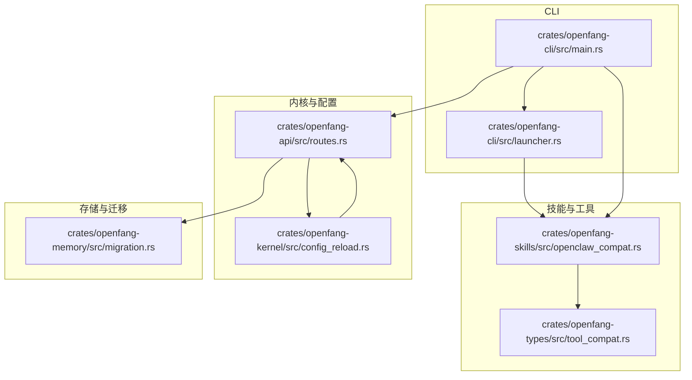
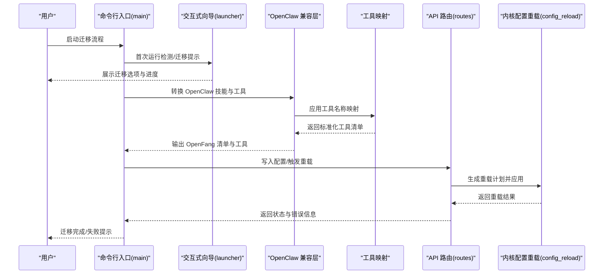
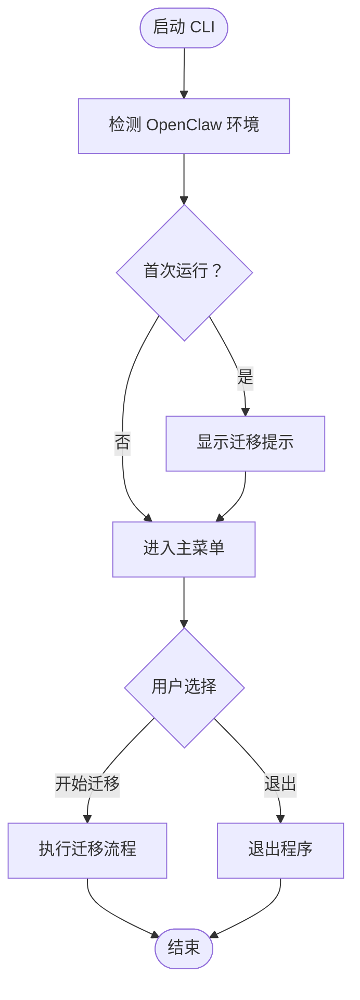
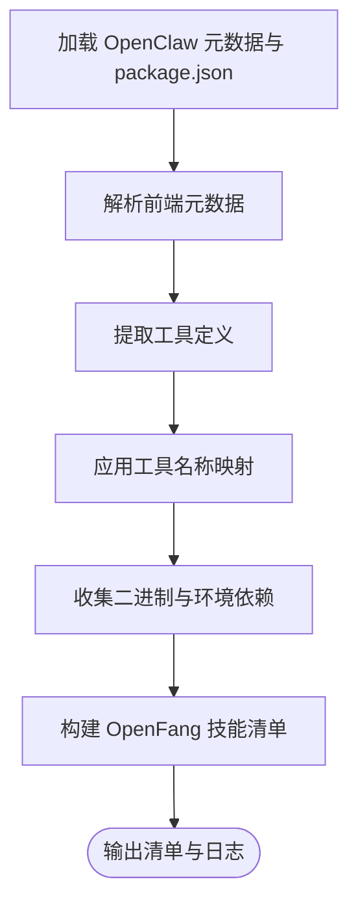
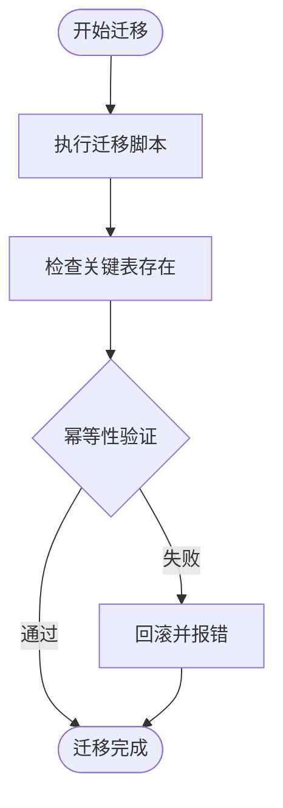
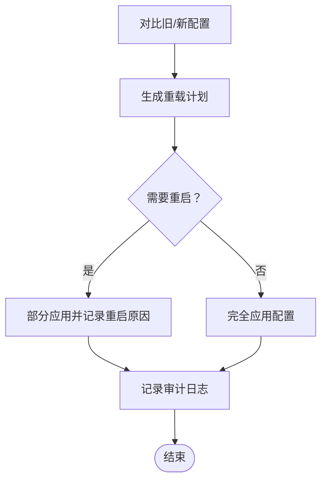
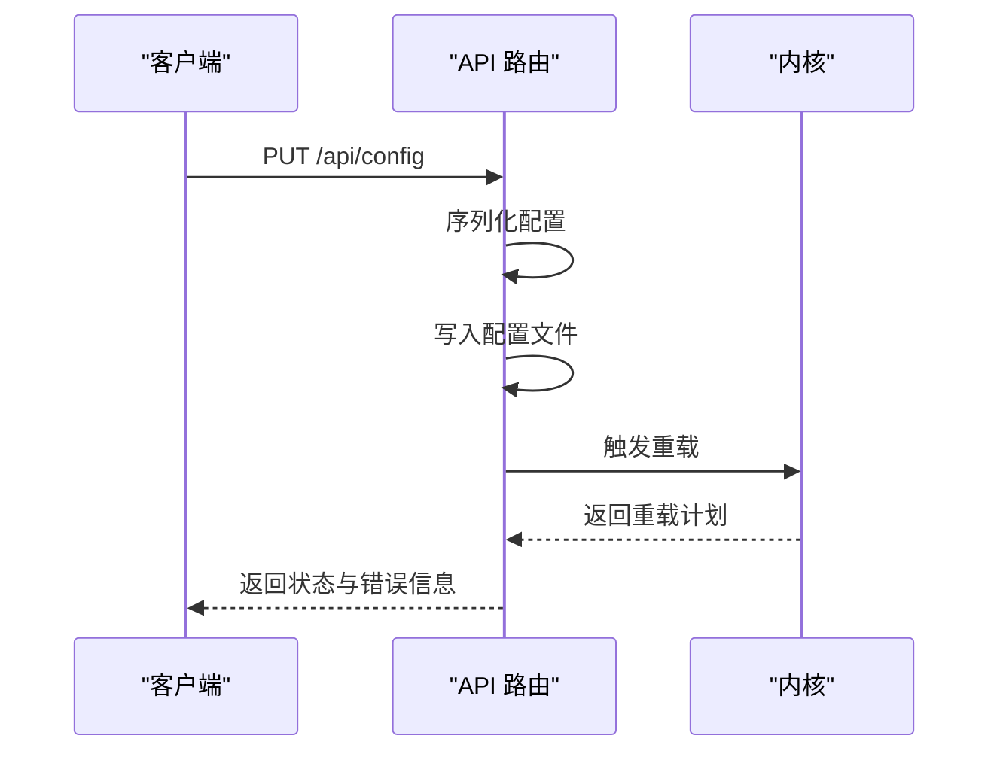
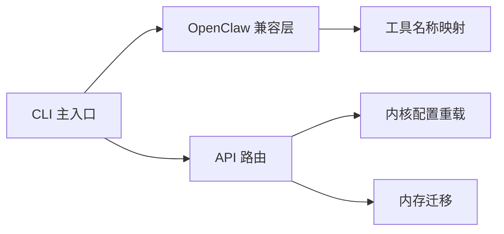

# 配置迁移工具

<cite>
**本文引用的文件**
- [Cargo.toml](file://Cargo.toml)
- [crates/openfang-cli/src/main.rs](file://crates/openfang-cli/src/main.rs)
- [crates/openfang-cli/src/launcher.rs](file://crates/openfang-cli/src/launcher.rs)
- [crates/openfang-skills/src/openclaw_compat.rs](file://crates/openfang-skills/src/openclaw_compat.rs)
- [crates/openfang-types/src/tool_compat.rs](file://crates/openfang-types/src/tool_compat.rs)
- [crates/openfang-memory/src/migration.rs](file://crates/openfang-memory/src/migration.rs)
- [crates/openfang-kernel/src/config_reload.rs](file://crates/openfang-kernel/src/config_reload.rs)
- [crates/openfang-api/src/routes.rs](file://crates/openfang-api/src/routes.rs)
</cite>

## 目录
1. [简介](#简介)
2. [项目结构](#项目结构)
3. [核心组件](#核心组件)
4. [架构总览](#架构总览)
5. [详细组件分析](#详细组件分析)
6. [依赖关系分析](#依赖关系分析)
7. [性能考量](#性能考量)
8. [故障排查指南](#故障排查指南)
9. [结论](#结论)
10. [附录](#附录)

## 简介
本文件面向 OpenFang 配置迁移工具的使用者与维护者，系统化阐述迁移能力、支持的迁移类型、迁移流程与执行模式，并覆盖从旧版本 OpenFang 以及从其他智能体平台（OpenClaw）迁移时的配置转换、数据格式升级与兼容性处理。文档同时给出命令行接口与交互式引导、迁移前准备、备份策略、风险评估、迁移过程监控与进度跟踪、错误处理、迁移后验证与性能测试、常见问题与最佳实践等。

## 项目结构
迁移相关能力主要分布在以下模块：
- 命令行入口与交互式向导：用于首次运行检测与迁移提示
- OpenClaw 兼容层：将 OpenClaw 技能与工具元数据转换为 OpenFang 格式
- 工具名称映射：统一 OpenClaw 与 OpenFang 的工具命名差异
- 内存迁移：数据库迁移脚本与幂等性保障
- 配置热重载与重启规划：变更分类与应用策略
- API 路由：配置写入、校验与触发热重载

图表来源
- [crates/openfang-cli/src/main.rs](file://crates/openfang-cli/src/main.rs)
- [crates/openfang-cli/src/launcher.rs](file://crates/openfang-cli/src/launcher.rs)
- [crates/openfang-skills/src/openclaw_compat.rs](file://crates/openfang-skills/src/openclaw_compat.rs)
- [crates/openfang-types/src/tool_compat.rs](file://crates/openfang-types/src/tool_compat.rs)
- [crates/openfang-kernel/src/config_reload.rs](file://crates/openfang-kernel/src/config_reload.rs)
- [crates/openfang-api/src/routes.rs](file://crates/openfang-api/src/routes.rs)
- [crates/openfang-memory/src/migration.rs](file://crates/openfang-memory/src/migration.rs)

章节来源
- [Cargo.toml:1-160](file://Cargo.toml#L1-L160)

## 核心组件
- 命令行入口与交互式向导
  - 在首次运行或特定场景下检测是否存在 OpenClaw 环境，并在“开始”菜单中提示自动迁移路径。
  - 提供交互式选择与进度反馈，便于用户确认迁移范围与目标。
- OpenClaw 兼容层
  - 将 OpenClaw 技能包中的元数据、工具定义与运行时信息转换为 OpenFang 可识别的清单与工具集。
  - 自动处理工具名映射、运行时类型、依赖项与输入模式。
- 工具名称映射
  - 统一 OpenClaw 的工具命名风格到 OpenFang 规范，确保工具调用链一致。
- 内存迁移
  - 数据库迁移脚本具备幂等性，可重复执行而不破坏状态；迁移过程中对表结构进行校验。
- 配置热重载与重启规划
  - 对比新旧配置，区分需要重启的变更与可热更新的变更，生成重载计划并记录原因。
- API 路由
  - 提供配置写入、序列化、落盘与触发内核重载的端点，返回重载状态与错误信息。

章节来源
- [crates/openfang-cli/src/launcher.rs:147-532](file://crates/openfang-cli/src/launcher.rs#L147-L532)
- [crates/openfang-skills/src/openclaw_compat.rs:275-459](file://crates/openfang-skills/src/openclaw_compat.rs#L275-L459)
- [crates/openfang-types/src/tool_compat.rs:1-26](file://crates/openfang-types/src/tool_compat.rs#L1-L26)
- [crates/openfang-memory/src/migration.rs:349-363](file://crates/openfang-memory/src/migration.rs#L349-L363)
- [crates/openfang-kernel/src/config_reload.rs:115-398](file://crates/openfang-kernel/src/config_reload.rs#L115-L398)
- [crates/openfang-api/src/routes.rs:9616-9866](file://crates/openfang-api/src/routes.rs#L9616-L9866)

## 架构总览
迁移工具围绕“检测—转换—应用—验证”的闭环工作流构建，CLI 作为入口协调各模块完成从 OpenClaw 到 OpenFang 的技能与配置迁移，并通过 API 与内核协作实现配置写入与热重载。

图表来源
- [crates/openfang-cli/src/main.rs](file://crates/openfang-cli/src/main.rs)
- [crates/openfang-cli/src/launcher.rs](file://crates/openfang-cli/src/launcher.rs)
- [crates/openfang-skills/src/openclaw_compat.rs](file://crates/openfang-skills/src/openclaw_compat.rs)
- [crates/openfang-types/src/tool_compat.rs](file://crates/openfang-types/src/tool_compat.rs)
- [crates/openfang-api/src/routes.rs](file://crates/openfang-api/src/routes.rs)
- [crates/openfang-kernel/src/config_reload.rs](file://crates/openfang-kernel/src/config_reload.rs)

## 详细组件分析

### 命令行入口与交互式向导
- 功能要点
  - 首次运行检测是否存在 OpenClaw 环境，若检测到则在“开始”菜单中提示自动迁移。
  - 使用 TUI 展示菜单、状态与进度，支持键盘导航与快捷键提示。
  - 在迁移过程中根据检测结果动态调整界面提示与布局高度。
- 关键行为
  - 初始化终端与异常恢复钩子，保证崩溃时恢复终端状态。
  - 根据检测到的环境动态渲染“来自 OpenClaw？”提示行，引导用户进入迁移流程。

图表来源
- [crates/openfang-cli/src/launcher.rs:147-532](file://crates/openfang-cli/src/launcher.rs#L147-L532)

章节来源
- [crates/openfang-cli/src/launcher.rs:147-532](file://crates/openfang-cli/src/launcher.rs#L147-L532)

### OpenClaw 兼容层与工具映射
- 功能要点
  - 解析 OpenClaw 技能包元数据，提取名称、版本、描述、作者、许可证与标签等字段。
  - 从 package.json 中抽取工具定义，构建 OpenFang 的工具清单。
  - 将 OpenClaw 工具名映射到 OpenFang 规范，未知工具按规则转换为 OpenFang 命名风格。
  - 记录工具翻译映射关系，便于审计与回溯。
- 处理流程
  - 读取前端元数据与 package.json，合并生成技能清单。
  - 遍历命令定义，应用工具映射规则，收集所需二进制与环境变量。
  - 生成 OpenFang 技能清单，标记来源为 OpenClaw 并设置默认运行时类型。

图表来源
- [crates/openfang-skills/src/openclaw_compat.rs:275-459](file://crates/openfang-skills/src/openclaw_compat.rs#L275-L459)
- [crates/openfang-types/src/tool_compat.rs:1-26](file://crates/openfang-types/src/tool_compat.rs#L1-L26)

章节来源
- [crates/openfang-skills/src/openclaw_compat.rs:275-459](file://crates/openfang-skills/src/openclaw_compat.rs#L275-L459)
- [crates/openfang-types/src/tool_compat.rs:1-26](file://crates/openfang-types/src/tool_compat.rs#L1-L26)

### 内存迁移与幂等性
- 功能要点
  - 提供数据库迁移脚本，确保在不同版本间平滑升级。
  - 迁移过程具备幂等性，重复执行不会导致错误或状态不一致。
  - 对关键表的存在性进行断言，保障迁移完整性。
- 实践建议
  - 在生产环境中先在测试实例上验证迁移脚本。
  - 迁移前后记录数据库快照，以便回滚。

图表来源
- [crates/openfang-memory/src/migration.rs:349-363](file://crates/openfang-memory/src/migration.rs#L349-L363)

章节来源
- [crates/openfang-memory/src/migration.rs:349-363](file://crates/openfang-memory/src/migration.rs#L349-L363)

### 配置热重载与重启规划
- 功能要点
  - 对比旧配置与新配置，生成重载计划，明确哪些变更需要重启、哪些可热更新、哪些无需处理。
  - 将变更归类为重启原因列表，便于审计与排障。
- 执行流程
  - 生成重载计划 → 若需重启则返回部分应用状态 → 否则返回完全应用状态 → 记录审计日志。

图表来源
- [crates/openfang-kernel/src/config_reload.rs:115-398](file://crates/openfang-kernel/src/config_reload.rs#L115-L398)
- [crates/openfang-api/src/routes.rs:9616-9866](file://crates/openfang-api/src/routes.rs#L9616-L9866)

章节来源
- [crates/openfang-kernel/src/config_reload.rs:115-398](file://crates/openfang-kernel/src/config_reload.rs#L115-L398)
- [crates/openfang-api/src/routes.rs:9616-9866](file://crates/openfang-api/src/routes.rs#L9616-L9866)

### API 路由与配置写入
- 功能要点
  - 提供配置写入端点，负责序列化、落盘与触发内核重载。
  - 返回重载状态（已应用/部分应用/保存但重载失败）与错误详情。
  - 记录审计日志，便于追踪配置变更。
- 错误处理
  - 序列化失败、写入失败、重载失败均以结构化 JSON 返回错误信息。

图表来源
- [crates/openfang-api/src/routes.rs:9616-9866](file://crates/openfang-api/src/routes.rs#L9616-L9866)

章节来源
- [crates/openfang-api/src/routes.rs:9616-9866](file://crates/openfang-api/src/routes.rs#L9616-L9866)

## 依赖关系分析
- 组件耦合
  - CLI 与 OpenClaw 兼容层之间通过函数调用解耦，CLI 负责交互与流程编排，兼容层负责具体转换逻辑。
  - OpenClaw 兼容层依赖工具映射模块，确保工具名一致性。
  - API 路由与内核配置重载紧密协作，路由负责落盘与触发，内核负责变更分类与应用。
- 外部依赖
  - 工作区统一依赖管理，涉及序列化、HTTP 客户端、并发、日志、加密、WS 客户端、WASM 沙箱、TUI 等生态库。

图表来源
- [Cargo.toml:1-160](file://Cargo.toml#L1-L160)
- [crates/openfang-cli/src/main.rs](file://crates/openfang-cli/src/main.rs)
- [crates/openfang-skills/src/openclaw_compat.rs](file://crates/openfang-skills/src/openclaw_compat.rs)
- [crates/openfang-types/src/tool_compat.rs](file://crates/openfang-types/src/tool_compat.rs)
- [crates/openfang-api/src/routes.rs](file://crates/openfang-api/src/routes.rs)
- [crates/openfang-kernel/src/config_reload.rs](file://crates/openfang-kernel/src/config_reload.rs)
- [crates/openfang-memory/src/migration.rs](file://crates/openfang-memory/src/migration.rs)

章节来源
- [Cargo.toml:1-160](file://Cargo.toml#L1-L160)

## 性能考量
- 迁移脚本幂等性设计避免重复开销，适合在多节点或频繁重试场景下使用。
- 工具映射采用静态查找表，时间复杂度低，适合大规模技能批量转换。
- API 写入与重载采用异步与热更新策略，尽量减少停机时间。
- 建议在生产环境进行容量与压力测试，确保迁移期间的服务稳定性。

## 故障排查指南
- 常见问题
  - OpenClaw 技能转换失败：检查前端元数据与 package.json 结构是否完整，确认工具名称映射是否缺失。
  - 配置写入失败：检查目标路径权限与磁盘空间，查看序列化与写入错误信息。
  - 重载失败：查看重载计划中的重启原因，确认是否涉及网络、监听地址或密钥等不可热更新字段。
- 排查步骤
  - 查看 CLI 输出与日志，定位失败阶段。
  - 回滚到上一个可用配置快照，逐步缩小问题范围。
  - 使用 API 路由提供的配置模式端点，核对字段类型与取值范围。
- 建议
  - 在迁移前备份所有配置与数据库。
  - 分批迁移，先迁移非关键技能与工具，再迁移核心资产。
  - 使用灰度策略，逐步扩大迁移范围并持续监控服务指标。

章节来源
- [crates/openfang-api/src/routes.rs:9616-9866](file://crates/openfang-api/src/routes.rs#L9616-L9866)
- [crates/openfang-kernel/src/config_reload.rs:115-398](file://crates/openfang-kernel/src/config_reload.rs#L115-L398)

## 结论
OpenFang 配置迁移工具通过 CLI 引导、OpenClaw 兼容层转换、工具映射与内核热重载机制，实现了从 OpenClaw 到 OpenFang 的自动化迁移。配合内存迁移的幂等性与 API 的重载策略，可在保证稳定性的同时高效完成迁移任务。建议在生产环境中遵循备份、灰度与监控的最佳实践，确保迁移过程可控、可观测、可回滚。

## 附录

### 命令行接口与执行模式
- CLI 入口
  - 通过命令行启动迁移流程，首次运行时检测 OpenClaw 环境并提示迁移。
- 执行模式
  - 交互式向导：通过 TUI 菜单选择迁移范围与目标。
  - 批量转换：针对 OpenClaw 技能包进行批量转换并输出 OpenFang 清单。

章节来源
- [crates/openfang-cli/src/launcher.rs:147-532](file://crates/openfang-cli/src/launcher.rs#L147-L532)
- [crates/openfang-cli/src/main.rs](file://crates/openfang-cli/src/main.rs)

### 迁移前准备、备份与风险评估
- 准备工作
  - 备份当前 OpenFang 配置与数据库。
  - 备份 OpenClaw 技能包与元数据，确保可回滚。
- 风险评估
  - 工具名称映射可能产生不兼容，需逐项核对。
  - 配置热更新无法覆盖的字段变更会导致服务重启，需提前规划窗口。

章节来源
- [crates/openfang-memory/src/migration.rs:349-363](file://crates/openfang-memory/src/migration.rs#L349-L363)
- [crates/openfang-kernel/src/config_reload.rs:115-398](file://crates/openfang-kernel/src/config_reload.rs#L115-L398)

### 迁移过程监控与进度跟踪
- 监控点
  - CLI 输出与日志级别，记录每一步成功/失败状态。
  - API 路由返回的重载状态与错误信息，用于判断迁移是否生效。
- 进度跟踪
  - 交互式向导提供进度条与状态行，直观展示迁移阶段。

章节来源
- [crates/openfang-api/src/routes.rs:9616-9866](file://crates/openfang-api/src/routes.rs#L9616-L9866)
- [crates/openfang-cli/src/launcher.rs:147-532](file://crates/openfang-cli/src/launcher.rs#L147-L532)

### 迁移后验证与性能测试
- 验证步骤
  - 校验技能清单与工具定义是否完整。
  - 通过 API 获取配置模式并核对字段。
  - 运行最小化工作负载，观察服务响应与日志。
- 性能测试
  - 在灰度环境中进行吞吐与延迟测试，对比迁移前后指标。

章节来源
- [crates/openfang-api/src/routes.rs:9638-9666](file://crates/openfang-api/src/routes.rs#L9638-L9666)