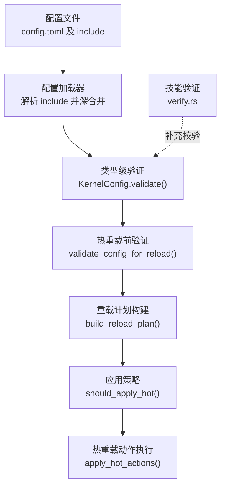
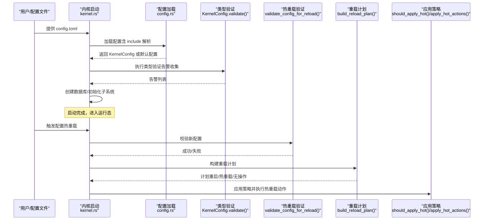
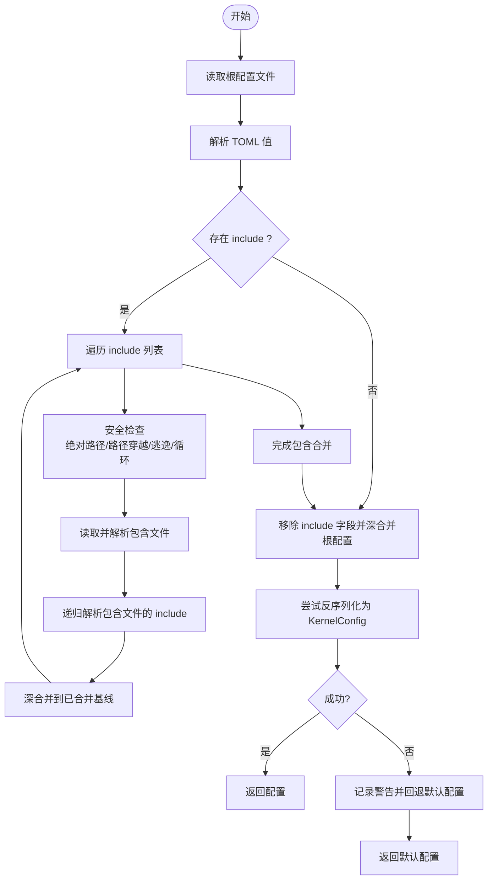
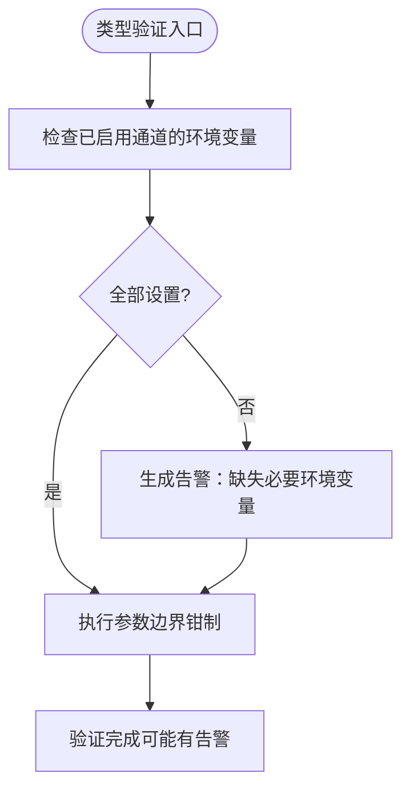
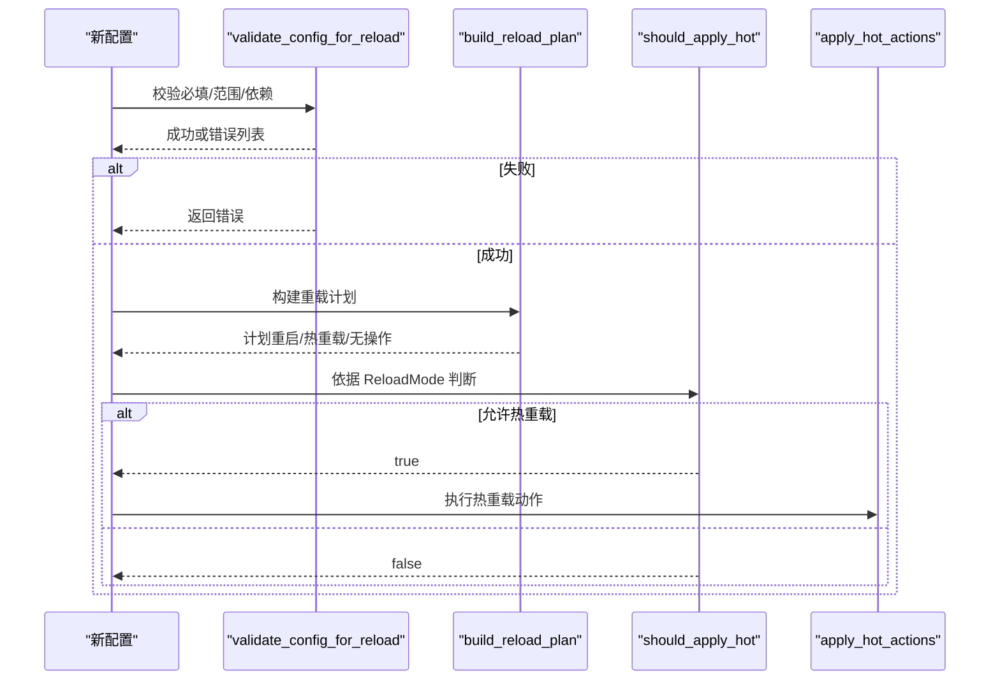
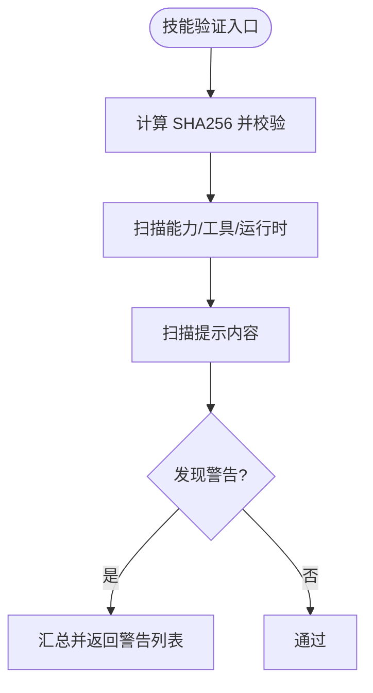
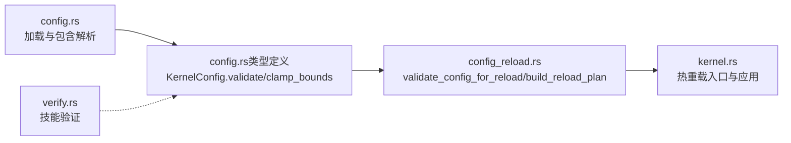

# 配置验证

<cite>
**本文档引用的文件**
- [config.rs](file://crates/openfang-kernel/src/config.rs)
- [config_reload.rs](file://crates/openfang-kernel/src/config_reload.rs)
- [config.rs（类型定义）](file://crates/openfang-types/src/config.rs)
- [kernel.rs](file://crates/openfang-kernel/src/kernel.rs)
- [verify.rs](file://crates/openfang-skills/src/verify.rs)
- [openfang.toml.example](file://openfang.toml.example)
</cite>

## 目录
1. [简介](#简介)
2. [项目结构](#项目结构)
3. [核心组件](#核心组件)
4. [架构总览](#架构总览)
5. [详细组件分析](#详细组件分析)
6. [依赖分析](#依赖分析)
7. [性能考虑](#性能考虑)
8. [故障排查指南](#故障排查指南)
9. [结论](#结论)
10. [附录](#附录)

## 简介
本文件系统化阐述 OpenFang 的配置验证体系，覆盖从配置加载、语法校验、语义校验到依赖校验的完整流程；说明热重载前的验证规则、错误报告与修复建议；总结各类验证场景（必填字段、格式、范围、依赖关系）及严重度与处理策略；并给出性能优化、缓存与增量验证思路，以及调试与日志诊断方法，并解释配置验证与系统启动流程的集成与失败处理机制。

## 项目结构
OpenFang 将配置验证拆分为多个层次与模块：
- 配置加载与包含解析：负责安全地合并多文件配置，执行语法与基础安全检查。
- 类型级验证：在运行时对 KernelConfig 进行语义与依赖检查，生成告警列表。
- 热重载前验证：比较新旧配置，构建重载计划并进行重启/热重载/无操作三类判定。
- 技能安全验证：对技能包进行完整性与安全扫描，作为“语义+依赖”的补充校验。

**图表来源**
- [config.rs:18-110](file://crates/openfang-kernel/src/config.rs#L18-L110)
- [config.rs（类型定义）:3016-3215](file://crates/openfang-types/src/config.rs#L3016-L3215)
- [config_reload.rs:115-320](file://crates/openfang-kernel/src/config_reload.rs#L115-L320)
- [kernel.rs:3543-3613](file://crates/openfang-kernel/src/kernel.rs#L3543-L3613)
- [verify.rs:1-295](file://crates/openfang-skills/src/verify.rs#L1-L295)

**章节来源**
- [config.rs:1-110](file://crates/openfang-kernel/src/config.rs#L1-L110)
- [config.rs（类型定义）:3016-3215](file://crates/openfang-types/src/config.rs#L3016-L3215)
- [config_reload.rs:115-320](file://crates/openfang-kernel/src/config_reload.rs#L115-L320)
- [kernel.rs:3543-3613](file://crates/openfang-kernel/src/kernel.rs#L3543-L3613)
- [verify.rs:1-295](file://crates/openfang-skills/src/verify.rs#L1-L295)

## 核心组件
- 配置加载与包含解析
  - 支持 include 列表，按顺序深合并，根配置覆盖包含项。
  - 安全限制：拒绝绝对路径、路径穿越、目录逃逸、循环包含、超过最大嵌套深度。
  - 包含文件解析失败或反序列化失败时回退至默认配置并记录警告。
- 类型级验证（KernelConfig.validate）
  - 检查已启用通道所需的环境变量是否设置，未设置则产生告警。
  - 对浏览器、Web 抓取等关键参数进行边界钳制（clamp_bounds），避免极端值导致运行时问题。
- 热重载前验证（validate_config_for_reload）
  - 必填字段检查：如 api_listen 不可为空。
  - 范围检查：如 max_cron_jobs 上限。
  - 依赖关系检查：网络开启时必须提供共享密钥；审批策略需通过其内部校验。
- 重载计划构建与应用
  - 构建区分三类变更：需要重启、可热重载、仅信息性变更。
  - 根据配置的 ReloadMode 决定是否应用热重载动作。
- 技能验证（verify.rs）
  - 完整性：SHA256 校验。
  - 安全扫描：运行时类型、能力、工具要求中的危险项识别。
  - 提示注入检测：对提示内容进行模式匹配，识别潜在提示注入风险。

**章节来源**
- [config.rs:112-243](file://crates/openfang-kernel/src/config.rs#L112-L243)
- [config.rs（类型定义）:3016-3215](file://crates/openfang-types/src/config.rs#L3016-L3215)
- [config_reload.rs:273-320](file://crates/openfang-kernel/src/config_reload.rs#L273-L320)
- [kernel.rs:3543-3613](file://crates/openfang-kernel/src/kernel.rs#L3543-L3613)
- [verify.rs:1-295](file://crates/openfang-skills/src/verify.rs#L1-L295)

## 架构总览
下图展示配置验证在启动与热重载两个阶段的交互：

**图表来源**
- [kernel.rs:507-552](file://crates/openfang-kernel/src/kernel.rs#L507-L552)
- [config.rs:18-110](file://crates/openfang-kernel/src/config.rs#L18-L110)
- [config.rs（类型定义）:3016-3215](file://crates/openfang-types/src/config.rs#L3016-L3215)
- [config_reload.rs:273-320](file://crates/openfang-kernel/src/config_reload.rs#L273-L320)
- [kernel.rs:3543-3613](file://crates/openfang-kernel/src/kernel.rs#L3543-L3613)

## 详细组件分析

### 组件一：配置加载与包含解析（语法与安全）
- 功能要点
  - 解析 include 数组，相对路径基于根配置所在目录。
  - 深合并策略：后包含覆盖先包含，根配置最终覆盖合并结果。
  - 安全控制：拒绝绝对路径、父目录组件、目录逃逸、循环包含、超深嵌套。
  - 错误回退：解析/读取/反序列化失败时记录警告并使用默认配置。
- 关键实现位置
  - include 解析与深合并：[resolve_config_includes:112-243](file://crates/openfang-kernel/src/config.rs#L112-L243)
  - 默认路径与 HOME 目录解析：[default_config_path/openfang_home:245-262](file://crates/openfang-kernel/src/config.rs#L245-L262)
  - 示例配置参考：[openfang.toml.example:1-49](file://openfang.toml.example#L1-L49)

**图表来源**
- [config.rs:18-110](file://crates/openfang-kernel/src/config.rs#L18-L110)
- [config.rs:112-243](file://crates/openfang-kernel/src/config.rs#L112-L243)

**章节来源**
- [config.rs:18-110](file://crates/openfang-kernel/src/config.rs#L18-L110)
- [config.rs:112-243](file://crates/openfang-kernel/src/config.rs#L112-L243)
- [openfang.toml.example:1-49](file://openfang.toml.example#L1-L49)

### 组件二：类型级验证（语义与依赖）
- 功能要点
  - 通道启用但缺少对应环境变量时发出告警，避免运行期凭空失败。
  - 对浏览器、Web 抓取等关键参数进行生产边界钳制，防止极端配置导致资源耗尽或行为异常。
- 关键实现位置
  - 通道环境变量检查与告警：[KernelConfig.validate:3016-3215](file://crates/openfang-types/src/config.rs#L3016-L3215)
  - 参数边界钳制（clamp_bounds）：[KernelConfig.clamp_bounds:3477-3510](file://crates/openfang-types/src/config.rs#L3477-L3510)

**图表来源**
- [config.rs（类型定义）:3016-3215](file://crates/openfang-types/src/config.rs#L3016-L3215)
- [config.rs（类型定义）:3477-3510](file://crates/openfang-types/src/config.rs#L3477-L3510)

**章节来源**
- [config.rs（类型定义）:3016-3215](file://crates/openfang-types/src/config.rs#L3016-L3215)
- [config.rs（类型定义）:3477-3510](file://crates/openfang-types/src/config.rs#L3477-L3510)

### 组件三：热重载前验证与重载计划
- 功能要点
  - 必填字段：api_listen 不可为空。
  - 范围检查：max_cron_jobs 上限。
  - 依赖关系：network_enabled 开启时必须提供 shared_secret；审批策略内部校验。
  - 重载计划：区分重启、热重载、无操作三类；支持按 ReloadMode 决策是否应用热重载。
- 关键实现位置
  - 热重载前验证：[validate_config_for_reload:273-303](file://crates/openfang-kernel/src/config_reload.rs#L273-L303)
  - 重载计划构建：[build_reload_plan:115-267](file://crates/openfang-kernel/src/config_reload.rs#L115-L267)
  - 应用策略与动作执行：[should_apply_hot/apply_hot_actions:309-320](file://crates/openfang-kernel/src/config_reload.rs#L309-L320), [kernel 中的应用逻辑:3560-3613](file://crates/openfang-kernel/src/kernel.rs#L3560-L3613)

**图表来源**
- [config_reload.rs:115-320](file://crates/openfang-kernel/src/config_reload.rs#L115-L320)
- [kernel.rs:3543-3613](file://crates/openfang-kernel/src/kernel.rs#L3543-L3613)

**章节来源**
- [config_reload.rs:115-320](file://crates/openfang-kernel/src/config_reload.rs#L115-L320)
- [kernel.rs:3543-3613](file://crates/openfang-kernel/src/kernel.rs#L3543-L3613)

### 组件四：技能验证（完整性与安全）
- 功能要点
  - 完整性：计算 SHA256 并与期望摘要比对。
  - 安全扫描：识别 Node.js 运行时、ShellExec、NetConnect(*)、危险工具（shell_exec、file_write）等高危能力。
  - 提示内容扫描：识别提示注入、数据外泄、可疑命令等模式。
- 关键实现位置
  - 校验器与扫描器：[SkillVerifier:27-180](file://crates/openfang-skills/src/verify.rs#L27-L180)

**图表来源**
- [verify.rs:1-295](file://crates/openfang-skills/src/verify.rs#L1-L295)

**章节来源**
- [verify.rs:1-295](file://crates/openfang-skills/src/verify.rs#L1-L295)

### 组件五：启动流程中的配置验证集成
- 功能要点
  - 启动时加载配置并执行类型验证，输出告警。
  - 初始化内存、驱动、模型目录等子系统。
  - 热重载时先进行热重载前验证，再构建计划并按策略应用。
- 关键实现位置
  - 启动加载与验证：[kernel::boot/boot_with_config:507-552](file://crates/openfang-kernel/src/kernel.rs#L507-L552)
  - 热重载入口与应用：[kernel::reload_config:3543-3613](file://crates/openfang-kernel/src/kernel.rs#L3543-L3613)

**章节来源**
- [kernel.rs:507-552](file://crates/openfang-kernel/src/kernel.rs#L507-L552)
- [kernel.rs:3543-3613](file://crates/openfang-kernel/src/kernel.rs#L3543-L3613)

## 依赖分析
- 组件耦合
  - 配置加载器与类型验证紧密耦合：加载器负责语法与安全，类型验证负责语义与依赖。
  - 热重载验证与重载计划独立于具体子系统，通过枚举动作与布尔标志解耦。
  - 技能验证独立于主配置流程，作为插件安装/更新时的补充校验。
- 外部依赖
  - TOML 解析与深合并：用于 include 解析与合并。
  - 环境变量读取：用于通道令牌等敏感配置。
  - 日志框架：用于记录警告与重载摘要。

**图表来源**
- [config.rs:18-110](file://crates/openfang-kernel/src/config.rs#L18-L110)
- [config.rs（类型定义）:3016-3215](file://crates/openfang-types/src/config.rs#L3016-L3215)
- [config_reload.rs:115-320](file://crates/openfang-kernel/src/config_reload.rs#L115-L320)
- [kernel.rs:3543-3613](file://crates/openfang-kernel/src/kernel.rs#L3543-L3613)
- [verify.rs:1-295](file://crates/openfang-skills/src/verify.rs#L1-L295)

**章节来源**
- [config.rs:18-110](file://crates/openfang-kernel/src/config.rs#L18-L110)
- [config.rs（类型定义）:3016-3215](file://crates/openfang-types/src/config.rs#L3016-L3215)
- [config_reload.rs:115-320](file://crates/openfang-kernel/src/config_reload.rs#L115-L320)
- [kernel.rs:3543-3613](file://crates/openfang-kernel/src/kernel.rs#L3543-L3613)
- [verify.rs:1-295](file://crates/openfang-skills/src/verify.rs#L1-L295)

## 性能考虑
- 解析与合并
  - include 嵌套深度限制与路径安全检查避免了恶意配置导致的资源滥用。
  - 深合并采用递归策略，复杂度与配置层级和键数量成正比；建议合理组织 include 结构以降低合并成本。
- 边界钳制
  - clamp_bounds 在启动阶段一次性修正极端配置，避免运行期反复判断带来的开销。
- 热重载
  - 通过 JSON 序列化比较字段差异，时间复杂度与配置字段数量线性相关；建议减少不必要的频繁变更。
  - ReloadMode 控制是否应用热重载，避免在不支持的变更上浪费资源。
- 缓存与增量
  - 当前实现未见专用缓存层；可在后续版本中引入：
    - 配置哈希缓存：对已验证配置生成稳定哈希，变更时仅重新校验差异部分。
    - 增量热重载：仅对受影响子系统重建连接或上下文，而非全量重启。
- 日志与诊断
  - 使用结构化日志记录验证与重载摘要，便于定位问题与评估影响面。

[本节为通用指导，无需特定文件引用]

## 故障排查指南
- 配置加载失败
  - 症状：无法读取/解析配置文件，回退默认配置并记录警告。
  - 排查：检查文件权限、路径正确性、TOML 语法；确认 include 路径为相对且不越权。
  - 参考：[config.rs 加载与回退逻辑:18-110](file://crates/openfang-kernel/src/config.rs#L18-L110)
- 通道配置告警
  - 症状：类型验证输出“某通道已启用但环境变量未设置”告警。
  - 排查：确认对应环境变量已导出，或在配置中移除该通道。
  - 参考：[KernelConfig.validate:3016-3215](file://crates/openfang-types/src/config.rs#L3016-L3215)
- 热重载失败
  - 症状：validate_config_for_reload 返回错误列表，重载被拒绝。
  - 排查：检查 api_listen 是否为空、max_cron_jobs 是否超限、网络开启时是否提供 shared_secret、审批策略是否有效。
  - 参考：[validate_config_for_reload:273-303](file://crates/openfang-kernel/src/config_reload.rs#L273-L303)
- 重载计划不符合预期
  - 症状：计划标记为需要重启，但期望热重载。
  - 排查：确认变更涉及的字段是否属于“热重载安全”范围；调整 ReloadMode 或修正配置。
  - 参考：[build_reload_plan:115-267](file://crates/openfang-kernel/src/config_reload.rs#L115-L267), [should_apply_hot:309-320](file://crates/openfang-kernel/src/config_reload.rs#L309-L320)
- 技能安装失败
  - 症状：SHA256 校验失败或出现安全警告。
  - 排查：确认来源完整性；根据警告级别决定是否允许安装（Info 可忽略，Warning/Critical 需谨慎）。
  - 参考：[verify.rs:1-295](file://crates/openfang-skills/src/verify.rs#L1-L295)

**章节来源**
- [config.rs:18-110](file://crates/openfang-kernel/src/config.rs#L18-L110)
- [config.rs（类型定义）:3016-3215](file://crates/openfang-types/src/config.rs#L3016-L3215)
- [config_reload.rs:273-320](file://crates/openfang-kernel/src/config_reload.rs#L273-L320)
- [kernel.rs:3543-3613](file://crates/openfang-kernel/src/kernel.rs#L3543-L3613)
- [verify.rs:1-295](file://crates/openfang-skills/src/verify.rs#L1-L295)

## 结论
OpenFang 的配置验证体系以“语法—语义—依赖—热重载”分层推进，结合安全包含解析、环境变量检查、边界钳制与热重载策略，确保系统在启动与运行期均保持稳健。通过告警与错误报告机制，用户可快速定位问题并采取修复措施；通过 ReloadMode 与重载计划，系统在保证安全的前提下尽可能减少停机时间。未来可在缓存与增量验证方面进一步优化，提升大规模配置管理与高频变更场景下的性能与体验。

[本节为总结，无需特定文件引用]

## 附录
- 验证场景清单
  - 必填字段检查：api_listen、网络共享密钥、审批策略等。
  - 格式验证：TOML 语法、include 路径格式、环境变量名规范。
  - 范围检查：max_cron_jobs 上限、浏览器/抓取参数边界。
  - 依赖关系验证：通道启用与环境变量一致性、网络开启与密钥配对。
- 错误分类与严重度
  - 语法错误：TOML 解析失败、包含路径非法 → 低/中（回退默认配置）
  - 语义告警：通道缺少环境变量 → 中（建议立即修复）
  - 依赖错误：网络开启但缺密钥 → 高（必须修复）
  - 热重载失败：超出安全范围或违反策略 → 中（调整配置或模式）
  - 技能安全警告：完整性/危险能力/提示注入 → 低/中/高（依严重度处理）
- 修复建议
  - 语法与包含：修正 TOML 语法与 include 路径，避免绝对路径与目录逃逸。
  - 语义与依赖：补齐环境变量，确保网络开启时提供共享密钥。
  - 热重载：将变更限定在热重载安全范围内，或选择重启模式。
  - 技能安装：优先使用可信来源，对高危警告进行人工复核。

[本节为概览，无需特定文件引用]