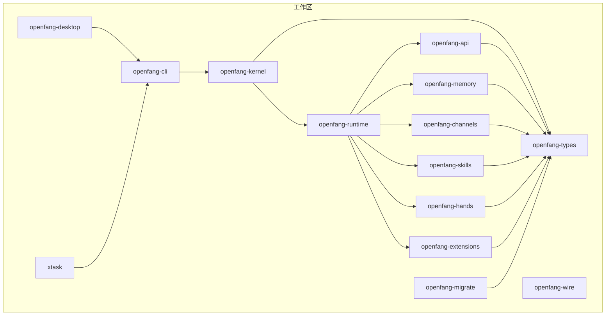
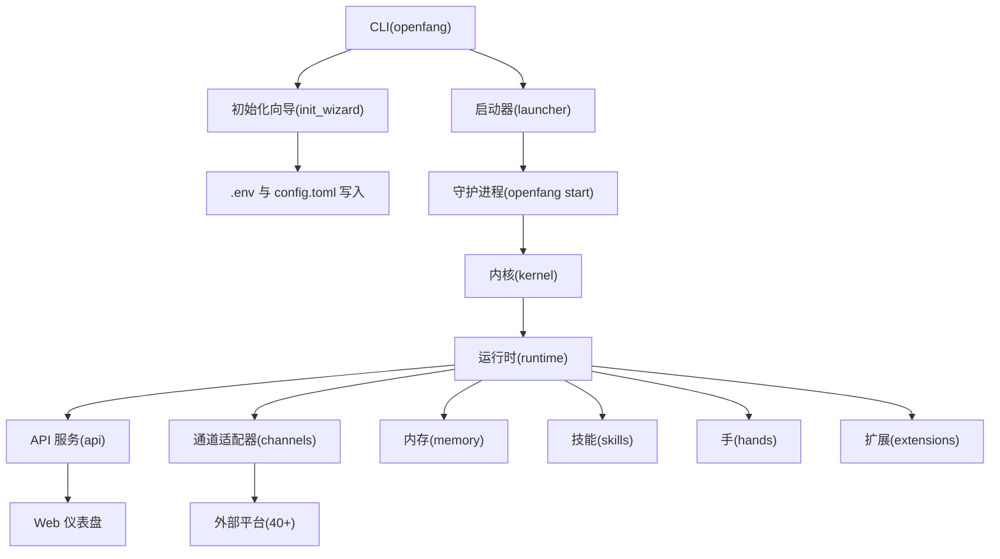
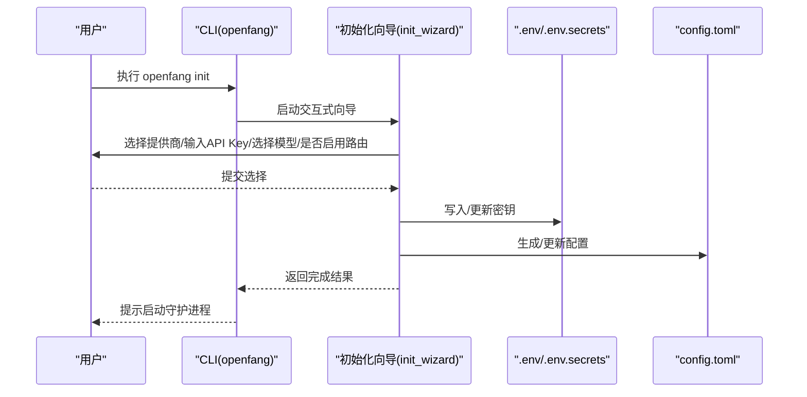
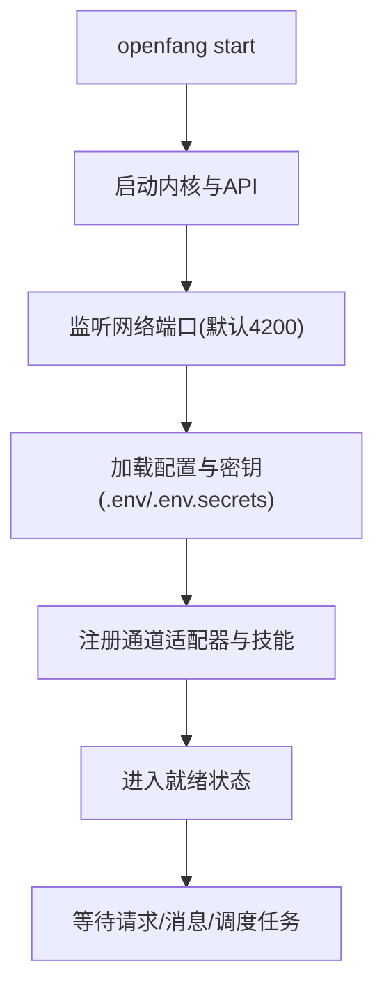
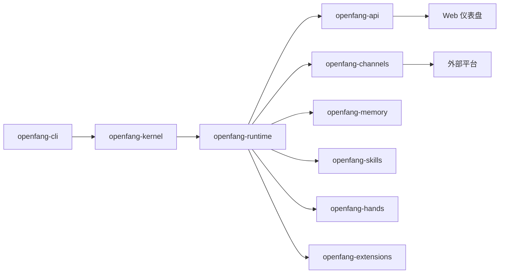

# 快速开始指南

<cite>
**本文引用的文件**
- [README.md](file://README.md)
- [Cargo.toml](file://Cargo.toml)
- [openfang.toml.example](file://openfang.toml.example)
- [crates/openfang-cli/src/main.rs](file://crates/openfang-cli/src/main.rs)
- [crates/openfang-cli/src/tui/screens/init_wizard.rs](file://crates/openfang-cli/src/tui/screens/init_wizard.rs)
- [crates/openfang-cli/src/launcher.rs](file://crates/openfang-cli/src/launcher.rs)
- [crates/openfang-cli/src/dotenv.rs](file://crates/openfang-cli/src/dotenv.rs)
- [deploy/openfang.service](file://deploy/openfang.service)
- [agents/assistant/agent.toml](file://agents/assistant/agent.toml)
- [agents/hello-world/agent.toml](file://agents/hello-world/agent.toml)
</cite>

## 目录
1. [简介](#简介)
2. [项目结构](#项目结构)
3. [核心组件](#核心组件)
4. [架构总览](#架构总览)
5. [详细组件分析](#详细组件分析)
6. [依赖关系分析](#依赖关系分析)
7. [性能与可用性建议](#性能与可用性建议)
8. [常见问题排查](#常见问题排查)
9. [结论](#结论)
10. [附录：一键安装与自定义选项](#附录一键安装与自定义选项)

## 简介
OpenFang 是一个用 Rust 构建的开源“智能体操作系统”，提供从终端到 Web 的全栈能力：内置 40+ 通道适配器、27+ LLM 提供商、可自动运行的“手”（Hands）能力包、交互式 TUI 仪表盘与 OpenAI 兼容 API。新用户可在 10 分钟内完成安装、初始化、启动并看到效果。

## 项目结构
仓库采用多 crate 的工作区组织，核心模块围绕“内核（kernel）—运行时（runtime）—API（api）—CLI（cli）—桌面应用（desktop）—扩展（extensions）—内存（memory）—技能（skills）—手（hands）—通道（channels）—迁移（migrate）—网络协议（wire）—类型系统（types）—工具链（xtask）”展开。

图表来源
- [Cargo.toml:1-161](file://Cargo.toml#L1-L161)

章节来源
- [Cargo.toml:1-161](file://Cargo.toml#L1-L161)

## 核心组件
- CLI：命令行入口，提供 init、start、chat、agent、hand、channel、config、doctor、dashboard 等子命令，支持交互式向导与一键启动。
- 内核：编排、调度、工作流、配额计量、RBAC、心跳、触发器、审批、审计等。
- 运行时：代理循环、LLM 驱动（Anthropic/Gemini/OpenAI 兼容）、53+ 工具、WASM 沙箱、MCP、A2A。
- API：140+ REST/WS/SSE 接口、OpenAI 兼容 API、Web 仪表盘。
- 通道适配器：40+ 即时通讯与企业协作平台接入。
- 内存：SQLite 持久化、向量嵌入、会话压缩、知识图谱。
- 技能与手：60+ 内置技能、7 个预置“手”（研究、剪辑、线索、预测、浏览器、社交、自动化）。
- 扩展：MCP 模板、凭据保险库、OAuth2 PKCE。
- 桌面应用：Tauri 2.0 原生应用（托盘、通知、快捷键）。
- 迁移：OpenClaw、LangChain、AutoGPT 迁移引擎。

章节来源
- [README.md:231-250](file://README.md#L231-L250)
- [Cargo.toml:1-161](file://Cargo.toml#L1-L161)

## 架构总览
下图展示从 CLI 到内核、运行时、API、通道与内存的整体交互路径。

图表来源
- [crates/openfang-cli/src/main.rs:87-294](file://crates/openfang-cli/src/main.rs#L87-L294)
- [crates/openfang-cli/src/tui/screens/init_wizard.rs:541-800](file://crates/openfang-cli/src/tui/screens/init_wizard.rs#L541-L800)
- [crates/openfang-cli/src/launcher.rs:175-269](file://crates/openfang-cli/src/launcher.rs#L175-L269)
- [crates/openfang-cli/src/dotenv.rs:22-32](file://crates/openfang-cli/src/dotenv.rs#L22-L32)

章节来源
- [crates/openfang-cli/src/main.rs:87-294](file://crates/openfang-cli/src/main.rs#L87-L294)
- [crates/openfang-cli/src/tui/screens/init_wizard.rs:541-800](file://crates/openfang-cli/src/tui/screens/init_wizard.rs#L541-L800)
- [crates/openfang-cli/src/launcher.rs:175-269](file://crates/openfang-cli/src/launcher.rs#L175-L269)
- [crates/openfang-cli/src/dotenv.rs:22-32](file://crates/openfang-cli/src/dotenv.rs#L22-L32)

## 详细组件分析

### 安装与初始化流程
- 跨平台一键安装：提供 curl 安装脚本与 PowerShell 安装脚本，安装后执行 openfang init 引导初始化。
- 初始化向导：交互式 6 步流程，选择提供商、填写 API Key、选择模型、是否启用智能路由、完成并选择启动 Web 仪表盘或直接聊天。
- 环境变量与密钥：通过 .env 文件管理 API Key，优先级低于系统环境变量；支持测试 Key 可用性。
- 默认配置：示例配置文件 openfang.toml.example 展示了默认模型、内存、网络监听地址、频道适配器与 MCP 服务器等项。

图表来源
- [crates/openfang-cli/src/tui/screens/init_wizard.rs:541-800](file://crates/openfang-cli/src/tui/screens/init_wizard.rs#L541-L800)
- [crates/openfang-cli/src/dotenv.rs:64-100](file://crates/openfang-cli/src/dotenv.rs#L64-L100)
- [openfang.toml.example:1-49](file://openfang.toml.example#L1-L49)

章节来源
- [README.md:407-442](file://README.md#L407-L442)
- [crates/openfang-cli/src/tui/screens/init_wizard.rs:30-223](file://crates/openfang-cli/src/tui/screens/init_wizard.rs#L30-L223)
- [crates/openfang-cli/src/dotenv.rs:22-32](file://crates/openfang-cli/src/dotenv.rs#L22-L32)
- [openfang.toml.example:1-49](file://openfang.toml.example#L1-L49)

### 启动与守护进程
- CLI 子命令：openfang start 启动内核与 API 服务；openfang stop 停止；openfang dashboard 在浏览器打开仪表盘。
- systemd 服务模板：提供 openfang.service，定义用户、组、工作目录、环境文件、安全加固与资源限制。
- 启动器：在无子命令且 TTY 环境下显示交互菜单，检测守护进程状态、提示配置提供商与 API Key。

图表来源
- [crates/openfang-cli/src/main.rs:115-122](file://crates/openfang-cli/src/main.rs#L115-L122)
- [deploy/openfang.service:7-35](file://deploy/openfang.service#L7-L35)
- [crates/openfang-cli/src/launcher.rs:187-205](file://crates/openfang-cli/src/launcher.rs#L187-L205)

章节来源
- [crates/openfang-cli/src/main.rs:115-122](file://crates/openfang-cli/src/main.rs#L115-L122)
- [deploy/openfang.service:1-39](file://deploy/openfang.service#L1-L39)
- [crates/openfang-cli/src/launcher.rs:187-205](file://crates/openfang-cli/src/launcher.rs#L187-L205)

### 频道适配器与 LLM 提供商配置
- 频道适配器：支持 Telegram、Discord、Slack、WhatsApp、Signal、Matrix、Email 等核心与企业/隐私/社交/职场平台；每个适配器支持模型覆盖、DM/群组策略、速率限制与输出格式。
- LLM 提供商：内置 Anthropic、Gemini、OpenAI 兼容驱动，可路由至 Groq、DeepSeek、OpenRouter、Together、Mistral、Fireworks、Cohere、Perplexity、xAI、AI21、Cerebras、SambaNova、Qwen、HuggingFace、Replicate、Ollama、vLLM、LM Studio 等 27+ 提供商。
- 配置方式：通过 openfang.toml.example 中的 [default_model]、[telegram]/[discord]/[slack] 等段落进行配置；API Key 通过 .env 或环境变量注入。

章节来源
- [README.md:254-266](file://README.md#L254-L266)
- [README.md:360-367](file://README.md#L360-L367)
- [openfang.toml.example:8-49](file://openfang.toml.example#L8-L49)

### 基本使用示例
- 启动守护进程并打开仪表盘：openfang start；浏览器访问 http://localhost:4200。
- 快速聊天：openfang chat（默认助手），或指定 agent 名称。
- 激活“手”：openfang hand activate researcher；查看状态 openfang hand status researcher。
- 列出可用代理：openfang agent list；Spawn 一个内置代理 openfang agent spawn coder。
- 查看模型与提供商：openfang models list；openfang models providers。
- 医生检查：openfang doctor；健康检查：openfang health。

章节来源
- [README.md:407-430](file://README.md#L407-L430)
- [crates/openfang-cli/src/main.rs:144-154](file://crates/openfang-cli/src/main.rs#L144-L154)

### 代理与系统提示
- 示例代理：assistant 与 hello-world 提供了基础系统提示与工具权限配置，便于理解如何定制代理行为与能力边界。
- 自定义代理：可通过 agent.toml 定义模型、温度、最大令牌数、系统提示、回退模型、资源限制、能力与网络访问策略等。

章节来源
- [agents/assistant/agent.toml:1-82](file://agents/assistant/agent.toml#L1-L82)
- [agents/hello-world/agent.toml:1-30](file://agents/hello-world/agent.toml#L1-L30)

## 依赖关系分析
- CLI 依赖内核与运行时；运行时依赖 API、通道、内存、技能、手、扩展；API 对外提供 REST/WS/SSE 与 OpenAI 兼容接口；通道连接外部平台；内存持久化与向量检索；扩展提供 MCP 与凭据管理。
- 工作区统一版本与依赖管理，确保各 crate 间类型与接口一致。

图表来源
- [Cargo.toml:1-16](file://Cargo.toml#L1-L16)
- [README.md:231-250](file://README.md#L231-L250)

章节来源
- [Cargo.toml:1-161](file://Cargo.toml#L1-L161)
- [README.md:231-250](file://README.md#L231-L250)

## 性能与可用性建议
- 使用 release-fast 配置构建以获得更快的二进制体积与启动速度（profile.release-fast 继承 release 并降低代码生成单元数量）。
- 合理设置默认模型与路由策略，避免频繁切换造成冷启动延迟。
- 为通道适配器设置合理的速率限制与输出格式，减少外部平台限流风险。
- 在生产环境中使用 systemd 服务模板，开启安全加固与资源限制。

章节来源
- [Cargo.toml:149-161](file://Cargo.toml#L149-L161)
- [deploy/openfang.service:20-35](file://deploy/openfang.service#L20-L35)

## 常见问题排查
- 安装失败或无法找到 openfang 命令
  - 确认已正确执行安装脚本；检查 PATH 是否包含安装目录。
  - 参考：README 中的安装与初始化步骤。
- 初始化后无法启动守护进程
  - 使用 openfang doctor 检查配置与依赖；确认 .env 与 config.toml 是否存在且可读。
  - 参考：初始化向导与 dotenv 加载逻辑。
- API Key 未生效
  - 确认 API Key 已写入 ~/.openfang/.env；系统环境变量优先级更高。
  - 使用 openfang config test-key 测试提供商连通性。
- 仪表盘无法访问
  - 确认 openfang start 已运行；默认监听地址为 127.0.0.1:4200；若绑定到 0.0.0.0，需检查防火墙。
- 通道无法接收消息
  - 使用 openfang channel setup 重新配置；openfang channel test 发送测试消息；检查令牌与平台权限。
- Windows 用户
  - 使用 PowerShell 安装脚本；确保以管理员权限运行；必要时调整执行策略。

章节来源
- [README.md:407-442](file://README.md#L407-L442)
- [crates/openfang-cli/src/dotenv.rs:22-32](file://crates/openfang-cli/src/dotenv.rs#L22-L32)
- [crates/openfang-cli/src/main.rs:418-454](file://crates/openfang-cli/src/main.rs#L418-L454)

## 结论
通过本指南，您可以在 10 分钟内完成 OpenFang 的安装、初始化、启动与基本使用。建议先完成提供商与 API Key 配置，再激活一个“手”或与默认代理聊天，最后通过仪表盘与 doctor 命令验证系统状态。遇到问题时，优先使用 doctor 与 channel test 进行定位，并参考 systemd 服务模板进行生产部署。

## 附录：一键安装与自定义选项

### 跨平台安装步骤
- macOS/Linux
  - 使用 curl 安装脚本安装后，执行 openfang init 引导初始化。
- Windows
  - 使用 PowerShell 安装脚本安装后，执行 openfang init 引导初始化。

章节来源
- [README.md:44-60](file://README.md#L44-L60)
- [README.md:433-441](file://README.md#L433-L441)

### 初始化向导关键步骤
- 选择 LLM 提供商与模型：向导会根据环境变量自动检测可用提供商，支持本地推理（如 Ollama、vLLM、LM Studio）与云端提供商。
- 填写 API Key：可从环境变量读取或手动输入；支持后台测试 Key 可用性。
- 模型选择：按提供商列出可用模型，支持默认模型与成本信息。
- 智能路由：当提供商有多个模型时，可为 Fast/Balanced/Frontier 三档选择模型。
- 完成与启动：保存配置后可直接启动 Web 仪表盘或进入聊天模式。

章节来源
- [crates/openfang-cli/src/tui/screens/init_wizard.rs:30-223](file://crates/openfang-cli/src/tui/screens/init_wizard.rs#L30-L223)
- [crates/openfang-cli/src/tui/screens/init_wizard.rs:541-800](file://crates/openfang-cli/src/tui/screens/init_wizard.rs#L541-L800)

### 配置文件与环境变量
- 默认配置：参考 openfang.toml.example，设置默认模型、内存参数、网络监听地址、频道适配器与 MCP 服务器。
- 环境变量：API Key 存储于 ~/.openfang/.env；系统环境变量优先级更高；支持 secrets.env 用于仪表盘写入的密钥。
- 环境变量加载：.env 与 secrets.env 会在启动时加载，且仅在系统未设置同名变量时生效。

章节来源
- [openfang.toml.example:1-49](file://openfang.toml.example#L1-L49)
- [crates/openfang-cli/src/dotenv.rs:22-32](file://crates/openfang-cli/src/dotenv.rs#L22-L32)
- [crates/openfang-cli/src/dotenv.rs:64-100](file://crates/openfang-cli/src/dotenv.rs#L64-L100)

### systemd 服务与生产部署
- 使用 openfang.service 作为系统服务模板，设置用户/组、工作目录、环境文件、安全加固与资源限制。
- 建议在生产环境启用只读根文件系统、私有临时目录、限制文件描述符与进程数。

章节来源
- [deploy/openfang.service:1-39](file://deploy/openfang.service#L1-L39)