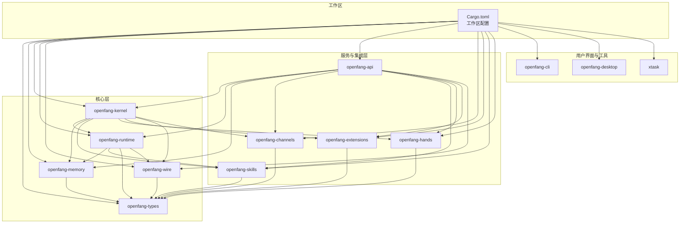
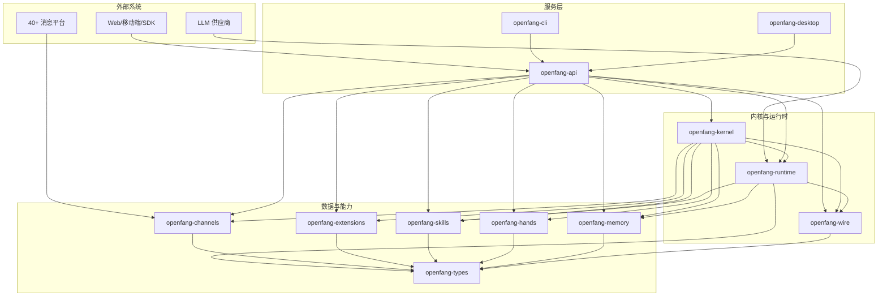
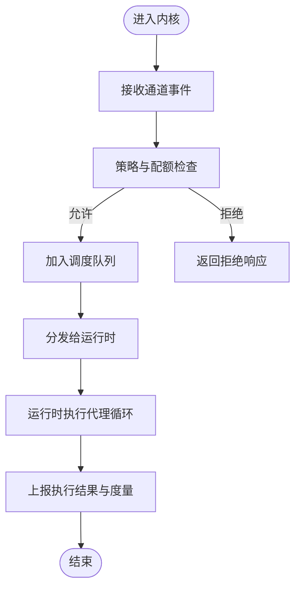
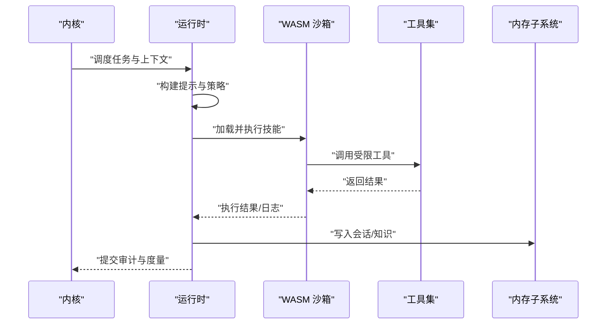
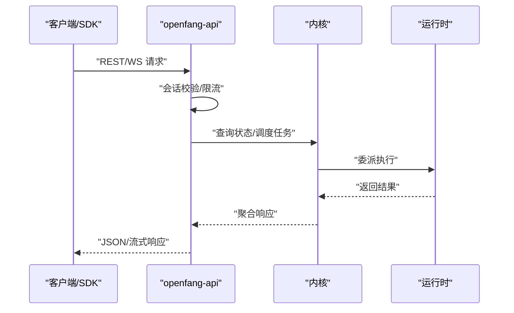
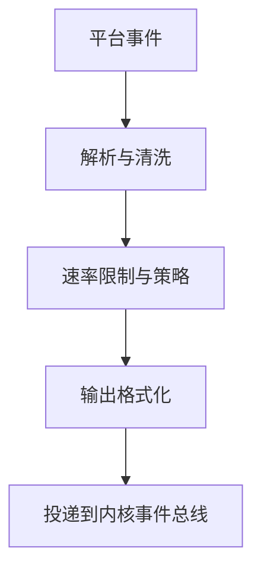
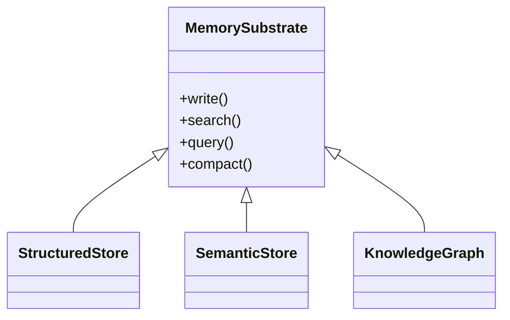
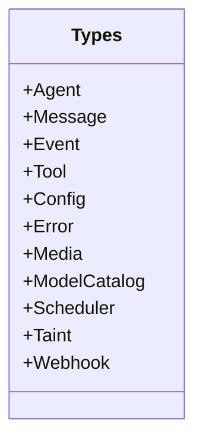
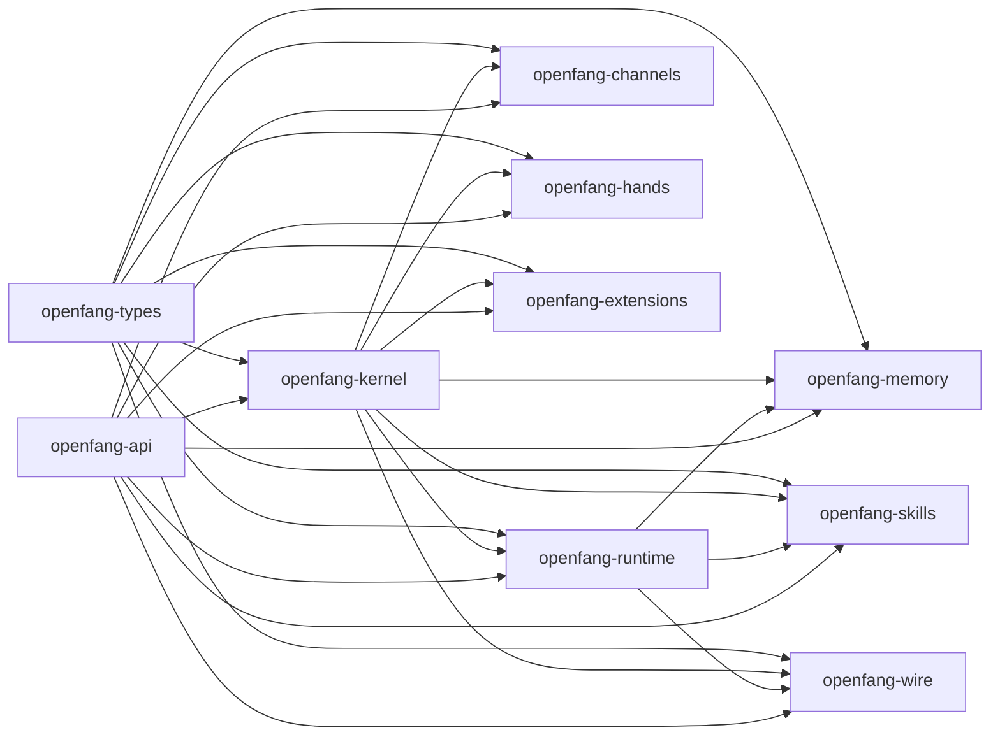

# 架构概览

<cite>
**本文引用的文件**
- [README.md](file://README.md)
- [Cargo.toml](file://Cargo.toml)
- [crates/openfang-kernel/Cargo.toml](file://crates/openfang-kernel/Cargo.toml)
- [crates/openfang-runtime/Cargo.toml](file://crates/openfang-runtime/Cargo.toml)
- [crates/openfang-api/Cargo.toml](file://crates/openfang-api/Cargo.toml)
- [crates/openfang-channels/Cargo.toml](file://crates/openfang-channels/Cargo.toml)
- [crates/openfang-types/Cargo.toml](file://crates/openfang-types/Cargo.toml)
- [crates/openfang-memory/Cargo.toml](file://crates/openfang-memory/Cargo.toml)
- [crates/openfang-skills/Cargo.toml](file://crates/openfang-skills/Cargo.toml)
- [crates/openfang-hands/Cargo.toml](file://crates/openfang-hands/Cargo.toml)
- [crates/openfang-extensions/Cargo.toml](file://crates/openfang-extensions/Cargo.toml)
- [crates/openfang-wire/Cargo.toml](file://crates/openfang-wire/Cargo.toml)
- [crates/openfang-kernel/src/lib.rs](file://crates/openfang-kernel/src/lib.rs)
- [crates/openfang-runtime/src/lib.rs](file://crates/openfang-runtime/src/lib.rs)
- [crates/openfang-api/src/lib.rs](file://crates/openfang-api/src/lib.rs)
- [crates/openfang-types/src/lib.rs](file://crates/openfang-types/src/lib.rs)
- [crates/openfang-memory/src/lib.rs](file://crates/openfang-memory/src/lib.rs)
- [crates/openfang-channels/src/lib.rs](file://crates/openfang-channels/src/lib.rs)
</cite>

## 目录
1. [引言](#引言)
2. [项目结构](#项目结构)
3. [核心组件](#核心组件)
4. [架构总览](#架构总览)
5. [详细组件分析](#详细组件分析)
6. [依赖分析](#依赖分析)
7. [性能考虑](#性能考虑)
8. [故障排查指南](#故障排查指南)
9. [结论](#结论)
10. [附录](#附录)

## 引言
OpenFang 是一个用 Rust 从零构建的开源“智能体操作系统”，目标是让智能体真正“为你工作”：自主运行、按计划执行、构建知识图谱、监控目标、生成线索、管理社交媒体并把结果汇报到仪表盘。整个系统编译为单一二进制文件（约 32MB），安装一次、一条命令即可启动，支持桌面端与 Web 仪表盘，并提供 137K+ 行代码、14 个核心 crate、1767+ 测试用例与零 Clippy 警告的质量基线。

本概览将围绕以下目标展开：
- 全面介绍 14 个核心 crate 的模块化设计与职责边界
- 解释微内核架构的设计原则、模块间依赖与数据流
- 阐述 137K+ 行代码的工程规模与组织方式
- 说明选择 Rust 作为主语言的技术考量（性能、安全、可维护性）
- 提供系统边界图与组件交互图，帮助不同技术背景读者理解整体布局

## 项目结构
OpenFang 采用多 crate 工作区（workspace）组织，所有 crate 均在根 Cargo.toml 中声明，统一版本、统一工具链与统一发布配置。核心 crate 按功能域划分，彼此通过类型与接口耦合，形成清晰的分层与边界。

图表来源
- [Cargo.toml:1-161](file://Cargo.toml#L1-L161)
- [crates/openfang-kernel/Cargo.toml:1-44](file://crates/openfang-kernel/Cargo.toml#L1-L44)
- [crates/openfang-runtime/Cargo.toml:1-38](file://crates/openfang-runtime/Cargo.toml#L1-L38)
- [crates/openfang-api/Cargo.toml:1-44](file://crates/openfang-api/Cargo.toml#L1-L44)
- [crates/openfang-channels/Cargo.toml:1-43](file://crates/openfang-channels/Cargo.toml#L1-L43)
- [crates/openfang-types/Cargo.toml:1-24](file://crates/openfang-types/Cargo.toml#L1-L24)
- [crates/openfang-memory/Cargo.toml:1-24](file://crates/openfang-memory/Cargo.toml#L1-L24)
- [crates/openfang-skills/Cargo.toml:1-28](file://crates/openfang-skills/Cargo.toml#L1-L28)
- [crates/openfang-hands/Cargo.toml:1-22](file://crates/openfang-hands/Cargo.toml#L1-L22)
- [crates/openfang-extensions/Cargo.toml:1-35](file://crates/openfang-extensions/Cargo.toml#L1-L35)
- [crates/openfang-wire/Cargo.toml:1-27](file://crates/openfang-wire/Cargo.toml#L1-L27)

章节来源
- [README.md:231-250](file://README.md#L231-L250)
- [Cargo.toml:1-161](file://Cargo.toml#L1-L161)

## 核心组件
本节对 14 个核心 crate 的职责进行分层说明，强调其在微内核架构中的定位与边界。

- openfang-types：定义跨模块共享的核心类型、事件、错误、签名与序列化兼容层，是所有 crate 的基础契约。
- openfang-memory：统一内存抽象，覆盖结构化存储（SQLite）、语义检索（未来向量库迁移）与知识图谱，为运行时与内核提供一致的访问接口。
- openfang-kernel：微内核中枢，负责代理生命周期、权限与配额、调度、工作流、触发器、配对、心跳、审计与监管等。
- openfang-runtime：智能体执行环境，包含 LLM 驱动抽象、工具执行、WASM 沙箱、MCP/A2A、会话修复、上下文预算与回退策略等。
- openfang-api：HTTP/WebSocket API 服务器，暴露 REST/WS/SSE 接口，提供仪表盘与 OpenAI 兼容 API，连接 CLI 与外部系统。
- openfang-channels：40 个消息通道适配器，将平台消息标准化为统一事件，支持速率限制、格式化与路由。
- openfang-skills：技能系统，包含内置技能、解析器、市场与 OpenClaw 兼容层。
- openfang-hands：7 个预置“手”（Hands），即自治能力包，含清单、系统提示与度量指标，独立运行并按计划执行。
- openfang-extensions：扩展与集成系统，提供 MCP 一键服务、凭据保险库、OAuth2 PKCE 等。
- openfang-wire：OFP（OpenFang Protocol）点对点协议，实现互信认证与消息路由。
- openfang-cli：CLI 与 TUI，支持守护进程管理、MCP 服务模式与初始化向导。
- openfang-desktop：基于 Tauri 的原生应用（托盘、通知、全局快捷键）。
- openfang-migrate：从 OpenClaw、LangChain、AutoGPT 等迁移的引擎。
- xtask：构建自动化任务。

章节来源
- [README.md:236-249](file://README.md#L236-L249)
- [crates/openfang-types/src/lib.rs:1-82](file://crates/openfang-types/src/lib.rs#L1-L82)
- [crates/openfang-memory/src/lib.rs:1-20](file://crates/openfang-memory/src/lib.rs#L1-L20)
- [crates/openfang-kernel/src/lib.rs:1-30](file://crates/openfang-kernel/src/lib.rs#L1-L30)
- [crates/openfang-runtime/src/lib.rs:1-59](file://crates/openfang-runtime/src/lib.rs#L1-L59)
- [crates/openfang-api/src/lib.rs:1-18](file://crates/openfang-api/src/lib.rs#L1-L18)
- [crates/openfang-channels/src/lib.rs:1-55](file://crates/openfang-channels/src/lib.rs#L1-L55)
- [crates/openfang-skills/Cargo.toml:1-28](file://crates/openfang-skills/Cargo.toml#L1-L28)
- [crates/openfang-hands/Cargo.toml:1-22](file://crates/openfang-hands/Cargo.toml#L1-L22)
- [crates/openfang-extensions/Cargo.toml:1-35](file://crates/openfang-extensions/Cargo.toml#L1-L35)
- [crates/openfang-wire/Cargo.toml:1-27](file://crates/openfang-wire/Cargo.toml#L1-L27)

## 架构总览
OpenFang 采用“微内核 + 插件化服务”的架构。内核（kernel）提供统一的调度、权限、配额与监管；运行时（runtime）承载智能体执行、工具与沙箱；API 层对外提供 HTTP/WebSocket 接口；通道层（channels）将多平台消息桥接为统一事件；记忆层（memory）提供统一的结构化/语义/知识图谱访问；其余 crate 分别负责技能、手、扩展、协议与桌面/CLI。

图表来源
- [README.md:231-250](file://README.md#L231-L250)
- [crates/openfang-api/Cargo.toml:1-44](file://crates/openfang-api/Cargo.toml#L1-L44)
- [crates/openfang-kernel/Cargo.toml:1-44](file://crates/openfang-kernel/Cargo.toml#L1-L44)
- [crates/openfang-runtime/Cargo.toml:1-38](file://crates/openfang-runtime/Cargo.toml#L1-L38)
- [crates/openfang-channels/Cargo.toml:1-43](file://crates/openfang-channels/Cargo.toml#L1-L43)
- [crates/openfang-types/Cargo.toml:1-24](file://crates/openfang-types/Cargo.toml#L1-L24)
- [crates/openfang-memory/Cargo.toml:1-24](file://crates/openfang-memory/Cargo.toml#L1-L24)
- [crates/openfang-skills/Cargo.toml:1-28](file://crates/openfang-skills/Cargo.toml#L1-L28)
- [crates/openfang-hands/Cargo.toml:1-22](file://crates/openfang-hands/Cargo.toml#L1-L22)
- [crates/openfang-extensions/Cargo.toml:1-35](file://crates/openfang-extensions/Cargo.toml#L1-L35)
- [crates/openfang-wire/Cargo.toml:1-27](file://crates/openfang-wire/Cargo.toml#L1-L27)

## 详细组件分析

### 微内核（openfang-kernel）
- 职责边界：内核是系统的中枢，负责代理生命周期、权限与配额、调度、工作流、触发器、配对、心跳、审计与监管等。它不直接处理网络或工具调用，而是通过事件总线与运行时协作。
- 关键模块：approval、auth、capabilities、scheduler、workflow、registry、supervisor、heartbeat、event_bus、metering、trigger、wizard、whatsapp_gateway 等。
- 数据流：接收来自通道层的消息事件，经路由与策略判断后，调度到运行时执行；同时向 API 层暴露状态查询与控制接口。

图表来源
- [crates/openfang-kernel/src/lib.rs:1-30](file://crates/openfang-kernel/src/lib.rs#L1-L30)

章节来源
- [crates/openfang-kernel/src/lib.rs:1-30](file://crates/openfang-kernel/src/lib.rs#L1-L30)

### 运行时（openfang-runtime）
- 职责边界：承载智能体执行循环、LLM 驱动抽象、工具执行、WASM 沙箱、MCP/A2A、会话修复、上下文预算与回退策略等。
- 关键模块：agent_loop、drivers、sandbox、tool_runner、mcp、mcp_server、web_search、web_fetch、python_runtime、docker_sandbox、workspace_sandbox、prompt_builder、routing、retry、audit、loop_guard、provider_health 等。
- 数据流：从内核获取待执行任务，加载技能与工具，执行 WASM 沙箱中的技能代码，聚合输出并通过内核上报。

图表来源
- [crates/openfang-runtime/src/lib.rs:1-59](file://crates/openfang-runtime/src/lib.rs#L1-L59)

章节来源
- [crates/openfang-runtime/src/lib.rs:1-59](file://crates/openfang-runtime/src/lib.rs#L1-L59)

### API 层（openfang-api）
- 职责边界：提供 140+ REST/WS/SSE 端点，OpenAI 兼容 API，仪表盘前端资源与会话认证；作为内核的外部入口。
- 关键模块：routes、server、openai_compat、ws、session_auth、rate_limiter、channel_bridge、stream_chunker、stream_dedup 等。
- 数据流：接收客户端请求，校验会话与速率限制，调用内核/运行时能力，返回 JSON/流式响应。

图表来源
- [crates/openfang-api/src/lib.rs:1-18](file://crates/openfang-api/src/lib.rs#L1-L18)

章节来源
- [crates/openfang-api/src/lib.rs:1-18](file://crates/openfang-api/src/lib.rs#L1-L18)

### 通道层（openfang-channels）
- 职责边界：提供 40 个消息平台适配器，将平台消息转换为统一 ChannelMessage 事件，支持速率限制、DM/群组策略与输出格式化。
- 关键模块：telegram、slack、discord、whatsapp、email、matrix、rocketchat、teams、signal、irc、bluesky、feishu、line、mastodon、linkedin、twitch、xmpp、zulip、flock、guilded、keybase、nextcloud、nostr、pumble、threema、twist、webhook、dingtalk、dingtalk_stream、discourse、gitter、gotify、mumble、wecom 等。
- 数据流：各适配器监听平台事件，解析为统一消息，经速率限制与格式化后投递到内核事件总线。

图表来源
- [crates/openfang-channels/src/lib.rs:1-55](file://crates/openfang-channels/src/lib.rs#L1-L55)

章节来源
- [crates/openfang-channels/src/lib.rs:1-55](file://crates/openfang-channels/src/lib.rs#L1-L55)

### 记忆层（openfang-memory）
- 职责边界：统一内存抽象，覆盖结构化存储（SQLite）、语义检索（Phase 1 LIKE 匹配，Phase 2 向量化）与知识图谱，为运行时与内核提供一致的访问接口。
- 关键模块：structured、semantic、knowledge、session、consolidation、migration、usage、substrate。
- 数据流：运行时/内核通过 Memory trait 写入/查询会话、知识与统计信息，内部路由到对应后端。

图表来源
- [crates/openfang-memory/src/lib.rs:1-20](file://crates/openfang-memory/src/lib.rs#L1-L20)

章节来源
- [crates/openfang-memory/src/lib.rs:1-20](file://crates/openfang-memory/src/lib.rs#L1-L20)

### 类型与契约（openfang-types）
- 职责边界：定义跨模块共享的数据结构、事件、错误、签名与序列化兼容层，确保各模块间无业务逻辑耦合。
- 关键模块：agent、approval、capability、comms、config、error、event、manifest_signing、media、memory、message、model_catalog、scheduler、serde_compat、taint、tool、tool_compat、webhook。
- 辅助函数：字符串安全截断等通用工具。

图表来源
- [crates/openfang-types/src/lib.rs:1-82](file://crates/openfang-types/src/lib.rs#L1-L82)

章节来源
- [crates/openfang-types/src/lib.rs:1-82](file://crates/openfang-types/src/lib.rs#L1-L82)

### 技能系统（openfang-skills）
- 职责边界：内置技能目录、解析器（SKILL.md）、市场（FangHub）与 OpenClaw 兼容层。
- 关键模块：loader、marketplace、verify、bundled、clawhub、registry、openclaw_compat。
- 数据流：从本地/远程加载技能清单与内容，解析为运行时可用的工具集合。

章节来源
- [crates/openfang-skills/Cargo.toml:1-28](file://crates/openfang-skills/Cargo.toml#L1-L28)

### 手（Hands）系统（openfang-hands）
- 职责边界：7 个预置自治能力包（Clip、Lead、Collector、Predictor、Researcher、Twitter、Browser），含 HAND.toml 清单、系统提示与度量指标。
- 关键模块：bundled（含各 HAND 的 HAND.toml 与 SKILL.md）、registry、bundled.rs、lib.rs。
- 数据流：由内核调度生命周期（激活/暂停/重置），按计划执行并产出报告与指标。

章节来源
- [README.md:78-108](file://README.md#L78-L108)

### 扩展系统（openfang-extensions）
- 职责边界：MCP 一键服务、凭据保险库（AES-256-GCM）、OAuth2 PKCE、模板注册与健康检查。
- 关键模块：installer、registry、vault、oauth、credentials、health、bundled、lib.rs。
- 数据流：为第三方工具与服务提供安全接入与统一管理。

章节来源
- [crates/openfang-extensions/Cargo.toml:1-35](file://crates/openfang-extensions/Cargo.toml#L1-L35)

### 协议（openfang-wire）
- 职责边界：OFP（OpenFang Protocol）点对点协议，实现 HMAC-SHA256 互信认证与消息路由。
- 关键模块：peer、registry、message、lib.rs。
- 数据流：在受信任节点间建立安全通道，转发内核/运行时消息。

章节来源
- [crates/openfang-wire/Cargo.toml:1-27](file://crates/openfang-wire/Cargo.toml#L1-L27)

### CLI 与桌面（openfang-cli / openfang-desktop）
- 职责边界：CLI 提供守护进程管理、TUI 仪表盘、MCP 服务模式；桌面应用提供托盘、通知与全局快捷键。
- 数据流：CLI/桌面通过 HTTP 与 API 通信，实现对内核/运行时的可视化与命令式控制。

章节来源
- [README.md:444-460](file://README.md#L444-L460)

## 依赖分析
- 统一依赖：工作区集中声明 tokio、serde、chrono、uuid、dashmap、tracing、reqwest、axum、wasmtime、governor 等，保证版本一致性与跨 crate 的互操作。
- 内聚与解耦：openfang-types 为所有 crate 的基础契约；openfang-kernel 作为中枢协调其他模块；openfang-runtime 与 openfang-memory 紧密协作；openfang-api 仅作为门面；openfang-channels、openfang-skills、openfang-hands、openfang-extensions、openfang-wire 各司其职，通过类型与事件耦合。
- 外部依赖：HTTP 客户端（reqwest）、异步运行时（tokio）、序列化（serde）、数据库（rusqlite）、WASM（wasmtime）、加密（ed25519、aes-gcm、argon2、hmac）、速率限制（governor）、WebSocket（tokio-tungstenite）等。

图表来源
- [Cargo.toml:25-147](file://Cargo.toml#L25-L147)
- [crates/openfang-kernel/Cargo.toml:8-36](file://crates/openfang-kernel/Cargo.toml#L8-L36)
- [crates/openfang-runtime/Cargo.toml:8-31](file://crates/openfang-runtime/Cargo.toml#L8-L31)
- [crates/openfang-api/Cargo.toml:8-38](file://crates/openfang-api/Cargo.toml#L8-L38)
- [crates/openfang-channels/Cargo.toml:8-39](file://crates/openfang-channels/Cargo.toml#L8-L39)
- [crates/openfang-types/Cargo.toml:8-21](file://crates/openfang-types/Cargo.toml#L8-L21)
- [crates/openfang-memory/Cargo.toml:8-20](file://crates/openfang-memory/Cargo.toml#L8-L20)
- [crates/openfang-skills/Cargo.toml:8-23](file://crates/openfang-skills/Cargo.toml#L8-L23)
- [crates/openfang-hands/Cargo.toml:8-17](file://crates/openfang-hands/Cargo.toml#L8-L17)
- [crates/openfang-extensions/Cargo.toml:8-30](file://crates/openfang-extensions/Cargo.toml#L8-L30)
- [crates/openfang-wire/Cargo.toml:8-23](file://crates/openfang-wire/Cargo.toml#L8-L23)

章节来源
- [Cargo.toml:1-161](file://Cargo.toml#L1-L161)

## 性能考虑
- 编译优化：工作区启用 LTO、单代码生成单元与符号裁剪，兼顾体积与性能；提供 release-fast 配置以平衡编译速度与优化级别。
- 并发模型：基于 tokio 的异步运行时，结合 crossbeam、dashmap 实现高并发下的低锁争用与高效事件总线。
- I/O 与网络：HTTP 使用 axum + tower-http（CORS、压缩、追踪），WebSocket 使用 tokio-tungstenite；通道适配器针对不同平台优化连接与速率限制。
- 存储与检索：SQLite 结构化存储 + 语义检索（未来向量库迁移），会话与知识图谱统一抽象，减少重复扫描与序列化开销。
- 沙箱与隔离：WASM 双计费（燃料）+ 代际中断 + 守望线程，子进程沙箱（env_clear + 变量白名单）与工作空间隔离，避免资源滥用。
- 冷启动与内存：基准测试显示冷启动时间与空闲内存占用显著优于同类框架，得益于单二进制与精简依赖。

章节来源
- [Cargo.toml:149-161](file://Cargo.toml#L149-L161)
- [README.md:117-186](file://README.md#L117-L186)

## 故障排查指南
- 审计与溯源：Merkele 哈希链审计、信息流污点跟踪、Ed25519 签名的代理清单，便于定位异常与回溯。
- 会话修复：7 步消息历史验证与自动恢复，降低消息损坏导致的执行中断。
- 回退与重试：智能 LLM 提供商路由、成本与延迟感知的自动回退、指数退避与超时控制。
- 循环检测：基于 SHA256 的工具调用循环检测与断路器，防止“乒乓”式调用。
- 网络与 SSRF：私网地址阻断、云元数据端点拦截、DNS 重绑定防护。
- 速率限制：GCRA 成本感知令牌桶，支持每 IP 跟踪与过期清理。
- 路径遍历与输入净化：规范化 + 符号链接逃逸防护、HTML 实体解码、正则轻量清洗。

章节来源
- [README.md:206-228](file://README.md#L206-L228)

## 结论
OpenFang 以 Rust 为基石，采用微内核架构与多 crate 工作区组织，实现了高性能、强安全与高可维护性的统一。14 个核心 crate 各司其职、边界清晰，通过 openfang-types 契约与事件总线协同，形成从通道接入、内核调度、运行时执行到 API 对外的完整闭环。工程规模与质量基线（137K+ 行代码、1767+ 测试、零 Clippy 警告）体现了对稳定性的极致追求。对于希望构建“真正为你工作的智能体”的团队与个人，OpenFang 提供了可信赖的基础设施与扩展生态。

## 附录
- 快速开始与基准对比：参见项目自述文件中的快速入门与多维度基准对比。
- 安全系统一览：16 层纵深防御体系，覆盖沙箱、审计、污点、签名、SSRF、凭据清理、互信认证、能力门禁、安全头、健康端点脱敏、子进程沙箱、提示注入扫描、循环检测、会话修复、路径遍历与 GCRA 速率限制。

章节来源
- [README.md:407-460](file://README.md#L407-L460)
- [README.md:117-186](file://README.md#L117-L186)
- [README.md:206-228](file://README.md#L206-L228)