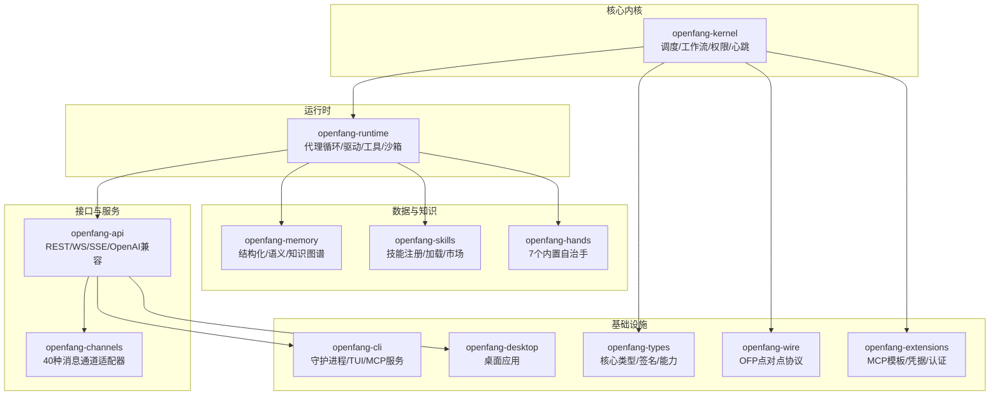
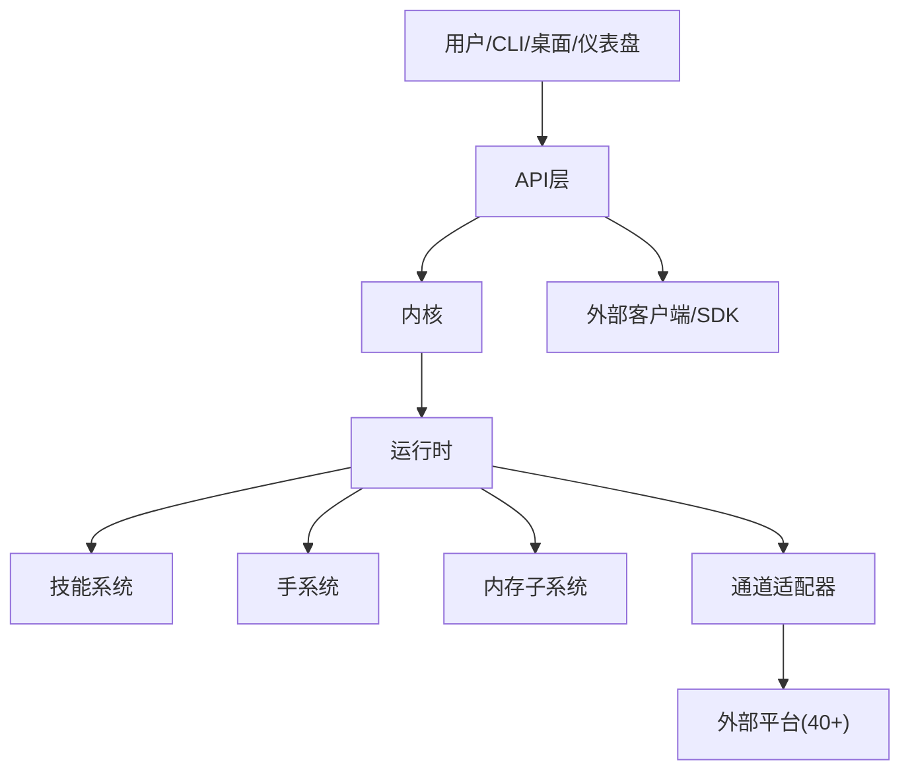
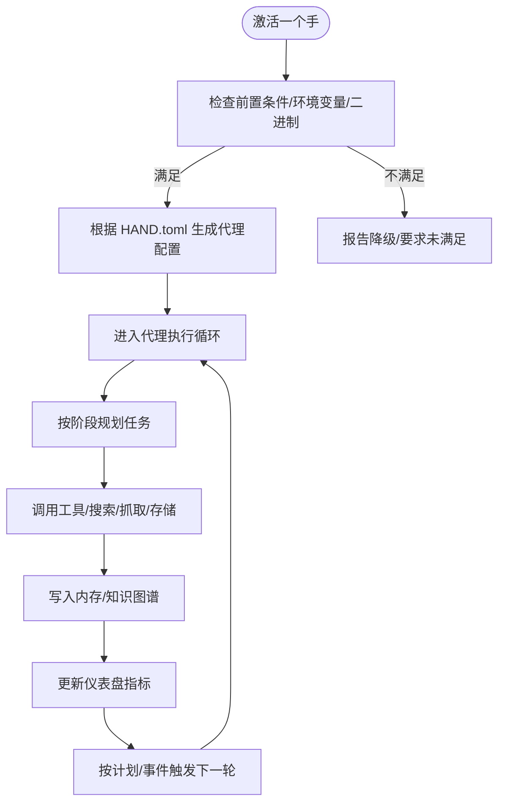
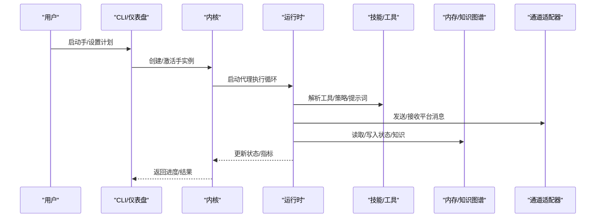
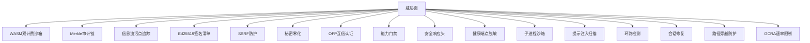
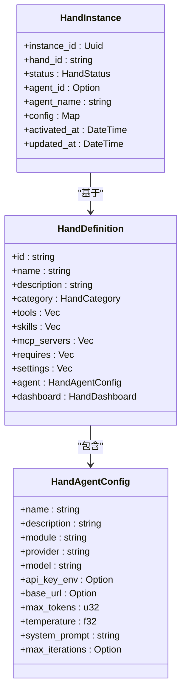
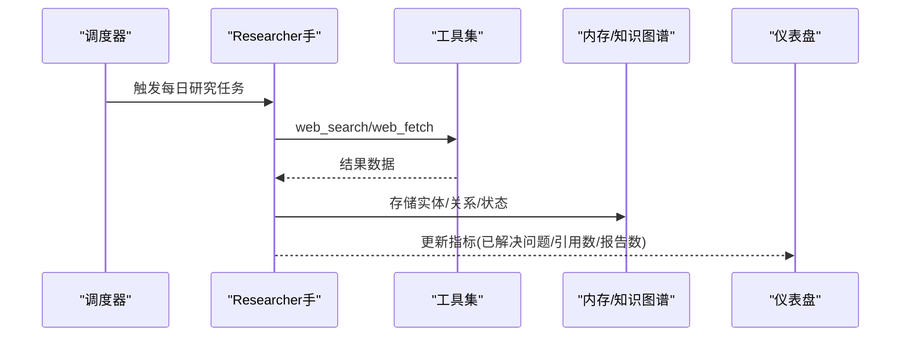
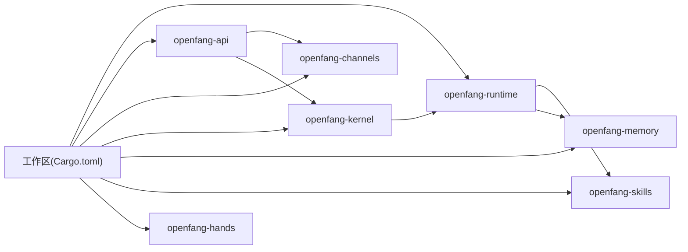

# 核心价值与定位

<cite>
**本文引用的文件**
- [README.md](file://README.md)
- [Cargo.toml](file://Cargo.toml)
- [openfang.toml.example](file://openfang.toml.example)
- [crates/openfang-kernel/src/lib.rs](file://crates/openfang-kernel/src/lib.rs)
- [crates/openfang-runtime/src/lib.rs](file://crates/openfang-runtime/src/lib.rs)
- [crates/openfang-api/src/lib.rs](file://crates/openfang-api/src/lib.rs)
- [crates/openfang-channels/src/lib.rs](file://crates/openfang-channels/src/lib.rs)
- [crates/openfang-memory/src/lib.rs](file://crates/openfang-memory/src/lib.rs)
- [crates/openfang-skills/src/lib.rs](file://crates/openfang-skills/src/lib.rs)
- [crates/openfang-hands/src/lib.rs](file://crates/openfang-hands/src/lib.rs)
- [crates/openfang-hands/bundled/researcher/HAND.toml](file://crates/openfang-hands/bundled/researcher/HAND.toml)
- [crates/openfang-hands/bundled/browser/HAND.toml](file://crates/openfang-hands/bundled/browser/HAND.toml)
- [crates/openfang-hands/bundled/lead/HAND.toml](file://crates/openfang-hands/bundled/lead/HAND.toml)
- [agents/researcher/agent.toml](file://agents/researcher/agent.toml)
- [agents/analyst/agent.toml](file://agents/analyst/agent.toml)
</cite>

## 目录
1. [引言](#引言)
2. [项目结构](#项目结构)
3. [核心组件](#核心组件)
4. [架构总览](#架构总览)
5. [详细组件分析](#详细组件分析)
6. [依赖关系分析](#依赖关系分析)
7. [性能考量](#性能考量)
8. [故障排查指南](#故障排查指南)
9. [结论](#结论)
10. [附录](#附录)

## 引言
本节面向初学者与开发者，系统阐述 OpenFang 的核心价值与定位：它不是“聊天机器人框架”，而是“开源智能体操作系统”。OpenFang 的根本区别在于：
- 将“智能体”从“被动应答”升级为“主动自治”：以“手（Hands）”为核心，实现无需用户交互的自主运行与持续产出。
- 单二进制部署：一键安装、一次启动、即刻运行，降低运维门槛。
- 16 层安全防护体系：从沙箱到审计链，形成纵深防御。
- 预构建自治手系统：内置多类“手”，覆盖研究、销售线索、浏览器自动化、情报采集等高频业务场景。

这些特性共同构成 OpenFang 的差异化优势，并在后续章节中通过架构、组件与实战场景进行深入解析。

**章节来源**
- [README.md:36-61](file://README.md#L36-L61)
- [README.md:40](file://README.md#L40)
- [README.md:42](file://README.md#L42)
- [README.md:64-108](file://README.md#L64-L108)
- [README.md:206-228](file://README.md#L206-L228)

## 项目结构
OpenFang 采用模块化工作区设计，由 14 个核心 crate 组成，围绕内核、运行时、API、通道适配、内存、技能、手、扩展、类型、通信协议等分层组织。整体结构强调“内核编排 + 运行时执行 + 多通道接入 + 安全与审计”的统一平台。

**图表来源**
- [Cargo.toml:1-17](file://Cargo.toml#L1-L17)
- [crates/openfang-kernel/src/lib.rs:1-30](file://crates/openfang-kernel/src/lib.rs#L1-L30)
- [crates/openfang-runtime/src/lib.rs:1-59](file://crates/openfang-runtime/src/lib.rs#L1-L59)
- [crates/openfang-api/src/lib.rs:1-19](file://crates/openfang-api/src/lib.rs#L1-L19)
- [crates/openfang-channels/src/lib.rs:1-56](file://crates/openfang-channels/src/lib.rs#L1-L56)
- [crates/openfang-memory/src/lib.rs:1-20](file://crates/openfang-memory/src/lib.rs#L1-L20)
- [crates/openfang-skills/src/lib.rs:1-255](file://crates/openfang-skills/src/lib.rs#L1-L255)
- [crates/openfang-hands/src/lib.rs:1-800](file://crates/openfang-hands/src/lib.rs#L1-L800)

**章节来源**
- [Cargo.toml:1-17](file://Cargo.toml#L1-L17)
- [README.md:231-250](file://README.md#L231-L250)

## 核心组件
- 内核（Kernel）：负责代理生命周期、调度、工作流、权限与事件总线，是系统中枢。
- 运行时（Runtime）：承载代理执行循环、LLM 驱动抽象、工具执行与 WASM 沙箱，确保可扩展与安全。
- API 层（API）：提供 140+ 接口，含 OpenAI 兼容端点、WebSocket 与 SSE，支持仪表盘与外部集成。
- 通道适配（Channels）：40 个消息平台适配器，统一消息桥接与策略控制。
- 内存（Memory）：结构化（SQLite）、语义（向量/全文）、知识图谱三库合一，支撑上下文与长期记忆。
- 技能（Skills）：可插拔工具包，支持 Python/WASM/Node/Shell 等运行时，具备来源追踪与安全策略。
- 手（Hands）：7 个预置自治能力包，声明式配置（HAND.toml），内置系统提示与仪表盘指标。
- 类型与协议（Types/Wire）：统一数据模型、Ed25519 签名、OFP 互信认证。
- 扩展（Extensions）：MCP 模板、凭据保险库、OAuth2 PKCE 等增强生态。

**章节来源**
- [crates/openfang-kernel/src/lib.rs:1-30](file://crates/openfang-kernel/src/lib.rs#L1-L30)
- [crates/openfang-runtime/src/lib.rs:1-59](file://crates/openfang-runtime/src/lib.rs#L1-L59)
- [crates/openfang-api/src/lib.rs:1-19](file://crates/openfang-api/src/lib.rs#L1-L19)
- [crates/openfang-channels/src/lib.rs:1-56](file://crates/openfang-channels/src/lib.rs#L1-L56)
- [crates/openfang-memory/src/lib.rs:1-20](file://crates/openfang-memory/src/lib.rs#L1-L20)
- [crates/openfang-skills/src/lib.rs:1-255](file://crates/openfang-skills/src/lib.rs#L1-L255)
- [crates/openfang-hands/src/lib.rs:1-800](file://crates/openfang-hands/src/lib.rs#L1-L800)

## 架构总览
下图展示 OpenFang 的端到端运行路径：用户通过 CLI/桌面/仪表盘触发，内核编排代理，运行时执行工具与 LLM 调用，通道适配器连接外部平台，内存与知识图谱持久化状态与知识，API 提供统一对外接口。

**图表来源**
- [crates/openfang-api/src/lib.rs:1-19](file://crates/openfang-api/src/lib.rs#L1-L19)
- [crates/openfang-kernel/src/lib.rs:1-30](file://crates/openfang-kernel/src/lib.rs#L1-L30)
- [crates/openfang-runtime/src/lib.rs:1-59](file://crates/openfang-runtime/src/lib.rs#L1-L59)
- [crates/openfang-channels/src/lib.rs:1-56](file://crates/openfang-channels/src/lib.rs#L1-L56)
- [crates/openfang-memory/src/lib.rs:1-20](file://crates/openfang-memory/src/lib.rs#L1-L20)
- [crates/openfang-skills/src/lib.rs:1-255](file://crates/openfang-skills/src/lib.rs#L1-L255)
- [crates/openfang-hands/src/lib.rs:1-800](file://crates/openfang-hands/src/lib.rs#L1-L800)

## 详细组件分析

### 自主智能体与“手（Hands）”系统
- “自主智能体”理念：OpenFang 不等待用户输入，而是按计划或事件驱动执行任务，持续产出结果。这与传统“聊天机器人”形成鲜明对比。
- “手（Hands）”是 OpenFang 的核心创新：预置自治能力包，声明式配置（工具、设置、要求、仪表盘指标），无需用户交互即可运行。
- 7 个内置手覆盖内容创作、销售线索、情报研究、浏览器自动化、预测与研究、社交账号管理等场景。

**图表来源**
- [crates/openfang-hands/src/lib.rs:328-427](file://crates/openfang-hands/src/lib.rs#L328-L427)
- [crates/openfang-hands/bundled/researcher/HAND.toml:154-398](file://crates/openfang-hands/bundled/researcher/HAND.toml#L154-L398)
- [crates/openfang-hands/bundled/browser/HAND.toml:110-255](file://crates/openfang-hands/bundled/browser/HAND.toml#L110-L255)
- [crates/openfang-hands/bundled/lead/HAND.toml:161-336](file://crates/openfang-hands/bundled/lead/HAND.toml#L161-L336)

**章节来源**
- [README.md:64-108](file://README.md#L64-L108)
- [crates/openfang-hands/src/lib.rs:1-800](file://crates/openfang-hands/src/lib.rs#L1-L800)
- [crates/openfang-hands/bundled/researcher/HAND.toml:1-398](file://crates/openfang-hands/bundled/researcher/HAND.toml#L1-L398)
- [crates/openfang-hands/bundled/browser/HAND.toml:1-255](file://crates/openfang-hands/bundled/browser/HAND.toml#L1-L255)
- [crates/openfang-hands/bundled/lead/HAND.toml:1-336](file://crates/openfang-hands/bundled/lead/HAND.toml#L1-L336)

### 与传统 Agent 框架的差异：无需用户交互的自主运行
- 传统框架：需要用户持续输入，智能体处于“待命”状态；OpenFang 的手在后台按计划/事件自动运行，产出结果后回传至仪表盘或通道。
- 机制差异：OpenFang 通过内核的调度与工作流、运行时的代理循环、通道适配器的消息桥接，形成“无人值守”的闭环。

**图表来源**
- [crates/openfang-kernel/src/lib.rs:1-30](file://crates/openfang-kernel/src/lib.rs#L1-L30)
- [crates/openfang-runtime/src/lib.rs:1-59](file://crates/openfang-runtime/src/lib.rs#L1-L59)
- [crates/openfang-channels/src/lib.rs:1-56](file://crates/openfang-channels/src/lib.rs#L1-L56)
- [crates/openfang-memory/src/lib.rs:1-20](file://crates/openfang-memory/src/lib.rs#L1-L20)

**章节来源**
- [README.md:36-61](file://README.md#L36-L61)
- [crates/openfang-kernel/src/lib.rs:1-30](file://crates/openfang-kernel/src/lib.rs#L1-L30)
- [crates/openfang-runtime/src/lib.rs:1-59](file://crates/openfang-runtime/src/lib.rs#L1-L59)

### 单二进制部署的优势
- 体积小、冷启动快、安装简单：OpenFang 编译为单一二进制，便于分发与部署，适合服务器与边缘环境。
- 一致性高：无额外依赖（除必要系统库），减少环境漂移与兼容性问题。
- 快速上线：初始化后直接启动，无需复杂的容器编排或多进程管理。

**章节来源**
- [README.md:42](file://README.md#L42)
- [README.md:407-431](file://README.md#L407-L431)

### 16 层安全防护体系的设计理念
OpenFang 将安全视为“内核属性”，而非事后补丁，覆盖执行、网络、凭证、审计、认证、策略等维度，形成“纵深防御”。

**图表来源**
- [README.md:206-228](file://README.md#L206-L228)

**章节来源**
- [README.md:206-228](file://README.md#L206-L228)

### 预构建自治手系统的技术创新
- 声明式配置：通过 HAND.toml 描述工具、设置、要求、仪表盘指标与系统提示，实现“所见即所得”的能力装配。
- 可观测性：每个手定义仪表盘指标，结合内存键值，实时展示运行状态与产出。
- 可扩展性：支持选择/文本/开关等设置类型，动态注入环境变量与提示词块，适配不同提供商与本地资源。
- 安全边界：部分手（如浏览器手）强制购买审批流程，防止自动支付风险。

**图表来源**
- [crates/openfang-hands/src/lib.rs:328-427](file://crates/openfang-hands/src/lib.rs#L328-L427)
- [crates/openfang-hands/src/lib.rs:274-296](file://crates/openfang-hands/src/lib.rs#L274-L296)

**章节来源**
- [crates/openfang-hands/src/lib.rs:1-800](file://crates/openfang-hands/src/lib.rs#L1-L800)
- [crates/openfang-hands/bundled/researcher/HAND.toml:1-398](file://crates/openfang-hands/bundled/researcher/HAND.toml#L1-L398)
- [crates/openfang-hands/bundled/browser/HAND.toml:1-255](file://crates/openfang-hands/bundled/browser/HAND.toml#L1-L255)
- [crates/openfang-hands/bundled/lead/HAND.toml:1-336](file://crates/openfang-hands/bundled/lead/HAND.toml#L1-L336)

### 使用场景对比与实战案例
- 竞争情报收集（Researcher 手）
  - 场景：每日定时发现目标公司/话题，跨源交叉验证，生成结构化报告并入库。
  - 差异：无需人工干预，按计划自动运行；传统框架需用户持续提问。
- 社交媒体管理（Social 手）
  - 场景：自动发布内容、跟踪表现、回复互动，支持审批队列。
  - 差异：手在后台执行，用户仅在必要时确认关键动作。
- 销售线索生成（Lead 手）
  - 场景：按 ICP/角色/地区筛选，自动发现、丰富、去重、打分并导出报告。
  - 差异：手按日程周期性产出，替代“临时查询”模式。
- 浏览器自动化（Browser 手）
  - 场景：自动完成表单填写、下单前审批、截图留痕。
  - 差异：严格的安全门禁，禁止自动支付，保障资金安全。

**图表来源**
- [crates/openfang-hands/bundled/researcher/HAND.toml:154-398](file://crates/openfang-hands/bundled/researcher/HAND.toml#L154-L398)
- [crates/openfang-hands/src/lib.rs:367-427](file://crates/openfang-hands/src/lib.rs#L367-L427)

**章节来源**
- [README.md:78-108](file://README.md#L78-L108)
- [crates/openfang-hands/bundled/researcher/HAND.toml:1-398](file://crates/openfang-hands/bundled/researcher/HAND.toml#L1-L398)
- [crates/openfang-hands/bundled/browser/HAND.toml:1-255](file://crates/openfang-hands/bundled/browser/HAND.toml#L1-L255)
- [crates/openfang-hands/bundled/lead/HAND.toml:1-336](file://crates/openfang-hands/bundled/lead/HAND.toml#L1-L336)

## 依赖关系分析
- 工作区聚合：所有 crate 在工作区中统一管理，共享依赖版本与构建配置。
- 运行时依赖：Tokio 异步运行时、Axum HTTP 服务、WASM 时钟沙箱、加密与安全库、数据库与序列化等。
- 组件耦合：内核与运行时强耦合（编排与执行），API 与通道适配器弱耦合（通过统一事件/消息），内存与技能/手通过统一接口访问。

**图表来源**
- [Cargo.toml:1-17](file://Cargo.toml#L1-L17)
- [Cargo.toml:26-144](file://Cargo.toml#L26-L144)

**章节来源**
- [Cargo.toml:1-17](file://Cargo.toml#L1-L17)
- [Cargo.toml:26-144](file://Cargo.toml#L26-L144)

## 性能考量
- 冷启动时间：相比主流框架，OpenFang 具备更优的冷启动表现，适合快速响应与低延迟场景。
- 内存占用：在空闲状态下保持较低内存占用，兼顾资源效率与稳定性。
- 安装体积：单二进制部署显著降低安装体积，便于边缘与容器环境分发。
- 并发与吞吐：基于异步运行时与多通道适配器，支持高并发消息处理与任务调度。

**章节来源**
- [README.md:117-186](file://README.md#L117-L186)

## 故障排查指南
- 配置检查：核对默认模型、监听地址、通道令牌与 MCP 服务器配置，确保环境变量正确。
- 日志与审计：利用内存中的会话与知识图谱，结合 Merkle 审计链定位异常轨迹。
- 安全告警：关注污点追踪、提示注入扫描、环路检测与会话修复等机制的告警输出。
- 通道连通性：检查通道适配器的健康状态与速率限制，确认平台凭据与策略设置。

**章节来源**
- [openfang.toml.example:1-49](file://openfang.toml.example#L1-L49)
- [README.md:206-228](file://README.md#L206-L228)

## 结论
OpenFang 以“自主智能体操作系统”为定位，通过内核编排、运行时执行、通道接入与安全审计的完整闭环，实现了“无需用户交互的自主运行”。其单二进制部署、16 层安全体系与预构建自治手系统，构成了面向生产的差异化优势。对于竞争情报、社交媒体运营、销售线索生成等场景，OpenFang 提供了稳定、可扩展且安全的自动化解决方案。

[本节为总结性内容，不直接分析具体文件]

## 附录
- 术语对照
  - 自主智能体：无需用户交互即可按计划/事件运行并产出结果的智能体。
  - 手（Hands）：预置的自治能力包，声明式配置与仪表盘指标。
  - 内核：系统中枢，负责调度、工作流、权限与事件。
  - 运行时：代理执行循环、工具执行与沙箱环境。
  - 通道适配器：40 种消息平台接入层。
  - 内存：结构化/语义/知识图谱三库合一。
  - 技能：可插拔工具包，支持多种运行时。
  - 审计链：基于 Merkle 哈希链的不可篡改记录。
  - 沙箱：WASM 双计费与子进程隔离，防止越权与资源滥用。

[本节为补充说明，不直接分析具体文件]