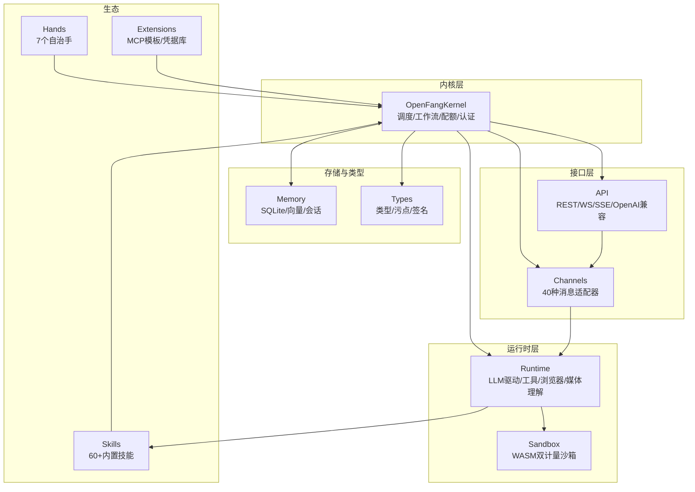
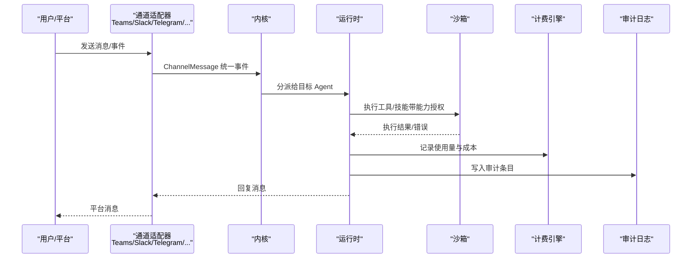
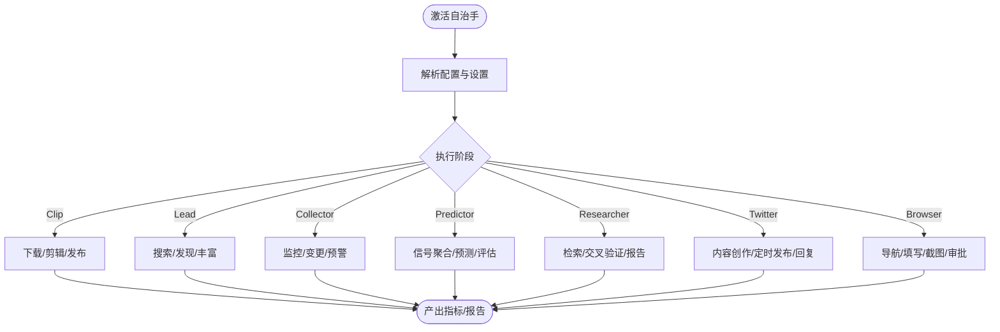
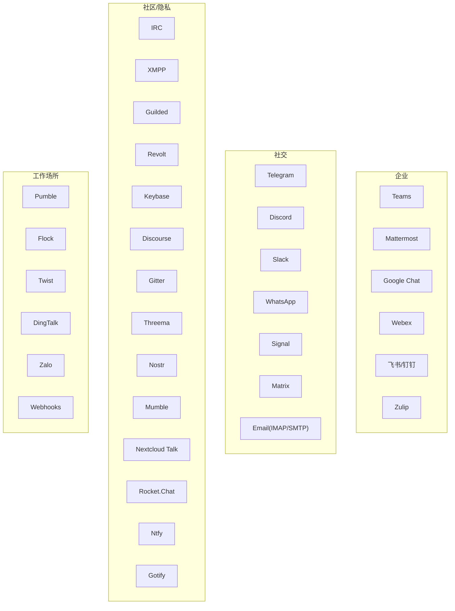
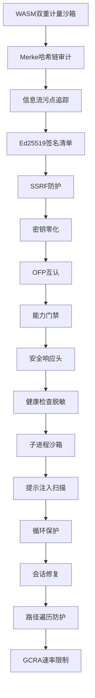
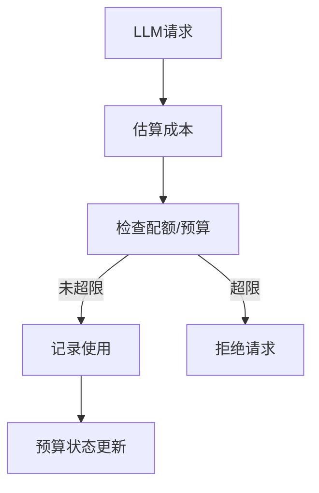
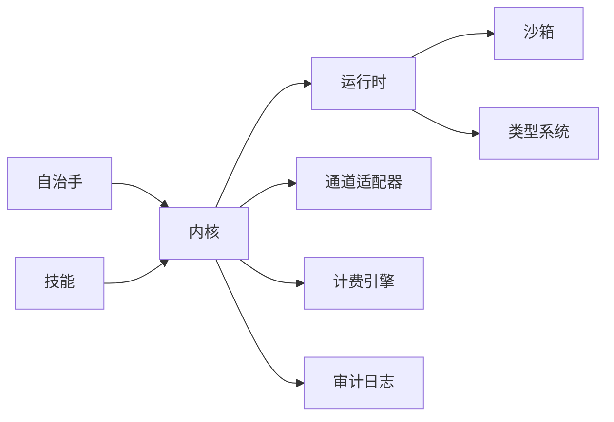

# 核心特性介绍

<cite>
**本文引用的文件**
- [README.md](file://README.md)
- [lib.rs](file://crates/openfang-channels/src/lib.rs)
- [HAND.toml（Researcher）](file://crates/openfang-hands/bundled/researcher/HAND.toml)
- [HAND.toml（Browser）](file://crates/openfang-hands/bundled/browser/HAND.toml)
- [HAND.toml（Lead）](file://crates/openfang-hands/bundled/lead/HAND.toml)
- [metering.rs](file://crates/openfang-kernel/src/metering.rs)
- [sandbox.rs](file://crates/openfang-runtime/src/sandbox.rs)
- [taint.rs](file://crates/openfang-types/src/taint.rs)
- [kernel.rs](file://crates/openfang-kernel/src/kernel.rs)
- [teams.rs](file://crates/openfang-channels/src/teams.rs)
- [slack.rs](file://crates/openfang-channels/src/slack.rs)
- [telegram.rs](file://crates/openfang-channels/src/telegram.rs)
- [whatsapp.rs](file://crates/openfang-channels/src/whatsapp.rs)
- [linkedin.rs](file://crates/openfang-channels/src/linkedin.rs)
</cite>

## 目录
1. [简介](#简介)
2. [项目结构](#项目结构)
3. [核心组件](#核心组件)
4. [架构总览](#架构总览)
5. [详细组件分析](#详细组件分析)
6. [依赖关系分析](#依赖关系分析)
7. [性能考量](#性能考量)
8. [故障排查指南](#故障排查指南)
9. [结论](#结论)
10. [附录](#附录)

## 简介
OpenFang 是一个用 Rust 构建的开源“智能体操作系统”，强调“真正为你工作的智能体”。其核心目标是提供可独立运行、按计划执行、具备知识图谱构建与报告能力的自治智能体，并通过单一二进制部署实现快速上线与稳定运行。项目包含 14 个核心 Rust crate，超过 13 万行代码，1767+ 测试用例，零 Clippy 警告，具备 16 层安全防护体系、40 种消息渠道适配器、7 个预置自治手（Hands）、以及强大的审计与计费体系。

- 单二进制部署：约 32MB，安装即用，支持 Windows 与类 Unix 系统。
- 自治手（Hands）：7 个预置能力包，无需用户每次提示即可自动工作。
- 渠道适配器：40 种消息平台接入，覆盖企业与个人社交平台。
- 安全体系：16 层纵深防御，从 WASM 双重计量沙箱到 Merkle 哈希链审计。
- 性能基准：冷启动时间、空闲内存、安装体积均优于主流竞品。

**章节来源**
- [README.md: 36-521:36-521](file://README.md#L36-L521)

## 项目结构
OpenFang 采用模块化设计，围绕内核（Kernel）组织各子系统，包括运行时（Runtime）、API 层、通道桥接（Channels）、内存（Memory）、类型系统（Types）、技能（Skills）、自治手（Hands）、扩展（Extensions）、无线协议（Wire）、CLI、桌面应用（Desktop）、迁移工具（Migrate）与任务（xtask）。核心能力通过 14 个 crate 实现，形成高内聚、低耦合的架构。

**图表来源**
- [kernel.rs: 60-164:60-164](file://crates/openfang-kernel/src/kernel.rs#L60-L164)
- [lib.rs: 1-55:1-55](file://crates/openfang-channels/src/lib.rs#L1-L55)

**章节来源**
- [README.md: 231-250:231-250](file://README.md#L231-L250)

## 核心组件
- 内核（Kernel）：统一编排 Agent 注册、能力管理、事件总线、调度器、后台执行器、审计日志、计费引擎、模型目录、触发器、工作流、配对管理等。
- 运行时（Runtime）：LLM 驱动、工具集、浏览器自动化、媒体理解、文本转语音、进程管理、A2A 任务、MCP 工具缓存等。
- 通道桥接（Channels）：40 种消息平台适配器，统一消息事件格式，支持速率限制、分段发送、输出格式化。
- 类型与安全（Types）：定义 Agent、能力、消息、工具、错误、配置等核心类型；实现污点追踪、Ed25519 签名、能力门禁等。
- 自治手（Hands）：7 个预置自治能力包，含研究、销售线索、浏览器自动化、剪辑、预测、领英管理、推特账号管理等。
- 计费与配额（Metering）：基于模型目录与令牌统计的成本估算与配额检查，支持全局与按小时/日/月预算。
- 沙箱（Sandbox）：WASM 双重计量（燃料+纪元中断），能力授权，宿主函数调用校验，防止越权与资源滥用。
- 污点追踪（Taint）：基于格的标签传播，阻断敏感数据流向危险汇点（如 shell 执行、网络请求、跨智能体消息）。

**章节来源**
- [kernel.rs: 60-164:60-164](file://crates/openfang-kernel/src/kernel.rs#L60-L164)
- [metering.rs: 14-213:14-213](file://crates/openfang-kernel/src/metering.rs#L14-L213)
- [sandbox.rs: 94-275:94-275](file://crates/openfang-runtime/src/sandbox.rs#L94-L275)
- [taint.rs: 12-182:12-182](file://crates/openfang-types/src/taint.rs#L12-L182)

## 架构总览
下图展示了 OpenFang 的端到端架构：外部消息经由 40 种渠道适配器进入统一事件模型，内核进行路由与调度，运行时负责工具执行与浏览器/媒体处理，沙箱保障插件与技能的安全执行，计费引擎记录成本并检查配额，审计日志记录操作链路，最终通过 API 提供仪表盘与控制能力。

**图表来源**
- [teams.rs: 36-176:36-176](file://crates/openfang-channels/src/teams.rs#L36-L176)
- [slack.rs: 26-134:26-134](file://crates/openfang-channels/src/slack.rs#L26-L134)
- [telegram.rs: 31-140:31-140](file://crates/openfang-channels/src/telegram.rs#L31-L140)
- [whatsapp.rs: 25-175:25-175](file://crates/openfang-channels/src/whatsapp.rs#L25-L175)
- [kernel.rs: 60-164:60-164](file://crates/openfang-kernel/src/kernel.rs#L60-L164)
- [sandbox.rs: 94-275:94-275](file://crates/openfang-runtime/src/sandbox.rs#L94-L275)
- [metering.rs: 14-213:14-213](file://crates/openfang-kernel/src/metering.rs#L14-L213)

## 详细组件分析

### 自治手（Hands）：7 个预置能力包
- Clip：视频下载、片段提取、字幕与缩略图生成、发布到 Telegram/WhatsApp。
- Lead：按 ICP/角色/规模/地理筛选，发现与丰富潜在客户，去重与评分，定时产出 CSV/JSON/Markdown 报告。
- Collector：持续监控目标（公司/人/主题），变更检测、情感追踪、知识图谱构建与关键变化预警。
- Predictor：多信号聚合、可信度推理链、预测与置信区间、Brier 得分自评估、反身模式。
- Researcher：深度研究、交叉验证、CRAAP 评估、APA 引文、多语言报告。
- Twitter：自动内容创作（7 种轮换格式）、定时发布、提及回复、性能指标追踪、审批队列。
- Browser：网页导航、表单填写、点击流程、会话持久化、购买前强制审批。

**图表来源**
- [HAND.toml（Researcher）: 1-398:1-398](file://crates/openfang-hands/bundled/researcher/HAND.toml#L1-L398)
- [HAND.toml（Browser）: 1-255:1-255](file://crates/openfang-hands/bundled/browser/HAND.toml#L1-L255)
- [HAND.toml（Lead）: 1-336:1-336](file://crates/openfang-hands/bundled/lead/HAND.toml#L1-L336)

**章节来源**
- [README.md: 64-108:64-108](file://README.md#L64-L108)

### 渠道适配器：40 种消息平台覆盖
- 企业平台：Teams、Mattermost、Google Chat、Webex、飞书/钉钉、Zulip。
- 社交平台：Telegram、Discord、Slack、WhatsApp、Signal、Matrix、Email（IMAP/SMTP）。
- 社区与隐私：IRC、XMPP、Guilded、Revolt、Keybase、Discourse、Gitter、Threema、Nostr、Mumble、Nextcloud Talk、Rocket.Chat、Ntfy、Gotify。
- 工作场所与 Webhooks：Pumble、Flock、Twist、DingTalk、Zalo、Webhooks。
- 支持功能：每通道模型覆盖、私聊/群组策略、速率限制、输出格式化。

**图表来源**
- [lib.rs: 1-55:1-55](file://crates/openfang-channels/src/lib.rs#L1-L55)
- [README.md: 254-266:254-266](file://README.md#L254-L266)

**章节来源**
- [teams.rs: 36-176:36-176](file://crates/openfang-channels/src/teams.rs#L36-L176)
- [slack.rs: 26-134:26-134](file://crates/openfang-channels/src/slack.rs#L26-L134)
- [telegram.rs: 31-140:31-140](file://crates/openfang-channels/src/telegram.rs#L31-L140)
- [whatsapp.rs: 25-175:25-175](file://crates/openfang-channels/src/whatsapp.rs#L25-L175)
- [linkedin.rs: 30-200:30-200](file://crates/openfang-channels/src/linkedin.rs#L30-L200)

### 安全体系：16 层纵深防御
- WASM 双重计量沙箱：燃料计量 + 纪元中断，看门狗线程终止超时代码。
- Merkle 哈希链审计：每个动作加密链接至前序，篡改整链失效。
- 信息流污点追踪：标签在执行中传播，敏感数据从源到汇全程受控。
- Ed25519 签名的智能体清单：身份与能力集合加密签名。
- SSRF 防护：阻断私网 IP、云元数据端点与 DNS 重绑定攻击。
- 密钥零化：Zeroizing<String> 在不再需要时自动擦除内存中的密钥。
- OFP 互认：HMAC-SHA256 基于随机数的双向认证，常数时间校验。
- 能力门禁：基于角色的访问控制，工具声明与内核强制执行。
- 安全响应头：CSP、X-Frame-Options、HSTS、X-Content-Type-Options。
- 健康检查脱敏：公开健康检查返回最小信息，完整诊断需认证。
- 子进程沙箱：env_clear + 变量白名单传递，跨平台进程树隔离与终止。
- 提示注入扫描：检测覆写尝试、数据外泄模式与 shell 引用注入。
- 循环保护：SHA256 工具调用循环检测与断路器。
- 会话修复：7 步消息历史校验与自动恢复。
- 路径遍历防护：规范化与符号链接逃逸防护。
- 通用计数/令牌桶限流：成本感知的令牌桶，按 IP 跟踪与过期清理。

**图表来源**
- [sandbox.rs: 94-275:94-275](file://crates/openfang-runtime/src/sandbox.rs#L94-L275)
- [taint.rs: 12-182:12-182](file://crates/openfang-types/src/taint.rs#L12-L182)
- [metering.rs: 14-213:14-213](file://crates/openfang-kernel/src/metering.rs#L14-L213)

**章节来源**
- [README.md: 206-228:206-228](file://README.md#L206-L228)

### 单二进制部署：性能与体验
- 安装大小：约 32MB，显著小于竞品（ZeroClaw 8.8MB，OpenClaw 500MB，CrewAI 100MB，LangGraph 150MB，AutoGen 200MB）。
- 冷启动时间：约 180ms，远优于 ZeroClaw（10ms）与 OpenClaw（5.98s），与 LangGraph（2.5s）、CrewAI（3.0s）、AutoGen（4.0s）相比更具实用性。
- 空闲内存：约 40MB，明显优于 ZeroClaw（5MB）但更接近竞品水平，兼顾安全与资源占用平衡。
- 一键安装：Linux/macOS 一行脚本，Windows PowerShell 一键安装，初始化后直接启动。

**章节来源**
- [README.md: 117-152:117-152](file://README.md#L117-L152)
- [README.md: 407-431:407-431](file://README.md#L407-L431)

### 预算与计费：成本透明与可控
- 成本估算：内置模型定价表与模型目录联动，按输入/输出令牌估算成本。
- 配额检查：支持按小时/日/月限额，全局预算与按智能体配额双重控制。
- 使用记录：SQLite 后端持久化，支持汇总查询与按模型分组统计。
- 预算状态：实时展示当前花费与上限占比，支持告警阈值与默认令牌限制。

**图表来源**
- [metering.rs: 14-213:14-213](file://crates/openfang-kernel/src/metering.rs#L14-L213)

**章节来源**
- [metering.rs: 14-213:14-213](file://crates/openfang-kernel/src/metering.rs#L14-L213)

## 依赖关系分析
- 内核对运行时与通道的依赖：内核持有运行时组件（LLM 驱动、工具、浏览器、媒体、进程管理、A2A、MCP）与通道适配器注册表，形成统一调度与执行闭环。
- 运行时对沙箱与类型系统的依赖：运行时通过沙箱执行第三方/插件代码，通过类型系统进行能力与污点控制。
- 计费与审计：计费引擎与审计日志贯穿运行时与内核，确保成本与行为可追溯。
- 自治手与技能：自治手作为内核的“前台”能力，技能作为“后台”工具扩展，二者共同构成可组合的智能体能力矩阵。

**图表来源**
- [kernel.rs: 60-164:60-164](file://crates/openfang-kernel/src/kernel.rs#L60-L164)
- [sandbox.rs: 94-275:94-275](file://crates/openfang-runtime/src/sandbox.rs#L94-L275)
- [taint.rs: 12-182:12-182](file://crates/openfang-types/src/taint.rs#L12-L182)

**章节来源**
- [kernel.rs: 60-164:60-164](file://crates/openfang-kernel/src/kernel.rs#L60-L164)

## 性能考量
- 冷启动：得益于单二进制与精简依赖，OpenFang 在启动后即可提供服务，适合需要快速响应的场景。
- 内存占用：在启用安全与审计功能的同时，保持较低的空闲内存，满足长期运行需求。
- 安装体积：极小的安装包，便于在边缘设备或受限环境中部署。
- 并发与稳定性：通道适配器采用异步长轮询/WebSocket，结合指数退避与线程池，保证高并发下的稳定性。

[本节为通用性能讨论，不直接分析具体文件]

## 故障排查指南
- 渠道适配器常见问题
  - Teams：OAuth2 令牌获取失败、租户白名单限制、消息长度超限分片发送。
  - Slack：Socket Mode 连接失败、线程 TTL 与自动回复配置、链接展开参数。
  - Telegram：令牌校验失败、HTML 标签不被支持导致 400、长消息分片。
  - WhatsApp：Cloud API 与 Web 网关模式切换、Meta 验证令牌与电话号码白名单。
  - LinkedIn：OAuth2 权限不足、组织 ID 规范化、每日请求数限制。
- 沙箱与工具
  - WASM 执行超时或燃料耗尽：检查工具复杂度与超时配置，必要时提升燃料预算。
  - 能力门禁被拒：确认工具声明与授予的能力列表一致。
- 污点与安全
  - 提示注入/数据外泄：检查污点标签与汇点策略，必要时显式降级标签。
- 计费与配额
  - 超出配额：调整限额或等待周期，查看预算状态与使用汇总。

**章节来源**
- [teams.rs: 80-176:80-176](file://crates/openfang-channels/src/teams.rs#L80-L176)
- [slack.rs: 70-134:70-134](file://crates/openfang-channels/src/slack.rs#L70-L134)
- [telegram.rs: 75-140:75-140](file://crates/openfang-channels/src/telegram.rs#L75-L140)
- [whatsapp.rs: 68-175:68-175](file://crates/openfang-channels/src/whatsapp.rs#L68-L175)
- [linkedin.rs: 68-184:68-184](file://crates/openfang-channels/src/linkedin.rs#L68-L184)
- [sandbox.rs: 112-275:112-275](file://crates/openfang-runtime/src/sandbox.rs#L112-L275)
- [taint.rs: 83-182:83-182](file://crates/openfang-types/src/taint.rs#L83-L182)
- [metering.rs: 25-100:25-100](file://crates/openfang-kernel/src/metering.rs#L25-L100)

## 结论
OpenFang 以“单二进制、自治手、40 渠道、16 层安全”为核心竞争力，提供从企业到个人社交平台的全栈消息接入能力，配合强大的计费与审计体系，确保在高性能与高安全之间取得最佳平衡。其预置的 7 个自治手覆盖研究、销售、浏览器自动化等高频场景，显著降低用户使用门槛。通过持续优化与生态扩展，OpenFang 为构建可信赖的智能体操作系统奠定了坚实基础。

[本节为总结性内容，不直接分析具体文件]

## 附录
- 对比维度与结论
  - 渠道数量：OpenFang 40 个，显著领先竞品。
  - 安全层数：OpenFang 16 层，远超 ZeroClaw（6 层）与 OpenClaw（3 层）。
  - 冷启动与安装体积：OpenFang 在实用性和体积上取得平衡，优于多数竞品。
  - 语言与生态：Rust 语言与丰富的内置工具、技能、MCP/A2A 生态，便于二次开发与集成。

**章节来源**
- [README.md: 117-203:117-203](file://README.md#L117-L203)