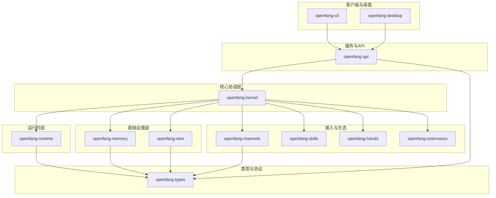
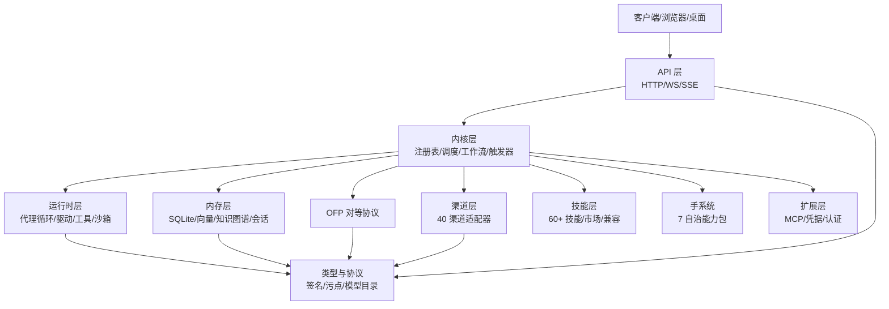
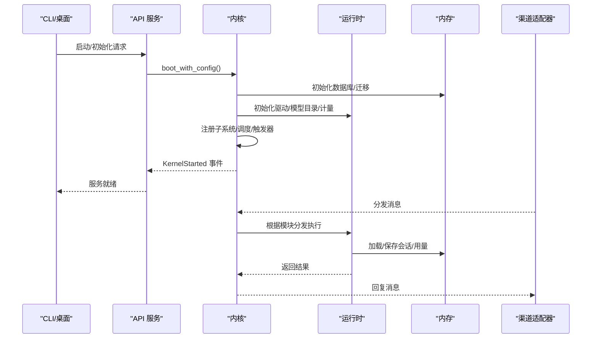
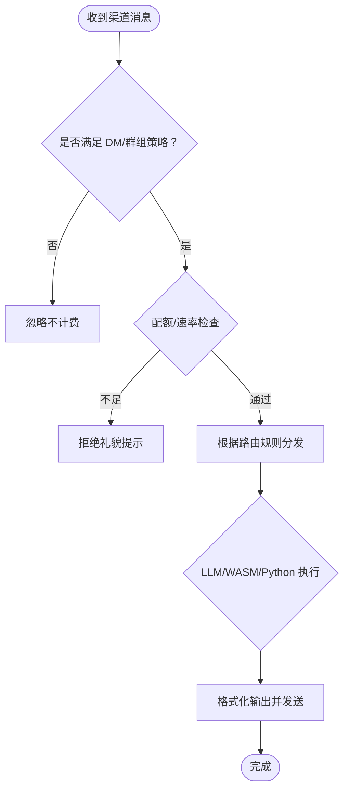
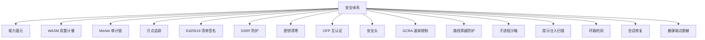
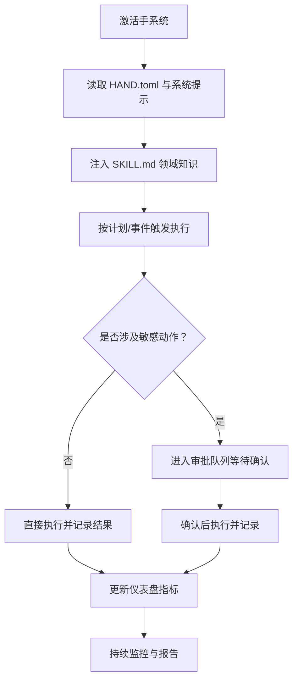
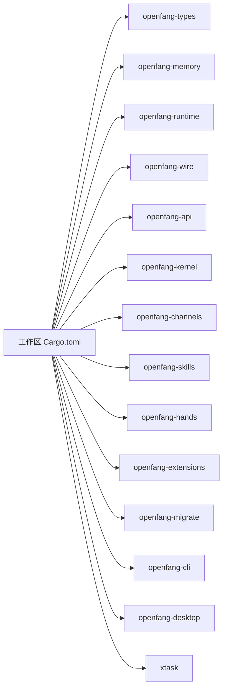

# 项目概述

<cite>
**本文引用的文件**
- [README.md](file://README.md)
- [Cargo.toml](file://Cargo.toml)
- [openfang.toml.example](file://openfang.toml.example)
- [docs/getting-started.md](file://docs/getting-started.md)
- [docs/architecture.md](file://docs/architecture.md)
- [docs/security.md](file://docs/security.md)
- [docs/channel-adapters.md](file://docs/channel-adapters.md)
- [scripts/install.sh](file://scripts/install.sh)
- [crates/openfang-api/Cargo.toml](file://crates/openfang-api/Cargo.toml)
- [crates/openfang-channels/Cargo.toml](file://crates/openfang-channels/Cargo.toml)
- [crates/openfang-kernel/src/lib.rs](file://crates/openfang-kernel/src/lib.rs)
- [crates/openfang-runtime/src/lib.rs](file://crates/openfang-runtime/src/lib.rs)
- [agents/hello-world/agent.toml](file://agents/hello-world/agent.toml)
- [crates/openfang-hands/bundled/browser/HAND.toml](file://crates/openfang-hands/bundled/browser/HAND.toml)
</cite>

## 目录
1. [简介](#简介)
2. [项目结构](#项目结构)
3. [核心组件](#核心组件)
4. [架构总览](#架构总览)
5. [详细组件分析](#详细组件分析)
6. [依赖关系分析](#依赖关系分析)
7. [性能考量](#性能考量)
8. [故障排查指南](#故障排查指南)
9. [结论](#结论)
10. [附录](#附录)

## 简介
OpenFang 是一个开源的“智能体操作系统”，并非聊天机器人框架或 Python 包装器，而是从零开始用 Rust 构建的原生智能体运行时。它提供“自主代理”能力：无需用户主动触发，即可在后台按计划运行、构建知识图谱、监控目标、生成线索、管理社交媒体并把结果汇报到仪表盘。

- 单二进制部署：整个系统编译为约 32MB 的单一可执行文件，一次安装、一条命令即可启动。
- 预构建“手系统（Hands）”：内置 7 个即插即用的自治能力包，无需下载、无需 Docker，开箱即用。
- 16 层安全防护：从沙箱、审计链、污点追踪到互认证、速率限制、路径穿越防护等，形成纵深防御。
- 40 个消息渠道适配器：覆盖主流社交、企业协作、隐私通信、通知平台等，统一接入。
- 137K+ 行代码、14 个核心 crate、1767+ 测试用例，零 clippy 警告，生产级质量。

**章节来源**
- [README.md:36-521](file://README.md#L36-L521)

## 项目结构
仓库采用 Cargo 工作区组织，包含 14 个核心 crate，以及文档、示例、SDK、脚本等资源。核心模块自下而上依赖，形成清晰的分层：

- 类型与协议层：openfang-types（共享类型、签名、模型目录、兼容性）
- 基础设施层：openfang-memory（内存子系统）、openfang-wire（OFP 对等协议）
- 运行时层：openfang-runtime（代理循环、驱动抽象、工具运行、沙箱）
- 核心协调层：openfang-kernel（注册表、调度、工作流、触发器、计量）
- 接入与服务层：openfang-api（HTTP/WS/SSE）、openfang-channels（40 渠道桥接）
- 生态与扩展：openfang-skills（技能市场）、openfang-hands（手系统）、openfang-extensions（MCP 模板）
- 客户端与桌面：openfang-cli、openfang-desktop
- 迁移与工具：openfang-migrate、xtask

**图表来源**
- [docs/architecture.md:25-66](file://docs/architecture.md#L25-L66)
- [Cargo.toml:1-17](file://Cargo.toml#L1-L17)

**章节来源**
- [Cargo.toml:1-162](file://Cargo.toml#L1-L162)
- [docs/architecture.md:25-66](file://docs/architecture.md#L25-L66)

## 核心组件
- openfang-types：定义跨模块共享的核心类型（Agent、Capability、Event、Memory、Message、Tool、Config、Taint、ManifestSigning、ModelCatalog、MCP/A2A 配置、Web 配置），并提供 Ed25519 数字签名与 taint 跟踪。
- openfang-memory：基于 SQLite 的内存子系统，支持结构化 KV、向量检索、知识图谱、会话管理、任务看板、用量统计与规范会话（跨渠道记忆）。
- openfang-runtime：代理执行引擎，包含 3 个原生 LLM 驱动、23 个内置工具、WASM 双重计量沙箱、MCP/A2A 协议、网络抓取与搜索、会话修复、环路检测、审计链等。
- openfang-kernel：中央协调器，组装所有子系统，负责代理注册、调度、工作流、触发器、后台执行、WASM 沙箱、模型目录、计量、认证、心跳监控、技能注册、Web 工具上下文等。
- openfang-api：基于 Axum 的 HTTP/WS/SSE 服务器，提供 76+ 端点（代理、工作流、触发器、内存、渠道、模板、模型、提供商、技能、A2A、健康、版本、关机等），内置 OpenAI 兼容端点。
- openfang-channels：40 个渠道适配器（Telegram、Discord、Slack、WhatsApp、Signal、Matrix、Email、Webhook、Teams、Mattermost、IRC、Google Chat、Twitch、Rocket.Chat、Zulip、XMPP、LINE、Viber、Messenger、Reddit、Mastodon、Bluesky、Feishu、Revolt、Nextcloud、Guilded、Keybase、Threema、Nostr、Webex、Pumble、Flock、Twist、Mumble、DingTalk、Discourse、Gitter、Ntfy、Gotify、LinkedIn 等），统一实现格式化、限流、策略、覆盖配置。
- openfang-wire：OFP（OpenFang Protocol）对等通信协议，基于 HMAC-SHA256 互认证与 JSON 帧，支持发现、通告、路由消息、保活。
- openfang-cli：基于 Clap 的命令行工具，支持初始化、启动、状态、诊断、代理生命周期、工作流、触发器、迁移、技能、渠道、配置、聊天、MCP 等。
- openfang-desktop：Tauri 2.0 原生应用，内嵌内核与服务器，提供系统托盘、通知、快捷键、自动更新与后台更新。
- openfang-skills：技能系统，60+ 内置技能（Python/Node/WASM/PromptOnly），支持 FangHub 市场、ClawHub 兼容、SKILL.md 解析、提示注入扫描、SHA256 校验。
- openfang-hands：7 个预置“手系统”（Clip、Lead、Collector、Predictor、Researcher、Twitter、Browser），每个包含 HAND.toml、系统提示、SKILL.md、审批门禁与仪表盘指标。
- openfang-extensions：MCP 模板、AES-256-GCM 凭据保险库、OAuth2 PKCE 等扩展能力。
- openfang-migrate：从 OpenClaw、LangChain、AutoGPT 等迁移的引擎。
- xtask：构建自动化任务。

**章节来源**
- [docs/architecture.md:48-66](file://docs/architecture.md#L48-L66)
- [crates/openfang-api/Cargo.toml:1-46](file://crates/openfang-api/Cargo.toml#L1-L46)
- [crates/openfang-channels/Cargo.toml:1-43](file://crates/openfang-channels/Cargo.toml#L1-L43)

## 架构总览
OpenFang 的架构强调“内核优先、模块解耦、安全优先”。内核负责装配与编排，运行时负责执行与隔离，API/通道负责对外交互，内存与类型提供基础数据与安全模型。

**图表来源**
- [docs/architecture.md:25-66](file://docs/architecture.md#L25-L66)
- [crates/openfang-kernel/src/lib.rs:1-30](file://crates/openfang-kernel/src/lib.rs#L1-L30)
- [crates/openfang-runtime/src/lib.rs:1-59](file://crates/openfang-runtime/src/lib.rs#L1-L59)

## 详细组件分析

### 组件一：内核启动序列与代理生命周期
- 启动阶段：加载配置、创建数据目录、初始化内存、LLM 驱动、模型目录、计量、调度、核心子系统、RBAC、技能注册、Web 工具上下文、恢复持久化代理、发布启动事件。
- 代理生命周期：Running/Suspended/Terminated 三态；spawn 时校验继承权限、授予能力、注册调度、持久化；消息到达时进行 RBAC、渠道策略、配额检查、模块分发（LLM、WASM、Python 子进程）；kill 时撤销能力、停止后台循环、清理触发器与存储。
- 稳定性加固：环路检测、会话修复、工具超时、最大延续次数、代理调用深度限制、稳定性指导语、块感知压缩。

**图表来源**
- [docs/architecture.md:69-157](file://docs/architecture.md#L69-L157)
- [docs/architecture.md:160-230](file://docs/architecture.md#L160-L230)

**章节来源**
- [docs/architecture.md:69-230](file://docs/architecture.md#L69-L230)

### 组件二：渠道适配器与消息路由
- 统一接口：ChannelAdapter trait 提供 start/send/stop/status/send_in_thread 等方法，支持指数退避、优雅关闭、消息拆分、输出格式化、限流与策略。
- 40 渠道覆盖：从 Telegram、Discord、Slack、WhatsApp、Signal、Matrix、Email 到 Teams、Mattermost、IRC、Google Chat、Twitch、Rocket.Chat、Zulip、XMPP、LINE、Viber、Messenger、Reddit、Mastodon、Bluesky、Feishu、Revolt、Nextcloud、Guilded、Keybase、Threema、Nostr、Webex、Pumble、Flock、Twist、Mumble、DingTalk、Discourse、Gitter、Ntfy、Gotify、LinkedIn 等。
- 路由策略：默认代理、用户绑定、命令前缀切换、回退策略；支持每渠道模型/提示/DM/群组策略/限流/线程/输出格式覆盖。

**图表来源**
- [docs/channel-adapters.md:552-561](file://docs/channel-adapters.md#L552-L561)
- [docs/channel-adapters.md:200-240](file://docs/channel-adapters.md#L200-L240)

**章节来源**
- [docs/channel-adapters.md:1-726](file://docs/channel-adapters.md#L1-L726)

### 组件三：安全硬核体系（16 层）
- 能力基元：Capability 枚举覆盖文件/网络/工具/LLM/代理交互/内存/Shell/OFP/经济等，继承校验防止越权。
- WASM 双重计量：燃料计数 + 时代中断，防 CPU/时间滥用。
- Merkle 审计链：记录关键动作，链式完整性校验。
- 污点追踪：标签传播，敏感汇（如 shell_exec、net_fetch、agent_message）阻断。
- Ed25519 清单签名：保护清单完整性与真实性。
- SSRF 防护：方案校验、主机黑名单、DNS 解析后私网检测。
- 密钥清零：Zeroizing<String> 自动擦除内存中的密钥。
- OFP 互认证：HMAC-SHA256 + 随机 nonce + 常量时间比较。
- 安全头：CSP、X-Frame-Options、X-Content-Type-Options、Referrer-Policy、Permissions-Policy。
- GCRA 速率限制：成本感知令牌桶，按 IP 跟踪与过期清理。
- 路径穿越防护：安全解析与能力前置检查。
- 子进程沙箱：env_clear + 选择性变量透传。
- 提示注入扫描：技能内容扫描，阻断覆盖尝试、数据外泄与 shell 引用。
- 环路检测与会话修复：工具调用环路检测、历史一致性修复。
- 健康端点脱敏：公开健康返回最小信息，详细诊断需认证。

**图表来源**
- [docs/security.md:36-60](file://docs/security.md#L36-L60)
- [docs/security.md:63-184](file://docs/security.md#L63-L184)
- [docs/security.md:186-267](file://docs/security.md#L186-L267)
- [docs/security.md:269-382](file://docs/security.md#L269-L382)
- [docs/security.md:384-473](file://docs/security.md#L384-L473)
- [docs/security.md:475-552](file://docs/security.md#L475-L552)
- [docs/security.md:554-645](file://docs/security.md#L554-L645)
- [docs/security.md:647-713](file://docs/security.md#L647-L713)
- [docs/security.md:715-791](file://docs/security.md#L715-L791)
- [docs/security.md:793-800](file://docs/security.md#L793-L800)
- [docs/security.md:800-800](file://docs/security.md#L800-L800)

**章节来源**
- [docs/security.md:1-800](file://docs/security.md#L1-L800)

### 组件四：手系统（Hands）与自治能力
- 7 个内置手系统：Clip（视频剪辑与发布）、Lead（线索挖掘与评分）、Collector（情报监控与预警）、Predictor（超级预测与准确度跟踪）、Researcher（多源交叉研究与引用）、Twitter（账号运营与审批队列）、Browser（网页自动化与购买审批）。
- 每个手系统包含：
  - HAND.toml：声明工具、设置、要求与仪表盘指标
  - 系统提示：多阶段操作手册（数百字专家流程）
  - SKILL.md：领域知识参考，注入到运行时上下文
  - 审批门禁：敏感动作（如购买）必须经人工确认
- 预构建即运行：无需下载、无需 pip 安装、无需 Docker 拉取，直接激活即可工作。

**图表来源**
- [crates/openfang-hands/bundled/browser/HAND.toml:1-255](file://crates/openfang-hands/bundled/browser/HAND.toml#L1-L255)

**章节来源**
- [README.md:64-108](file://README.md#L64-L108)
- [crates/openfang-hands/bundled/browser/HAND.toml:1-255](file://crates/openfang-hands/bundled/browser/HAND.toml#L1-L255)

### 组件五：LLM 驱动与模型目录
- 3 个原生驱动：Anthropic（Claude）、Gemini（Google）、OpenAI 兼容（覆盖 20+ 提供商）。
- 模型目录：51 个内置模型、20+ 别名、20+ 提供商，支持别名解析、成本估算、路由决策。
- 配置：内核默认与代理覆盖，共享驱动实例或专用实例，自动重试与指数退避，API Key 内存清零。

**章节来源**
- [docs/architecture.md:329-437](file://docs/architecture.md#L329-L437)

## 依赖关系分析
- 工作区成员：14 个 crate，类型与协议层向下依赖，运行时与内核层向上依赖，API/通道层对外暴露。
- 关键依赖：Tokio（异步运行时）、Axum（HTTP）、Wasmtime（WASM）、Serde（序列化）、Reqwest（HTTP 客户端）、DashMap（并发容器）、Zeroize（密钥清零）、HMAC/Ed25519（安全算法）、Govenor（速率限制）等。
- 性能优化：发布配置启用 LTO、单代码单元、符号剥离、优化等级 3；运行时使用 spawn_blocking 访问 SQLite，避免非异步驱动。

**图表来源**
- [Cargo.toml:1-17](file://Cargo.toml#L1-L17)

**章节来源**
- [Cargo.toml:26-162](file://Cargo.toml#L26-L162)

## 性能考量
- 冷启动：官方基准显示远优于同类框架，典型冷启动小于 200ms。
- 空闲内存：显著低于 LangGraph/CrewAI/AutoGen/OpenClaw，适合长期驻留。
- 安装体积：约 32MB，远小于其他生态，便于快速部署。
- 并发与 I/O：Tokio 事件循环、异步 HTTP 客户端、SQLite 使用 spawn_blocking，避免阻塞；WASM 沙箱双重计量防止资源滥用。
- 上下文管理：块感知会话压缩、用量统计、成本估算，降低无效计算。

[本节为通用性能讨论，不直接分析具体文件]

## 故障排查指南
- 安装与初始化
  - 使用脚本安装：支持 Linux/macOS/WSL，自动检测平台、下载归档、校验 SHA256、写入 PATH。
  - 初始化：创建 ~/.openfang/ 目录与默认配置，引导设置 LLM 提供商密钥。
- 常见问题
  - API 密钥未设置：使用 doctor 命令检查配置与环境变量。
  - 渠道连接失败：检查令牌、网络连通性、平台权限；查看适配器健康状态。
  - WASM 模块异常：检查燃料/超时配置、工具权限、路径穿越与 SSRF 防护。
  - 审计链中断：验证 Merkle 链完整性，定位篡改入口。
- 诊断工具
  - openfang doctor：检查配置、密钥、工具链。
  - openfang status：查看守护进程状态。
  - openfang channel list/setup：列出与交互式配置渠道。
  - openfang skill list/search：查看已安装与可发现技能。
  - openfang workflow list/create/run：编排与执行工作流。
  - openfang agent list/chat/kill：管理代理生命周期。

**章节来源**
- [scripts/install.sh:1-197](file://scripts/install.sh#L1-L197)
- [docs/getting-started.md:17-153](file://docs/getting-started.md#L17-L153)
- [docs/getting-started.md:270-305](file://docs/getting-started.md#L270-L305)
- [docs/getting-started.md:308-322](file://docs/getting-started.md#L308-L322)
- [docs/getting-started.md:324-377](file://docs/getting-started.md#L324-L377)

## 结论
OpenFang 以“内核优先、模块解耦、安全优先”的设计，提供了从底层内存与协议、到运行时与渠道接入的完整智能体操作系统。其 16 层安全体系、40 渠道适配器、7 个预置手系统、单二进制部署与生产级测试覆盖率，使其成为企业与个人部署智能体应用的理想选择。对于初学者，可通过内置模板与向导快速上手；对于资深开发者，其模块化架构、开放协议与扩展机制提供了充分的定制空间。

[本节为总结性内容，不直接分析具体文件]

## 附录

### 快速开始指南
- 安装
  - Shell 安装（Linux/macOS）：curl -sSf https://openfang.sh | sh
  - PowerShell 安装（Windows）：irm https://openfang.sh/install.ps1 | iex
  - Cargo 安装：cargo install --git https://github.com/RightNow-AI/openfang openfang-cli
  - Docker：docker pull ghcr.io/RightNow-AI/openfang:latest
- 初始化与启动
  - openfang init：创建配置目录与默认配置
  - openfang start：启动守护进程，提供 WebChat 与 REST/WS/SSE 接口
  - openfang doctor：检查环境与配置
- 激活手系统
  - openfang hand activate researcher：激活研究助手
  - openfang hand status researcher：查看进度
  - openfang hand list：列出可用手系统
- 聊天与代理
  - openfang chat：快速聊天
  - openfang agent spawn agents/hello-world/agent.toml：创建代理
  - openfang agent list/chat/kill：管理代理

**章节来源**
- [docs/getting-started.md:17-90](file://docs/getting-started.md#L17-L90)
- [docs/getting-started.md:93-153](file://docs/getting-started.md#L93-L153)
- [docs/getting-started.md:156-236](file://docs/getting-started.md#L156-L236)
- [docs/getting-started.md:270-305](file://docs/getting-started.md#L270-L305)
- [README.md:407-442](file://README.md#L407-L442)

### 配置示例
- 默认模型与内存参数：在 ~/.openfang/config.toml 中设置 provider/model/api_key_env/base_url、内存衰减率、网络监听地址等。
- 渠道配置：在 [channels.<name>] 下设置令牌环境变量、默认代理、允许用户列表、覆盖项（模型/提示/策略/限流/线程/输出格式/用量尾注）。

**章节来源**
- [openfang.toml.example:1-49](file://openfang.toml.example#L1-L49)
- [docs/channel-adapters.md:115-166](file://docs/channel-adapters.md#L115-L166)
- [docs/channel-adapters.md:169-198](file://docs/channel-adapters.md#L169-L198)

### 示例代理与手系统
- hello-world 代理：内置模板，具备文件读取、网络抓取与检索、内存读写等能力。
- Browser 手系统：网页自动化、表单填写、截图验证、购买审批等，支持无头模式与多种设置。

**章节来源**
- [agents/hello-world/agent.toml:1-30](file://agents/hello-world/agent.toml#L1-L30)
- [crates/openfang-hands/bundled/browser/HAND.toml:1-255](file://crates/openfang-hands/bundled/browser/HAND.toml#L1-L255)